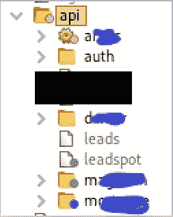
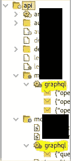
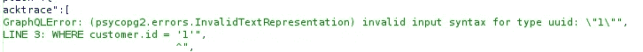
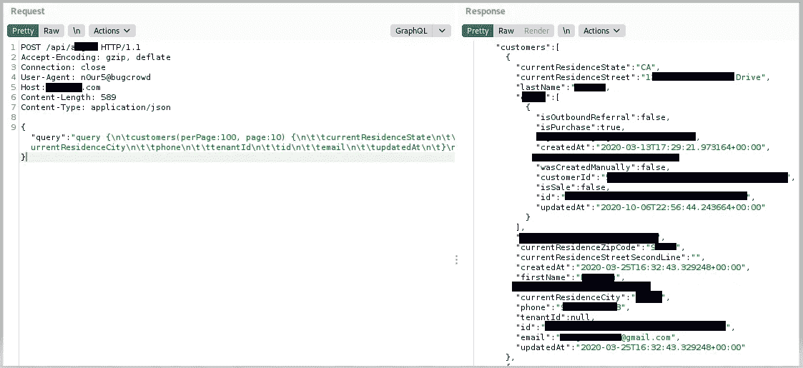
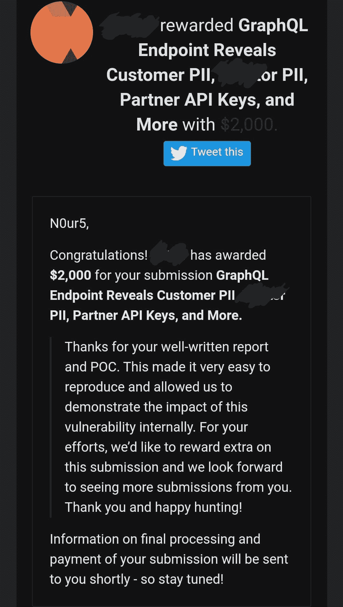

# 谁去叫水管工，GraphQL 又漏水了…

> 原文：<https://infosecwriteups.com/somebody-call-the-plumber-graphql-is-leaking-again-654bf1a38d26?source=collection_archive---------0----------------------->

大家好，今天我要给大家讲一个故事。它主要是关于一个 GraphQL 漏洞，我最近因为这个漏洞被 BugCrowd 平台上的一个公共程序授予了奖励。这个项目不允许公开，所以我可能需要在“规则”范围内进行编辑。这也将涉及到我觉得我必须做的一点强制手段，以确保我的奖金支付是适当的。

因此，为了让每个人都快速上手，GraphQL 是一种允许通过 API 交互进行数据库查询和操作的技术。它由脸书开发，仅在内部使用，直到 2015 年向公众发布。如今在大公司遇到这种情况非常普遍。BugCrowd 是一家在 bug 赏金猎人和支付 BugCrowd 实质上扮演裁判的组织之间的互动中充当中间人的公司。这些都是非常高层次的定义，如果你愿意，你可以独立地对它们进行大量的研究。

如今，我并不总是有大量的时间致力于虫类赏金项目，我是一名圣灵降临者/威胁猎人。我是一个父亲，一个丈夫，一个游戏玩家，一个 DIY 者……老实说，很难把一切都融入其中。所以当我想花些时间在赏金上时，通常会有很多侦查任务。这意味着我只是试图找到 web 应用程序中可能还没有被深入研究的部分。或者在今天的例子中，部分不应该对公众开放…

而四处打探目标的主要”。我查看了我的 Burpsuite 目标选项卡，注意到“/api”端点及其子端点。其中大多数是在浏览和使用网站上的“正常”功能时被动发现的。我还发现了其中的几个，在目录强制过程中，我发现了尽可能多的 API 端点。

像往常一样半编辑过

这些不同的子 API 端点中的每一个都在很大程度上限制了我们通过要求认证所能获得的数据。其他人给我们的数据只是用来宣传网站界面(如头像、侧栏标志等)。换句话说，对我这个臭虫猎人来说没有任何用处。至少在脆弱性方面。

然而，我注意到这些端点中的大多数都利用了 GraphQL 查询…

如果说我对 GraphQL 有所了解的话，那就是它很少在一开始就设置正确。许多公司都有不安全的 GraphQL 端点，并在 Bug Bounty 报告中呼吁。考虑到 GraphQL 在现有技术基础上的复杂性，这是可以理解的。但是一旦我注意到这一点，我就开始了我的 GraphQL 测试之路。我已经在其他几个公共程序和一个私有程序中测试了 GraphQL 端点，但从未发现任何问题，但正如前面提到的，我已经阅读了足够多的错误报告，知道这只是时间问题！一个可以帮助你保持动力的例子是【HackerOne 向一名赏金猎人支付了 20，000 美元,这名赏金猎人发现他们的 GraphQL 实例泄露了大量敏感数据。

不管怎样，我的第一步通常是尝试对端点运行自省查询。如果成功；GraphQL 中的自省查询将为您提供大量关于“模式”/数据配置的信息。比如存在什么类型的信息，它们是如何连接的，它们接受什么格式，如何查询数据，以及如何操作数据。

几乎每一篇关于测试 GraphQL 实例的文章都会告诉您寻找以下端点:

*   */graphql*
*   */graphiql*
*   */graphql.php*
*   */graph QL/控制台*

如果你在 BurpSuite 中使用 graph QL“InQL Scanner”BApp(add on ),你所要做的就是输入你想要发送自省查询的 URL。然而，我认为重要的是要认识到，仅仅因为上面列出的那些端点表明 GraphQL 的存在，并不意味着如果您怀疑某个目标正在运行某个实例，就应该将它视为运行自省查询的端点的完整列表。例如…你确实可以在我上面的截图中看到一些/ *graphql* 端点…但是当运行 Introspecition 查询时，我实际上得到的有趣细节的端点根本没有标记为“ *graphql* ”!

为了与目标保持一致，我不想/也不能说出实际的端点名称，但为了简单起见，我们将称它为"*/API/vulnerable*"…只需知道 graphql 不是端点的名称，因为这是我最终要说明的要点。所以我发 *https://【编校】。com/api/vulnerable* 转移到 Burpsuite 中的 InQL 扫描器，果然……基于该端点支持的查询，大量看起来有趣的数据查询潜在地可用。我迅速向 Repeater 选项卡发送一个名为“ *customer.query* ”的查询，并填写“ *ID* ”参数，仅猜测“ *1* ”，以查看是否有任何用户数据返回，但我基本上得到一个错误，表明 ID 格式不被接受。

我还看到了 SQL 语句的一部分，并且使用了“Psycopg2”。这告诉我他们正在使用 Python，很可能是 PostgresSQL。

好的，我正在寻找一个 UUID…可能会太复杂而无法猜测…所以我查看了从我运行的初始自省查询中得到的其他可能的查询，我看到了“ *customers.query* ”(注意在这种情况下 *customers* 是复数)。唉，我为什么不从那个开始呢！哈哈…我把那个查询扔掉了，它只需要两个参数… *每页的结果数* …和*要查询哪个页面*…这有多简单？！我不需要猜测任何事情，所以希望查询运行时不需要认证…

我肯定没有“黑”任何东西。但是我确实发现了一堆我觉得我不应该有的敏感信息！下一个合乎逻辑的步骤是探索我能够处理的其他查询。还有一些更敏感的信息，关于以其他方式与平台相关的各种合作伙伴和用户(有点像承包商)。我发现了一些 API 键以及外部 webhook urls，但这些 URL 超出了范围，所以除了在 BugCrowd 的报告中提到它们之外，我真的不能做太多。

我整理了我的数据，试图尽可能地提高影响力，然后把报告寄出去。在选择类别时，我认为该漏洞符合我注意到的“P1”严重性，因为它会导致“敏感机密”泄露。然后我看了看 P1 公司的项目支出，很快意识到如果一切顺利，我可以得到一笔可观的支出。

我在一个周六的晚上提交了报告，焦急地等待着审查，我以为审查要到周一才会进行。

星期一到了，一天的大部分时间过去了，我只是得到一个回应，我在报告中发送的概念证明在运行时没有产生相同的结果。我发送了一些替代的有效载荷，我知道这些载荷可以避免复制/粘贴格式问题，我认为这是我发送的最初的 Curl 概念证明不起作用的原因。然后更多的时间过去了，我没有听到一个字。周一午夜左右，BugCrowd 的一名员工跳到了报告上，我认为他是在推动目标在报告上向前迈进。星期二我醒来时，目标如下…

这个发现是合法的，因此我们撤下了这个网站。使用的数据是假的，但是我们知道研究人员不会知道，我们正在评估奖金。我们感谢好的工作，并将很快颁奖。

*谢谢。”*

我的直觉告诉我这些数据看起来不是假的。好像我在制作中到处挖掘。如果数据是假的，为什么要这么快就把整个页面拉出来？有些事不合情理。

我又回到了侦察模式……我从之前的查询中去掉了一些客户的名字，把他们的名字放到了脸书和 LinkedIn 的搜索栏中……嘣！我发现许多人，他们的名字和位置与 PII 的名字和位置完全匹配……所以我用我的“customers.query”概念证明中的一些用户在脸书的名字和城镇与 PII 并排匹配的截图回击了这个报告线程。他们现在能说什么？我有他们的电子邮件地址、电话号码，还有他们的一些脸书主页。我会去问用户他们自己是否使用目标网站…哈哈好吧好吧，我只是在开玩笑。

我最不想做的事情就是陷入这样一种境地:我在 BugCrowd 上呼吁一个程序对此撒谎，所以我试图尽可能好地表达事情，以防他们方面有一些真正的误解。又一次…我等待着…

我也许应该试着再看一遍毒品。看起来是个不错的节目。不过字幕有时会让人精疲力尽。

两天后，我推了他们一下。他们回复让我知道我的支出即将到来，但从未真正回应我关于数据真实的评论。但我认为，延迟回应肯定来自于对数据的一些内部困惑。最终，他们只是给它加上了“p3”严重性(“中度”严重性——显然有一个“p3”版本的“敏感机密泄露”)😕不过我还是要了..lol)并给我发了我的赏金，还说了一些客气话。

…出去买些家庭健身器材😃

总结:有几点真的…

1.  监控你的网络日志。理想情况下，这意味着放置一个 SIEM，并确保 web 服务器日志被转发用于日志关联。我无法想象将一个公开的 bug 赏金目标的 web 服务器日志转储到一个 SIEM 中会有多疯狂。我想既然大多数程序要求你在 User-Agent 头中包含一个特殊的字符串，你可以用这种方式丢弃/过滤掉所有的 bounty 流量。但是我确信你仍然会被那些不阅读交战规则或者不知道如何配置他们的工具来修改 UA 报头的人打败。然而，理论上你可以使用 WAF 将明显是新手测试者的具有恶意行为的 IP 列入黑名单，允许适当的用户代理通过，并监控来自不符合这两个类别的 web 服务器的日志。这只是一个不切实际的想法，但是沿着这个逻辑的一些东西可能是有意义的。当然，在这种情况下，攻击者可以只使用一个 bug-bounty 接受的用户代理，并在实际上是恶意的情况下不受监控。看看这变成猫捉老鼠有多快！？
2.  很少有理由允许公共用户在 GraphQL 端点上运行自省查询。但是我相信它曾经是，并且可能仍然是 GraphQL 实例中的默认设置😐。不要相信任何东西的默认设置。阅读你实现的所有东西的“安全问题”部分，尤其是面向 web 的。
3.  在虫子赏金猎人方面，我自己的逻辑是“侦查为王”，和很多人一样。当然，我已经听到了来自 P1 勇士队的反对意见，即有时只是彻底了解那些显而易见的东西是一个更好的选择。这一切都是基于你自己的优势，随着时间的推移，你最终会根据我自己的经历和别人的经历来塑造自己的方法。我只想说……人们花了几百美元就收集了大量的复杂步骤的报告。我找到了一个开放的端点，在提交一个 2000 万美元的 bug 之前，花了大概一个小时的时间查询它，看看有没有影响。我并不是说金钱应该是主要的动力，不管怎样，如果金钱是你的主要动力，那就更难了解了。但我要说，即使你不喜欢侦察深潜，它们显然有一些价值！这种情况下 2000 美元 lol。

*在此奖励期间没有黑客攻击发生😉。*

下次见！

N0ur5