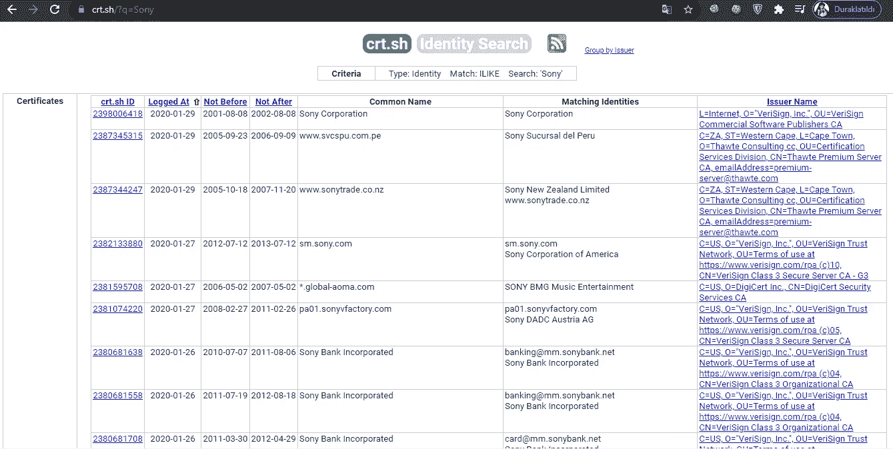
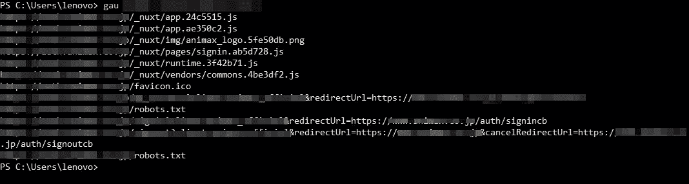
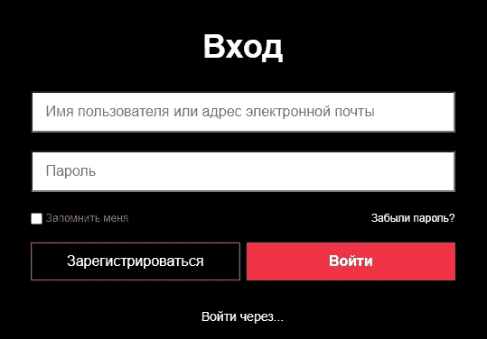
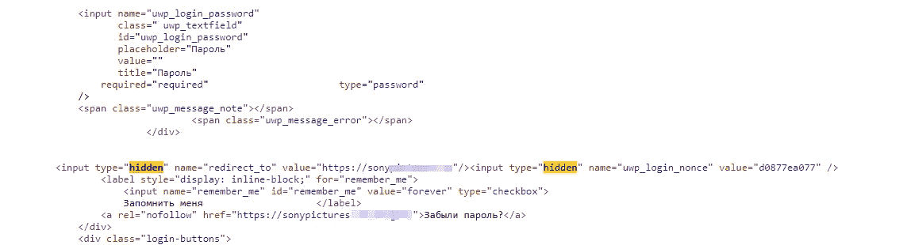
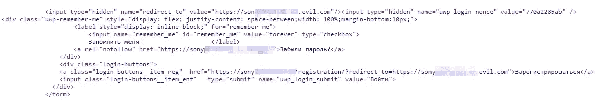
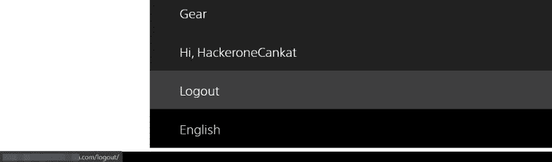
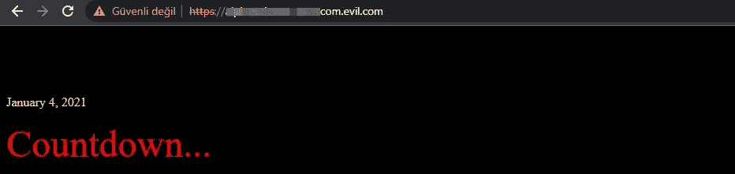
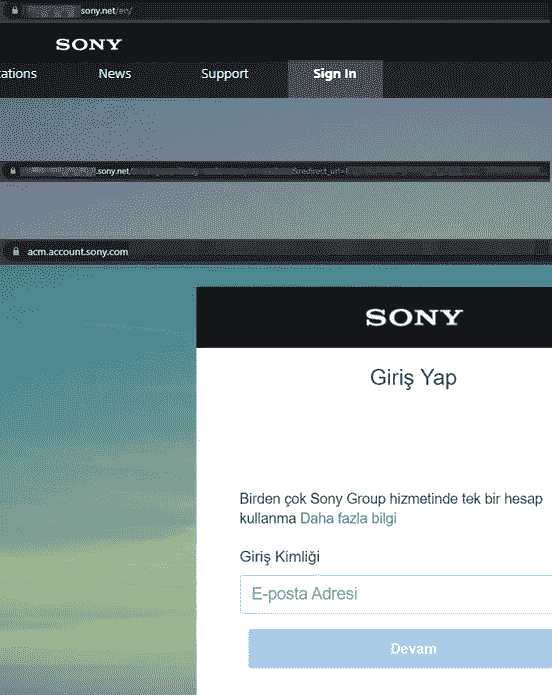
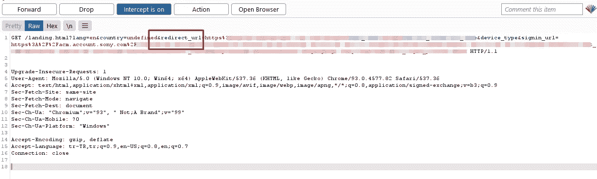

# 索尼狩猎 I:发现隐藏参数(5x SWAG)

> 原文：<https://infosecwriteups.com/sony-hunting-i-discovering-hidden-parameters-5x-swag-c3396c0064bc?source=collection_archive---------0----------------------->

大家好。

已经很久了。希望大家都好。我想，我应该发表一篇新的评论，我已经准备好了。
今天我要讲的是几个月前我在索尼发现的一系列漏洞。好，那我们走吧！

如你所知，**索尼**是一个巨大的目标，即使我没有任何财务利润(只有赃物)，我也特别喜欢照顾它。
一般来说，专注于单一的漏洞类型不是我的风格。然而，在这个广泛的范围内，我想让事情变得简单一点，只关注开放重定向漏洞。因为寻找诸如开放重定向之类的漏洞被遗忘或忽略了。所以，这篇文章的主题将是**的开放重定向。**(我打算以后用其他漏洞继续这个系列。)

> **侦查是我的生命**

crt.sh/?q =索尼

我注意到，在范围较广的程序中，使用关键字比输入目标的域名更有用。

因此，在某些程序中，尝试使用“Sony”“Sony typictures”这样的关键字，而不是“sony.com”或“sony.net ”,可能会产生更多输出。同时“%”之类的呆瓜。%.%.target.% "和“%.target.net”在 crt.sh 上还是可以有创意的

> **搜寻隐藏参数**

“redirectUrl”参数是一个潜在的开放重定向。

在这段时间里，我与 GAU 和 FFUF 一起回顾了索尼的子域名。(有时是 waybackurls)一般来说，我关注的是带有登录或注册部分的域。
基本上我所做的是发现接受用户输入的页面，然后尝试重定向用户，看看参数是否正常工作。
此外，JS 文件对于发现新参数总是很重要的。当我得到一个 js 文件作为任何输出的结果时，我用 LinkFinder 查看其中的参数。最后，Paramspider 或 Arjun 可以帮助我们发现隐藏的参数。

现在我们基本上已经看到了我们能做什么，让我们继续我遇到的案例。

> **案例一:使用隐藏参数的基本开放重定向**

在第一种情况下，我正在浏览 SonyPictures 的子域，我注意到它们中的大多数没有收到用户的输入。然而，我发现了几个例外。

当我打开页面的源代码时，我通常会搜索隐藏的参数和关键字，如“重定向”或“返回”。
没多久，我偶然发现了一个类似下面的参数。

隐藏参数在 URL 中不可见，所以我们必须自己添加参数。我试图通过创建一个类似下面的结构来干扰这个参数。
*sonypicturessite.tld/login/?redirect_to=targetsite.com"*

当尝试重定向参数时，我做的第一件事是将“. evil.com”添加到域的末尾。使目标网站成为子域，并重定向到 evil.com。这是一个快捷方式，它允许我们看到参数的结尾没有被过滤。

> **情况二:复制隐藏参数**

与第一种情况类似，我在不同的登录面板中发现了一个隐藏的参数。然而，这一次它不允许开放重定向。我尝试了很多方法，但无法绕过它。

但是游戏当然不会就此结束，我想到了在不同的潜在重定向区域尝试相同的参数。就像登录一样，注销屏幕也是其中之一。
在这一点上，我认为我在登录屏幕上发现的参数是一个常用参数，用于注销或重定向同一个站点。

我将找到的参数添加到注销 URL 的末尾，并获得了另一个成功的重定向。

> **案例三:干扰重定向**

这篇文章的最后一个例子是关于干扰使用 URL 上的镜像参数进行的重定向。让我们来看看这个例子，以便更好地理解这一点。

在最后一个目标中，当我点击登录时，它将我重定向到通过 sony.com 登录。然而，中间的重定向参数没有逃过我的注意。这个 URL 看起来很乱，所以我决定用 Burp Suite 来检查它。

我第一次尝试就能够将“redirect_url”参数重定向到目标站点。

现在我有 5 个索尼的赠品。我发现的其他重定向与这些类似。

就这些了，谢谢你的阅读。你可以在推特上关注我。[https://twitter.com/canmustdie](https://twitter.com/canmustdie)