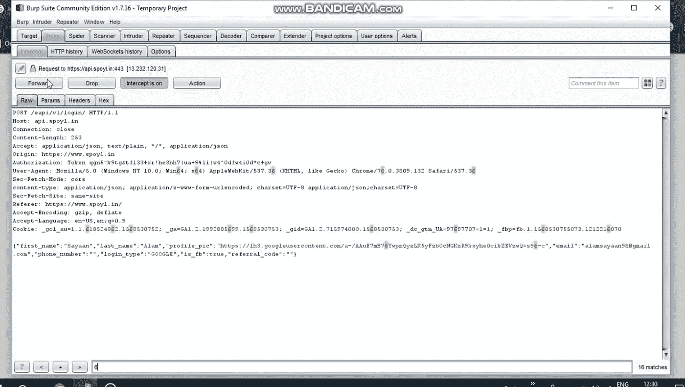
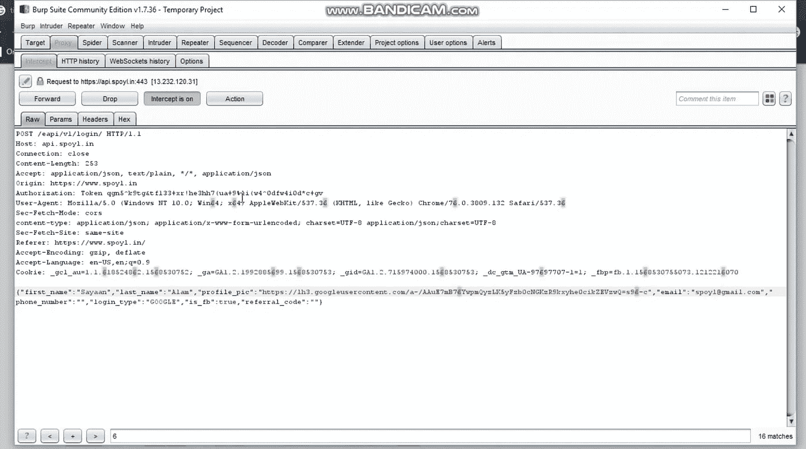
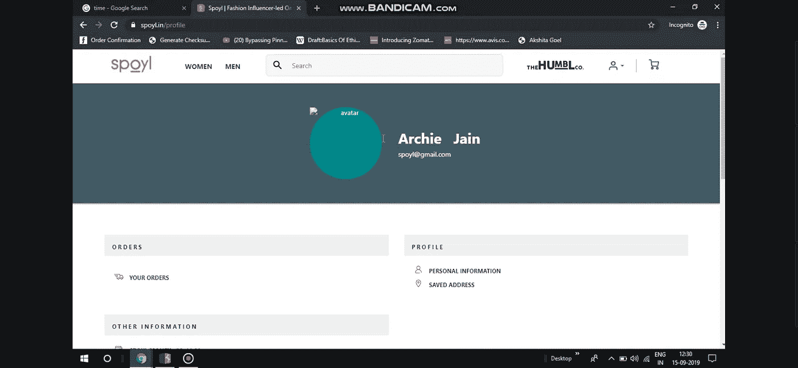

# Spoyl 数据泄露背后的故事！！！

> 原文：<https://infosecwriteups.com/spoylleak-4ea0a8641561?source=collection_archive---------0----------------------->

你好，信息安全社区，我是 Sayaan Alam，我写的文章并不完美，请忽略错误...让我们转到 bug.....

## 是什么 bug

有一个 IDOR 导致帐户接管，主要问题是与谷歌登录服务的集成，网络服务器只是验证用户的邮件 id，而不是验证访问令牌和电子邮件，所以我用受害者的电子邮件 id 的邮件 id 替换了“电子邮件”值，并获得了访问权限。

## 关于漏洞

IDOR——当用户提供的输入未经验证就被服务器处理时，应用程序通过不同的参数以不安全的方式引用一些其他内部对象时，就会出现这种情况。此漏洞主要出现在 API 的中

## 我们开始吧

那是 2019 年 5 月，我在 bug bounty 最喜欢的时间，因为我在 20 多家不同的公司发现了 20 多个 bug...甚至我这个月也去谷歌了 HOF...

所以，我在搜索虫子，累了就开始在我的 Instagram 上冲浪...斯波伊尔的一则广告提出了测试斯波伊尔的想法...这些天来，我一直热衷于测试使用谷歌选项登录，我向前迈进，并进行测试.....当从 Google 返回时，我发现一个对 spoyl web 服务器的访问请求...

我当时就想万岁！！！当我发现这个的时候...所以我用一个随机的电子邮件 id spoyl@gmail.com 操纵了它...

猜猜看...结果是什么，我成功地登录到用户的帐户...

主要故事开始了
对我来说，这是聚会时间，但不是那么早...
现在我搜索他们的首席执行官的电子邮件地址，希望能在 rocket reach 上找到...我开了他们 CEO 的账户，拿到了他的手机号码...有趣的是，获得首席执行官的私人电话号码将使报告漏洞变得容易...我向前移动并向他报告了这个错误，他立即打电话给我并询问了这个错误...我认为他是一个负责任的人...但是等等！！！不是这样的...第二天我查看了那期杂志，它还在，我当时就想-哇！！！这是一个帐户接管或 XSS，为什么这些家伙不重视它...我把它留下，一周后又检查了一遍...嗯，它还在，我又联系了 CEO.....他挡住了我...

我当时很迷茫，离开了他们...现在在 9 月份，我再次检查了它，猜猜是什么错误仍然存在，当时我非常生气，因为该网站将数百万人的数据置于危险之中，许多印度名人在 spoyl 上拥有自己的账户.....真的，我没想到这是一个硅谷海归说的....(是的，他曾在硅谷工作过)...现在我想联系一些记者来强调这个问题...我联系了许多记者，但得到了赫芬顿邮报的拉赫纳·凯拉女士的帮助，她打电话给我，询问了与臭虫有关的一切，当我告诉她许多印度名人..有了他们在 spoyl 上的账户，我就可以访问他们的电话号码和详细地址.....她问我要证据，所以我给她发了一个印度名人账户的证据.....她核实了这一问题，并联系了 spoyl 首席执行官，确认了这一问题...他们第二天就修好了……(媒体的力量)

## 我背后的动机

安全应该是每个公司的第一要务。但是有 70%的公司不重视网络安全…这是你公司最重要的部分。许多公司不尊重帮助他们提高安全性的安全研究人员，甚至许多公司威胁他们将提起诉讼。想象一下，如果一个黑帽黑客而不是白帽黑客得到了同样的错误，他会对你做什么。我们希望拥有安全可靠的网络空间。

## 应该改变什么

每个公司都应该启动负责任的信息披露政策的漏洞奖励计划。你应该尊重每一个向你报告 bug 的黑客，而不是利用它。

初创公司的心态应该是这样的，你应该在公司成立时启动你的漏洞奖励计划，或者你应该在任何服务推出前定期进行漏洞评估。这对初创企业来说很重要，因为如果你的声誉下降到最初的水平，你就很难再恢复。

## POC 视频

## 不要忘记阅读这篇新闻文章

[https://www . huffington post . in/entry/spoyl-website-bug-found-by-14-year _ in _ 5dc 1641 AE 4b 0615 b 8 a 99830 c](https://www.huffingtonpost.in/entry/spoyl-website-bug-found-by-14-year_in_5dc1641ae4b0615b8a99830c)

祝你未来的信息安全事业好运。

如果你有任何关于这篇文章的问题，请通过 twitter 联系我。我要打开我的 DM。

[推特](http://twitter.com/alamsayaan)

## 伙计们，请不要犹豫，鼓掌 50 次😊

# 下次见！

## 如果你喜欢我的博客文章和我的作品，请考虑看看我的“给我买杯咖啡”页面
[https://www.buymeacoffee.com/jgUFSPu](https://www.buymeacoffee.com/jgUFSPu)

*关注* [*Infosec 报道*](https://medium.com/bugbountywriteup) *获取更多此类精彩报道。*

 [## 信息安全报道

### 收集了世界上最好的黑客的文章，主题从 bug 奖金和 CTF 到 vulnhub…

medium.com](https://medium.com/bugbountywriteup)