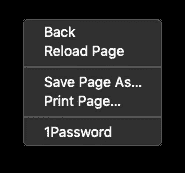
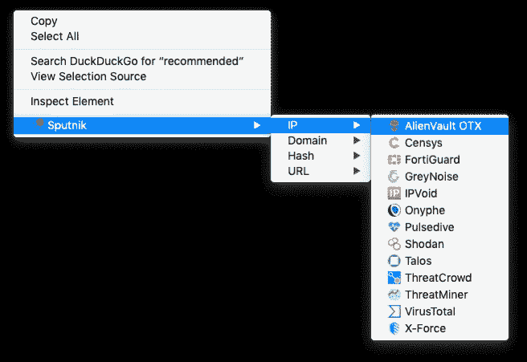
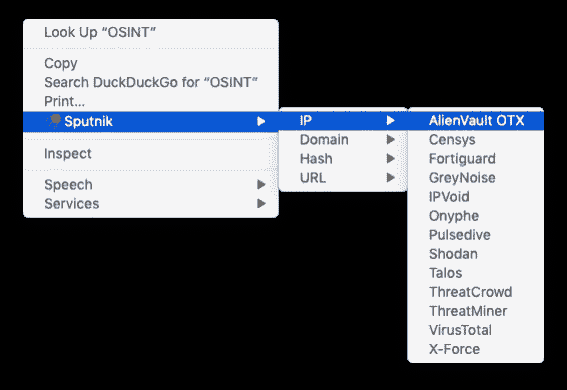

# Sputnik——开源智能浏览器扩展

> 原文：<https://infosecwriteups.com/sputnik-an-open-source-intelligence-browser-extension-da2f2c22c8ec?source=collection_archive---------0----------------------->


# 摘要

Sputnik 是一个浏览器扩展，我设计它是为了使用免费的开源智能(OSINT)资源快速方便地搜索 IP、域、文件散列和 URL。

作为一名事件响应分析师，该工具能够简化调查期间收集的工件的旋转。能够快速收集信息有助于为调查提供背景，并有助于对事件进行叙述。

我设计这个的时候考虑到了方便和效率。为了使用这个扩展，只需突出显示您想要搜索的工件，然后右键单击选择一个 OSINT 工具。您也可以右键单击超链接、图像、音频和视频内容，域将从这些工件中提取出来。在大多数情况下，您会被直接重定向到结果。对于需要用户交互的工具，比如 captchas，突出显示的工件被保存到您的剪贴板，您将被定向到提交页面来粘贴所选择的工件。

Sputnik 是免费的:

*   [火狐插件商店](https://addons.mozilla.org/en-US/firefox/addon/sputnik-osint/)
*   [Chrome 网络商店](https://chrome.google.com/webstore/detail/sputnik/manapjdamopgbpimgojkccikaabhmocd)

下面是一些例子和代码片段来解释它是如何工作的。

跳到最后，查看两种浏览器中的扩展截图。

# 设计样本

Sputnik 在 Firefox 和 Chrome 中是作为上下文菜单项实现的。上下文菜单是浏览器中的界面窗口，通过右键单击出现，例如:



上下文菜单示例

上下文菜单浏览器扩展通常有两个基本组件:

1.  存储元数据(如版本号和权限)的清单。
2.  实现扩展功能的 javascript 文件。

# 显示

浏览器扩展的典型清单如下所示:

人造卫星清单

正如您所看到的，它包含了一些信息，如简要描述、图标文件的路径、版本号和一组权限。为了在 Firefox 和 Chrome 中实现菜单项，我不得不使用每个浏览器支持的 API/框架，以便尽可能多地利用内置功能，避免重新发明轮子。

# 上下文菜单功能

我选择按照工件类型(IP、域、文件散列和 URL)将 OSINT 源分成它们自己的子菜单。为此，我使用了父/子菜单:

Firefox 上下文菜单

为了启动选择的 OSINT 资源，我简单地使用了一个 switch 语句来设置将要打开的 url。对于在 URL 中支持工件的工具，我在搜索链接后面附加了选择的文本。

上下文菜单功能

# 剪贴板写入

Firefox 内置了向剪贴板写入数据的功能，实现起来很简单:

```
navigator.clipboard.writeText(info.selectionText);
```

虽然 Chrome 授予了剪贴板写访问权限，但目前没有内置的支持向剪贴板写入的功能。我能够实现一个将文本写入剪贴板的 JavaScript 函数:

Chrome 剪贴板写入

调用该函数将选定的文本写入剪贴板，使用:

```
copyStringToClipboard(info.selectionText);
```

访问 Sputnik 的 GitHub 获取 Firefox 和 Chrome 扩展的所有代码！这个项目已经收到了来自开源社区的惊人的建议和输入，我期待着与其他用户一起使这个工具变得更好。

# 火狐浏览器

可以通过 Mozilla 在[火狐插件商店](https://addons.mozilla.org/en-US/firefox/addon/sputnik-osint/)买到。



Firefox 演示

# 铬

可通过 [Chrome 网上商店](https://chrome.google.com/webstore/detail/sputnik/manapjdamopgbpimgojkccikaabhmocd)购买。



Chrome 演示