# SPYSE——不是你常用的互联网搜索引擎

> 原文：<https://infosecwriteups.com/spyse-not-your-regular-internet-search-engine-f18b77d534aa?source=collection_archive---------1----------------------->

当我们说互联网搜索引擎时，您会立即想到提供开放端口列表和在整个互联网的这些端口上运行的服务信息的服务。

SPYSE 也提供了这些信息。但不仅仅如此。它做得更多。

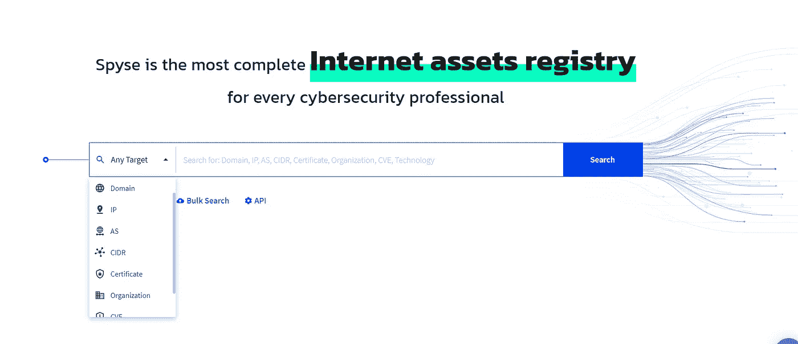

摘自 Spyse 网站

让我们来看看一些使 Spyse 从其他类似服务中脱颖而出的功能。

# 1)执行搜索不需要语法。

他们只需键入这些字段中的任何一个即可开始。

*   域名
*   IP 地址；网络地址
*   ASN —自治系统号
*   指挥员(Commander)
*   SSL 证书
*   组织
*   CVE

# 2)高级搜索确实非常高级

有这么多你可以做的高级搜索，让我给你看几个可能性。我举个例子。

## 案例研究 1 —硬币蜂箱

如果我们想分析有多少域仍然感染着 **Coinhive** 恶意软件( **Coin Hive** 是一种加密货币挖掘服务，它依赖于一小块被设计安装在网站上的计算机代码。该代码使用任何访问该网站的浏览器的部分或全部计算能力，招募机器来挖掘 Monero 加密货币的比特),我们可以利用这样的高级搜索功能。

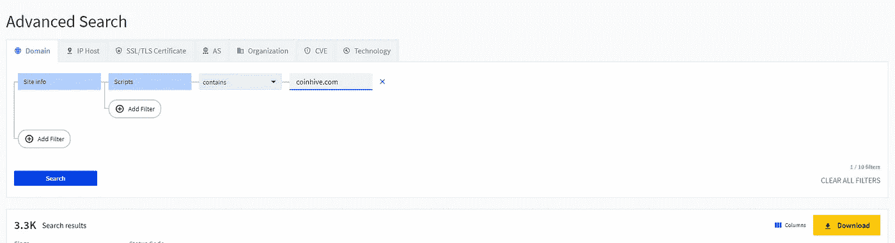

获取包含 coinhive 恶意软件的域

在上面的例子中，我们首先选择域模块，在它里面，有更多的选项，像 DNS 记录，站点信息，域名，技术等等。

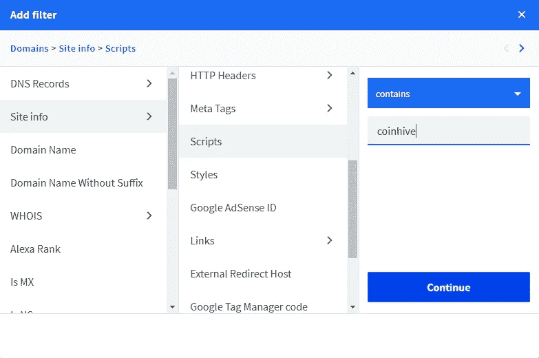

高级搜索示例。

所以你可以搜索任何一个网站，只要它的脚本中包含了某个特定的单词。

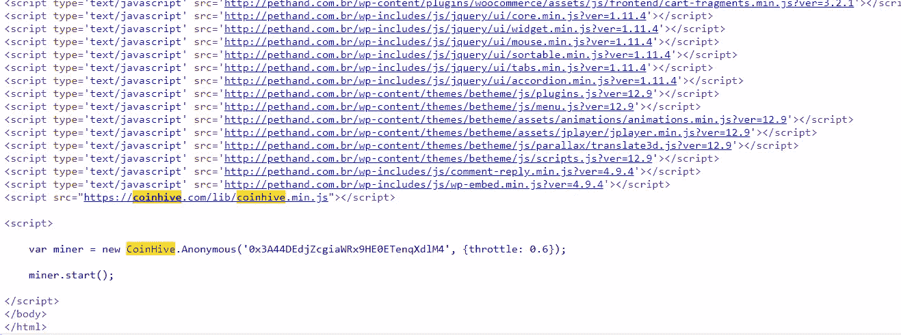

其中一个网站包含 coinhive 恶意软件

## 案例研究 2 —亚马逊 S3 桶

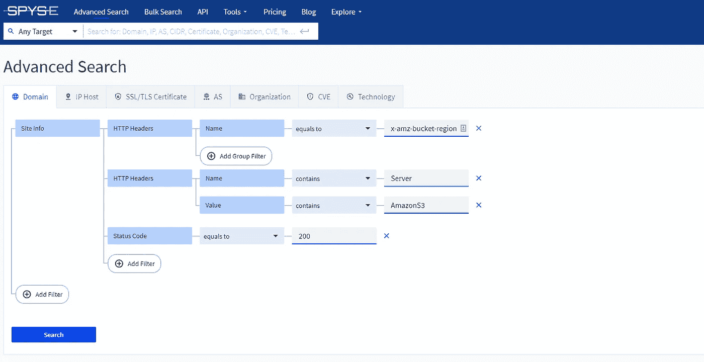

寻找活着的 S3 水桶

使用高级搜索，您可以像上面一样使用复杂的多个条件来查找活着的 S3 桶。您可以进一步缩小搜索范围，找到您正在寻找的域名。

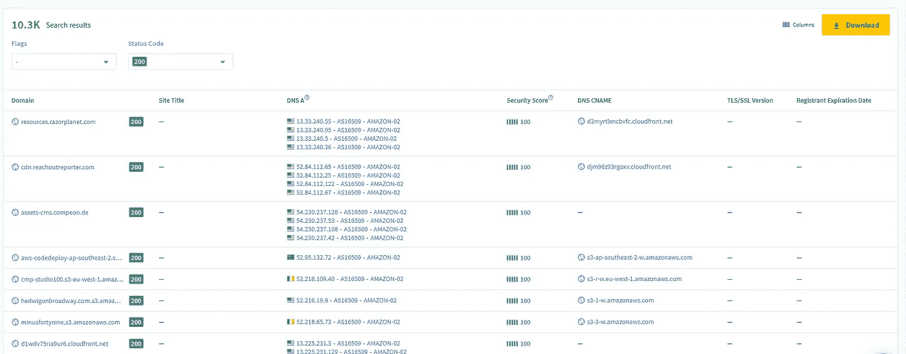

上述搜索的结果

这是找到 S3 网址的另一种方法

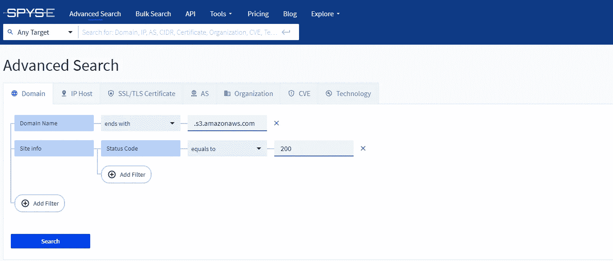

AWS S3 URL 发现

这是上面搜索的结果。

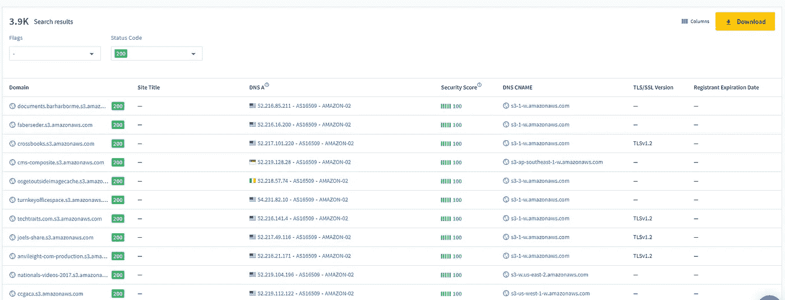

# 3)构建复杂的查询

在下面的示例中，您可以看到在印度搜索运行 Microsoft Exchange 服务器的 IP 是多么容易。

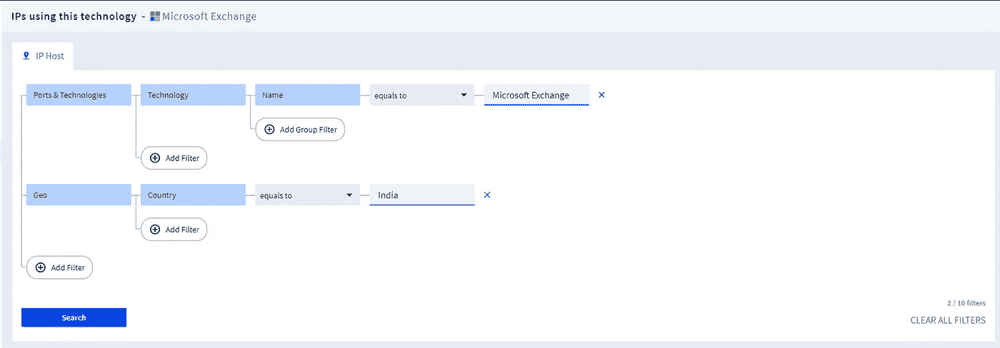

印度的 Microsoft Exchange 服务器查询。

点击按钮，您将获得以下信息。

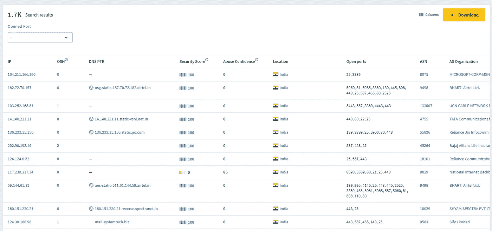

Microsoft exchange 服务器列表。

从这里你可以下载 IPs，DNS PTR 记录，开放端口等。，非常得心应手。

# 4)高度相关的数据

当您搜索任何域时，您还会获得相关数据，如有多少其他域托管在相同的 IP 地址、相同标题的域、具有相同主机的 IPV4 主机、子域等。

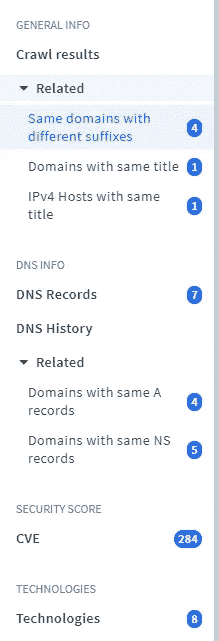

这些信息不需要额外的努力就可以提供给你。仅仅访问这些数据就能帮助你在侦察过程中获得各种见解。

# 结论

用 Spyse 的数据进行这样的分析非常容易。因为 Spyse 还具有对识别恶意 IP 有用的 IP 滥用信息。

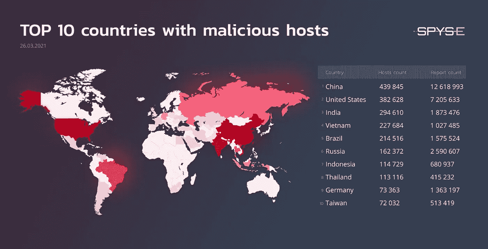

# 泄漏

我们将赠送 3 张为期 1 个月的 Spyse 订阅优惠券。我们很高兴看到您将如何处理这份订阅。关注我们的推特，了解更多关于捐赠的信息—[https://twitter.com/InfoSecComm](https://twitter.com/InfoSecComm)