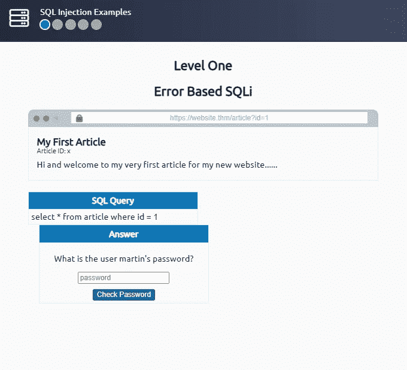
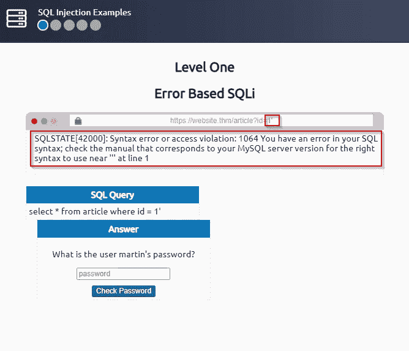
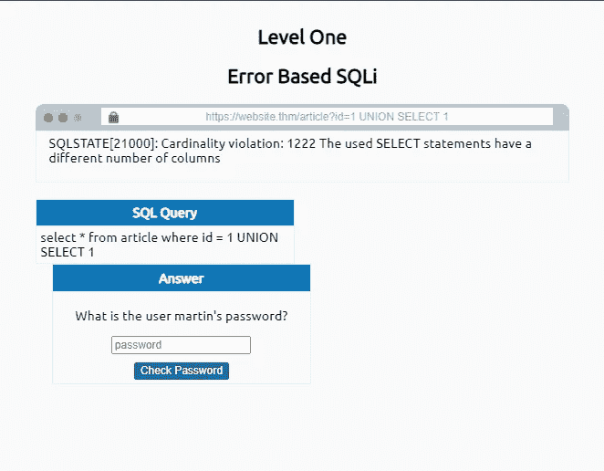
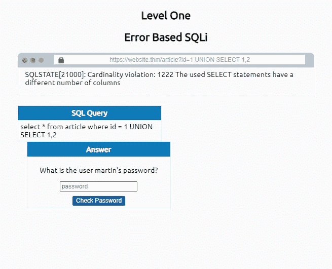
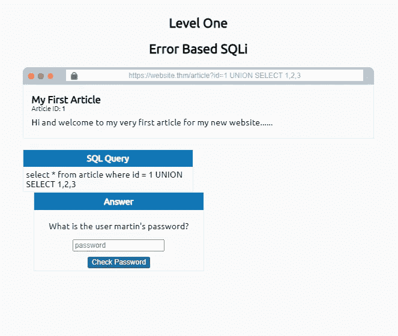
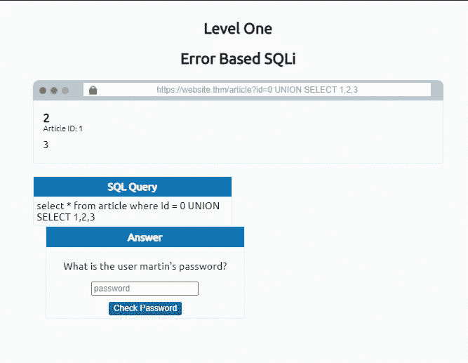
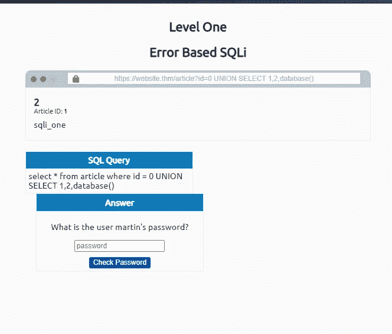
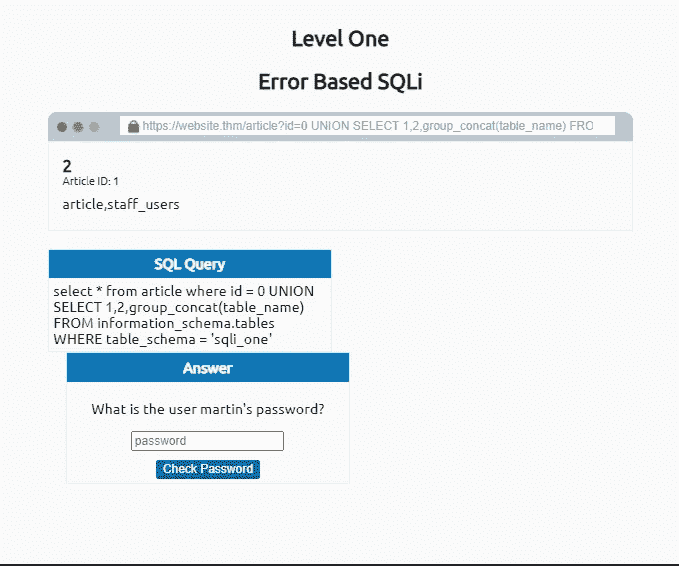
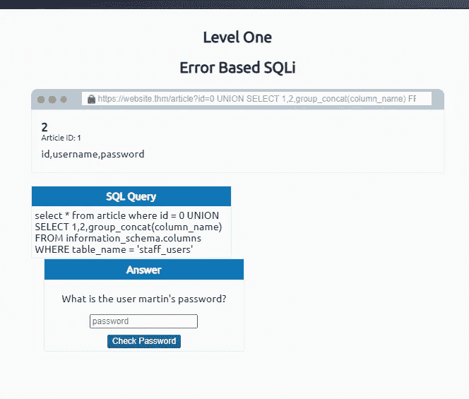
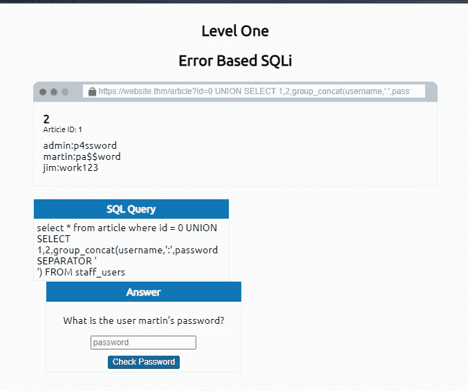

# SQL 注入 JR. Pentester -TryHackMe

> 原文：<https://infosecwriteups.com/sql-injection-jr-pentester-tryhackme-13bc28649034?source=collection_archive---------0----------------------->

嗨，了不起的黑客们，在这个故事中，你们将会知道什么是 SQL 注入，以及如何在不同的类型中找到它们。

SQL 注入也被定义为 SQLi，这是一种对应用程序 web 服务器数据库的攻击场景，通过在数据库中执行恶意查询，导致窃取数据、修改和删除客户数据。

坦率地说，这是最危险的漏洞，因为来自用户的验证输入未经整理或不正确。

> **控制数据库的软件的首字母缩写是什么？**

答复:数据库管理系统

> **保存数据的网格状结构的名称是什么？**

*答:表*

SQL 代表结构化查询语言，用于查询数据库以检索客户需要的信息，只需经过身份验证。SQL 有一个执行操作的命令列表。

SQL 查询，如选择、插入、删除、删除、创建等。每个命令执行独特的操作。

**选择:**

该命令用于从数据库中检索数据。

`select * from users;`

它用于从用户那里选择数据。

**工会**

该命令用于组合 2 个或多个 SELECT 语句的结果，从单个或多个表中检索数据。

`SELECT name,address,city,postcode from customers UNION SELECT company,address,city,postcode from suppliers;`

插入

它用于向数据库中插入新的一行数据。

`insert into users (username,password) values ('bob','password123');`

更新

它用于更新表中的一行或多行数据。

`update users SET username='root',password='pass123' where username='admin';`

删除

它用于删除一行或多行数据。

`delete from users where username='martin';`

> **用什么 SQL 语句检索数据？**

*答:选择*

> **哪个 SQL 子句可以用来从多个表中检索数据？**

*答:工会*

> **用什么 SQL 语句添加数据？**

*答:插入*

> 什么字符表示 SQL 查询的结束？

*答:；*

SQL 注入可以分为三种主要类型

**带内 SQL 注入、基于错误的 SQL 注入、基于联合的 SQL 注入**

寻找带内 SQLi 的实用方法:

这种类型的 SQL 注入基本上发生在输入特殊字符时，错误信息直接显示在浏览器上。

上面的实际例子显示了站点有基于错误的 SQL 注入，所以接下来，我们需要指出数据库表中有多少列

这表明表中没有一列和两列。

我们在表的数据库中有三列。

在上面的例子中，我更改了 id=0 而不是 1，因为查询需要显示数据。

我们使用上面的命令查找数据库名称

我们使用`0 UNION SELECT 1,2,group_concat(table_name) FROM information_schema.tables WHERE table_schema = 'sqli_one'`在数据库中找到表名

我们使用`0 UNION SELECT 1,2,group_concat(column_name) FROM information_schema.columns WHERE table_name = 'staff_users'`找到列名

最后，我们使用`0 UNION SELECT 1,2,group_concat(username,':',password SEPARATOR ' ') FROM staff_users`在专栏中找到有趣的信息

> **完成 1 级后是什么旗？**

*Ans:THM { SQL _ INJECTION _ 3840 }*

我通过输入网站上显示的马丁旗帜找到了上面的旗帜。

让我们在下一个博客中看到更多类型的 SQL 注入。点击关注按钮，通过电子邮件订阅。下一个博客再见。