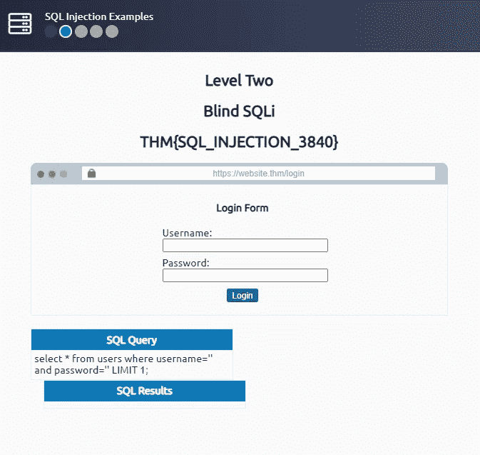
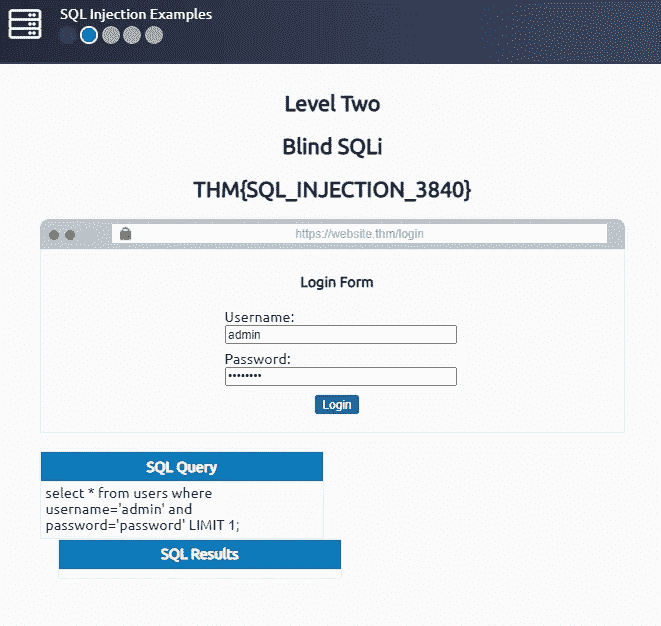
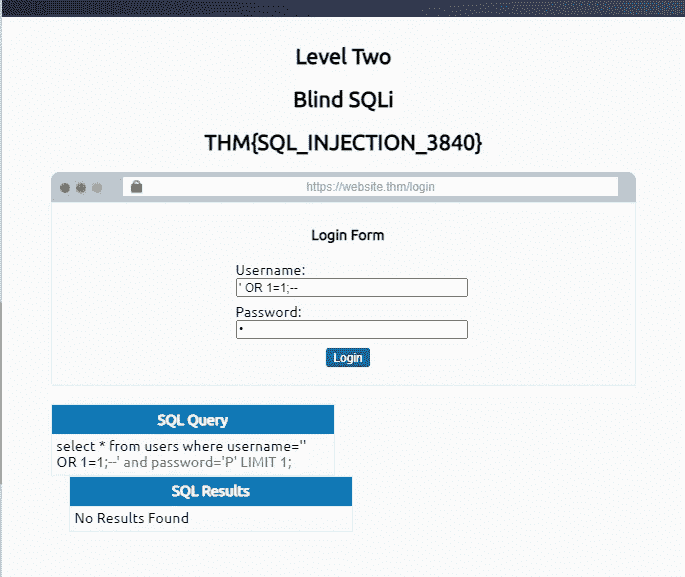
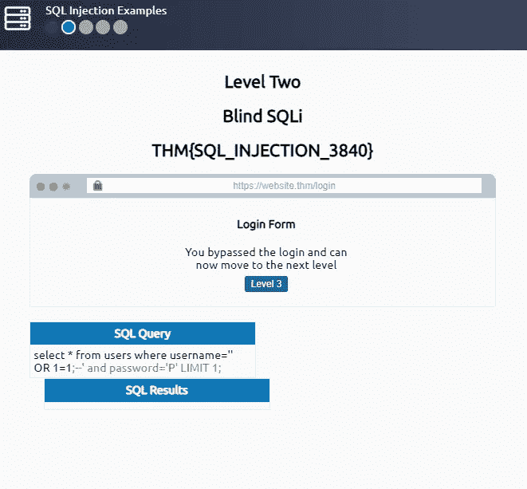
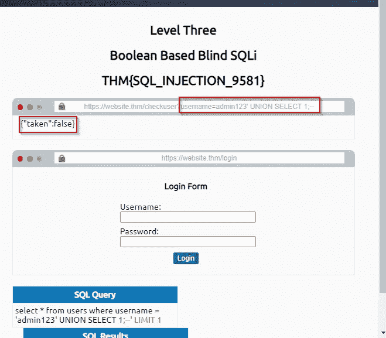
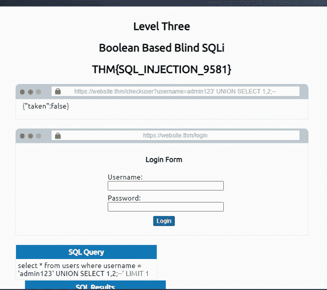
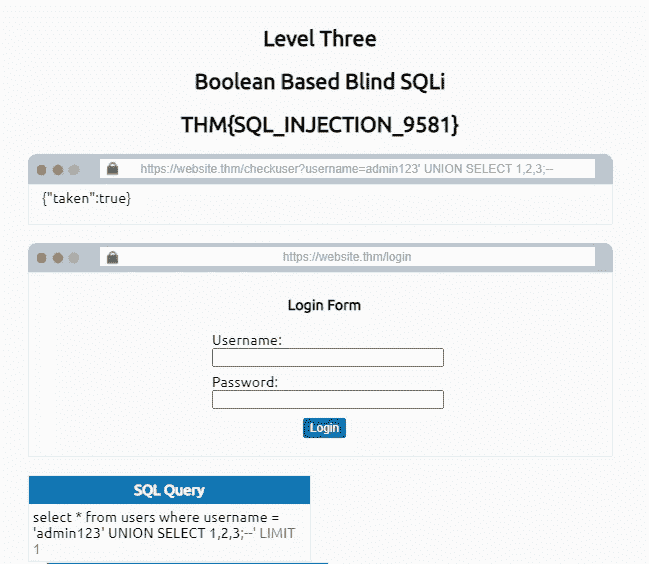
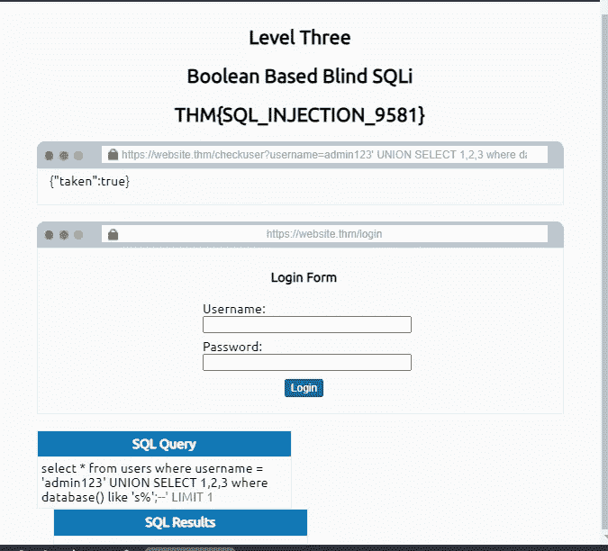
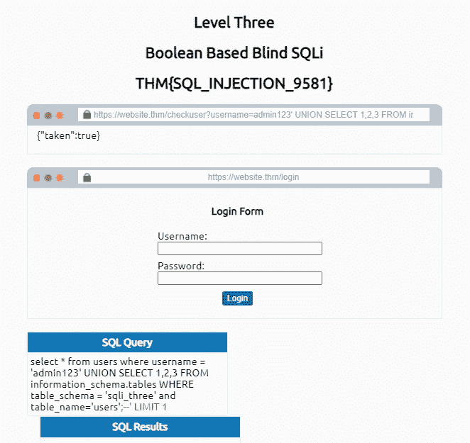
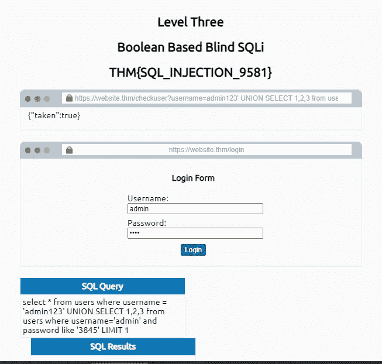

# SQL 注入 JR. Pentester -TryHackMe 第 2 部分

> 原文：<https://infosecwriteups.com/sql-injection-jr-pentester-tryhackme-part-2-3b9d106e9d7b?source=collection_archive---------0----------------------->

嗨，伙计们，欢迎回到小 SQL 注入的第二部分。

在这一部分中，我们将了解**盲 SQLi —身份验证绕过、盲 SQLi —基于布尔、盲 SQLi—基于时间、范围带外 SQLi 和补救。**

因此，让我们从盲 SQLi 开始，即绕过身份认证。最关键的方法是认证旁路，这可以通过盲 Sqli 技术来实现。

**让我们开始动手:**

SQL 查询如下所示:

`select * from users where username='%username%' and password='%password%' LIMIT 1;`

我给了登录的默认密码，但不幸的是没有。

我应用了一些绕过认证的技术。

它成功登录。

下一个副标题是基于布尔运算的 SQL 注入。一般来说，布尔意味着真或假，是或否，基于布尔条件的 0 或 1 得出问题的解决方案。同样，这些条件也适合 SQL 注入让我们看看实际的示范。

当我使用上面显示布尔值 false 的查询时。

类似地，当应用联合选择 1，2 时；— —显示相同的假布尔值。

它显示一个真布尔值，这表示数据库中有 3 列。

然后为了找到数据库我使用这个查询 ***admin123' UNION SELECT 1，2，3 where database()like ' s % '；—***

最后链接我得到了数据库的结果 **sqli_three** 。

***admin123' UNION SELECT 1，2，3 FROM information_schema.tables 其中 table_schema = 'sqli_three '和 table _ name = ' users—‘极限 1***

上面的查询对于查找表名很有用。

让我们通过应用布尔方法来完成寻找密码的任务。

此处使用的查询:

***admin123' UNION SELECT 1，2，3 from username = ' admin '和 password like ' 3845 ' LIMIT 1；—***

> **完成四级后最后的旗帜是什么？**

**THM { SQL _ INJECTION _ MASTER }**

在这一部分，我们将了解带外 SQLi。

这是在数据库服务器或业务逻辑 web 应用程序上启用的。

> **说出一个以 D 开头的协议，该协议可用于从数据库中提取数据。**

***DNS***

**补救:**

使用预准备语句、输入验证和转义用户输入。