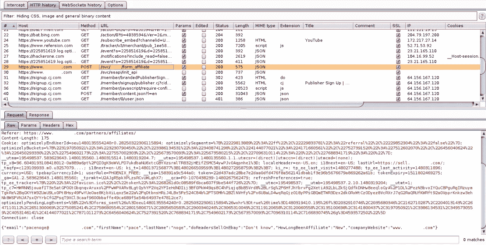
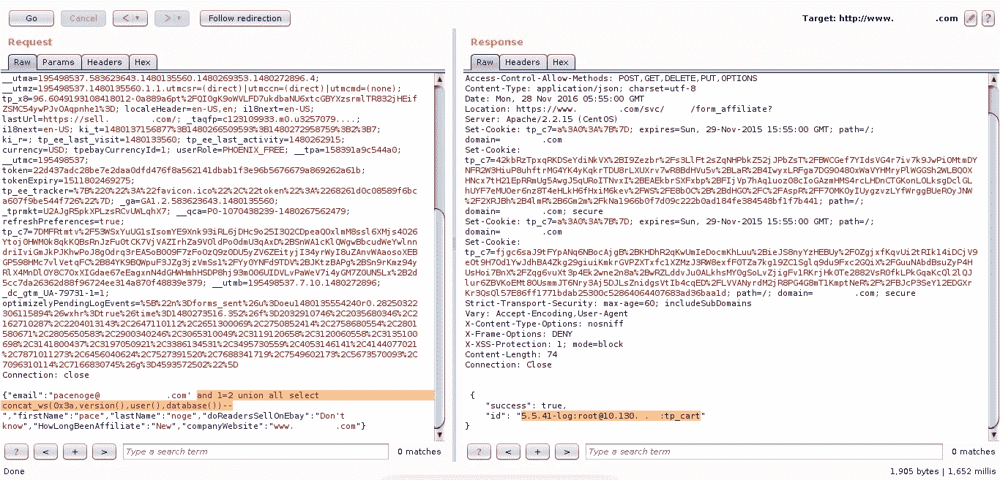
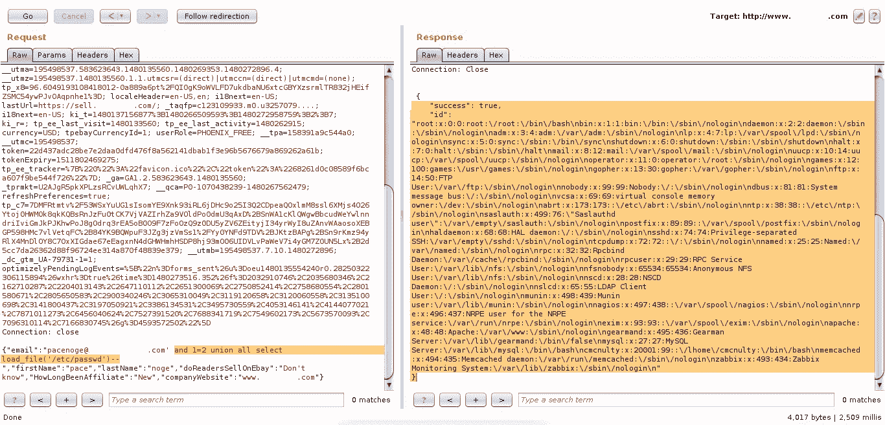
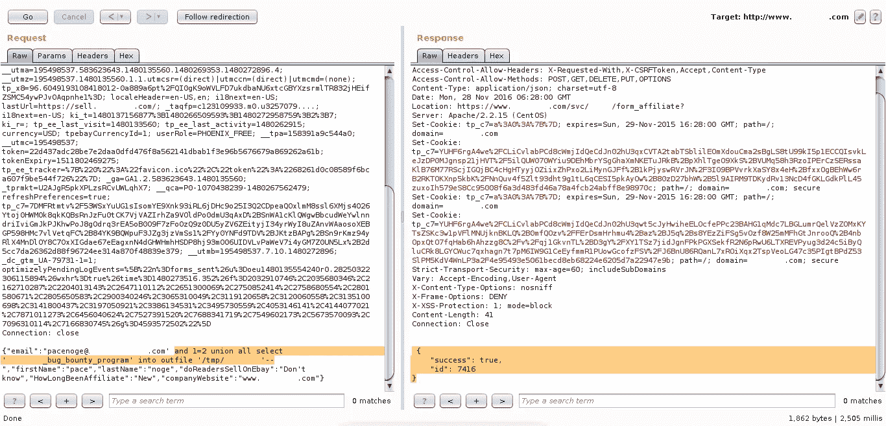
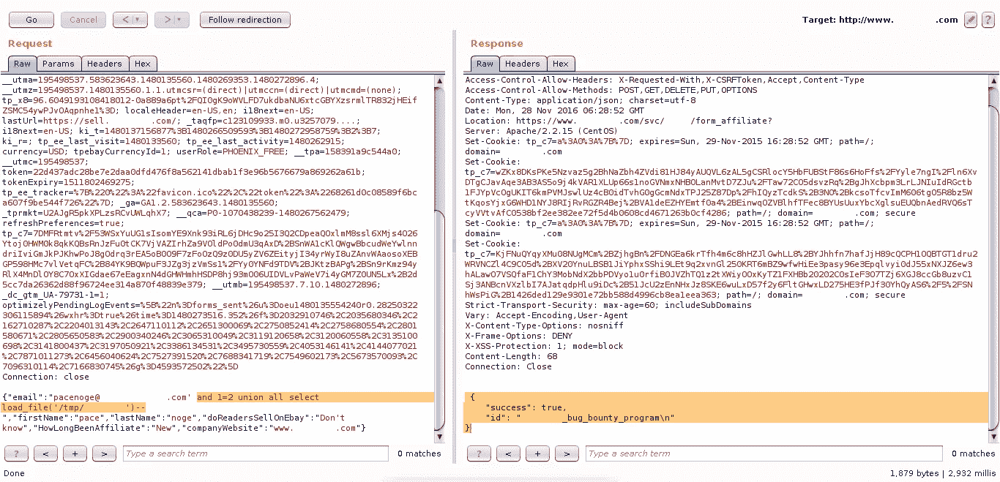

# 将文件加载到输出文件的 SQL 注入

> 原文：<https://infosecwriteups.com/sql-injection-with-load-file-and-into-outfile-c62f7d92c4e2?source=collection_archive---------0----------------------->

这次提交让我在 h1 上得到了病人徽章，因为这已经超过 6 个月(1 年)了，呵呵呵呵。用撇号(')测试时，我得到了 sqli 漏洞。抱歉，编辑们。😛

我确实像往常一样在网上注册了会员。

然后得到了重定向，把所有表单信息都贴在这里[**【https://www.blablabla.com/svc/*****/form_affiliate】**](https://www.blablabla.com/svc/*****/form_affiliate)。选择它并发送到中继器。易受攻击的参数是 **email** 。

在请求框中，我在“ **email** ”参数**”中输入这个 SQL 命令，1 = 2 union all select concat _ ws(0x3a，version()，user()，database()) —** 并单击 **Go** (这个命令将显示版本、用户和数据库名称)

结果显示在响应框" **5.5.41-log:root@10.130 中。*.**:tp_cart** ”。现在我试着把 SQL 命令改成这个 load file 命令**'和 1 = 2 union all select load _ file('/etc/passwd ')**和 boom！拿到通行证了。

将 load file 命令更改为 into outfile 命令，以在/tmp **上创建一个文件，1 = 2 union all select ' blablabla _ bug _ bounty _ program ' into outfile '/tmp/blablabla '—**该命令意味着将 blablabla_bug_bounty_program 写入/tmp 目录下的 blabla bla 文件。

现在我再次使用 load file 来查看文件是否是使用这个命令创建的**和 1=2 union 都选择 load _ file('/tmp/blabla bla ')**

而且创建成功了！所以我得到了 sqli，也可以在服务器上创建一个文件。

快乐的黑客们！😃