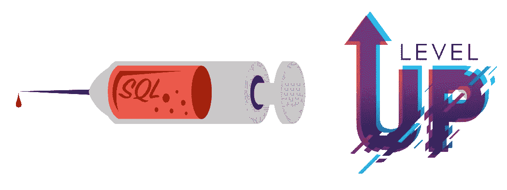

# SQLi:下一级

> 原文：<https://infosecwriteups.com/sqli-next-level-5b1145b83c79?source=collection_archive---------1----------------------->

即使 SQLMap' `--eval`也帮不上忙:)



有一些 SQL 注入，利用它们并不像你在道德黑客课程中看到的那样简单。比如当易受攻击的参数的值是 base64 编码时。在这种情况下你会怎么做？

嗯，你可能会使用`sqlmap`的`--base64`国旗。
或者对于更复杂的场景，你可能想耍酷，使用`sqlmap`的脚本引擎，向`--eval`旗帜寻求帮助。

但是如果连强大的`--eval`功能都帮不上忙呢？那就是你需要提升知识的时候了。⏫

**第一部分:易受攻击的功能**

在一次测试中，我测试了一个用于发送官方邮件和文件的应用程序。
在收件箱部分，有过滤邮件的功能。通过使用下拉菜单，你可以告诉应用程序显示哪些邮件:
未读邮件
高优先级邮件
带附件的邮件
等。

一旦选择了任何一个选项，就会发送一个 POST 请求。
POST 主体很奇怪，它是一个 JSON，其中一个参数包含 XML 数据，一个 XML 标记的属性是易受攻击的 SQL 查询的输入。
简化后的帖子正文:

```
{
    "param1": "<Search Filter='**GIBBERISH HERE**' Order='DESC' Sort='priority'/>",
    "param2": "something..",
    ...
}
```

*方法论* :
我们这里有什么？SQL 查询的输入

我们可以控制查询的哪些部分？
1。
凡(过滤)2。排序依据(排序，顺序)

查询结构可以是怎样的？

```
SELECT 
  * 
FROM 
  letters 
WHERE 
  userid = 12345 
  AND **injection** 
ORDER BY 
  **injection** **injection**
```

它脆弱吗？
由于查询中有几个注入点，一个简单的方法是确认注入是注释查询的一部分。

注意:我们不能在 WHERE 部分注入，因为`Filter`参数的值是加密值的 base64 编码(最好说是混淆的)。这是本文的要点，我将向您展示我如何绕过实现的安全机制。😉

让我们开始注射:

```
{
    "param1": "<Search Filter='GIBBERISH HERE' Order='DESC***/**' Sort='priority**/***'/>",
    "param2": "something..",
    ...
}
```

这种注入影响后端查询的方式:

```
SELECT 
  * 
FROM 
  letters 
WHERE 
  userid = 12345 
  AND injection 
ORDER BY 
  injection**/*** *injection****/ <-- (commented part)**
```

响应服务器返回的数据与之前相同，但是使用了不同的*排序*，这意味着注入成功了！

好，`sqlmap`时间？
我用了`sqlmap`但是无法确认漏洞。所以我开始再次手动测试，但仍然没有机会。

那现在怎么办？放弃？不，那对我来说是禁止的。⛔

我决定处理参数`Filter`的乱码值，并破解加密。反正那样更酷，不是吗？😌但是有可能解密服务器端加密的字符串吗？

**PRO TIP**
每当您在对服务器的请求中看到一个加密的值，但您在服务器的先前响应中找不到该值，这意味着该值很可能在客户端得到了加密。因此，深入研究 JS 文件并破解代码💣
备注:使用`Logger++`的`Grep Values`标签，不勾选`Search Requests`。

**第二部分:逆向工程 js 代码** 我在服务器之前的响应中搜索了加密值，没有找到该值的任何实例，所以我可以非常肯定加密发生在客户端的 JS 代码中。
好了，如何找到负责加密查询的 js 代码？
第一条线索可以是请求本身:

```
{
    "param1": "<Search **Filter**='GIBBERISH HERE' Order='DESC' Sort='priority'/>",
    "param2": "something..",
    ...
}
```

我搜索了包含乱码数据的参数名，并找到了构建 XML 数据的代码。
不错，一个很好的起点。现在是分析代码的时候了。
如何？使用有史以来最好的 js 调试工具: **chrome devtools** 😏

**亲提示** 完整阅读本文档:
[https://developer.chrome.com/docs/devtools/javascript/](https://developer.chrome.com/docs/devtools/javascript/)

长话短说，通过使用`devtools`和设置一些断点，我发现了模糊值背后的工作流程:

**1。**根据用户选择的下拉选项，将选择一个 SQL 查询:

```
function SelectFilter(selectedFilter) {
    switch (selectedFilter) {
        case "unread messages":
            filter = "mailType = 1"
            break; case "high priority":
            filter = "mailType = 1"
            break; case "having attachment":
            filter = "mailType = 1"
            break;
    }
    return filter;
}
```

**2。**然后对查询进行加密:

```
function encrypt(Filter){
    // grep session token

    // mix the query with session token

    // base64 encode the result of previous step // obfouscate the result of previous step

    // base64 encode again return Filter;
}
```

**3。之后，js 查询构建 XML 数据。最后，将 XML 放入 JSON 并发送请求**

此时，我非常确定，如果我找到一种方法，像 js 代码那样加密我的 SQL 负载，并将其发送到服务器，那么在后端代码中将会有一个注入。为什么？
很简单，
因为当开发人员如此努力地隐藏正在传输的查询并在客户端完成所有这些工作时，他认为他的屏障是不可穿透的，并且……服务器端没有保护😏

好了，现在我们知道了工作流程。如何使用这些知识来注入我们自己的查询？写一个脚本来做同样的加密？？不，比那简单多了…

使用`devtools` …
在加密函数的第一行放置一个断点，
将函数的参数值更改为您自己的查询，
点击恢复按钮，让代码完成它的工作，但是以恶意的方式😉
*我告诉过你要看* `*devtools*` *文档，不是吗？*:)

我使用了一个简单的基于布尔的注入来确认漏洞。之后，使用字符串连接技术，我发现后端 DBMS 是`SQL Server`。
你可以在 portswigger 的`SQL Injection cheat sheet`:
[https://portswigger . net/we b-security/SQL-injection/cheat-sheet](https://portswigger.net/web-security/sql-injection/cheat-sheet)的开头找到这个技巧

在执行了几个查询之后，我意识到注入是基于布尔的。

您还记得易受攻击的查询的工作是返回收到的邮件数据，对吗？
那么如果它返回数据，为什么注入是盲目的？
阅读本文，学习如何将盲注转为联注:✌️
[https://medium . com/@ rend _/healing-blind-injections-df 30 b 9 e 0e 06 f](https://medium.com/@Rend_/healing-blind-injections-df30b9e0e06f)

好的，在这个阶段我需要使用`SQLMap`来实现自动化。
但是当易受攻击的参数被如此硬混淆时，如何使用`SQLMap`？

**第三部分:自动化，艰难之路** *在这一部分，我想向你展示如何正确地使用工具****im****😊*

*让我快进一下故事… 2X*

*我需要使用`SQLMap`进行自动化…
但是输入变得模糊…
使用`--eval`标志并编写一个脚本来进行模糊…
什么语言`--eval`接受…？
python…
我应该自己写完整个 python 脚本吗…？
不是当你已经有代码的时候…
但是它在 JS 中…
找到一种方法将 JS 转换成 Python…
google it…
哦，有一个叫做`js2py`的 Python 模块做了确切的工作…
酷，现在我有了一个混淆有效负载的脚本…
我应该在终端中编写整个脚本作为`--eval`的输入吗…？
不，保存为`.py`文件导入:`--eval="import mycode;..."`
如何将脚本的输出插入请求体…？⛔BLOCKED⛔:我无法让它工作…？为什么…？
`eval`标志不像支持`form-based`数据那样支持`JSON`数据…
如果我能够动态地使用`burp`修改请求会怎样…？
要做到这一点，我需要用 burp 执行 Python 代码…
有办法吗…？
谷歌这个也是…
不错，有个扩展叫`python scripter`那个…
✅PASSED✅
怎么用…？
实现了 burp 针对 python 的 API 的一部分… (API 本身是针对 JAVA 的)
哪里可以找到 API 文档…？
此处:burp suite->extender tab->API tab
使用 API 的函数，添加修改请求正文所需的代码…
通过您的脚本进入`python scripter`
不起作用…😕
它不识别`js2py`模块…
试着修一下…
⛔BLOCKED⛔
怎么修…？你的代码在 burp 中不能工作，但在你的终端中可以工作，不是吗？
使用`os.popen()`从您的终端运行它😉
✅PASSED✅
酷，一切正常。现在如何将`SQLMap`带到剧中…？
先说说`SQLMapp`是怎么工作的…？它发送一个查询，并根据注入的有效负载分析响应(你还期望别的吗？😐)
它不关心查询在哪里或如何被注入…
它只是分析响应…
所以…
我删除了整个 POST 主体并在那里放了一个`*`这样，我的脚本收到的请求只包含了`SQLMap`的有效载荷…
我获取有效载荷，修改它，然后我把它放在服务器期望的适当主体中…
我的意思是， 我把它放在 XML 中，把 XML 放在 JSON 中…
发送请求，接收它的响应，把响应交给`SQLMap`并让它做它的工作，分析响应…
✨DONE✨
`SQLMap`确认了基于布尔的注入…*

*布尔基？我更喜欢基于工会的:😏
[https://medium . com/@ Rend _/healing-blind-injections-df 30 b 9 e 0e 06 f](https://medium.com/@Rend_/healing-blind-injections-df30b9e0e06f)*

***有帮助吗？**
我不要求你给我买杯咖啡，
教我点什么…
不和:`**REDN#9702**`*