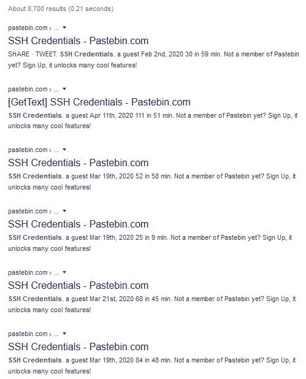
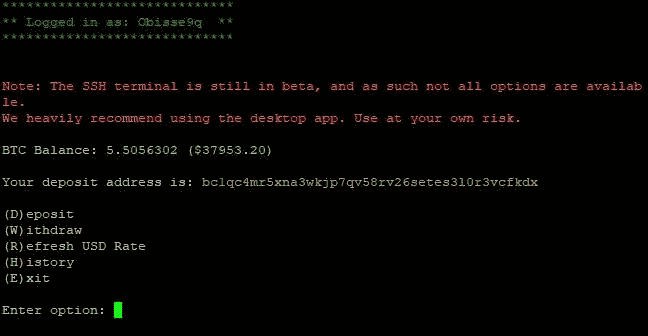
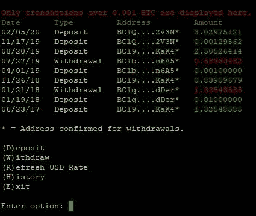
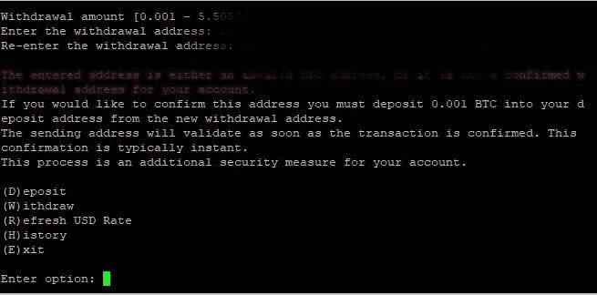
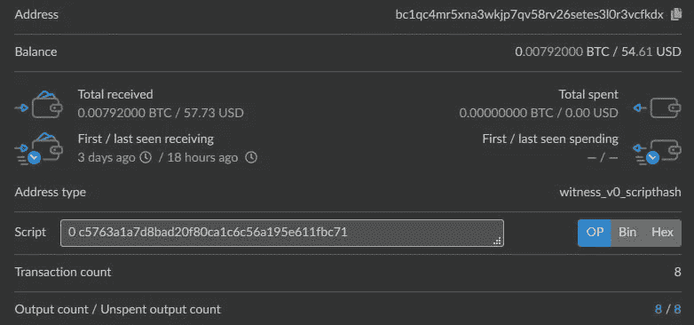
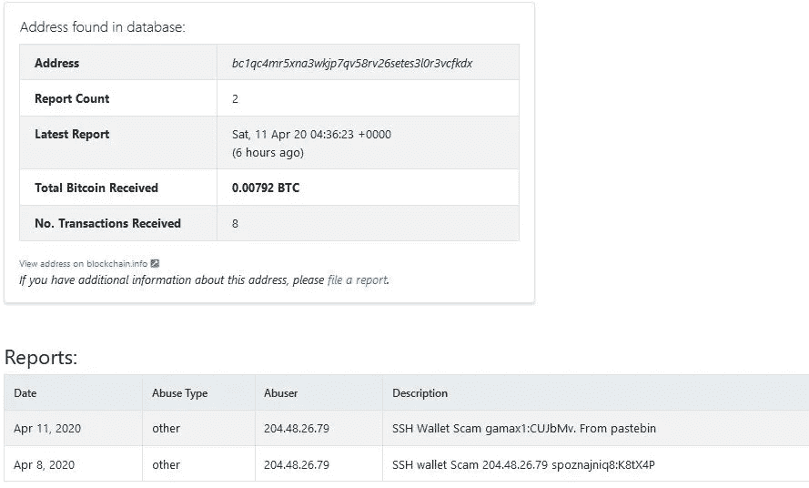
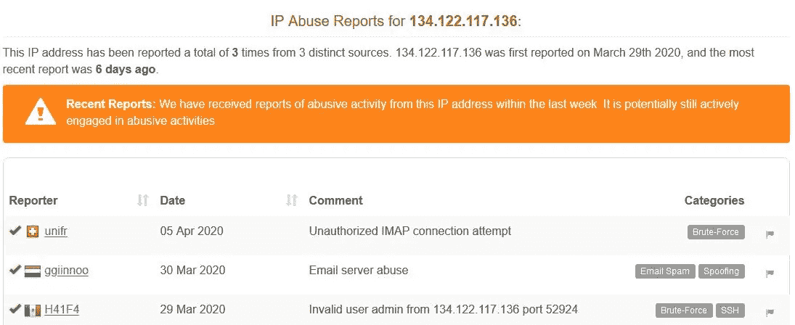

# SSH 比特币钱包:揭开另一个秘密骗局

> 原文：<https://infosecwriteups.com/ssh-bitcoin-wallet-demystifying-another-crypto-scam-afee7ad37f35?source=collection_archive---------2----------------------->

> 注意:本文是使用现有 OSINT 技术的加密调查的一部分！

你们中有多少人会在浏览 Pastebin 或其他论坛时收到一个开放的 SSH 服务器，并尝试一下？特别是，当提到“**比特币钱包**”以及 **SSH 服务器凭证**时，会给密码爱好者探索它增添一层兴奋感。

如果**是的**是你的答案，那么欢迎来到新的秘密骗局的世界。

图片提供:Alphacoders.com

一个名为“SSH 凭证”的新骗局正在各种平台上传播，尤其是在 Pastebin 上。

SSH 比特币钱包骗局的大量结果

Pastebin 上共享了多个具有不同凭据的 IP。为了防止骗局，同样被管理员删除。但是，缓存版本仍然保存数据。

因此，让我们通过登录 SSH 服务器来探索一下

1.  一旦使用凭证登录，用户将显示 5 个选项，即:- **存款、取款、刷新美元汇率、历史记录、退出**以及相当于 **$37，953** 的 BTC 余额。

在这里，我们可以看到演员提供了一个 Bech32 地址(seg wit Mainnet)***BC 1 qc4 Mr 5 xna 3 wkjp 7 qv 58 RV 26 sets 3 l 0 r 3 vcfkdx***

3.通过查看 **H** 历史，我们可能会看到这个地址过去的交易，这与区块链数据不符。因此，可以假设为该选项显示的数据是任何其他钱包 ID 的随机数据，以使用户相信过去的交易。

很好的诱饵！！！

3.当键入“W”时，将显示以下错误

这是给新手的第一个提示，因为它不允许你在没有存入 6 美元(0.001 BTC)的情况下提取任何金额。这明确了这很可能是一个针对比特币钱包持有者的恶意骗局**。**

通过对骗子提供的钱包地址进行余额检查，我们可以发现已经有人在这个 SSH 比特币钱包骗局中损失了钱。

三天之内，骗子赚了 57 美元

同一个地址本月被报道了两次

举报比特币滥用的地址

让我们深入研究一下技术细节…

以下是使用各种登录 SSH 凭证在 Pastebin 上传播 SSH 比特币钱包骗局的 IP 地址

> 83.165.27.4-> R Cable Y telecomuniciones Galicia s . a(西班牙)
> 204.48.26.79->数字海洋(美国)
> **134.122.117.136->数字海洋(美国)**
> 18.218.58.219->AWS(美国)
> 155.164.138.88->AT&T(美国)
> 18.191.151.79->AWS(美国)
> 45.129.2.137->LLC Baxet(俄罗斯)

从上面的列表中，报告最多的 IP 地址是:-

IP 信誉报告

这些是在各种贴子上发现的最活跃的 IP 地址(ATTOW)。还有一种可能是骗子为同一个骗局设置新的 SSH 服务器:- ***SSH 比特币钱包***

**钥匙入口**

> >永远不要从您的主计算机登录到未知的 SSH 服务器
> >永远不要存款，即使您看到过去交易的实质性证明，您也知道证明很可能被篡改
> >始终通过检查比特币滥用来检查比特币地址的真实性 DB
> >报告传播恶意活动的 BTC 地址
> >向 AbuseIPDB 报告 IP 地址，并帮助社区将其列入黑名单。

**注意:- *本文纯属个人研究，未经作者同意，不得在任何地方使用/发表。***