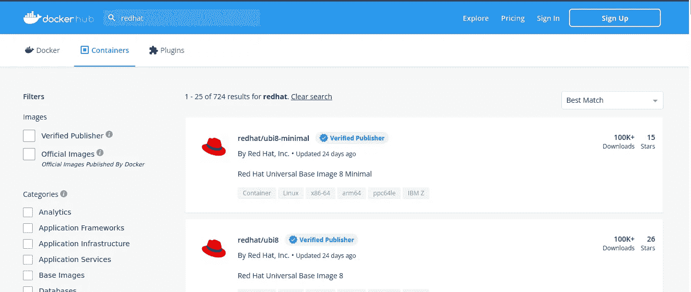
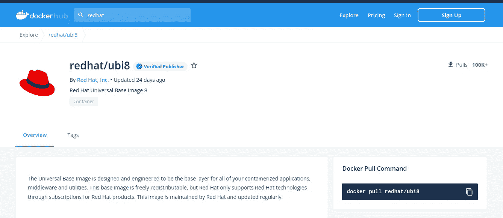
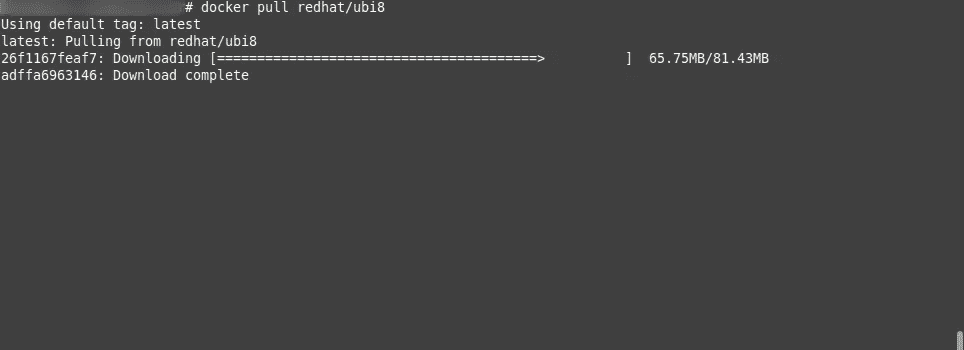
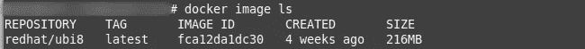
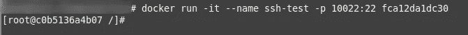
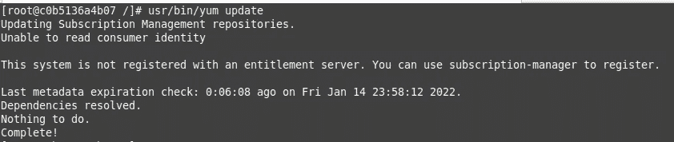
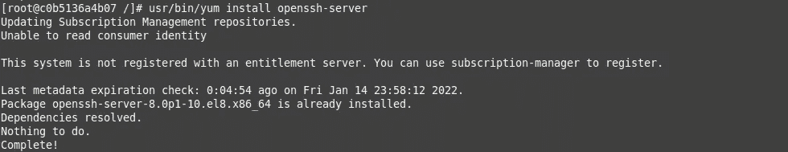
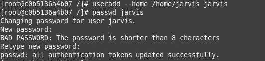
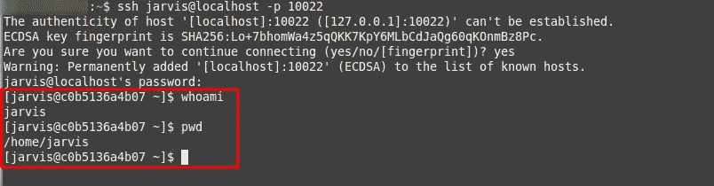
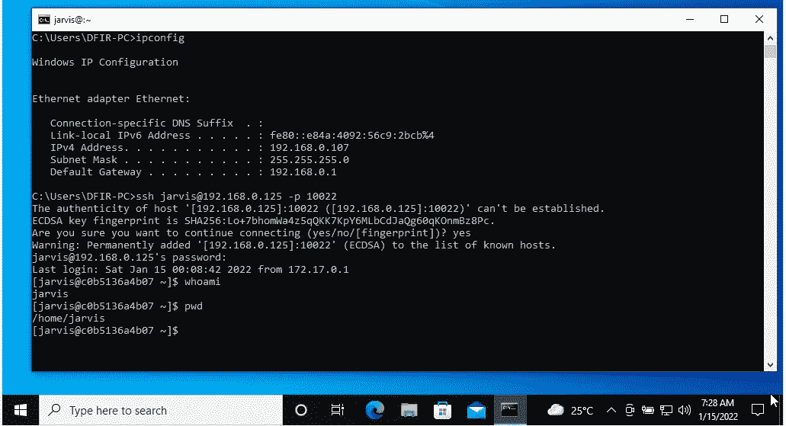

# 用 Docker 对红帽的 SSH

> 原文：<https://infosecwriteups.com/ssh-to-red-hat-with-docker-e84066d2b065?source=collection_archive---------2----------------------->

## 用 Red Hat 和 ssh 制作一个 docker 容器

Docker 是一个开发、运输和运行应用程序的开放平台。您将能够在本地机器上拥有一个隔离的环境，并使用少量的资源。

有人使用 docker 来运行他们易受攻击的应用程序，因为 docker 具有隔离性，并且适合做渗透测试实验室。所以今天我想在 docker 中运行 sshd 服务。

点击了解更多关于 docker [的信息。](https://en.wikipedia.org/wiki/Docker_(software))

## 拉图像

所有 docker 图片均在 hub.docker.com 提供。您可以选择您喜欢的图像作为运行 docker 容器的基础。对于本教程，我将使用红帽 UBI 8。



出于安全考虑，我建议您始终从经过**认证的发行商处获取图片。**



首先，你必须在你的电脑/你的虚拟机上安装 docker。然后运行下面的命令。

```
docker pull redhat/ubi8
```



拉动 docker 图像

如果已经完成，运行此命令查看图像列表

```
docker image ls
```



如果你的 **docker image ls** 命令显示如上图，恭喜你已经提取了图像并保存在你的计算机上。

## 运行集装箱

在 Docker 中，命令" **run"** 意味着创建并启动你的容器。

```
docker run -it --name ssh-test -p 10022:22 fca12da1dc30
```

**注**:

`-it` :与容器的交互外壳一起运行

`--name ssh-test`:容器名为 **ssh-test**

`-p 10022:22`:本地机器端口 10022，docker 容器端口 22

**fca12da1dc30** :图像 ID。

一旦运行容器，它将生成一个带有随机主机名的交互式 shell:



## 安装 sshd

运行更新包存储库，

```
usr/bin/yum update
```



并安装 openssh-server，

```
usr/bin/yum install openssh-server
```



然后，使用以下内容生成主机密钥:

```
ssh-keygen -A
```

还有最后一步，启动 ssh 服务器，运行`/usr/sbin/sshd &`。

## 测试

在测试之前，我想使新用户成为**贾维斯**。

```
useradd --home /home/jarvis jarvis
passwd jarvis
```



打开新选项卡并访问 ssh。



## 从虚拟机访问怎么样？

尝试使用用户名 **jarvis** 和端口**10022 ssh 到您的主机(您的 docker 正在运行)。**但是，要确保你的虚拟机和你的主机有**桥接**。



从 windows 虚拟机到 docker 的 ssh

## 结论

实际上，docker 为您提供了到 docker 容器的直接连接。如果运行 sshd，它将使您的 docker 不会再次被隔离。但是如果你想了解任何操作系统，docker 是比虚拟机更好的方法，因为那个容器只需要你的一点资源(ram/存储)。