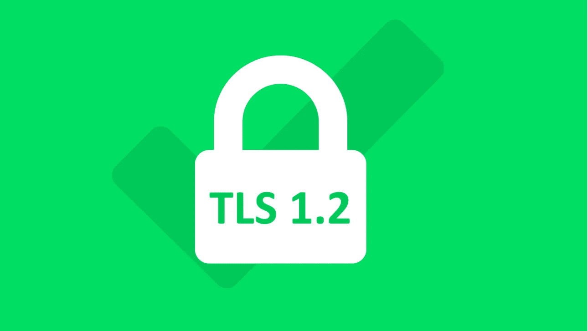

# SSL 锁定和 AWS 证书管理器

> 原文：<https://infosecwriteups.com/ssl-pinning-aws-certificate-manager-e414c4fb2aa3?source=collection_archive---------0----------------------->

## 您是否因为利用 [ACM](https://docs.aws.amazon.com/acm/latest/userguide/acm-overview.html) 进行自动化证书管理而无法在移动应用中实现 SSL 锁定？让我们讨论一种可能的解决方法，帮助我们保护传输中的数据，同时让托管服务就位，以避免手动证书管理的开销。

## 只是安全性和稳定性之间的另一个权衡？

# 介绍

保护数据安全的一个关键方面是保护传输中的数据，即流入/流出移动应用程序和后端的数据必须得到充分保护，以防止对手实施中间人攻击。

## 安全地实现 TLS 还不够吗？

当正确实现时(例如，仅允许安全密码套件、最新的协议版本、[)没有覆盖默认行为以在握手期间禁用检查](https://wiki.sei.cmu.edu/confluence/pages/viewpage.action?pageId=87150715)等。)TLS ***看似足够*** 确保传输中敏感数据的机密性和完整性，阻挡重放攻击，提供双方认证。但是，在 TLS 中，服务器的真实性是根据服务器的 SSL/TLS 证书来决定的，该证书是由认证机构(CA)颁发的。

因此，所提供的整体安全性主要基于信任模型**工作，其中 ca 必须被信任。由于它从根本上是以信任为基础的，因此会出现违反信任/安全妥协的情况，这有时会让利益相关方对仅使用 TLS 来保护传输中的数据没有信心:**

*   CAs 可能不遵循安全最佳实践，并可能受到威胁- [DigiNotar 案例研究](https://www.itnews.com.au/news/diginotar-investigators-uncover-woeful-security-271685)
*   CAs 为域颁发证书的违反信任行为- [Symmentec 为 google.com 错误颁发证书](https://www.thesslstore.com/blog/symantec-re-issue-thousands-of-ssl-certificates-will-be-distrusted-tuesday/)， [TrustWave 为间谍活动颁发证书](https://www.computerworld.com/article/2501291/trustwave-admits-issuing-man-in-the-middle-digital-certificate--mozilla-debates-punishment.html)等。
*   根据 2014 年完成的[研究](https://www.youtube.com/watch?v=tJFfDOQT46k&t=1556s)，33%的 ca/分 ca 从未颁发过公共 SSL 证书

确实需要一个额外的安全层来保护我们的用户，以防可信 CA 的信任破坏/妥协，以防止对手获得我们的域的伪造证书并执行中间人攻击。这就是移动安全人士推荐 SSL pin 的原因

# SSL/TLS 固定

SSL 固定是一种帮助我们提供传输层安全性并保护传输中的数据的技术。它不信任每个 CA，而是在 SSL 握手期间的基本检查(证书有效性、证书完整性等)之上仅信任一组证书元数据(即证书校验和/公钥校验和),从而大大减少了攻击面。)

只有白名单中的证书哈希/证书的公钥哈希用于通信时，才允许通信，这有助于我们改进基于信任模型构建的安全模型。

在高层次上，可以使用以下两种方法之一来实现它:

*   **证书锁定:**当客户端验证握手期间收到的证书的校验和时，锁定校验和。
*   **公钥锁定:**客户端验证从握手过程中收到的证书中提取的公钥的校验和，并锁定公钥的校验和。

你可以在这里阅读更多关于 SSL 固定[的细节。](https://appmattus.medium.com/android-security-ssl-pinning-1db8acb6621e)

## 公钥锁定和证书轮换

SSL 证书需要在一段时间后更新，因此锁定证书变得非常麻烦，因为每次更新都需要强制更新，这很不方便，因为这会降低用户体验。

公钥锁定帮助我们克服这一点，同时维护 UX，当我们锁定公钥(SPKI，SubjectPublicKeyInfo)而不是证书时，我们不需要在每次轮换证书时强制更新，因为在更新证书时可以使用相同的密钥对，即，当证书被更新时，其校验和会改变，但由于密钥保持不变，校验和保持不变，所以我们不需要在每次轮换证书时强制更新。

# 依赖 ACM 的应用程序的 SSL 固定

到目前为止，我们已经了解了为什么一个安全的 TLS 实现是不够的，以及 SSL Pinning 如何帮助我们提高安全性。话虽如此，虽然看起来公钥锁定可以解决问题，但在我们非常依赖*托管服务*的现代，不幸的是，SSL 锁定似乎不是一个可扩展的解决方案。

AWS 不建议使用 [ACM(AWS 证书管理器)](https://docs.aws.amazon.com/acm/latest/userguide/acm-overview.html)为应用程序实现 SSL/TLS 锁定。对于那些不知道 ACM 的人来说，它是一个托管服务，处理创建、存储和更新 SSL 证书和密钥的复杂性。

为了续订证书，ACM 生成一个新的公钥-私钥对，这意味着我们不能通过使用相同的密钥对来利用公钥锁定的好处。此外，ACM 将在证书到期前 60 天自动更新证书。

出于这个原因，AWS [不建议](https://aws.amazon.com/premiumsupport/knowledge-center/pin-application-acm-certificate/)将您的应用程序绑定到 ACM 颁发的 SSL/TLS 证书。

## **权衡**

依靠托管服务实现稳定的运营是一个事实上的标准，而 ACM 是广泛使用的托管服务之一。考虑到这一点，可以将运营工程师从手动管理域证书的繁琐任务中解脱出来，但同时也大大降低了因错过续订而导致停机的几率。

安全性与稳定性

> 虽然这在很大程度上取决于应用程序的安全要求和数据之间的流动，但同时中断的风险也不容忽视，因此这是一个很好的安全工程问题！

或者，如果我们遵循 AWS 的[建议](https://aws.amazon.com/premiumsupport/knowledge-center/pin-application-acm-certificate/)，为 ACM 颁发的证书锁定根 CA，从根本上说，我们仍然依赖信任模型来保证安全性。然而，我们只信任单个 CA，而不是信任设备信任存储中的所有 CA，这大大减少了攻击面。

# 证书透明度:一个拯救计划？

Google 的证书透明(CT)项目是一个[开放框架](https://tools.ietf.org/html/rfc6962#section-2.1.3)，涉及**公开可审计**和**仅附加**所有已颁发证书的日志，可以近乎实时地监控和审计。它使得检测由证书颁发机构错误颁发的 SSL 证书或从其他无可指责的证书颁发机构恶意获取的 SSL 证书成为可能。它还可以识别出恶意颁发证书的证书颁发机构。

我们可以依靠 CT 来保护传输中的数据？马修·多兰令人惊讶地描述了这种方法，这里[捕捉得非常好](https://appmattus.medium.com/android-security-certificate-transparency-601c18157c44)。在下一个媒体故事中，我将围绕 CT 的技术方面，以及如何利用它来为依赖于它的应用程序保护传输中的数据，捕捉更多信息。在那之前，敬请关注:)