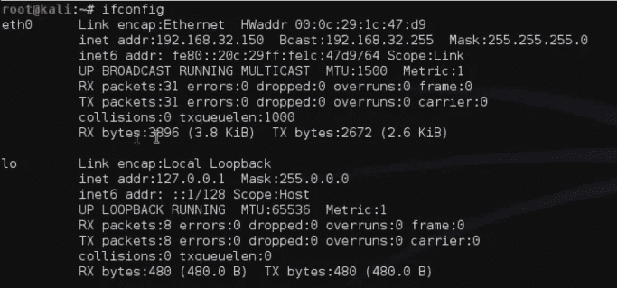
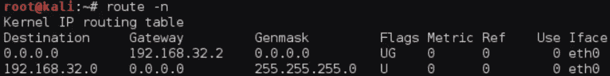
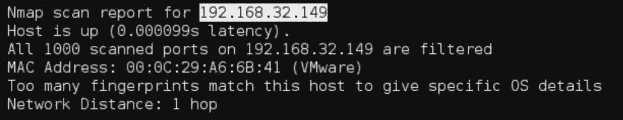
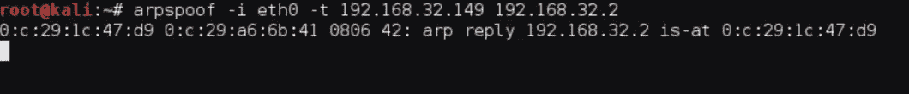
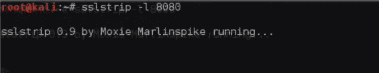
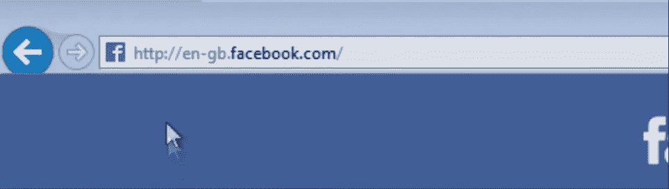
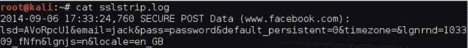

# SSL 带&多棒啊！

> 原文：<https://infosecwriteups.com/ssl-strip-how-awesome-it-is-a0eb79e28bcc?source=collection_archive---------0----------------------->

这篇文章不像我以前的文章，在那里我演示了一个我已经实现的黑客，但它更像是一个教程。这些天我没有写太多东西，因为我专注于发展我的技能。我想特别写一下这个技巧，因为这是我们大多数人都知道理论，但从来没有真正理解我们应该如何将其付诸实践的话题之一。

# 让我们开始吧！

我知道大多数阅读这篇文章的人一定听说过 SSL 条带化，这实际上是一种中间人攻击，您成为受害者和他们访问的网页之间的代理。这甚至不是主要部分，实际的窍门是剥离网站上存在的 SSL 配置，将一个 https 网站变成 http 网站，使所有的流量通信以纯文本方式进行。

# 剥离 SSL

所以，从攻击开始，让我给你一个概念，执行这个需要的东西

1.  受害者需要在同一个网络上
2.  你需要受害者的 IP 地址
3.  这种攻击适用于 Internet Explorer

首先，我们需要找出我们用来连接到网络的接口，为此我们可以在 Kali 机器上使用“ifconfig”命令

礼貌用语:[jackkturials](https://www.youtube.com/channel/UC64x_rKHxY113KMWmprLBPA)

现在，一旦我们确定了正在使用的接口，我们就需要执行 IP 转发过程，为此我们键入给定的命令。

> echo 1 >/proc/sys/net/IP v4/IP _ forward

礼遇:[见习](https://www.youtube.com/channel/UC64x_rKHxY113KMWmprLBPA)

现在，我们配置我们的 IP 表，它将流量从一个部分重新路由到另一个部分，这是我们的 SSL 带将监听的内容

> iptables-t NAT-A PREROUTING-p TCP--destination-port 80-j REDIRECT-to-port 8080

礼貌:[杰克·图尔斯](https://www.youtube.com/channel/UC64x_rKHxY113KMWmprLBPA)

由于我们已经配置了要通过我们的机器路由的流量，现在我们必须找到网关路由器的 IP 地址，命令是

> 路线-北

礼貌:[jackkturials](https://www.youtube.com/channel/UC64x_rKHxY113KMWmprLBPA)

一旦我们发现这一点，我们就需要扫描我们网络上的所有机器，为此我们可以使用 nmap

> 192.168.32.2/24

礼貌:[jackkturials](https://www.youtube.com/channel/UC64x_rKHxY113KMWmprLBPA)

这是为了搞清楚受害者的 IP 地址，也就是我们要攻击的那个。一旦我们确定了机器的 IP 地址，我们就可以执行 arp 欺骗过程，从服务器发送到受害者系统的流量将被重定向到我们这里，然后我们将它转发到受害者的系统

> ARP spoof-I eth 0-t 192 . 168 . 32 . 149 192 . 168 . 32 . 2

192.168.32.149(受害者的 IP 地址)

192.168.32.2(网关路由器的 IP 地址)

礼貌用语:[jackkturials](https://www.youtube.com/channel/UC64x_rKHxY113KMWmprLBPA)

只要我们执行这个命令，它就会将流量重定向到我们这里。同时，我们需要打开一个新的终端，在那里我们需要键入以下命令

> sslstrip -l 8080

这将 https 网站转换成 http，我们在端口 8080 上启动一个监听器。

礼遇:[见习](https://www.youtube.com/channel/UC64x_rKHxY113KMWmprLBPA)

我们已经准备好了，只要受害者打开浏览器(Internet Explorer)浏览互联网，流量就会被重定向到我们这里。

现在，骗局开始了，只要受害者访问 https 网站，该网站就会自动转换为 http 网站。

现在这是一个巨大的威胁，因为一旦网站成为 http 网站，流量就不再保持加密，所有数据都以明文传输。因为我们已经在 Kali 机器上设置了一个监听器，所以我们可以捕捉我们机器上的所有流量，然后找出受害者的登录凭证。

下面的例子中，受害者访问脸书，但网站仍然是 http，SSL 加密从页面中消失。

# 这是什么圈套！

几分钟或几小时后，当监听器启动时，我们可以通过键入以下内容找到捕获的详细信息

> 卡特彼勒 sslstrip.log

礼貌:[杰克·图尔斯](https://www.youtube.com/channel/UC64x_rKHxY113KMWmprLBPA)

这使我们能够找到用户可能用来登录相应网站的每个登录凭证。整个过程最好的一点是，只要用户不检查 URL，他们甚至可能不会意识到流量受到了威胁。

# 道德的

因此，我们需要了解的是，这些攻击很可能在受害者没有意识到他们已经被黑客攻击的情况下发生。

作为预防措施，不要使用 INTERNET EXPLORER，因为像 Firefox 这样的浏览器会对流量进行加密，攻击者无法解密流量来判断它的实际含义。

使用像“HTTPS 无处不在”这样的插件，它会在你每次访问网站时通知你该网站是否使用了安全的 SSL 连接。

[HTTPS 无处不在](https://addons.mozilla.org/en-US/firefox/addon/https-everywhere/)(Mozilla Firefox)&[HTTPS 无处不在](https://chrome.google.com/webstore/detail/https-everywhere/gcbommkclmclpchllfjekcdonpmejbdp?hl=en)(谷歌 Chrome)

如果你喜欢，请鼓掌让我们合作。获取、设置、破解！

网址:[aditya12anand.com](https://www.aditya12anand.com/)|捐赠:[paypal.me/aditya12anand](https://paypal.me/aditya12anand)

电报:【https://t.me/aditya12anand 

推特:[twitter.com/aditya12anand](https://twitter.com/aditya12anand?source=post_page---------------------------)

领英:[linkedin.com/in/aditya12anand/](https://www.linkedin.com/in/aditya12anand/?source=post_page---------------------------)

电子邮件:aditya12anand@protonmail.com

注:请访问此链接以更好地理解 [JackkTutorials SSL 带](https://www.youtube.com/watch?v=LnbLRX83dzU)