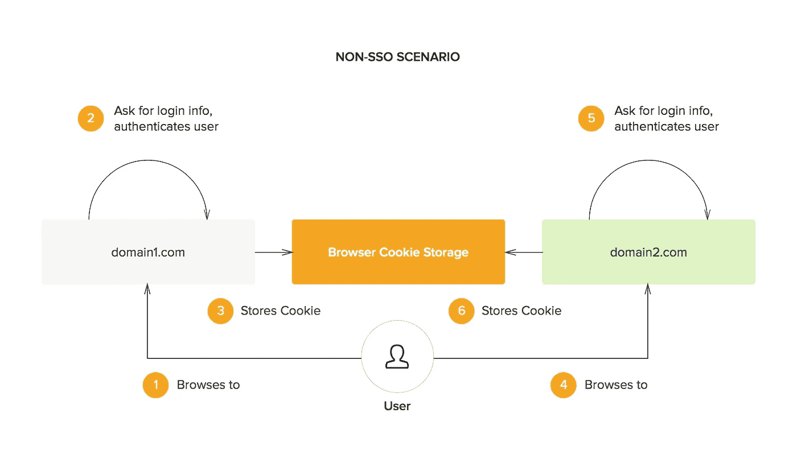
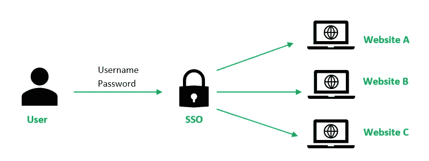
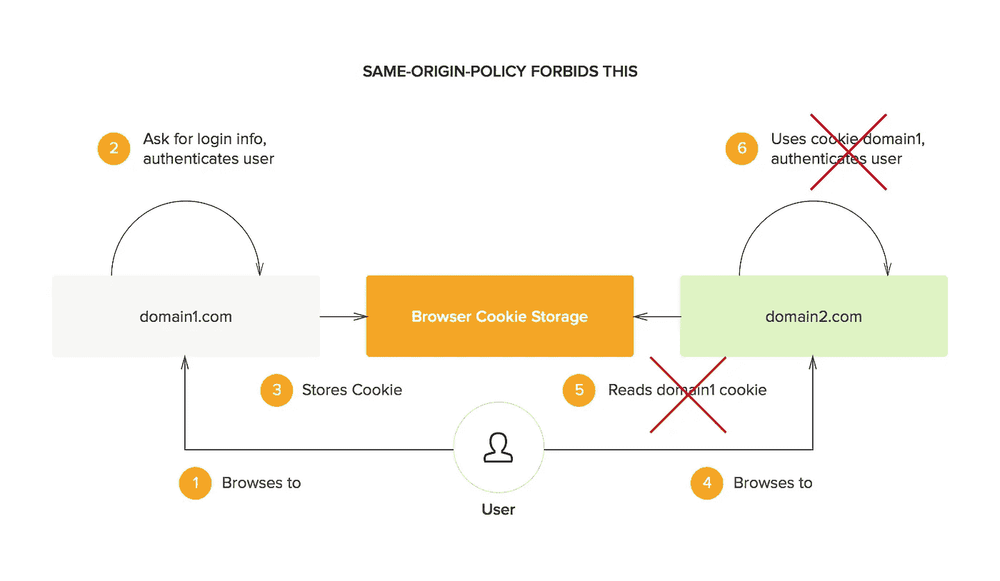
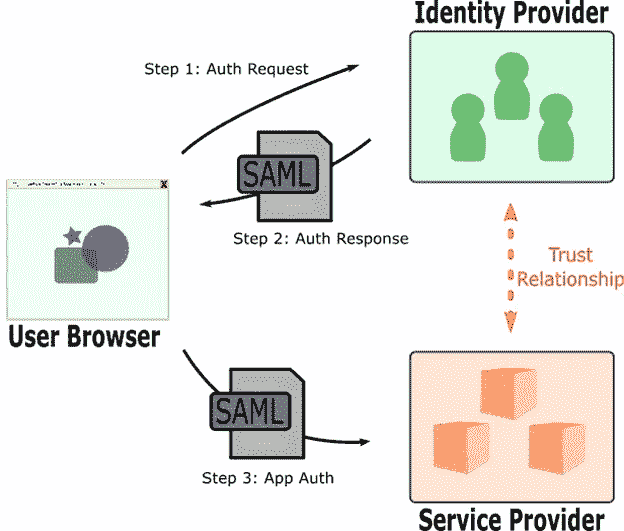

# SSO:一种安全的认证和授权方式？

> 原文：<https://infosecwriteups.com/sso-a-secure-way-for-authentication-and-authorization-6a4fb8794dd6?source=collection_archive---------0----------------------->

[迈卡·威廉姆斯](https://unsplash.com/@mr_williams_photography?utm_source=medium&utm_medium=referral)在 [Unsplash](https://unsplash.com?utm_source=medium&utm_medium=referral) 上拍照

# 介绍

在企业环境中，您可能需要不同的服务来完成工作。这些服务通常需要身份验证。必须为每个服务(为每个员工)创建一个帐户，这不仅给 IT 人员带来了负担，而且还促进了密码的重复使用。这将意味着，如果只有一个服务/帐户的密码落入攻击者手中，他就可以危及所有其他服务。

[来源](https://auth0.com/blog/what-is-and-how-does-single-sign-on-work/)

例如，你在 XYZ 公司工作。 *XYZ* 经营多种产品和服务，例如他们可能有一个管理假期和工资的门户，另一个门户可能是网站的分期版本，因此需要您登录不同的帐户才能完成工作。例如，早上第一件事就是登录公司的 CRM，然后是电子邮件客户端、共享文件夹(每次访问都需要登录)等。

正如你能猜到的，这给用户带来了很多不便。为什么每次你需要使用这些服务时都要登录呢？难道没有更简单的解决方法吗？原来是有的。它被称为单点登录。

# **单点登录**

[来源](https://www.geeksforgeeks.org/introduction-of-single-sign-on-sso/)

**单点登录是一种认证方法，使用户能够使用一个 ID 登录到多个相互连接但独立运行的软件系统中的任何一个**。使用真正的单点登录，用户只需登录一次即可访问服务，无需再次输入身份验证因素。

更简单地说，你不必每天早上都登录 CRM、电子邮件客户端或任何其他服务。你所要做的就是向身份提供者认证。登录后，您将获得一个会话 ID，这将允许您访问您应该有权访问的所有服务，也就是说，有一些不同的方法可以执行，例如对于一些网站，您只需输入电子邮件地址，它会验证来自身份提供商的一切并让您登录。

正如您所猜测的，*会话 ID 还记录了允许用户访问的内容。因此，它也有助于授权。*因此，在许多文章中，您可能还会看到 SSO 被定义为一种身份验证/授权方案。

# **单点登录的工作原理**

[来源](https://auth0.com/blog/what-is-and-how-does-single-sign-on-work/)

SSO 登录涉及三个实体。

1.  用户/用户浏览器(客户端)
2.  身份提供者
3.  互联网服务商

启动登录过程的实体称为用户或用户浏览器。发生这种情况时，会向身份提供者发送请求。要完成身份验证过程，用户必须首先登录身份提供者。身份提供者可能是同一家公司(您工作的公司)，也可能是购买或订阅的另一家公司。像这样的组织有几个，比如 OKTA 等等。在大多数情况下，用户名和密码是必需的，后面是双因素身份验证代码。

最终的实体是服务提供商。服务提供商是您希望访问的服务，以前(在没有 SSO 的情况下)需要您登录。它们可以是非常简单的网站，比如 HackerOne(如果您启用了 SSO，它只要求您发送电子邮件)。现在有很多网站支持 SSO，你也可以通过几个简单的步骤进行配置。

你的脑海中会出现一个问题。任何身份提供者都可以为任何服务提供会话令牌吗？不可以。要实现这一点，身份提供者和服务提供者之间必须存在信任关系。这是由建立 SSO 的开发人员建立的。

[来源](https://www.netspi.com/wp-content/uploads/2017/02/img_589a44780e8eb.png)

从解释和图片中可以明显看出，需要传递一些消息来建立身份验证。这些消息以一种叫做 SAML 的格式传递。它代表**安全断言标记语言。它是一种 XML 标记语言，内容是 base64 编码的。**

# **SAML 组件**

SAML 是通过 XML 实现的，有几个组件。为了理解 SAML，我们首先需要理解它的组件。SAML 有三个主要组成部分。它们是 SAML 断言、SAML 协议和 SAML 绑定。我们关心的最重要的组件是 SAML 断言。

**SAML 断言**:简单地说，这是一个从身份提供者发送到服务提供者的 XML 文档。*本文件包含有关用户授权和认证的信息*。这意味着用户可以访问哪些服务和功能。

当通信/消息通过用户的浏览器时，它们很容易被篡改，从而导致开发团队没有察觉或考虑到的意外副作用。

# **单点登录中的安全问题**

SSO 是许多不同组织正在使用的同类最佳服务，但是它确实存在一些安全问题。下面是在 SSO 登录系统中发现的一些安全问题。

**错误授权**

主要的问题是关于授权。如果已经向用户提供了对超出其角色的服务和功能的访问。因此，在执行渗透测试时，列出用户应该访问哪些服务和功能以及他实际上可以访问哪些服务是很重要的。

**消息到期**

这可以在 SAML 消息本身中看到。SAML 消息必须包含一个时间戳，表明请求何时发出，或者何时到期。在后一种情况下，会话 id 将总是有效的，并可能导致危害。

因此，当通过代理拦截 SAML 消息时，请始终检查时间戳和过期时间。 **IssueInstance，not nor after**可能是要寻找的关键词。

**消息重放攻击**

断言应该包含一个惟一的 ID(就像 web 应用程序中的 nonce ),这个 ID 应该只被应用程序接受一次。如果应用程序不考虑唯一 ID，那么这可能导致消息重放攻击，从而为同一个用户创建多个会话。

**消息签名检查**

就像 JWT 一样，SAML 包含消息签名。如果消息签名丢失，服务提供商没有检查，那么您可以更改 SAML 消息的权限以提升您的权限。

**无验证检查**

有些环境过于信任他们的用户。在这种情况下，服务提供者可能被配置为只检查有效的 SAML 消息。在这种情况下，攻击者可以伪造 SAML 消息来访问任何其他应用程序。然而，这也可能是错误配置问题的结果。

如果 SAML 消息中反映了一个用户 ID，请尝试将其更改为另一个用户的 ID。

# **结论**

在这篇博文中，我们讨论了单点登录(SSO)的基础知识，包括它是如何构建的、它的组件、它的安全性以及它可能如何被攻击。单点登录易受各种各样的漏洞的影响；上面列举的只是其中的一部分。总之，单点登录(SSO)简化了企业内部执行的各种任务，并有可能消除对密码管理器的需求。