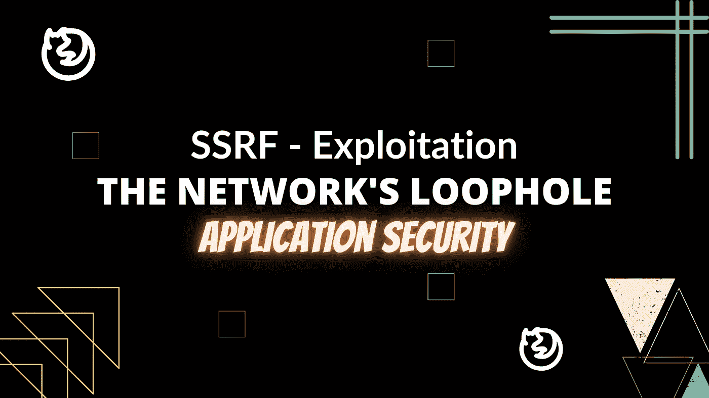
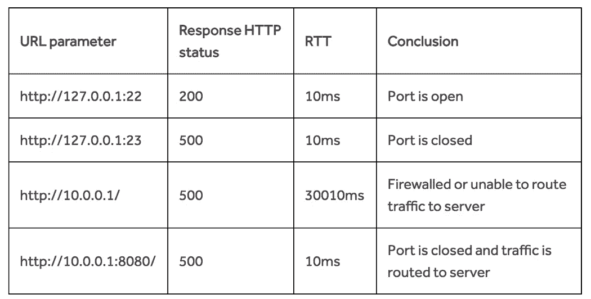

# SSRF —剥削 02

> 原文：<https://infosecwriteups.com/ssrf-exploitation-02-b682de16594?source=collection_archive---------1----------------------->

成功的网络攻击往往始于“网络边界”。



既然我们已经介绍了 SSRFs 的基础知识，让我们来学习利用它们吧！如果你不熟悉 SSRFs 或者需要更新，这里是关于 [SSRF](https://medium.com/bugbountywriteup/ssrf-the-servers-loophole-01-6e7e33fb1d57) 系列的第一部分。

你好，我是安摩尔。这篇文章是关于利用 SSRF 的不同技术。我希望读完这篇文章后，你们都能理解并能够操纵和利用许多针对 SSRF 漏洞的服务。

那么黑客到底能利用 SSRF 漏洞做什么呢？这通常取决于网络上的内部服务。今天，我们将讨论一旦发现漏洞，利用漏洞的几种常见方法。让我们开始吧:

## 我发现了一个 SSRF！现在怎么办？

SSRF 漏洞可用于:

1.  扫描网络中的主机；
2.  端口扫描内部机器和指纹内部服务；
3.  访问机密信息(如:重要的 API 密钥)
4.  提取实例元数据
5.  绕过访问控制
6.  访问 Root 权限(web 服务器上的 RCE)

# 网络扫描

首先，SSRFs 可用于扫描网络中其他可到达的机器。这是通过向易受攻击的端点提供一系列内部 IP 地址[并查看服务器是否对每个地址做出不同的响应来实现的。利用服务器行为的差异，我们可以收集关于网络结构的信息。](https://en.wikipedia.org/wiki/Reserved_IP_addresses)

**比如，当你要求:**

`https://public.example.com/upload_profile_from_url.php?url=10.0.0.1`

服务器的响应是:

`Error: cannot upload image: http-server-header: Apache/2.2.8 (Ubuntu) DAV/2`

当您请求时:

`https://public.example.com/upload_profile_from_url.php?url=10.0.0.2`

服务器的响应是:

`Error: cannot upload image: Connection Failed`

我们可以推断出 10.0.0.1 是网络上有效主机的地址，而 10.0.0.2 不是。

# 端口扫描和服务指纹

SSRFs 还可以用于端口扫描网络机器，并显示这些机器上运行的服务。开放端口为机器上运行的服务提供了一个很好的指示器，因为服务有运行它们的默认端口，端口扫描将您带到端口，手动检查任何类型的隐藏服务。这有助于您计划对服务的进一步攻击。

例如，当您向内部服务的端口 80 发送请求时(如 10.0.0.1:80)，如果服务器响应:

`Error: Cannot Upload Image: http-server-header: Apache/2.2.8 Ubuntu) DAV/2`

当您向同一台服务器上的端口 11 发送请求时，服务器会做出如下响应:

`Error: Cannot Upload Image: Connection Failed`

我们可以推断服务器上的端口 80 是开放的，而端口 11 不是。

# 提取实例元数据

这是我个人最喜欢的。亚马逊弹性计算云([亚马逊 EC2](https://aws.amazon.com/ec2) )是一项允许商人公开运行应用程序的服务。它有一个叫做“实例元数据”的服务。这使得 EC2 实例能够访问一个 API，该 API 返回关于实例本身的数据(在地址 169.254.169.254 上)。类似于 EC2 的实例元数据 API 服务也可以在 Google Cloud 上获得。默认情况下，这些 API 端点是可访问的，除非它们被网络管理员特别阻止或禁用。这些服务可能泄露的信息通常极其敏感，可能会允许攻击者将 SSRFs 升级为严重的信息泄漏，甚至可能让攻击者操纵服务并获得 RCE(远程代码执行)。

## 查询 AWS EC2 元数据

这些端点揭示了 API 密钥、AWS S3 令牌和密码等信息。

这里有几个特别有用的，可以先试试:

```
-   [http://169.254.169.254/latest/meta-data/](http://169.254.169.254/latest/meta-data/) : returns the list of available metadata that you can query.-   [http://169.254.169.254/latest/meta-data/local-hostname/](http://169.254.169.254/latest/meta-data/local-hostname/) : returns the internal hostname used by the host.-   [http://169.254.169.254/latest/meta-data/iam/security-credentials/ROLE_NAME](http://169.254.169.254/latest/meta-data/iam/security-credentials/ROLE_NAME) : returns the security credentials of that role.-   [http://169.254.169.254/latest/dynamic/instance-identity/document](http://169.254.169.254/latest/dynamic/instance-identity/document) : reveals the private IP address of the current instance.-   [http://169.254.169.254/latest/user-data/](http://169.254.169.254/latest/user-data/) : returns user data on the current instance.
```

## 查询谷歌云元数据

如果该公司使用谷歌云，你可以尝试查询谷歌实例元数据 API。

Google 为他们的 API 端点实现了一些额外的安全措施——查询 Google Cloud 元数据 APIv1 需要特殊的头:

`"Metadata-Flavor : Google" or "X-Google-Metadata-Request: True"`

但是这种保护很容易被绕过，因为大多数通过 APIv1 可访问的端点可以通过 API v1β1 端点来访问。和 APIv1 没有相同的报头要求。

以下是首先要了解的一些重要信息:

```
http://metadata.google.internal/compute#Metadata/v1beta1/instance/service-accounts/default/tokens : returns the access token of the account on the instance.http://metadata.google.internal/computeMetadata/v1beta1/project/attributes/ssh-key> returns public SSH keys that can connect to other instances in this project.
```

亚马逊和谷歌并不是唯一提供元数据 API 的网络服务。[这里是](https://gist.github.com/BuffaloWill/fa96693af67e3a3dd3fb)其他云元数据服务和你可以尝试的东西的列表。

# 利用我们现有的资源

现在，使用您通过扫描网络、识别服务和提取实例元数据所发现的内容，您现在可以尝试提取以下内容:

## 旁路访问控制

一些 internl 服务可能只根据 IP 地址或内部报头来控制访问。仅仅通过从受信任的机器发送请求，就有可能绕过敏感功能的访问控制。

## 泄露机密信息

如果您能够使用 SSRF 找到凭据，则可以使用这些凭据来访问存储在网络上的机密信息。例如:如果你能找到 AWS 的 S3 钥匙，就去看看该公司的私人 S3 桶，看看你是否能接触到它们。

## 执行代码(RCE)

你可以利用收集到的信息把 SSRF 变成 RCE。例如，如果您发现管理员凭据给予写权限，尝试上传一个外壳，然后监听并尝试获得一个反向外壳，或者如果您发现一个不安全的管理面板，然后尝试找到是否有任何功能，使您能够执行脚本？更好的是，也许你可以以 root/administrator 身份登录？

# B 林德 SSRFs

盲 ssrf 是这样的 ssrf，其中您没有从目标服务器获得响应或错误。

对 blind 的利用通常局限于网络映射、端口扫描和服务发现。由于您不能直接从服务器提取信息，因此对盲 SSRFs 的利用很大程度上依赖于推理。利用 HTTP 状态代码和服务器响应时间，我们可以获得与常规 SSRF 类似的结果。

## 使用 HTTP 状态代码的网络和端口扫描

例如，当您在 HTTP 状态代码 200(状态代码为“OK”)中输入以下请求时

`[https://subdomain.example.com/webhook?url=10.0.0.1](https://subdomain.example.com/webhook?url=10.0.0.1)`

而下面的请求导致 HTTP 状态代码 500(状态代码为“内部服务器错误”)

`[https://subdomain.example.com/webhook?url=10.0.0.2](https://subdomain.example.com/webhook?url=10.0.0.2)`

我们可以推断出 10.0.0.1 是网络上有效主机的地址，而 10.0.0.2 不是。

端口扫描与盲 ssrf 的工作方式相同。

# 使用服务器响应时间的网络和端口扫描

如果服务器没有以状态代码的形式返回任何有用的信息，那么一切都不会丢失。通过检查服务器响应您的请求需要多长时间，您可能仍然能够找出网络结构。

如果服务器对某些地址的响应时间过长，这可能表明这些网络地址未被路由，或者隐藏在防火墙后面。另一方面，如果请求被路由器立即丢弃，异常短的响应时间也可能表示未路由的地址。如果服务器对某些端口的响应时间过长，这可能表明这些端口已经关闭。

请看这张由 [@jobert](https://hackerone.com/jobert) 在 [Hackerone 博客](https://www.hackerone.com/blog-How-To-Server-Side-Request-Forgery-SSRF)上发布的图表。它很好地概述了网络的行为方式。



当执行任何类型的网络或端口扫描时，重要的是要记住易受攻击的机器有不同的行为，关键是要寻找行为上的差异，而不是上述的特定特征。

为了更多地了解盲人 SSRF 和他们的剥削，[点击这里](https://shahjerry33.medium.com/blind-ssrf-the-hide-seek-game-da9d0ecef2fb)。

感谢阅读这篇文章。希望现在您已经了解了利用 SSRF 漏洞的基本知识。

黑客快乐！

直到那时；

**醒吃骇客重复🔥**


*来自 Infosec 的报道:Infosec 上每天都会出现很多难以跟上的内容。* [***加入我们的每周简讯***](https://weekly.infosecwriteups.com/) *以 5 篇文章、4 个线程、3 个视频、2 个 Github Repos 和工具以及 1 个工作提醒的形式免费获取所有最新的 Infosec 趋势！*