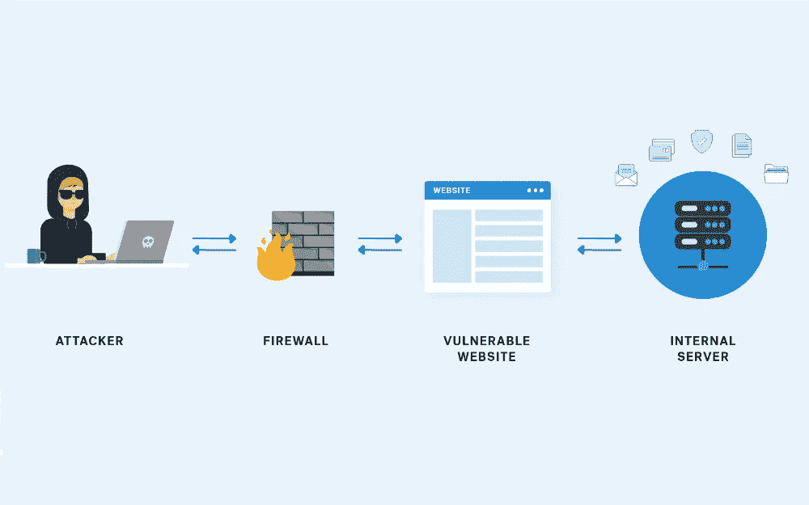
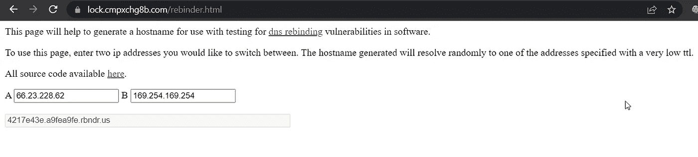
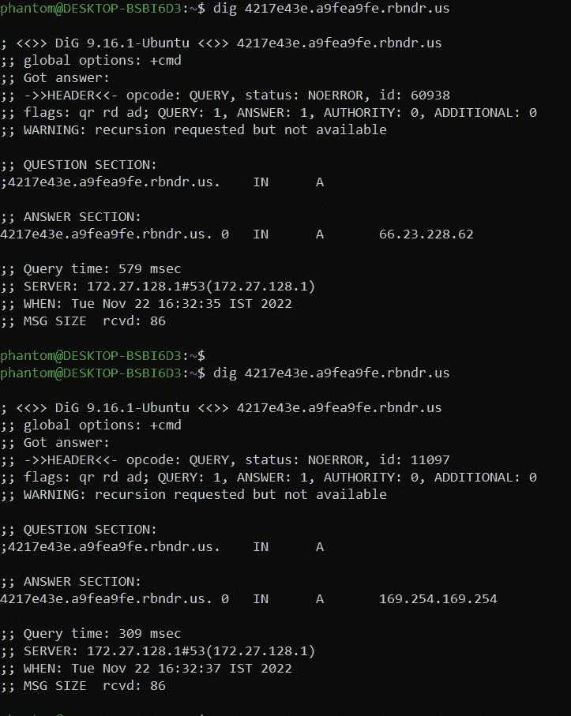
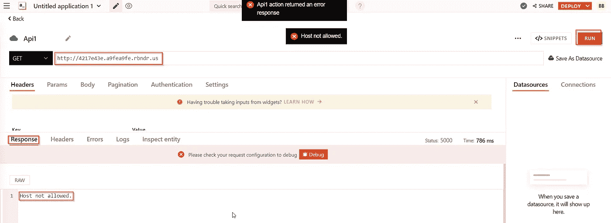
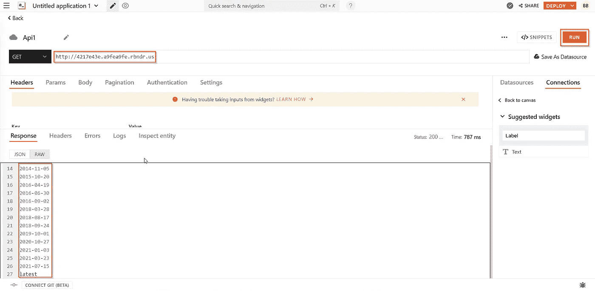
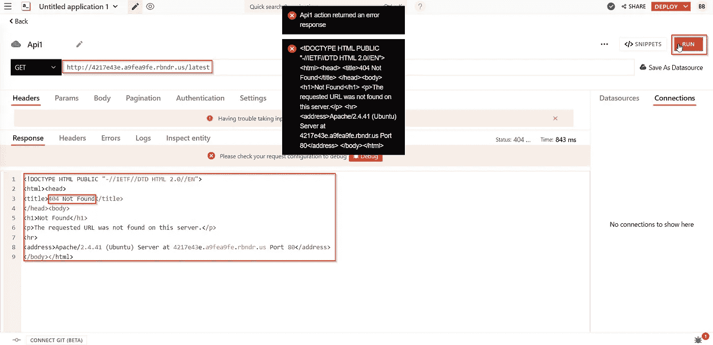
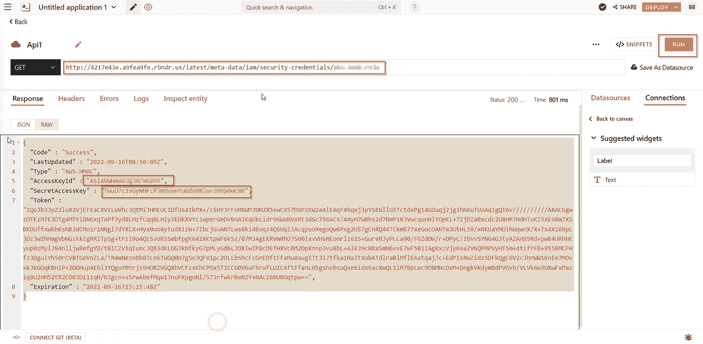

# 通过 DNS 重新绑定的 SSRF(CVE-2022–4096)

> 原文：<https://infosecwriteups.com/ssrf-via-dns-rebinding-cve-2022-4096-b7bf75928bb2?source=collection_archive---------0----------------------->

大家好，我自己 [**巴萨瓦拉杰**](http://twitter.com/basu_banakar) ，今天在这篇文章中，我将解释一下我的第二次 CVE，即[**CVE-2022–4096**](https://cve.mitre.org/cgi-bin/cvename.cgi?name=CVE-2022-4096)

我们开始吧

SSRF 概述

> **SSRF 使用 DNS 重新绑定发现**[**Appsmith**](https://github.com/appsmithorg/appsmith)**。**
> 
> 仅供参考: [Appsmith](https://github.com/appsmithorg/appsmith) 用于构建、发布和维护内部工具。

最初，我通过使用服务器端重定向方法在 appsmith 中发现了两个 SSRF。

这是绕过这两个最初的 SSRF。

**DNS 重新绑定概述:**

> DNS 重新绑定是一种操纵域名解析的方法，通常用作计算机攻击的一种形式。在这种攻击中，恶意网页使访问者运行客户端脚本，攻击网络上其他地方的机器。理论上，同源策略可以防止这种情况发生:客户端脚本只允许访问服务于该脚本的同一主机上的内容。比较域名是实施该策略的重要部分，因此 DNS 重新绑定通过滥用域名系统(DNS)来规避这种保护。

让我们通过 DNS 重新绑定来生成一个主机名，以绕过 SSRF 限制！[https://lock.cmpxchg8b.com/rebinder.html](https://lock.cmpxchg8b.com/rebinder.html)

DNS 重新绑定

我们可以看到，我们生成的主机名被分配了两个不同的 IP

挖掘命令

现在易受攻击的功能是创建新的 API 和 Elasticsearch

脆弱的功能

现在，在 url 函数中添加生成的主机名，并单击运行，我得到的响应是**主机不允许**

不允许主机响应

现在再次点击运行后，成功地得到了一些与 AWS 云元数据路径的响应

aws 元数据路径

现在将“最新的”路径附加到 url，并再次单击 run，我得到了 **404** (因为这次服务器击中了我在 DNS 重新绑定中使用的 IP)。

404 响应

现在，在连续点击和尝试(再次点击“运行”直到我得到一些响应)方法并将路径(我在响应中得到的)附加到 url 之后，我成功地检索到了 AWS 键

AWS 密钥检索成功

易受攻击的版本:Appsmith < v1.8.1

现在将此事报告给 Appsmith 并获得确认，然后将此事报告给 huntr.dev，以获得 CVE 对此问题的关注，并获得此[CVE-2022–4096](https://cve.mitre.org/cgi-bin/cvename.cgi?name=CVE-2022-4096)

请忽略语法和语言的限制:)

跟我来:

推特:【https://twitter.com/basu_banakar 

insta gram:【https://instagram.com/basu_banakar 

领英:[https://www.linkedin.com/basubanakar](https://www.linkedin.com/in/basubanakar/)

## 来自 Infosec 的报道:Infosec 每天都有很多内容，很难跟上。[加入我们的每周简讯](https://weekly.infosecwriteups.com/)以 5 篇文章、4 个线程、3 个视频、2 个 GitHub Repos 和工具以及 1 个工作提醒的形式免费获取所有最新的 Infosec 趋势！