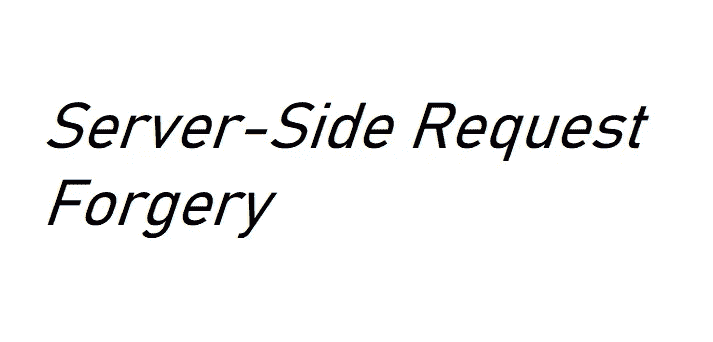

# SSRF:网络应用安全基础知识

> 原文：<https://infosecwriteups.com/ssrf-web-app-security-basics-b88da872c9c8?source=collection_archive---------0----------------------->



> **服务器端请求伪造** (SSRF)是一种漏洞利用，攻击者可以利用服务器的功能来访问或操纵服务器网络中的信息，而攻击者无法直接访问这些信息。

**如果 SSRF 攻击成功:**

攻击者可能会导致服务器连接回自身、组织基础架构内的其他基于 web 的服务或外部第三方系统，这可能会导致潜在的法律责任和声誉损害。这非常类似于 CSRF，如果机器容易受到 XXE 的攻击，那也可能导致 SSRF。如果你想了解 CSRF 和 XXE，你可以参考我以前的文章:

*   [*CSRF : Web App 安全基础知识*](https://medium.com/bugbountywriteup/csrf-web-app-security-basics-dd4628122fea)
*   [*XXE:网络应用安全基础知识*](https://medium.com/bugbountywriteup/xxe-web-app-security-basics-70ef8ed274f0)

**例如:**

攻击者想要从内部网络上无法直接访问的机器上获取敏感信息。但是有一台服务器在公共网络上，可以访问内部机器。现在，攻击者试图从公共机器获取信息，并注意到这一点:

```
GET /?url=http://localhost/server-status HTTP/1.1
Host: example.com
```

在这里，在拦截请求和少量修改时，攻击者可以发送这样的请求:

*   检索公共服务器上文件:

```
GET /?url=file:///etc/passwd HTTP/1.1
Host: example.com
```

*   访问内部服务器:

```
GET /?url=http://internal-ip/admin/ HTTP/1.1
Host: example.com
```

*   盲 SSRF:当服务器易受攻击，但敏感信息不会在响应中泄露。盲 SSRF 通常难以利用，但有时会导致完全远程代码执行。假设，攻击者有一个恶意网站，那里有一个文件 exploit.php。

```
Attacker’s site: http://malicious-site.com/ssrf/exploit.phpGET /?url=http://internal-ip/admin/ HTTP/1.1
Host: example.com
```

**缓解:**

*   将 IP 列入黑名单/白名单。
*   禁用未使用的 URL 模式(`file:///`、`dict://`、`ftp://`和`gopher://`)。
*   对内部服务使用身份验证。

**绕过/变通办法:**

*   基于黑名单的过滤器:

```
Converting IP to hex/Octal/Decimal:
127.0.0.1 --> 2130706433 (Decimal)
```

*   基于白名单的过滤器:

```
https://whitelisted-host@malicious-host (Using @)
https://whitelisted-host.malicious-host
https://malicious-host#whitelisted-host (Using #)
```

参考资料:

[](https://portswigger.net/web-security/ssrf) [## 什么是 SSRF(服务器端请求伪造)？教程和示例|网络安全学院

### 在这一节中，我们将解释什么是服务器端请求伪造，描述一些常见的例子，并解释如何…

portswigger.net](https://portswigger.net/web-security/ssrf) [](https://www.acunetix.com/blog/articles/server-side-request-forgery-vulnerability/) [## 什么是服务器端请求伪造(SSRF)？Acunetix

### 服务器端请求伪造(SSRF)漏洞使得攻击者能够从服务器的后端服务器发送精心编制的请求

www.acunetix.com](https://www.acunetix.com/blog/articles/server-side-request-forgery-vulnerability/)