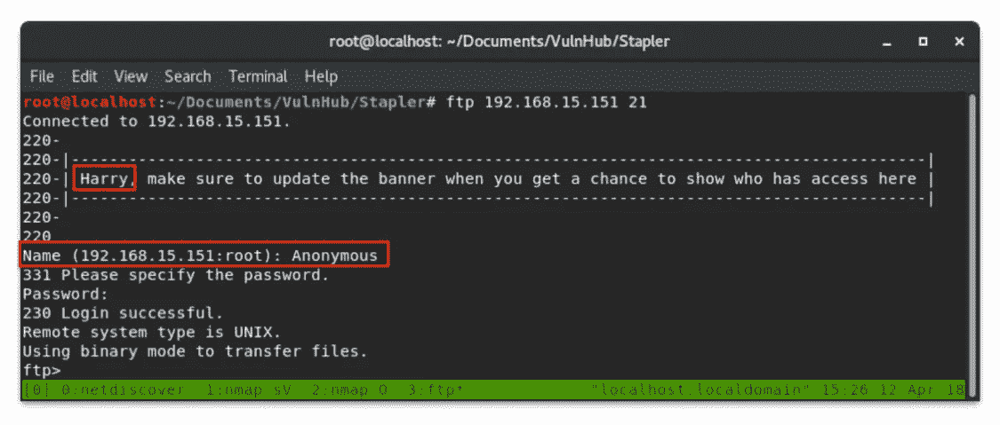
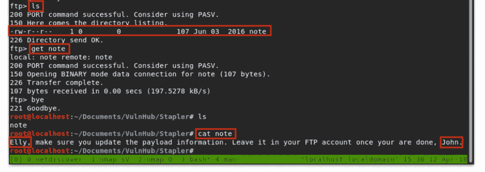
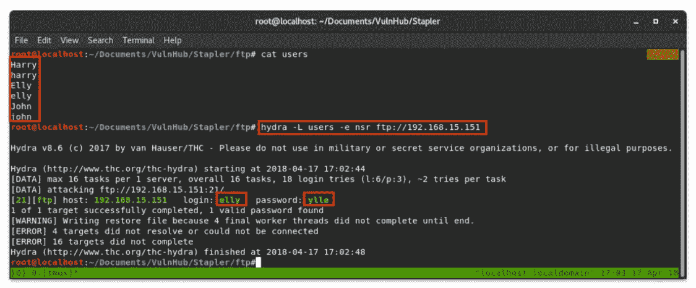
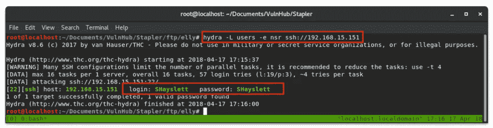
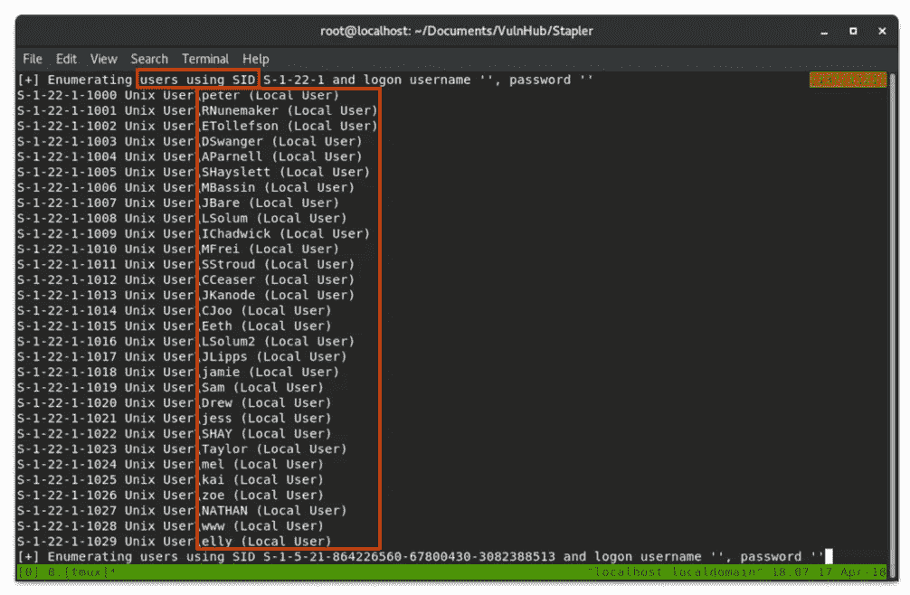
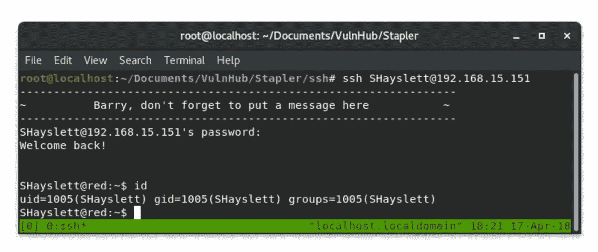
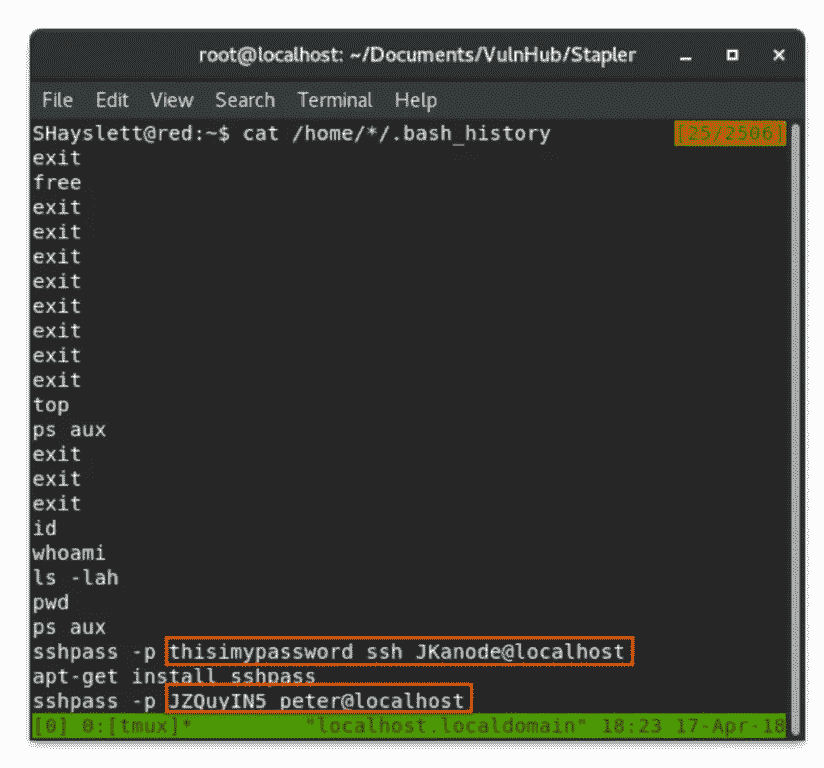

# 订书机角 1-仅包含枚举的根

> 原文：<https://infosecwriteups.com/stapler-pt-1-c9a14793eb3?source=collection_archive---------0----------------------->


订书机

# 摘要

Stapler 是一个运行多种服务的 Ubuntu 服务器。本演练将讨论如何枚举其中三个服务以获得对计算机的 root 访问权限。被访问的服务有 **FTP** 、 **SMB** 和 **SSH** 。

> 被利用的主要漏洞有:
> 弱用户凭证
> 强凭证使用不当

# 侦察/扫描

我最初的侦察是对本地网络进行 arp 扫描，以便用`netdiscover`快速返回目标在我私有范围内的 IP 地址。

```
netdiscover -r 192.168.15.0/24
```

> -r 指定网络范围

接下来，我使用`nmap`列举了主机上的操作系统和开放端口。

```
nmap -O 192.168.15.151
```

很快，我们可以看到有大量的服务在运行。太多了，不知道从哪里开始。随着 Linux 3.2 — 4.8 的推出，操作系统检测又回来了，范围相当广泛……让我们再深入一点。

接下来，我开始了另一次`nmap`扫描。这一次是枚举在每个端口上运行的服务版本，并在这些服务上运行默认脚本，以潜在地获得附加信息。

```
nmap -sV -sC 192.168.15.151
```

> -sV 枚举服务版本
> 
> -sC 运行默认脚本

好的，这里有很多东西要打开。

SMB 和 SSH 在其版本中将 Ubuntu 称为主机操作系统。很高兴知道。

现在让我们一次只看一个端口。查看第一个打开的端口，我们可以看到该服务器允许匿名 FTP。我们去看看。

# 文件传送协议

```
ftp 192.168.15.151
```



匿名 FTP

甚至在登录服务器之前，我们就会看到一个包含名字的横幅。我注意到这是一个潜在的用户名，并继续前进。

要匿名登录 FTP 服务器，只需输入“Anonymous”作为用户名，并给出一个空密码。

一旦在服务器上，我们被放在一个无处可去的目录和一个名为`note`的文件中。我们可以使用命令`get note`将便笺传输回我们的机器。



获取注释

这个文件揭示了另外两个潜在的用户名:`Elly` & `John`。

## FTP 凭据审核

现在我们已经有了三个潜在的用户名，让我们使用`hydra`来检查劣质的 FTP 凭证。我创建了一个大小写都合适的用户列表。

```
hydra -L users -e nsr ftp://192.168.15.151
```

> -L 提供用户名列表
> 
> `-e nsr`检查**空**密码、用户名为密码(**同**)或用户名为密码的反码(**反**)



九头蛇 FTP

本次审计返回了`elly`的凭证！

访问他们的 FTP 目录会发现一堆文件。其中许多我们可以复制到我们的机器上…其中一个叫做`passwd`。将它复制回主机，我们能够检查它并确认它似乎是`/etc/passwd`的副本。

让我们使用一个聪明的`awk`命令行程序来生成一个在登录时访问`/bin/bash`的用户列表。

```
awk -F':' '/\/bin\/bash/{print $1}' passwd > users
```

> `-F':'`集:为田忌
> 
> `/\/bin\/bash`查找包含/bin/bash 的行
> 
> `{print $1}`打印由`:`分割的第一个字段
> 
> `> users`将用户列表输出到名为`users`的文件中

现在我们已经有了一个很长的用户列表，可以 ssh 到 bash shell 中。让我们用这个列表做另一个弱密码审计，但是这次是在 SSH 上。

```
hydra -L users -e nsr ssh://192.168.15.151
```



九头蛇 SSH

这将为用户返回一个凭证`SHayslett`

> …在继续之前，让我们看看另一种更实际的枚举本地用户帐户的方法

# 服务器信息块

我们之前的`nmap`扫描显示 SMB 处于开放状态。我们可以使用`enum4linux`来做大量繁重的工作，以从该服务返回结果。通常当我运行这个脚本时，我会指定`-a`来使用所有的枚举方法，但是这非常冗长，并且有很多干扰需要筛选。让我们来看看返回本地用户帐户列表的内容:

```
enum4linux -r 192.168.15.151
```

> -r 将通过强制 SID 来枚举用户



enum4linux 强制 sid

类似于我们如何解析`passwd`文件，我们可以再次使用`awk`来生成用户列表。我们可以使用这个带有`hydra`的用户列表来返回与从 FTP 中的`passwd`文件生成的列表相同的凭证。

```
awk -F’\‘ '/Local User/{print $1}' enumUsers | cut -d' ' -f1
```

> `| cut -d' ' -f1`用空格分割`awk`的输出，并返回第一个字段，在本例中，这是用户名

# 嘘



嘘

以`SHayslett`的身份通过 SSH 登录，我们看到我们似乎是一个低特权用户。我的主目录中没有多少文件，但是有一个我可以阅读的`.bash_history`文件。这是一个由 Bash 维护的文件，它包含一个保存在内存中的命令列表，在退出时写入。

事实上，每个用户的主目录中都有`.bash_history`文件。我们可以阅读其中的一些！让我们看看其他人都做了些什么…



。bash _ 历史

不错！我们有另外两个用户的明文凭证。我们可以查看这些账户，看看他们有什么特权。

# 权限提升

切换到`peter`给了我们`sudo`特权以 root 用户身份运行任何命令。当我们以`peter`身份执行 sudo 时，系统会提示我们输入用户密码，所有执行的东西都会以`root`身份运行。有几个简单的 oneliners 程序可以实现完全交互的根 shell，它们是:

```
sudo su
```

或者

```
sudo /bin/bash
```


根

# 未完待续…

这还不算太糟——我们甚至没有参加所有的服务！

第 2 部分将介绍更多的服务和根机器的替代路径。

会有战功。