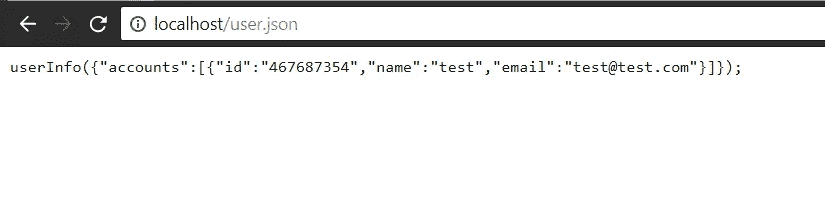
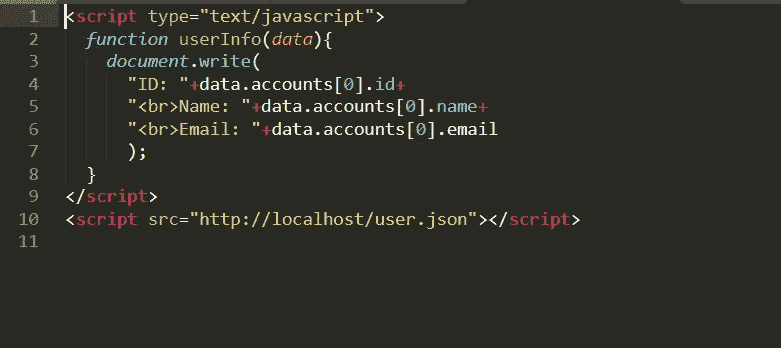
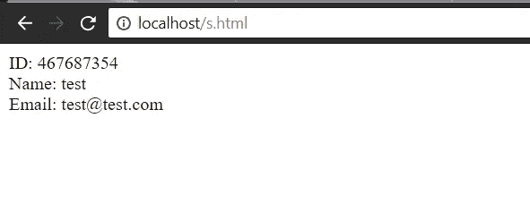
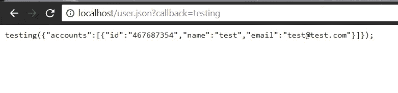

# 通过 JSONP 注入偷点 JSON 响应！！

> 原文：<https://infosecwriteups.com/steal-some-json-response-by-jsonp-injection-d385e9ccc0c1?source=collection_archive---------0----------------------->

一些网站依赖 JSON 来发送请求和接收响应，这种响应可以包括关于登录用户的信息，现在不应该对任何人公开。在这个主题中，我们将看到如何窃取这些数据。

# **JSON 是什么？**

JSON 是一种语言，但不是编程语言，但它是一种轻量级的数据交换格式，我们可以用它在不同的应用程序之间进行通信，例如(Android、IOS、Web 等)。).

# 剥削

现在 JSON 的一些回应是这样的:

反应

在这种情况下，如果您很幸运，我们可以通过使用 JS 编写一个小代码来转储这些数据，我们将在我的页面中将此文件作为 JS 文件包含在一个脚本标记中，我们将创建一个转储数据的函数，函数名应为 **userInfo** 这是一种利用，您可以在下图中看到代码:

代码

我页面上的回复是:

攻击者页面

这是一个有用的方法，而且基本上还有更多方法，但是我不想让这个话题变得无聊和冗长，我将讨论转储数据的最后一种方法，还有一种方法是将这个参数**回调**添加到 JSON 文件中，如果文件没有函数名可以利用，你可以尝试添加这样的参数:

现在它看起来像上面的情况，你应该遵循旧的步骤，完成后你将窃取数据。

感谢您的阅读，希望这个主题能对您有所帮助。