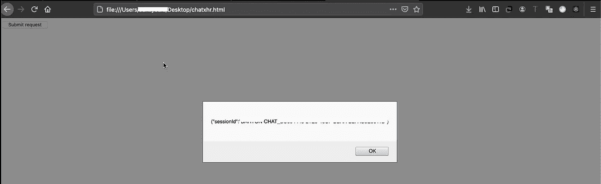
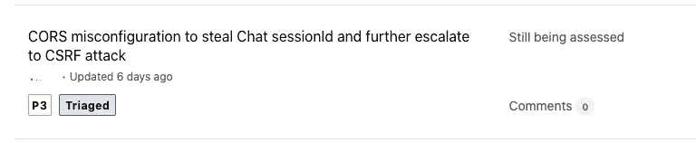

# 窃取与 CORS 的聊天会话 ID 并执行 CSRF 攻击

> 原文：<https://infosecwriteups.com/stealing-chat-session-id-with-cors-and-execute-csrf-attack-f9f7ea229db1?source=collection_archive---------0----------------------->

大家好，希望你们都健康平安。今天的文章是我最近在 Bugcrowd 私人项目上的发现。这篇文章解释了我如何将 CORS 与 CSRF 攻击联系起来，窃取受害者用户的聊天会话 Id，并代表受害者发送消息。不浪费时间，让我们进入漏洞的细节。

一月的第二周，在探索<redacted>领域时。我发现目标域名有内置聊天功能。对于发送新消息，系统将发送如下 POST 请求:</redacted>

POST /ha/chat/ <chat_session_id>HTTP/1.1
主机:<编校>
用户代理:XXXXX
接受:application/json，text/plain， */*
接受-语言:en-US，en；q=0.5
接受-编码:gzip，deflate
内容-类型:application/JSON；charset = utf-8
Host-Site:XXX
Content-Length:75
Origin:XXXXX
Connection:close
Referer:XXXXXXX</chat_session_id>

{"content":"HI "，" event":"MESSAGE "，" clientSideSequence":4，" role":"CUSTOMER"}

经过进一步的调查，我发现这个帖子的请求很容易受到 CSRF 的攻击。太好了。攻击者可以代表受害用户发送消息。

但是等等！！如果您仔细观察，端点包括受害者的 CHAT session _ id * */ha/CHAT/<chat_session_id>* *其格式如下:XXXXXX-CHAT _ xxxxxxxxxxxxx–XXXX-XXXX-XXXX-xxxxxxxxxxxxxxx</chat_session_id>

: (

现在我差一点就成功了，我不想放弃。此时此刻，我完全清楚，我需要做的就是找到一种方法来窃取受害者用户的聊天会话 ID。所以继续探索，遇到了一个端点，它帮助我创建受害用户的聊天会话 ID。* * https://<redacted>/ha/chat/create * *此外，端点没有 CORS 和 CSRF 保护。如此快速地创建了 CORS POC 代码并验证了该端点易受 CORS 攻击: )</redacted>

**CORS POC 代码示例:** *【相应更改值】*

<脚本>
var req = new XMLHttpRequest()；req.onload = reqListenerreq.open('GET/POST '，'<漏洞 URL >'，true)；req.withCredentials = true
req . send(' { } ')；函数 req listener(){ alert(this . responsetext)；};
</脚本>
< /html >

**结论**

因此，为了造成影响，攻击者将首先窃取受害者用户的聊天会话 Id，然后执行 CSRF 攻击，以受害者用户的身份发送消息。在完全弄清楚之后，很快在 2021 年 1 月 12 日发布了一份关于 Bugcrowd 的报告。Bugcrowd Triage 团队于 2021 年 1 月 26 日根据严重程度 P3 对该报告进行了分类

希望你喜欢我的解释。如果你有任何疑问，可以在 twitter 上 ping 我:[https://twitter.com/sunilyedla2](https://twitter.com/sunilyedla2)。祝你愉快，传播积极情绪！