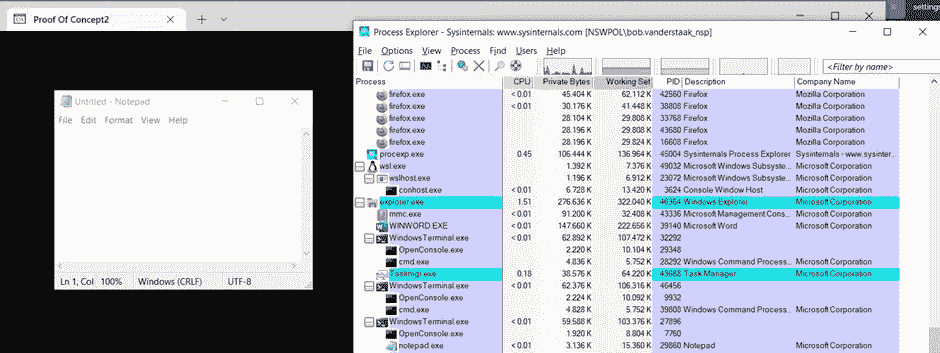
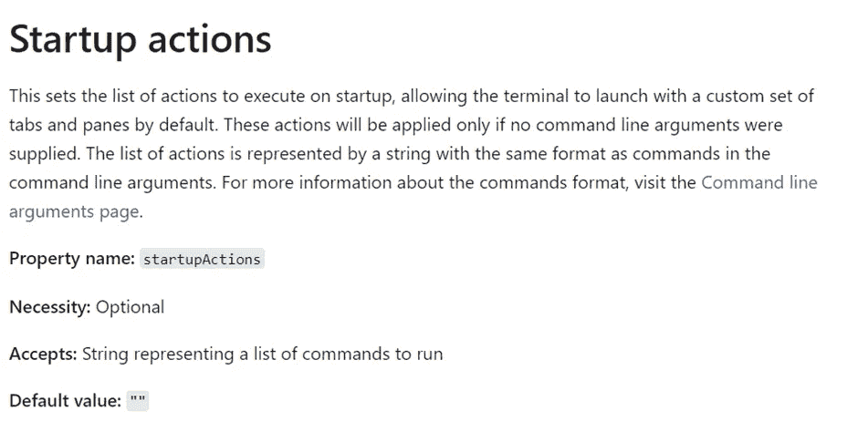
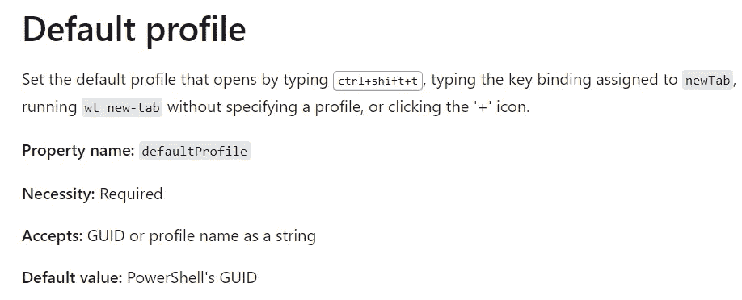
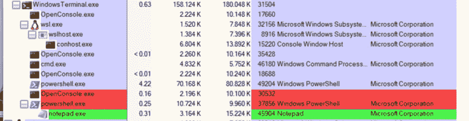
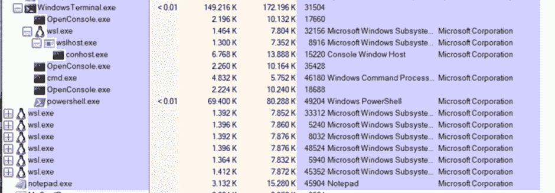
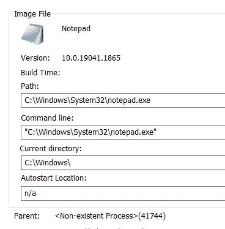
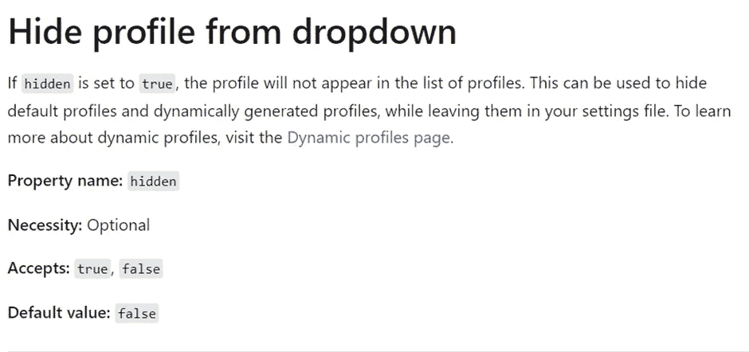
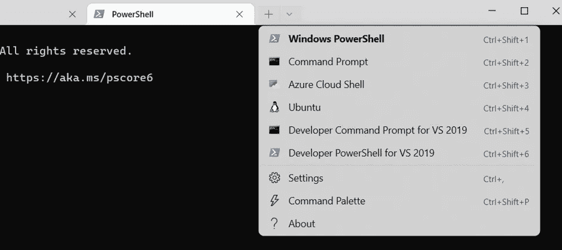
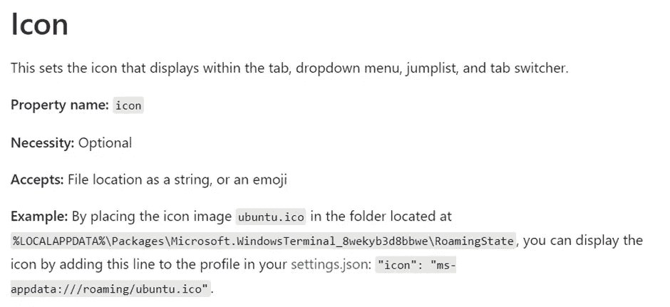

# 使用 Windows 终端时的隐形持久化。

> 原文：<https://infosecwriteups.com/stealthy-persistence-while-using-windows-terminal-ff6f4927563a?source=collection_archive---------0----------------------->

## 通过误用设置文件

我偶然发现了一篇有趣的文章，解释了一种使用 windows 终端配置文件在 Windows 机器上创建持久性的技术。

然而，在准备这篇文章的时候，我注意到终端窗口会挂起，这是一个明显的妥协迹象。



悬挂 cmd 没有那么隐秘持久

因此，我进一步研究，以找到一种方法来消除悬挂的 cmd 窗口，并使其更加隐蔽。

# 终端文档

正如在另一篇文章中所解释的，windows 终端有一个 settings.json，它提供了改变终端配置的可能性。这可以改变颜色，也可以改变其他配置，如启动哪个终端。

可以在以下文件夹中找到设置文件。

**" % local appdata % \ Packages \ Microsoft。windows terminal _<package id>\ local state \ "**

我注意到在微软的文档中有一个在另一篇文章中没有使用的方法，叫做 startupActions。



microsoft 文档解释了 startupAction 属性

使用 startupActions，可以定义启动时要启动的终端窗口。

这是一个重要的特性，因为我们想要启动一个“脏”终端，它会执行一些动作，并在事后自动自我销毁。以限制受害者可以查看脏标签的时间。

但首先我们需要定义脏的配置文件。我为终端定义了一个概要文件，它在启动时会启动 PowerShell 并启动一个新进程(在这个例子中是 notepad)。这个命令将创建相同的持久性，但是不显示挂起的终端。

```
{
"guid": "{d21dfa6e-2fd4-40ff-86fe-19ccdb2535f9}",
"name": "Proof Of Concept",
"hidden": true,   "commandline":"%SystemRoot%\\System32\\WindowsPowerShell\\v1.0\\powershell.exe Start-Process %SystemRoot%\\System32\\notepad.exe",
},
```

之后，我们可以将它添加到我们的启动操作中。


startupActions 属性

使用这一行，当启动终端应用程序时，所有指定的选项卡都将自动打开。为了更好的隐藏，验证是否已经指定了一个默认的概要文件是明智的。



微软解释的默认配置文件

如果指定了一个，但还没有 startupAction。您可以在启动选项中集成该配置文件，这将创建一个几乎无缝的集成。在没有定义默认配置文件的情况下，终端将回退到 PowerShell GUID 作为默认配置文件，然后添加该配置文件。

下面的代码利用 startupActions 来启动默认的 Powershell 属性，并加载概念验证配置文件。

```
"startupActions": "new-tab -p \"Windows PowerShell\" — title \"PowerShell\" ; new-tab -p \"Proof Of Concept\" — title \"cmd hanging\" ",
```

这项技术的有趣之处在于，执行的程序只是 wt 终端的一部分，持续几秒钟。后来因为 Powershell 被终止了，程序就和 windows 终端解耦了。



进程监视器显示在 WindowsTerminal 下终止 powershell 并启动 Notepad.exe

在这里 PowerShell 几乎会立刻被干掉。



Notepad.exe 不再位于 WindowsTerminal 下，但具有相同的 pid。

在额外的 PowerShell 被终止(它启动了程序记事本)后，它将有一个不存在的父对象，但是 pid 仍然是相同的！



在 Powershell 终止后，该程序有一个“不存在的进程”作为父进程

对于一些额外的隐藏，隐藏参数可以设置为真。这确保它不是终端界面下拉菜单中的可选项



隐藏由 microsoft 文档解释的配置文件

现在它在终端的下拉菜单中不再可见。使得当用户试图打开新终端时不太可能被发现。



由于隐藏属性，概念验证选项在下拉列表中不可见。

作为第二种选择，你可以看一个图标。有一个可以向用户显示 cmd 窗口的小窗口。与 windows 的标准悬挂图标，它可以给一些额外的维度，使它更合理的为什么会出错和关闭

因此，可以设置图标属性。
“图标”:<图标位置>



图标选项解释

给了我灵感的伟大文章可以在这里找到:[https://nasbench . medium . com/persistence-using-windows-terminal-profiles-5035d 3 fc 86 Fe。](https://nasbench.medium.com/persistence-using-windows-terminal-profiles-5035d3fc86fe.)出自[纳斯雷丁·本奇查利](https://medium.com/u/aad5aaf11bbb?source=post_page-----ff6f4927563a--------------------------------)

# **结论**

这个技巧为在使用微软终端应用程序的设备上强制持久性提供了一些简单的可能性。请记住，从 2022 年 10 月 18 日起，微软终端现在是默认终端，这是一个有效且明显的风险。

[](https://devblogs.microsoft.com/commandline/windows-terminal-is-now-the-default-in-windows-11/) [## Windows 终端现在是 Windows 11 的默认设置

### 这一天终于到来了！Windows 终端现在是 Windows 11 22H2 上默认的命令行体验！🎉这意味着…

devblogs.microsoft.com](https://devblogs.microsoft.com/commandline/windows-terminal-is-now-the-default-in-windows-11/) 

有趣的是，我深入阅读了终端函数是如何工作的，并找到了一种几乎无缝的方法，用我几乎每天都在使用的工具来创建持久性。

我还没有在 Mitre Att&ck 框架上看到它，也许它是 T1546 的一个新的 sub 技术？

有关终端的更多信息，请访问:

[](https://learn.microsoft.com/en-us/windows/terminal/customize-settings/startup) [## Windows 终端启动设置

### 下面列出的属性会影响整个终端窗口，不管配置文件的设置如何。这些应该是…

learn.microsoft.com](https://learn.microsoft.com/en-us/windows/terminal/customize-settings/startup) 

如果你想讨论任何与信息安全相关的话题，我在 linkedin 上:[https://www.linkedin.com/in/bobvanderstaak/](https://www.linkedin.com/in/bobvanderstaak/)

## 来自 Infosec 的报道:Infosec 每天都有很多内容，很难跟上。[加入我们的每周简讯](https://weekly.infosecwriteups.com/)以 5 篇文章、4 条线索、3 个视频、2 个 GitHub Repos 和工具以及 1 个工作提醒的形式免费获取所有最新的 Infosec 趋势！