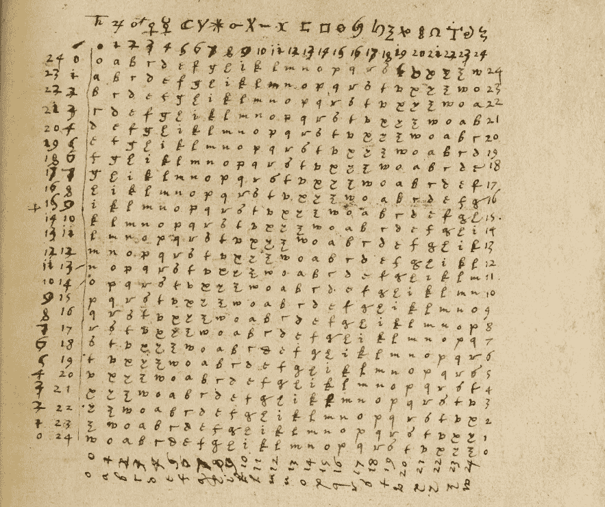
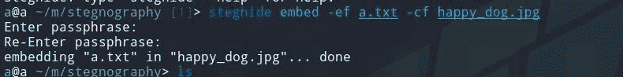
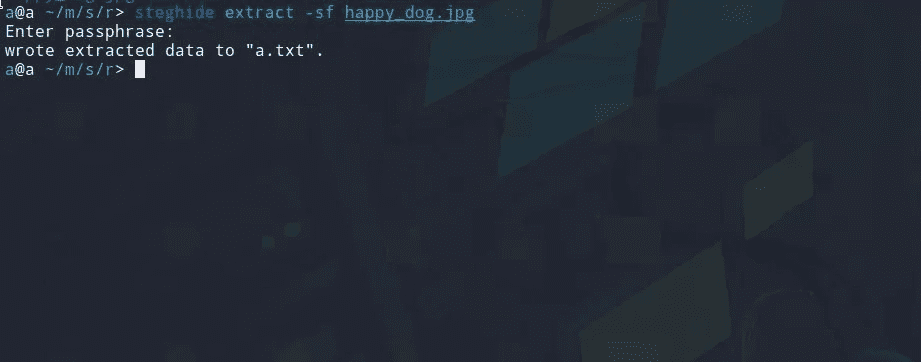
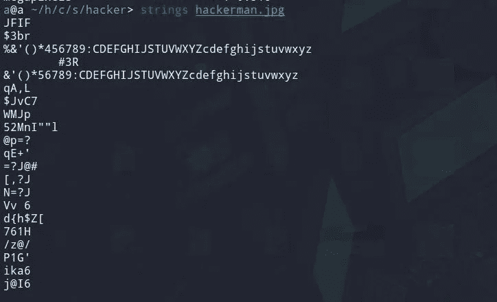
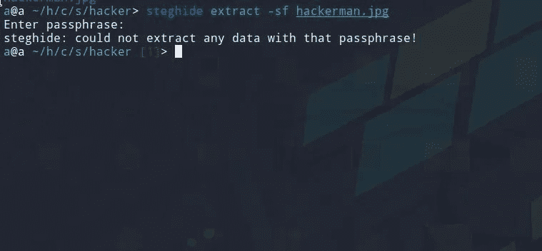
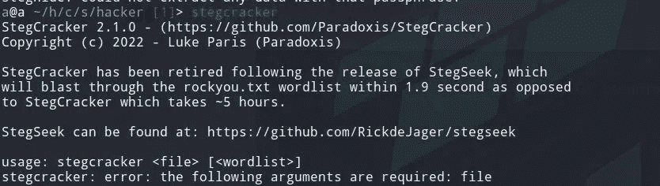
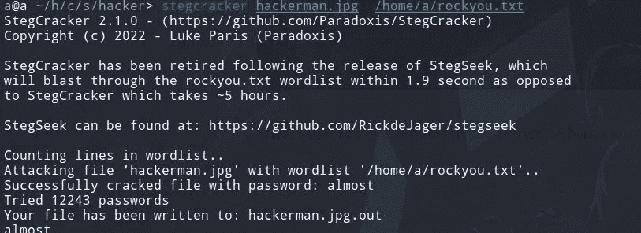
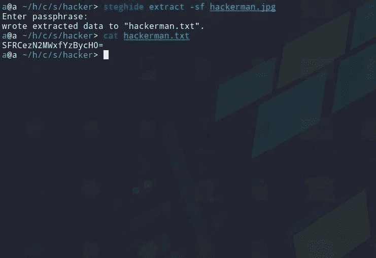

# 理解用于捕获旗帜挑战的隐写术

> 原文：<https://infosecwriteups.com/steganography-ctfs-73f7b310b1f7?source=collection_archive---------1----------------------->

## 什么是隐写术？用在什么地方？CTF 的隐写术

鸣谢:维基百科[https://en . Wikipedia . org/wiki/Steganography #/media/File:Steganography _ in _ the _ hand _ of _ John _ dee . png](https://en.wikipedia.org/wiki/Steganography#/media/File:Steganography_in_the_hand_of_John_Dee.png)

大家好，我希望你们都过得很好。今天，我们将学习隐写术，我们将做一些黑客盒子的挑战。所以不浪费任何时间，让我们开始吧。

# 什么是隐写术？

> 隐写术是一种将秘密信息隐藏在某物内部的方法。例如在图像或音频文件中隐藏秘密。

有许多工具可以帮助你隐藏一个秘密的信息在一个图像或另一种文件类型中。其中最著名的工具是 **steghide** 。稍后将详细介绍。

**有两种隐写术:**

㈠身体

㈡数字

在本文中，我们将学习**数字** **隐写术**

# **隐写术用在哪里？**

> SVR 等政府机构在某些通信中使用隐写术
> 
> 来源:[https://en.wikipedia.org/wiki/Steganography](https://en.wikipedia.org/wiki/Steganography)
> 
> 恶意黑客使用隐写术进行不同类型的攻击。一些最著名的方法是在启用宏的 Word 文档中，或者在歌曲或电影中嵌入实际的脚本。
> 
> 如果你想了解更多，请查看这篇文章
> 
> [https://ports wigger . net/daily-swig/what-is-steganography-a-complete-guide-to-the-ancient-art-of-hiding-messages](https://portswigger.net/daily-swig/what-is-steganography-a-complete-guide-to-the-ancient-art-of-concealing-messages)

# 如何将文本文件隐藏到图像中

我们需要安装 steghide。如果你使用 kali，那么 ***sudo 安装 steghide。***

我们将使用命令 **steghide embed -ef 选择要嵌入的文件<文件名> -cf 嵌入到文件<文件名>**

现在我们将提取我们的数据

我们将使用命令 **steghide extract -sf 将结果写入到<文件名>中，而不是封面文件<文件名>**

# 是时候跳 CTF 舞了

1:——https://app.hackthebox.com/challenges/17CTF·哈克曼

我会告诉你我如何在任何 CTF 挑战 steg 的方法。

**步骤:-**

1:-下载挑战文件

2:-下载文件后，我总是对文件运行 ExifTool。(在 CTF，你可以找到密码或其他有用的东西。)

3:-然后我将运行字符串命令(打印文件中可打印字符的序列)。之后，我首先使用 steghide 等其他工具。

检查 EXIF 数据

用线串

由于我不知道密码，我试图用 **stegcracker** 强行破解。

stegcracker

破解密码

我们几乎已经得到了我们的密码短语。现在我们可以用 steghide 提取隐藏文件

最终输出

我们的输出是 base64 编码的，我们可以简单地对它进行 base64 解码。

感谢你阅读这篇文章，希望你喜欢。你可以在推特上关注我 [hac10101](https://twitter.com/Hac10101)

# 🔈 🔈Infosec Writeups 正在组织其首次虚拟会议和网络活动。如果你对信息安全感兴趣，这是最酷的地方，有 16 个令人难以置信的演讲者和 10 多个小时充满力量的讨论会议。[查看更多详情并在此注册。](https://iwcon.live/)

 [## IWCon2022 - Infosec 书面报告虚拟会议

### 与世界上最优秀的信息安全专家建立联系。了解网络安全专家如何取得成功。将新技能添加到您的…

iwcon.live](https://iwcon.live/)