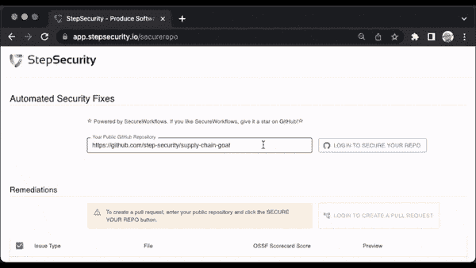

# StepSecurity 发布了用于提高 30 个关键开源项目(包括 NodeJS、OpenSSL、Python、Rails、React Native)安全性的工具

> 原文：<https://infosecwriteups.com/stepsecurity-releases-tool-that-it-used-to-improve-security-of-30-critical-open-source-projects-4ebbef31b908?source=collection_archive---------3----------------------->

[SecureWorkflows](https://github.com/step-security/secure-workflows) 是一个开源项目，可以自动实现安全最佳实践。SecureWorkflows 项目用于强化前 100 个关键开源项目中 30 个项目的 GitHub Actions 工作流文件。

您现在可以使用 app.stepsecurity.io/securerepo 的[在您自己的开源项目中使用 SecureWorkflows 来实现安全最佳实践。该工具使用拉请求来修复安全最佳实践问题，而无需安装任何应用程序。](https://app.stepsecurity.io/securerepo)

在开源项目中实现安全性最佳实践的工具

Linux 基金会的安全开源(SOS)奖励计划在过去的两个月里奖励了 StepSecurity 三次，因为它在 30 个关键的开源项目中实现了这些安全改进。与寻找漏洞的 bug 奖励计划不同，SOS 计划奖励开源安全最佳实践的实施。

实施这些安全性改进还提高了这 30 个项目的 OpenSSF 记分卡分数。Scorecard 根据项目中已经实现的安全性最佳实践为每个开源存储库打分。您可以使用[开源洞察](https://deps.dev/)查看您项目的得分，并使用[app.stepsecurity.io/securerepo](https://app.stepsecurity.io/securerepo)增加得分。

您可以在这里找到 30 个关键开源项目的合并拉请求列表:[https://github . com/step-security/secure-workflows/issues/462](https://github.com/step-security/secure-workflows/issues/462)

通过关注 StepSecurity 的 [Twitter](https://twitter.com/step_security) 和 [LinkedIn](https://www.linkedin.com/company/step-security) 账户，阅读未来几个月对这 30 个关键开源项目进行的安全改进的更多细节。

为了帮助宣传 SecureWorkflows 项目，请启动 [SecureWorkflows GitHub 存储库](https://github.com/step-security/secure-workflows)。

来自 Infosec 的报道:Infosec 上每天都会出现很多难以跟上的内容。 [***加入我们的每周简讯***](https://weekly.infosecwriteups.com/) *以 5 篇文章、4 个线程、3 个视频、2 个 Github Repos 和工具以及 1 个工作提醒的形式免费获取所有最新的 Infosec 趋势！*