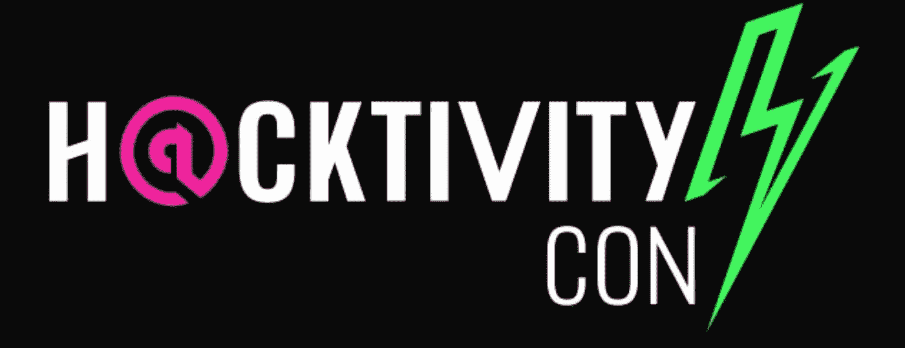
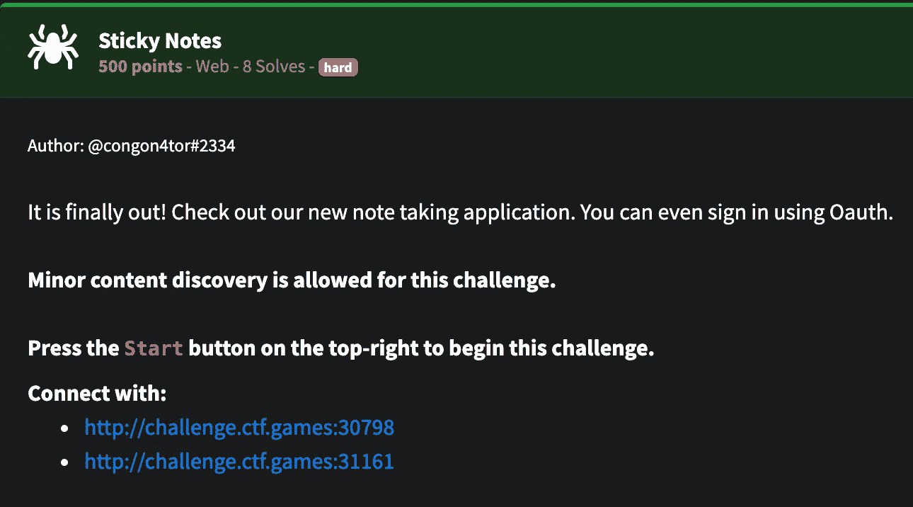
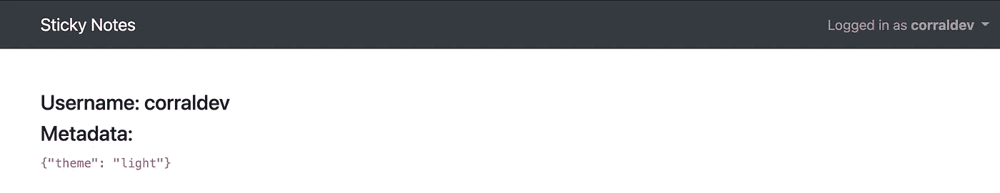
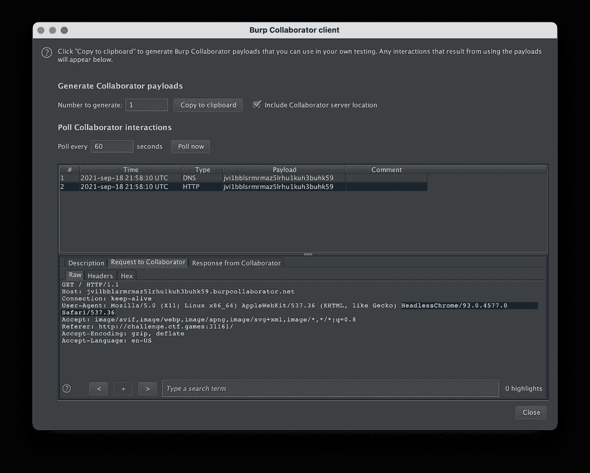
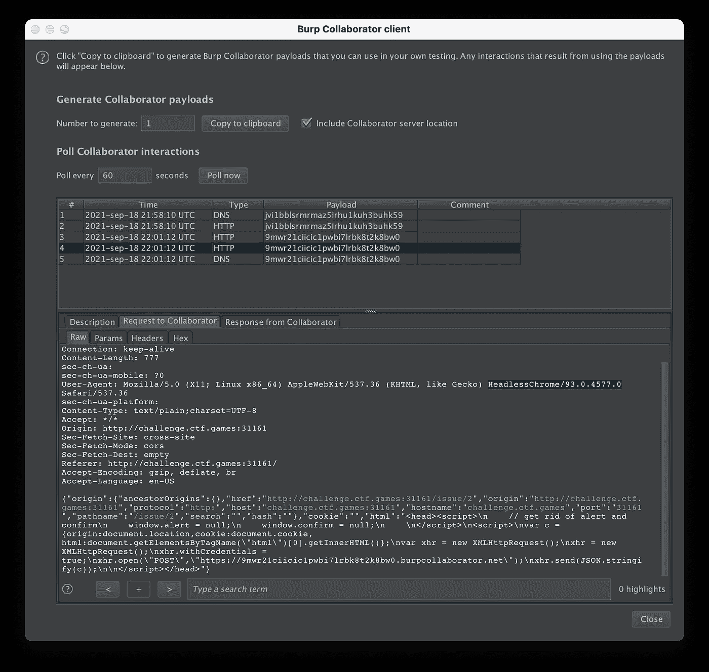
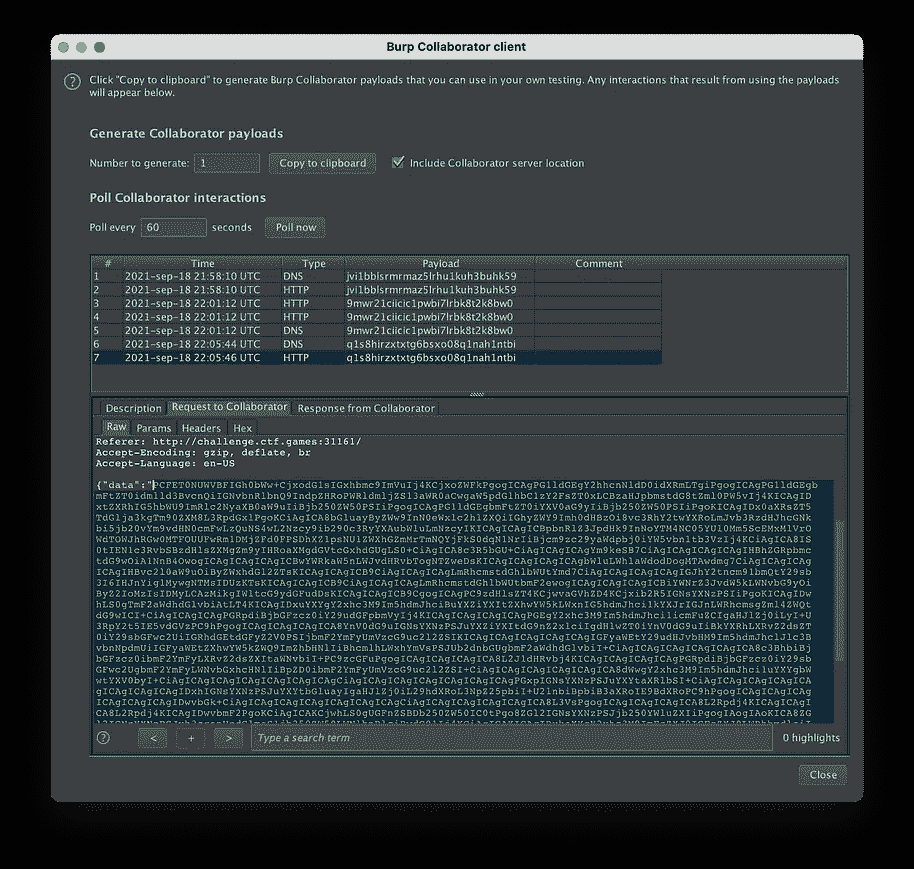
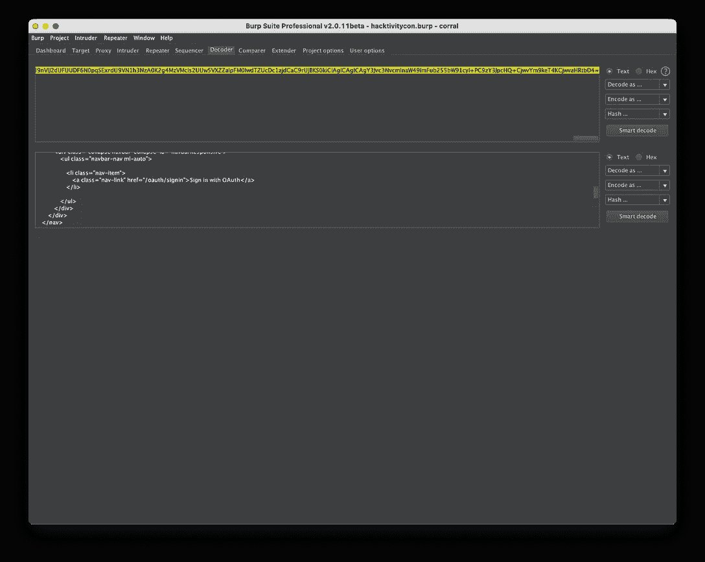
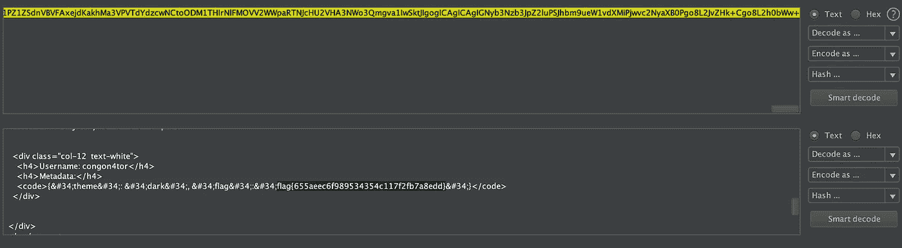

# 便利贴 2021 年世界杯

> 原文：<https://infosecwriteups.com/sticky-notes-h-cktivitycon-2021-ctf-c0b6242a80fd?source=collection_archive---------1----------------------->

我是这次挑战中能够抓住旗帜的 8 支队伍之一，如果你试图黑掉它，但你做不到，别担心，我差点就放弃了。

首先，侦察。

我们有两个服务，认证和便利贴应用。稍后您会看到 OAuth 有点棘手(它让我很头疼)。

便笺应用程序—主页面

便笺应用程序—ProFi ie

像往常一样，我开始侦察创建一个帐户，并测试应用程序的主要功能。很快我向自己提出了一个问题，为什么 ctf 创建者在那个平台中加入了一个报告问题的特性？那没有意义…那个服务没有人为了阅读我的令人烦恼的问题而工作…

但是……机器人呢？也许他们会放一些脚本来读取问题，也许我可以在那里执行一些代码。让我们试试…

我编写了一个简单的 xss 有效负载，并等待在我的 burp collaborator 客户机中收到请求。

这是一个无头铬合金(我之前以为)

好了，现在我们知道这部分容易受到 XSS 的攻击，我们需要升级到该客户。所以我首先试图获得更多关于机器人背景的信息。易受攻击容器的 Cookies、路径和 Html..

用于从机器人窃取信息的脚本。

首先，看起来没有要检索的 cookies，这是因为 httponly 标志，好吧，我们不能窃取会话并模拟它，但是……那么做一个 xhr 请求并泄漏笔记的内容或帐户的元数据呢？

该机器人似乎没有登录:(

在这里，我尝试了两件事，第一件是将用户重定向到 oauth 流，自定义重定向 url 到我的 xss 中毒页面，然后窃取代码，稍后在我这边使用……但是由于状态参数，这一操作失败了。每个用户在请求登录时都有一个独特的状态，当我使用一个时，页面说 redirect_url 无效…

我尝试的最后一件事是加载一个 iframe，它将在后台为我登录用户，请求个人资料页面，并最终将其发送给 burp collaborator。

我们终于拿到了旗子！

这就是所有的人！

跟我上去！—

[https://twitter.com/corraldev](https://twitter.com/corraldev)

https://hackerone.com/corraldev?type=user