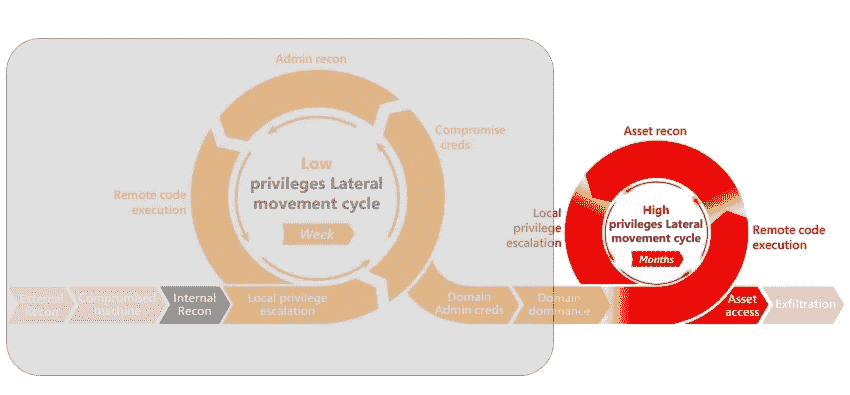

# 一劳永逸地停止对敏感基础架构的 Active Directory 侦测。

> 原文：<https://infosecwriteups.com/stop-active-directory-reconnaissance-for-sensitive-infrastructure-once-in-for-all-7c66a40c7d86?source=collection_archive---------0----------------------->

这是我的活动目录测试系列的第 4 部分。这一部分的重点是通过强制执行强制策略和减少外围应用来停止/限制 Active Directory 侦测。我在以前的文章中已经介绍了最基本的和一些高级的工具技术:
1。[第一部分:列举广告基础设施](https://medium.com/@Shorty420/enumerating-ad-98e0821c4c78)
2。[第二部分:自动化广告枚举](https://medium.com/bugbountywriteup/automating-ad-enumeration-with-frameworks-f8c7449563be)
3。[第三部分:Kerberoasting 在](https://medium.com/@Shorty420/kerberoasting-9108477279cc)
4 中为您开路。[第四部分:一劳永逸地停止对敏感基础架构的 Active Directory 侦察！](https://medium.com/@Shorty420/stop-active-directory-reconnaissance-for-sensitive-infrastructure-once-in-for-all-7c66a40c7d86)

那么，使用 Active Directory 的组织可以做些什么来对抗侦察和自动化工具库呢？以上所有的攻击都滥用了 NTLM 认证协议，所以唯一完整的解决方案是完全禁用 NTLM，转而使用 Kerberos。正如我们所知，许多组织的传统操作系统不支持 Kerberos 身份验证，因此禁用 NTLM 将会对业务产生重大影响。作为一个缓解因素，可以启用几个设置来最小化枚举、信息泄露、侦察和中继的风险。

连接杀伤链，专注于侦察和信息收集。Img 来源:https://docs . Microsoft . com/en-us/advanced-threat-analytics/ATA-threats

> *这些配置和变更特定于基础设施。因此，本文中不包含截图或 cmdlets。审核员/评审员将不得不挖掘并为组织获取这些信息。*

**建立**，实施和执行 SMB 签名将通过要求对所有流量进行签名来防止中继到 SMB。签名需要用户密码来验证消息，因此中继连接的攻击者无法发送服务器会接受的任何流量，因为攻击者不拥有受害者的密码。

**建立**，在 TLS 上实施和执行 LDAP 防止未签名的 LDAP 连接，并保护 LDAP 请求/响应。应该注意的是，通过 TLS 进行的 LDAP 连接也被认为是已签名的。

**考虑**身份验证的扩展保护通过确保用于连接到服务器的 TLS 通道与客户端在身份验证时使用的通道相同，有助于防止一些中继攻击。此设置主要适用于 IIS。

**建立**，实施并强制执行 SPN 目标名称验证，通过验证客户端认为正在进行身份验证的目标名称来防止中继到 SMB。如果名称与服务器不匹配，身份验证请求将被拒绝。

**强制**所有内部网站对 HTTPS 的唯一功能，转播变得不那么有效。当通过不安全的 HTTP 协议访问内部网站时，用户无法验证连接的真实性。

**考虑**如果域中需要 NTLM 认证，浏览器(主要是 Internet Explorer)仅自动认证受信任的网站。通过组策略，可以禁用自动 intranet 检测，而只自动对自动身份验证应适用的内部网站的白名单进行身份验证。如前所述，强烈建议在这里只使用 HTTPS 网站。

**考虑**禁用 Windows 代理自动检测。虽然 WPAD 的安全问题大多已通过 Microsoft MS16–077 安全更新解决，但仍然建议通过组策略禁用 WPAD。

**考虑**禁用 LLMNR/NBNS，因为配置良好的网络通常不需要这些不安全的名称解析协议。禁用它们会减少攻击者进行名称解析欺骗的可能性，从而使攻击者更难欺骗受害者连接到攻击者的服务器。这也确保了运行 Vista 和更高版本的系统在防止内部网络上的哈希捕获方面有很大的进步。

**确保**通过更改默认帐户设置和设置安全密码来保护软件安装。

**建立并维护**补丁管理流程，通过该流程定期扫描网络，查找过期的操作系统和软件，然后更新/升级并修补系统。

**避免**通过组策略对象设置管理密码。如果必须使用本地管理帐户，请使用随机密码来限制危害的深度。

**避免到处都是空会话。虽然空 NetBIOS 访问设置可能看起来是一个低风险问题，但当匿名访问发生时，它可能会泄露用户、组和策略，从而增加危害内部网络访问的机会。Windows 域控制器和服务器可以禁用此功能，以防止数据枚举。**

**确保**服务帐户密码超过 25 个字符(并且不易被猜到)。

**考虑** [托管服务账户](https://technet.microsoft.com/en-us/library/dd560633%28v=ws.10%29.aspx)和[组托管服务账户](http://blogs.technet.com/b/askpfeplat/archive/2012/12/17/windows-server-2012-group-managed-service-accounts.aspx)，确保服务账户密码长且复杂，并定期更换。提供密码保险存储的第三方产品也是管理服务帐户密码的可靠解决方案。尽管任何第三方密码管理工具都需要正确评估，因为相关的服务帐户通常需要域管理员级别的权限。此评估还应包括如何在解决方案中管理这些凭据。

**执行**一次*活动目录有效访问审计*和*活动目录委派审计*以准确识别**谁**被委派了**什么**活动目录中的管理访问权限，从而轻松识别组织内部的关键基础设施，以提供更多的安全关注。

**执行** CIS 和 IASE STIG 审核，以确保足够的强化到位。 [CIS](https://www.cisecurity.org/cis-benchmarks/) 和 [IASE STIG](https://iase.disa.mil/stigs/pages/a-z.aspx?Paged=TRUE) 核对表保证系统和网络硬化，差不多。利用 OpenSCAP 和 Nessus 进行自动化审计。这些指南中的许多检查确保了对初始数据收集的防范。

> **喊出:**
> 独联体基准:[https://www.cisecurity.org/cis-benchmarks/](https://www.cisecurity.org/cis-benchmarks/)
> IASE DISA 斯蒂格斯:[https://iase.disa.mil/stigs/pages/a-z.aspx?Paged=TRUE](https://iase.disa.mil/stigs/pages/a-z.aspx?Paged=TRUE)
> [https://adsecurity.org/?p=3458](https://adsecurity.org/?p=3458)