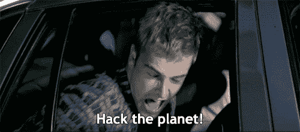
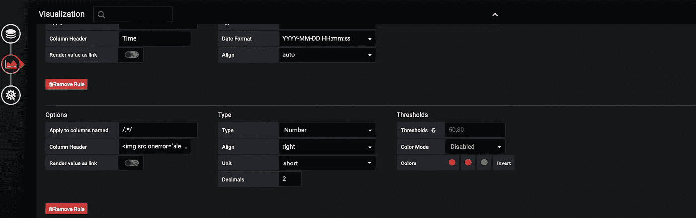
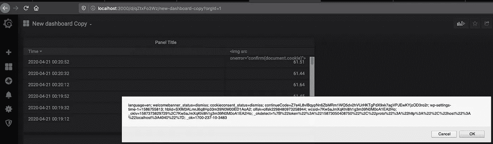
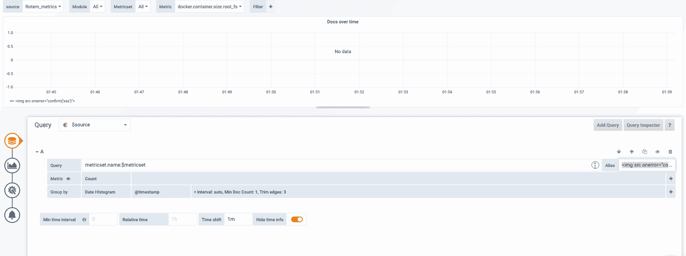
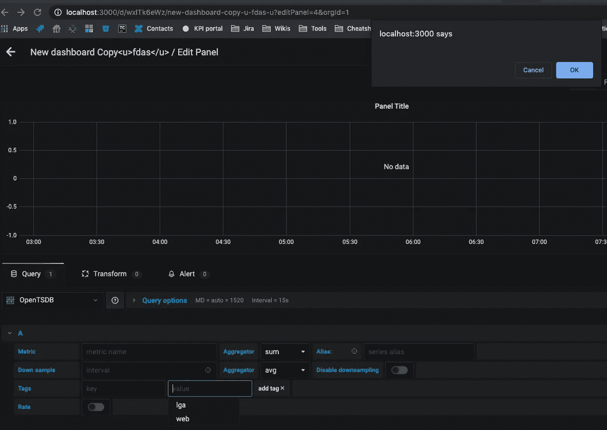

# 不要只触及表面，要破解依赖关系

> 原文：<https://infosecwriteups.com/stop-scratching-the-surface-and-hack-the-dependencies-fe4c26cd8ea?source=collection_archive---------0----------------------->

**TLDR；**我如何在格拉夫纳发现了四个 XSS 漏洞，而不是在私人 BBP 和**狩猎时继续挖掘其表面。)** **但是你必须读完它才能明白为什么*😎

不久前，我在我最喜欢的 Bug-Bounty 程序中搜索，但在其狭窄的范围内找不到任何新的或可疑的东西，所以我没有就此打住，而是决定追寻它们的依赖关系。

这个程序使用 Grafana 来实现它的一些核心功能，所以我想，为什么不去追求 Grafana 呢？



# 在表格可视化中排名第一的存储 XSS(CVE-2020–12245)

几分钟后，我发现了一个**存储在可视化表中的 XSS。**

*在此之前我也发现了另一个问题，但它以重复结束，因为它已经是一个已知的问题——*[https://github.com/grafana/grafana/pull/23254](https://github.com/grafana/grafana/pull/23254)。\_(ツ)_/



Grafana 易受攻击的表格可视化

## 影响

通过利用此漏洞，攻击者只需查看带有恶意可视化效果的仪表板，就可以在受害者的浏览器上执行任何 JavaScript 代码。



带有“受害者”cookies 的警告框

## 参考

*   [https://github . com/grafana/grafana/blob/master/changelog . MD # 673-2020-04-23](https://github.com/grafana/grafana/blob/master/CHANGELOG.md#673-2020-04-23)

# 在饼图面板中排名第二的存储 XSS(CVE-2020–13429)

饼状图是一个官方的 Grafana 插件，默认安装。

我发现“值头”字段既不验证也不净化用户输入，因此容易受到 XSS 注入的攻击。
我能够注入一个简单的 XSS 有效载荷，例如``。

## 影响

通过利用此漏洞，攻击者只需查看带有恶意可视化效果的仪表板，就可以在受害者的浏览器上执行任何 JavaScript 代码。

## 参考

*   [https://github.com/grafana/piechart-panel/issues/218](https://github.com/grafana/piechart-panel/issues/218)

# 在图形可视化中排名第三的存储 XSS(CVE-2020–24303)

当使用 ElasticSearch 作为数据源时,“查询”选项卡中的“别名”输入字段既不净化也不验证用户输入，这允许我向该字段注入一个简单的 XSS 有效负载(例如``)。

一旦受害者打开可视化标签，有效载荷就会被触发。



## 影响

通过利用此漏洞，攻击者可以通过操纵受害者的浏览器打开恶意可视化的“查询”选项卡，在受害者的浏览器上执行任何 JavaScript 代码。

## 参考

*   [https://github . com/grafana/grafana/blob/master/changelog . MD # 710-beta-1-2020-07-01](https://github.com/grafana/grafana/blob/master/CHANGELOG.md#710-beta-1-2020-07-01)

# #4 存储在 OpenTSDB 数据源中的 XSS(CVE-2020–13430)

我通过手动代码审查发现了这个漏洞，由于利用的先决条件(如下所述)，它更难被利用。



## 先决条件

```
1\. The attacker must be able to push a new tag value to the OpenTSDB data source, e.g.curl -X POST [http://localhost:4242/api/put](http://localhost:4242/api/put) -d '{"metric":"rotem.cpu.xss","timestamp":1346846400,"value":11,"tags":{"host":"web","dc":"lga****"}}'2\. The OpenTSDB data source must allow special characters for our exploit to work:tsd.core.tag.allow_specialchars = !@#$%^&*()_+{}|: <>?~`-=[]\;',./°
```

## 影响

通过利用此漏洞，满足上述先决条件的攻击者可以在受害者的浏览器上执行任何 JavaScript 代码，方法是操纵这些代码执行以下操作:

1.  转到现有或新的仪表板并添加新面板
2.  在查询的数据源中选择他们的 OpenTSDB 数据源
3.  通过单击+号添加新标签
4.  单击值字段，来自 OpenTSDB 标记值的 XSS 负载将被触发

## 参考

*   https://github.com/grafana/grafana/pull/24539

# 现实生活中的剥削

您可能会问自己，我是如何向列兵 BBP 报告这些漏洞的，严重性如何。

我报告了以上所有内容(除了 OpenTSDB，它与本程序无关)，并因**的 3 次批评**而获得奖励。


是的…我没骗你。

最初，三人组声称这是一个“自我 XSS”，因为(据称)我只能影响我自己组织的用户，但这完全是一个错误的假设。
我向他们解释说，Grafana 能够与其他用户共享仪表盘，这意味着如果我与另一个登录了他们帐户的用户共享我的恶意 Grafana 仪表盘，我将能够窃取他们的 cookies 并劫持他们的帐户。

好吧…但是关键？

然后我做了下一件事——因为他们在网站上有一个支持聊天，我请求他们允许我为我的恶意仪表板“请求支持”并攻击他们的支持工程师，他们同意了。


第一次尝试时，他们的支持工程师进入了我的恶意仪表板，但出于某种原因，我没有收到他们的会话 cookie。在第二次尝试时，我得到了全部。我现在能够以管理员身份登录到他们的生产帐户，管理他们的管理员，查看敏感日志(包括用户令牌)，这足以被认为是非常重要的。

这是我在格拉夫纳打猎的最佳决定之一。我在那里的短暂旅程既有收获又有乐趣(我非常享受，甚至贡献了其中的两个补丁😂).
我希望在格拉夫纳深化我的研究，将来在那里发现一些更奇特的虫子，但从那以后就没时间做了。

如果你喜欢读它，鼓掌。如果你想要更多，[在推特上关注我(2RS3C)](https://twitter.com/2RS3C) :D