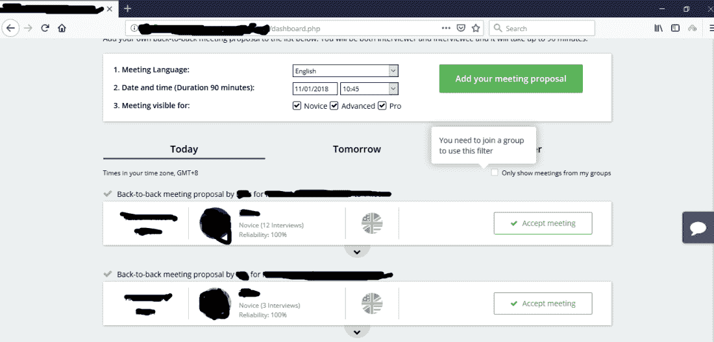
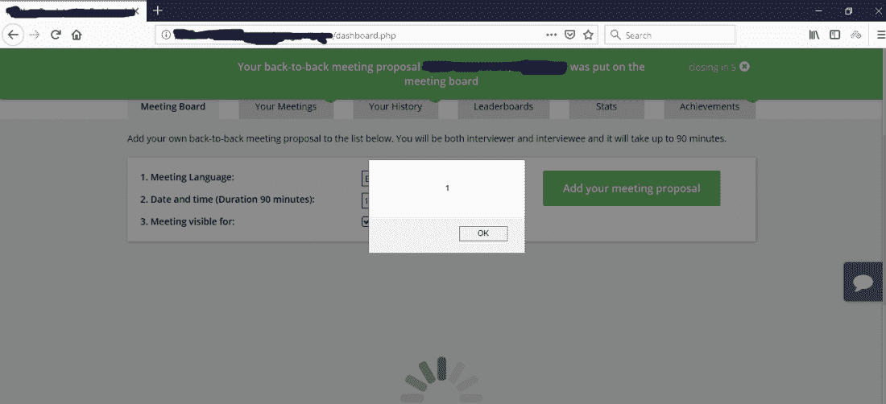
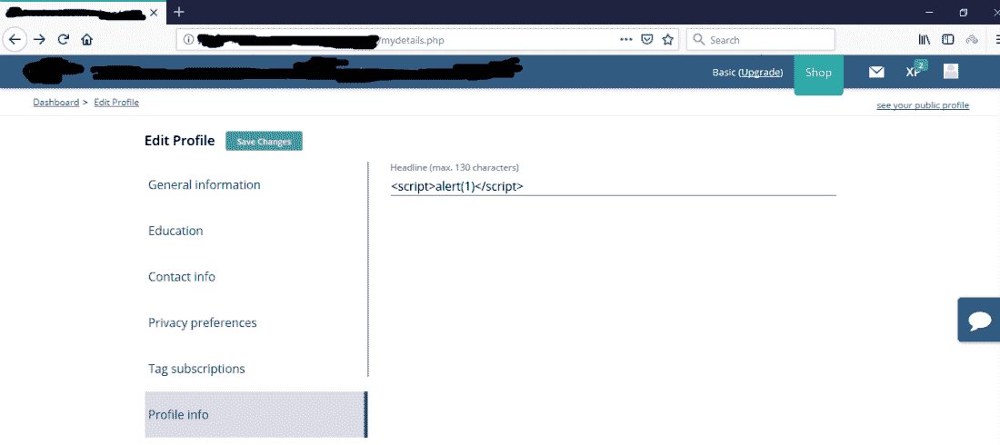
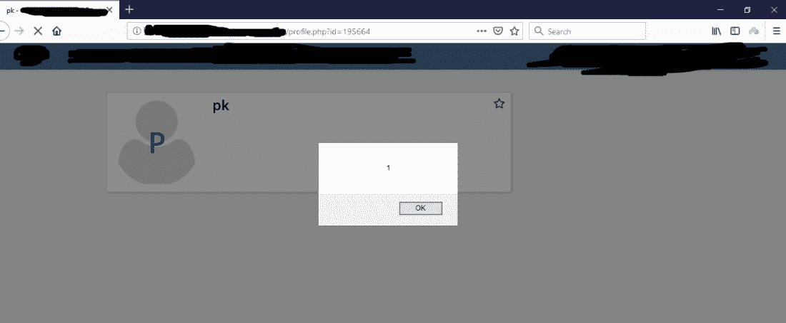

# 将 XSS 储存在昆虫赏金中

> 原文：<https://infosecwriteups.com/stored-xss-in-bug-bounty-13c08e6f5636?source=collection_archive---------0----------------------->

# 序

所以我不久前开始参与臭虫奖励计划，很快我发现至少有两个地方容易受到储存 XSS 的攻击(我相信相当大？他们有许多用户，并有一些大银行和公司作为他们的合作伙伴。)网站，帮助用户准备面试。

# 摘要

网站的仪表板显示用户提交的会议提议。XSS 有效负载可以添加到会议提议中，并在访问仪表板(OMG)的任何用户的浏览器上触发 XSS。

当登录用户访问特定用户(在这种情况下，我的测试帐户)的配置文件时，XSS 触发。

# 我是怎么发现的

在我发现这个网站正在运行一个 bug bounty 程序后，首先我寻找任何反映 XSS 的入口点，比如网站上的搜索功能和显示的错误信息。我运气不好😦。但有时不幸是塞翁失马焉知非福。

作为一个客人，我挖了一段时间后，决定注册一个帐户来测试其他功能。很快我发现我可以在仪表板上留下一些东西:

用户可以添加会议提案，每个提案都会显示在仪表板上(有一段时间，这让我想起了过去一些论坛上的“欢迎新成员”功能！).嗯……这意味着我们可以在仪表板上留下一些文本，比如提案内容？测试的好地方。

我发现用户可以为他/她的会议提议添加评论。让我们看看这个简单的脚本是否可行:

原来是有效的！评论被插入到 HTML 中，没有经过任何过滤，所以现在每当我们访问仪表板(也是网站的主页——如果你登录的话)时，它都保持警告“1”

我决定探索更多。必须有更多的地方显示用户输入而不过滤。所以我访问了个人资料编辑功能，发现了一个叫做 headline 的东西(“测试”就在用户名“pk”下面)

嗯…..这意味着我可以向每个访问我的个人资料的用户显示定制的文本。如果我在这里插入 javascript 会怎样？

同样，网站没有过滤用户输入并直接插入 HTML。所以我们得到了另一个储存的 XSS:

就是这样。肯定有更多的地方容易受到 XSS 的攻击。我会继续追踪它。