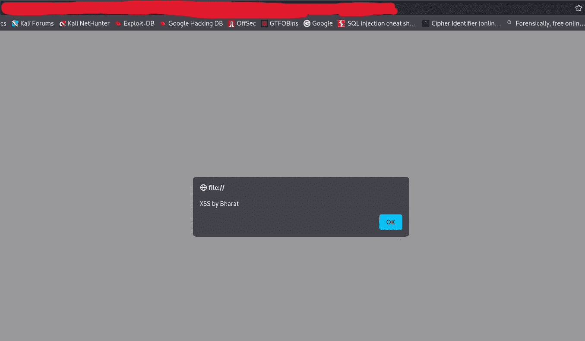
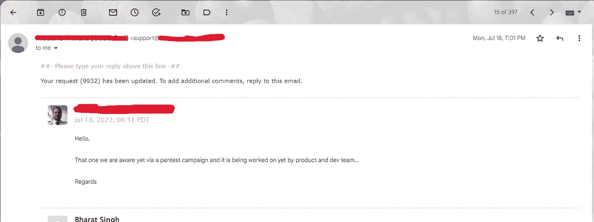

# 使用 SVG 文件存储 XSS

> 原文：<https://infosecwriteups.com/stored-xss-using-svg-file-2e3608248fae?source=collection_archive---------0----------------------->

嘿伙计们，希望你们都做得很好。我是来自印度的安全研究员和漏洞猎人。在这篇文章中，我将告诉你我最近对一个最终被复制的 VDP 的发现。由于公司的政策，我不能透露项目的名称。

# 臭虫的故事:

我寻找的目标实际上是一个拥有大量功能的编码平台。每当我选择一个程序进行测试时，我通常会检查所有的功能，并尝试手动理解目标。因此，在一整天了解目标后，我开始寻找错误，但没有运气，并开始感到筋疲力尽。没有低挂水果和网站是安静的安全，第二天与新鲜的头脑，我又开始忙碌，然后我的眼睛去了个人资料图片上传选项。因为它很安全，我没有低挂的错误，我不期望在那里找到一个文件上传漏洞，但我给它一个尝试。首先我上传了一个 txt 文件，我震惊了！！！它接受了。txt 文件，然后我移动到另一个步骤，并尝试再次上传一个。svg 文件，它允许 svg 文件，这是不常见的。

> **什么是 SVG 文件？**
> 
> 可缩放矢量图形(SVG)是一种网页友好的矢量文件格式。SVG 文件格式是在网站上显示二维图形、图表和插图的流行工具。

所以，我开始思考如何利用这个漏洞，使更有影响力，我想到的第一件事是存储 XSS，然后我做了一个文件。具有以下有效负载的 svg 扩展:

```
<?xml version="1.0" standalone="no"?>
<!DOCTYPE svg PUBLIC "-//W3C//DTD SVG 1.1//EN" "http://www.w3.org/Graphics/SVG/1.1/DTD/svg11.dtd">

<svg version="1.1" baseProfile="full" >
  <polygon id="triangle" points="0,0 0,50 50,0" fill="#009900" stroke="#004400"/>
  <script type="text/javascript">
    alert("XSS by BHARAT");
  </script>
</svg>
```

在个人资料照片部分上传文件后，我在新标签和 **BOOM 中打开了图片！！！**那个警告框。



**我就像…**

我有点兴奋，并试图把它带到一个新的水平 RCE(远程代码执行)，几个小时过去了，但我没有运气。我立即向他们的安全团队报告了这个 bug，并等待他们的回应。两天后，我收到他们的邮件说…



随着时间的推移，我感到沮丧和悲伤，至少我得到了一个有效的 bug:)。

**时间线:**

2022 年 7 月 16 日—报告了错误

2022 年 7 月 18 日—标记为重复

2022 年 7 月 19 日—收获的只有希望和永不放弃的态度。

**随时联系我，问我任何关于 bug 赏金和其他东西的问题**

**Linkedin-**[**https://www.linkedin.com/in/bharat-s1ngh/**](https://www.linkedin.com/in/bharat-s1ngh/)

**推特-**[https://twitter.com/zingzangoo](https://twitter.com/zingzangoo)

*来自 Infosec 的报道:Infosec 上每天都会出现很多难以跟上的内容。* [***加入我们的每周简讯***](https://weekly.infosecwriteups.com/) *以 5 篇文章、4 个线程、3 个视频、2 个 Github Repos 和工具以及 1 个工作提醒的形式免费获取所有最新的 Infosec 趋势！*