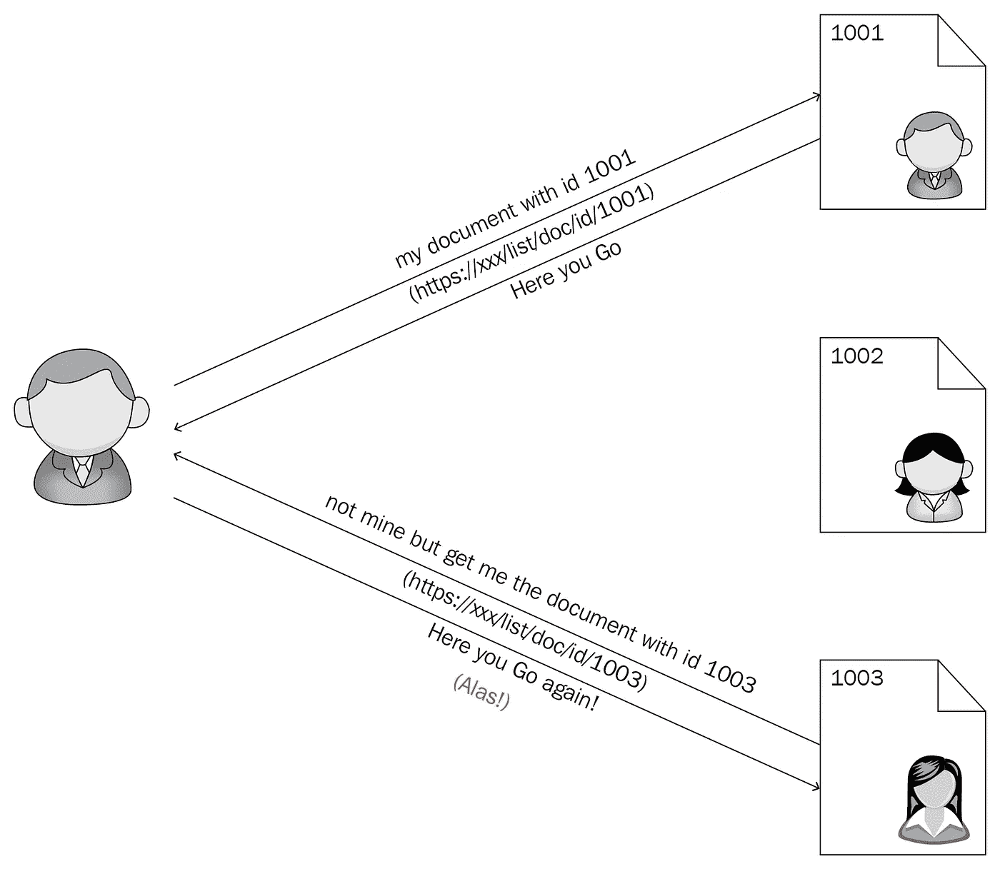

# 伊多的故事

> 原文：<https://infosecwriteups.com/stories-of-idor-4966369e6d82?source=collection_archive---------0----------------------->

你好

欢迎回来，

这将是一个系列，我将分享我的发现。

> **什么是 IDOR:**

当应用程序基于用户提供的输入提供对对象 的***直接访问时，就会出现不安全的直接对象引用。由于该漏洞，攻击者可以 ***绕过授权，直接访问系统中的资源。******

简单地说，假设有两个用户帐户，U1 和 U2，

两人的账户中都有文件，但只有账户用户可以访问，这意味着 U1 只能访问他的账户文件，而不是 U2 的文件。

一天，blahBlah.pdf·U1 试图在浏览器中查看他的文件，文件的网址是这样的:

[*https://whocare.com/file/23*](https://whocare.com/file/23)

现在好奇的 U1 试着改变最后一个数字，试着看看会发生什么，像

[*https://whocare.com/file/*](https://whocare.com/file/23)50

现在他可以从他的帐户查看 U2 文件。

现在的问题是为什么:

因为应用程序基于用户输入 提供对对象的 ***直接访问，而无需 ***验证对象*** 的真实性。***

> **怎么找**

IDOR 出现在像 XSS 这样的应用程序中，很容易找到它，但是在你理解了你测试的应用程序的目的/工作流程之后，它会变得更容易。

我将分享我的一些发现，这将明确你的概念，如何以及在哪里找到这些问题。

> 第 1 部分: ***IDOR 可以查看其他用户的账户详情***

这是我注册用户帐户时开始的，请求被 Burp 代理拦截，看起来像这样:

whocare.com 域进行内部 API 调用，用于注册。

请求

现在，如果您看到请求中有参数 ***user_id*** ，出于测试目的将其更改为随机值，我得到的响应是一个错误，如: ***用户已经存在，*** 连同它一起披露了用户信息，如:**姓名、电子邮件、地址**等。

反应

嗯，我编辑了一些个人信息，因为我得到了管理员帐户的详细信息，实际上这不是一蹴而就的，为此我开始使用 Burp Suite 入侵者暴力破解 ***user_id*** 参数，我得到了许多用户的详细信息，其中我也找到了管理员帐户的详细信息。

> **第 2 部分:IDOR:可以从订阅列表中取消订阅任何用户的电子邮件吗**

在同一个网站 whocare.com[dummy name]，有一个选择订阅时事通讯，电子邮件通知的最新更新。

在用户帐户设置中有一个取消订阅时事通讯的选项，当你提交请求时，他们会向注册用户发送一封电子邮件，网址如下:

[http://who care . com/delete newsletter/dmljdgltzw 1 hawxaz 21 hawwwuy 29t](http://alaraby.tv/deleteNewsletter/dmljdGltZW1haWxAZ21haWwuY29t)

如果你看到，这是 base64 编码，

**dgvzdgvybwfpbebnwfpbc5 JB 20 =:testermail@gmail.com**

现在，我们需要用户的电子邮件，以便取消订阅时事通讯的用户，因为他们没有验证这个请求。

现在从第一个问题，我们能够获得用户信息，如电子邮件，现在你知道，如果你想取消网站上所有用户的订阅，你只需要用户的电子邮件地址，你有。对于攻击，拦截这个 url 请求，将其发送给入侵者，添加所有用户的电子邮件，并在提交之前进行 base64 编码，开始攻击。时期

所以我试图把这两个小的 IDOR 链接成一个有影响力的报告。

> **第 3 部分:发现开放邮件中继:可以从真实的 Whocare.com 邮件服务器向受害者发送欺骗邮件**

这是同一个域中存在的另一个漏洞，在 ***反馈部分***

从中您可以向团队提交反馈。

对该外观的请求如下:

现在，如果您在请求部分看到我们将用于攻击目的的 2 个参数:

***contact us _ Department _ Txt =***邮件要发送到的帐户

***contact us _ Email _ Txt =***账户从哪里发邮件

***contact us _ Message body _ Txt***=您喜欢发送的消息

现在，我可以像这样创建新的请求并更改参数:

***ContactUs_Department_Txt=admin@whocare.com***

***【contact us _ Email _ Txt =【使用所有用户列表进行攻击】***

现在，所有用户都将从管理员帐户获得电子邮件，这看起来是合法的，这是对网络钓鱼的完美攻击。

我还有其他关于伊多的故事，希望我将来能写出来。

## **补救**:

需要实现适当的访问控制，这意味着这些请求应该在继续之前得到验证，另一件事是

使用强随机加密代替数字加密。比如 id=3，而不是 3，使用一些随机加密。

欲了解更多信息，请访问

[https://cheatsheetseries . owasp . org/Cheat sheets/unsecure _ Direct _ Object _ Reference _ Prevention _ Cheat _ sheet . html](https://cheatsheetseries.owasp.org/cheatsheets/Insecure_Direct_Object_Reference_Prevention_Cheat_Sheet.html)

> **时间线:**

1.  报告发送
2.  打补丁
3.  奖励[谁在乎🤷‍♀️除了我]

这就是现在，我们将很快与我们的下一个博客见面。直到那时再见。

如果你喜欢这个帖子，请随意转发。

*关注* [*Infosec 报道*](https://medium.com/bugbountywriteup) *获取更多此类精彩报道。*

 [## 信息安全报道

### 收集了世界上最好的黑客的文章，主题从 bug 奖金和 CTF 到 vulnhub…

medium.com](https://medium.com/bugbountywriteup)