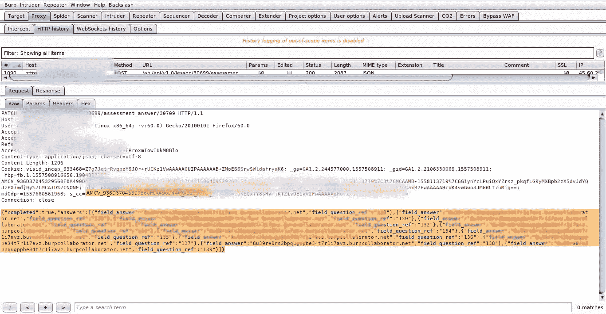
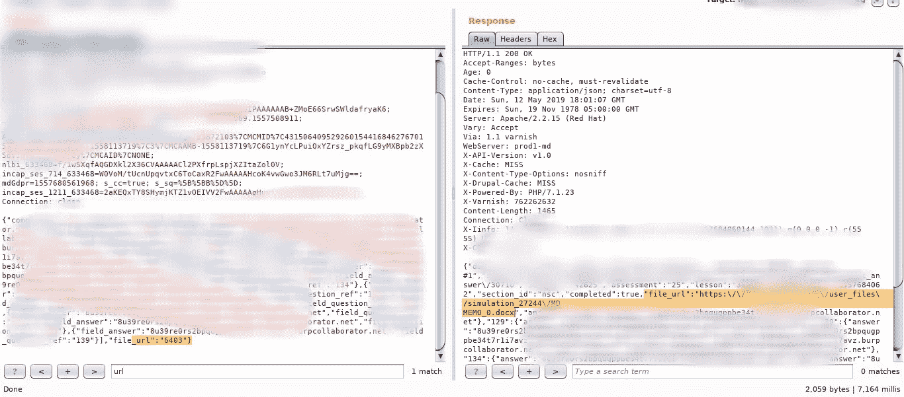

# 伊多的故事-第二部分

> 原文：<https://infosecwriteups.com/stories-of-idor-part-2-29d313a39e55?source=collection_archive---------0----------------------->

你好欢迎回来

在你开始之前，我推荐你阅读一下我以前的博客 中的 [***IDOR***](https://medium.com/bugbountywriteup/stories-of-idor-4966369e6d82)

所以今天我要分享另一个 IDOR 的故事，这个博客中的所有故事都是针对一个网站的，就叫它 xyz.com 吧。

在我们开始之前，让我简单介绍一下这个网站:

这是一个教育平台，主要面向政治/媒体/历史学家学生，它提供了一个分组讨论的平台。世界上几乎所有的著名大学都在使用这个平台，为他们的学生服务。

在应用程序中，将有教师(管理员)，谁创建类，可以邀请学生(低特权用户)到门户网站。

他们会有讨论、作业和项目。

到目前为止，您已经对应用程序有了基本的了解。

在应用程序中，有一个选项可以改变学生在课堂讨论/辩论中的角色，改变角色的请求如下所示:

所以有两个参数 26201 `[Class admin ID]`和 224410 `[Student Role ID].`现在这个学生角色 ID 有点奇怪，它与学生 ID 相关联

因此，如果我们能够通过保持 Student_id 参数不变来猜测学生角色 ID，

意思是，假设有一个学生的 *student_id=48990* ，现在通过将这个数字保存在 Student 中，如果我们开始强行使用*学生角色 ID* ，这样我们就能够将该学生从以前的班级移至我们的班级或任何其他班级，这取决于 26201 `[Class admin ID]`。

在这之后，我又找到了另一个 IDOR。

另一个类似的请求跟在这个请求后面。

现在你已经可以猜到，通过改变其他学生的 ID 来改变名字，这样你就可以改变他们的名字。

现在这是最初的请求，但是我想在 ***中添加一些额外的参数*** ，来检查，会得到什么样的响应。

所以在 JSON 参数 *{"first_name":"again "，" last_name":"namechanged"}*

我又加了一个参数 ***【邮箱】***

所以我的请求应该是这样的:

回答是 200 Ok，这意味着我可以改变任何用户的电子邮件，只需猜测他们的 ID。

通过这个我可以简单地接管任何用户帐户。

这个漏洞的影响是，我可以:

1:获得任何学生的详细资料，并改变他们的详细资料，这导致帐户接管

2:可以将任何学生从原来的班级移至任何其他班级

3:我可以从这个应用程序中永久删除用户，只需添加到我的帐户并从我的帐户中删除即可。

对于这两份报告，我的第一份报告获得了 1500 美元，账户接管获得了 2150 美元。

我也发现了一些其他有趣的 IDOR 问题。

学生可以在作业部分向老师提交作业，提交请求如下:

现在，如果你看到参数 *file_url，它有数值*

因此，如果我们更改这些数字，现在我可以将任何其他学生的文件上传到我的评估工具，我可以访问其他用户的文件。

反应

我向他们报告，他们通过删除这个参数来修补它。

所以经过 4 个月的修补，我开始检查我的旧报告，并试图绕过它。

现在，对于与上面相同的请求，它看起来像

现在，如果你注意到没有*文件 url 参数。*

回应看起来像这样:

如果你观察，有参数存在 ***【文件 _url】:空***

但是它没有出现在请求中，所以我试着像这样在请求中附加这个参数，剩下的就是历史了..！！

反应

我又一次绕过了它。

暂时就这样了。

整个故事是:

***总是寻找响应寻找隐藏参数***

> ***时间线:***

1.  报告发送
2.  打补丁
3.  奖金已发放

如果你喜欢它，请随意 ***转发*** 它。

有钱人可以在这里捐赠😄

再见..！！

*关注* [*Infosec 报道*](https://medium.com/bugbountywriteup) *获取更多此类精彩报道。*

 [## 信息安全报道

### 收集了世界上最好的黑客的文章，主题从 bug 奖金和 CTF 到 vulnhub…

medium.com](https://medium.com/bugbountywriteup)