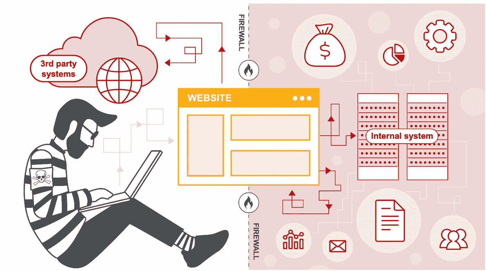
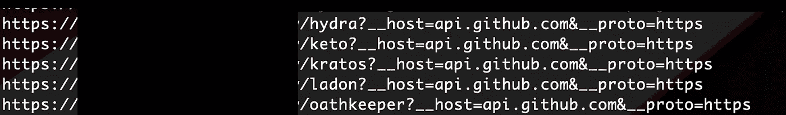
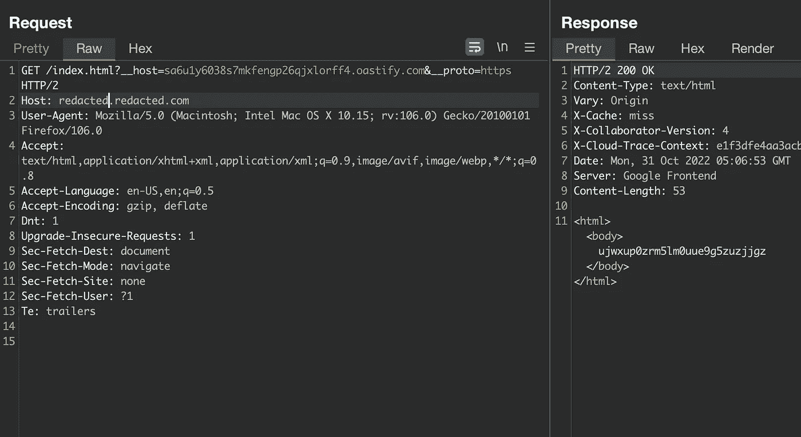
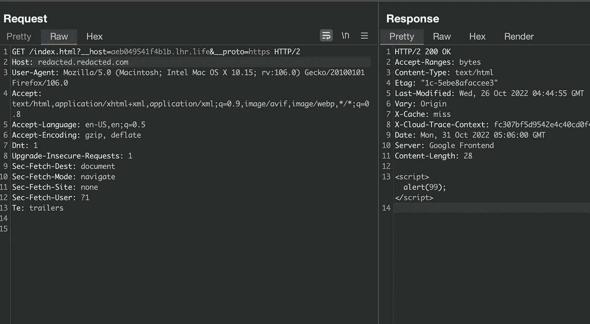
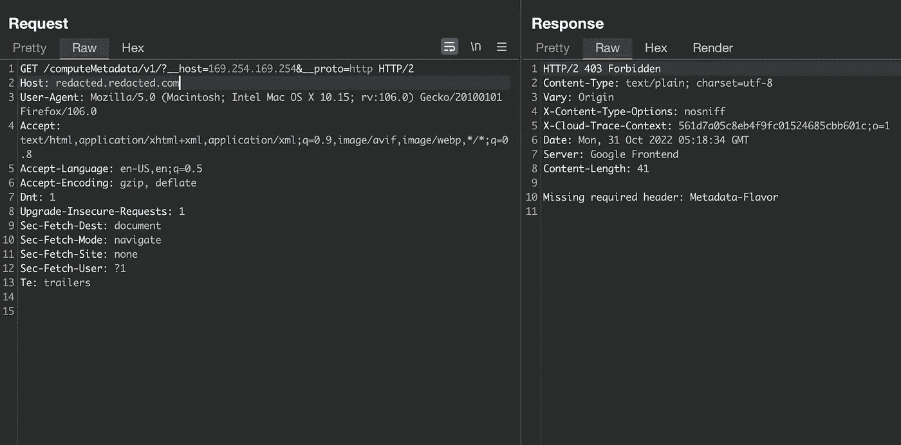
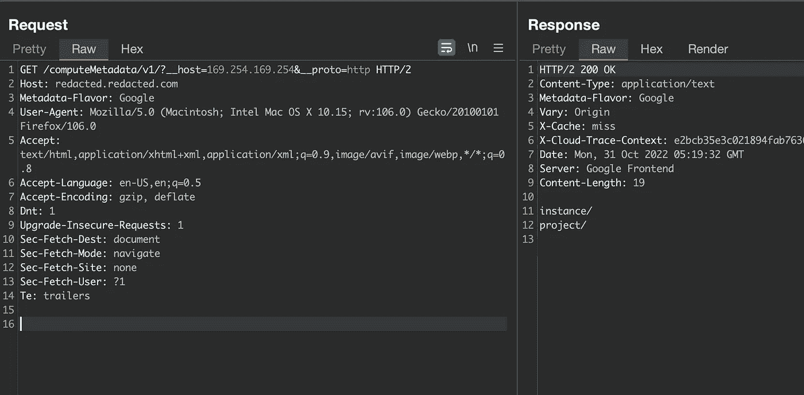
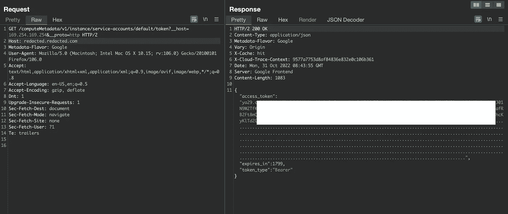
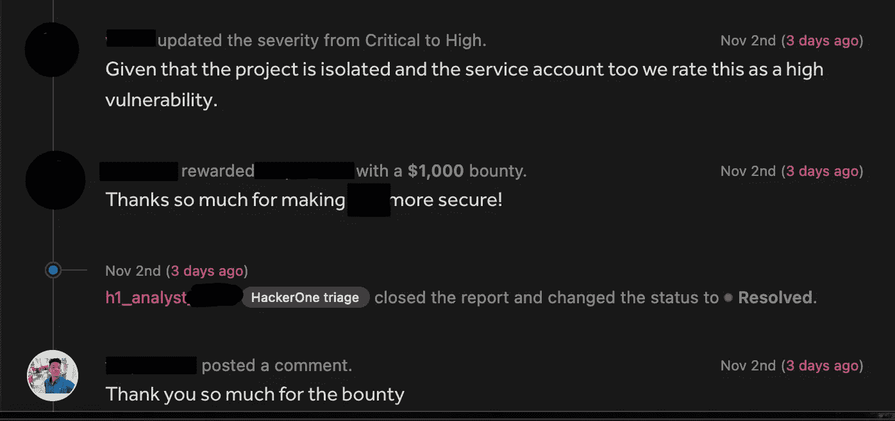

# 一千美元赏金的故事——SSRF 泄露访问令牌和其他敏感信息

> 原文：<https://infosecwriteups.com/story-of-a-1k-bounty-ssrf-d5c4868680f5?source=collection_archive---------0----------------------->



大家好，欢迎来到我的故事，我是如何利用泄露谷歌云访问令牌和其他敏感数据的 SSRF 在 HackerOne 上获得第一笔奖金的，在继续之前，我想感谢这个可爱的社区，它在我的整个旅程中帮助了我。

我从我的黑客的私人邀请列表中选择了目标，因此我不能透露目标，所以我将称它为 redacted.com。我从 recon 开始，我创建了一个自动化工具来完成我的 recon 过程，如收集子域名、获取活动主机、运行 nuclei、目录暴力、nmap 和获取 waybackurls 等。在我的自动化完成后，我分析了所有的数据，比如 waybackurls 和其他数据。

waybackurls 似乎很有趣，所以我很快使用 gf 模式来获取所有可能易受攻击的 ssrf 端点

```
cat waybackurl | gf ssrf
```



由于 __host 字段从 github 获取某种数据，我尝试测试 ssrf，所以我很快打开了我的 Burpsuite，将 burp collaborator 链接放入 __host 字段并发送请求，我单击了 poll now 按钮，是的，我得到了 HTTP 交互，burp collaborator 响应反映在屏幕上。



我试着用 XSS 启动了一个 Apache 服务器并上传了 alert JavaScript 有效载荷



但是我停止了，因为 XSS 不会如此有影响力，并开始寻找 ssrf，在 __host 参数中我放入了 169.254.169.254，在 url 中我添加了*/latest/meta-data/iam/security-credentials/*

```
https://redacted.redacted.com/latest/meta-data/iam/security-credentials/?__host=169.254.169.254&__proto=https
```

并发送了请求。但是它返回了 **502 错误网关**然后我将 __proto 值改为 http，但是它也不工作。

然后，我想到为什么不尝试其他端点，如谷歌，数字海洋一号的，我得到了一个 pdf 的帮助，其中有我将提供的所有 ssrf 端点，最后谷歌云端点给出了一个响应，而不是 502。

该响应包含

```
Missing required header: Metadata-Flavour
```



所以我很快添加了这个标题，并将它的值设置为 Google(得到了 pdf 的帮助),然后发送请求，然后 *yesss！！它确实起作用了*



然后，我尝试使用

```
GET /computeMetadata/v1/instance/service-accounts/default/token?__host=169.254.169.254&__proto=http
```

我尖叫着哇！！我明白了，SSRF 做到了:)



我尝试并得到了其他细节，如范围，电子邮件，地区和 id 等。

## 报告

我向所有的 POC 报告了这个漏洞，等到第二天，他们回复了&承认这是一个很酷的发现，并奖励我 1000 美元奖金



> PDF:[SSRF.pdf](https://github.com/faiqu3/ssrf/blob/main/SSRF.pdf)

谢谢你们读到这里，我希望你们能从这篇文章中学到一些新的东西。如果你喜欢，请鼓掌并跟我来:

## 推特:[https://twitter.com/imfaiqu3](https://twitter.com/imfaiqu3)

## insta gram:[https://www.instagram.com/faique.exe](https://www.instagram.com/faique.exe)

## 领英:[https://www.linkedin.com/in/faiqu3/](https://www.linkedin.com/in/faiqu3/)

## 来自 Infosec 的报道:Infosec 每天都有很多内容，很难跟上。[加入我们的每周简讯](https://weekly.infosecwriteups.com/)以 5 篇文章、4 个线程、3 个视频、2 个 GitHub Repos 和工具以及 1 个工作提醒的形式免费获取所有最新的 Infosec 趋势！