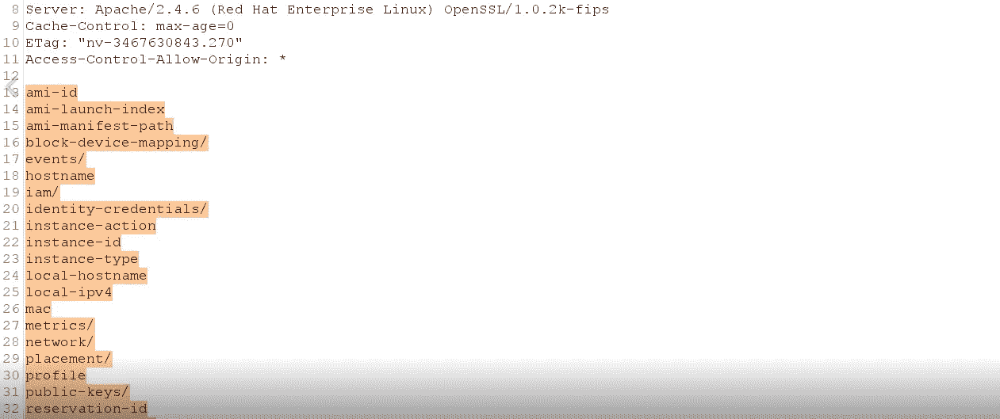
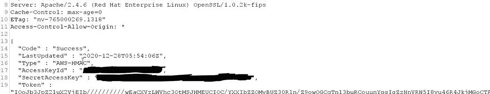

# 一个非常酷的 SSRF 臭虫的故事。

> 原文：<https://infosecwriteups.com/story-of-a-really-cool-ssrf-bug-cf88a3800efc?source=collection_archive---------0----------------------->

大家好！我叫韦丹特，也叫贝吉塔(在[推特](https://twitter.com/_justYnot))。我是网络安全爱好者，也是 bug 赏金猎人。这是我第一次写 2021。这篇文章是关于一个 [SSRF](https://portswigger.net/web-security/ssrf) 的漏洞，这个漏洞允许我访问目标公司的 AWS 元数据。所以让我们开始吧，

## 关于目标的一些信息

目标 web 应用程序就像一个具有许多功能的社交媒体平台。让我们假设它是 www.target.com

## 发现:-

由于目标有很多功能，我决定先测试主要的 web 应用程序，而不是做任何侦察。所以我启动了 burp suite，将目标添加到 scope 中，并开始抓取 web 应用程序。当蜘蛛运行时，我开始测试网络应用的不同功能。我试图找到不同的漏洞，如 XSS，IDORs，SQLi，速率限制攻击，业务逻辑错误等。大约两个小时，但没有运气:(

我正准备放弃这个目标，然后突然想起我开始蜘蛛网络应用程序，所以我去了打嗝的目标标签，有许多网页抓取和许多新的参数。然后，我开始搜索有趣的参数，大约 5 分钟后，我收到了以下请求

*GET /proxy/proxy.php？url=some_URL*

看到这个请求后，我立即启动了 burp collaborator，生成了一个有效负载，并将其输入到 url=参数中，然后发送了这个请求。我在 burp collaborator 中收到了带有 DNS 和 HTTP 请求的回调请求。此时我真的很开心。

然后我尝试访问 localhost(127.0.0.1)和/etc/passwd 文件，但是这次我没有得到任何响应。因此，我复制了从 burp 合作者那里获得的 IP，并对其使用了 Whois 和 dig 命令，并了解到该 IP 属于目标公司的 AWS 实例。所以这次我尝试访问 IP 169.254.169.254，它在 Amazon EC2 和其他云计算平台中用于向云实例分发元数据。所以我提出了以下要求

GET /proxy/proxy.php？url= `*http://169.254.169.254/latest/meta-data*`

得到了如下的回应:-

之后，我尝试访问 AWS 秘密访问密钥，以显示 SSRF 的影响，并提出以下请求:-

GET /proxy/proxy.php？url= `*http://169.254.169.254/latest/meta-data/identity-credentials/ec2/security-credentials/ec2-instance/*`

并在响应中获得了 AWS 秘密访问密钥！我对这个发现非常高兴！

SSRF 到 AWS-元数据访问。

然后我很快写了一份很好的报告并发送给公司，他们在 2 天内修复了这个漏洞。不幸的是，我没有因此得到任何奖励，因为目标公司有一个负责任的披露计划，但不管怎样，我从这个漏洞中学到了很多新东西，我希望你也能学到一些新东西:)

如果你对这篇报道有任何疑问，你可以通过这里的联系我[。](https://twitter.com/_justYnot)

我希望你们都喜欢阅读这篇文章。下次见，再见，黑客快乐！