# 一只奇怪的 CSRF 虫子的故事

> 原文：<https://infosecwriteups.com/story-of-a-weird-csrf-bug-bde1129c106e?source=collection_archive---------1----------------------->

嘿，大家好，

几个月前，我发现一个上传端点容易受到 csrf 的攻击，但是当我开始为它创建 poc 时。我意识到这并不像看起来那么简单。

这是一个**黑客程序**,我向他们要求披露许可，但没有得到任何回应，所以我将把目标称为 redacted.com

关于该应用程序的一些细节，这是一个投标网站，用户需要上传验证文件，如(*驾驶执照，护照等*)以访问该网站的投标部分。

在验证文档上传端点中对此进行了更深入的研究，我注意到它只能提交一次，这意味着一旦您上传了文档，您就不能再对其进行任何更改。然后由工作人员进行人工验证。

这是用户上传验证文档时提出的请求:

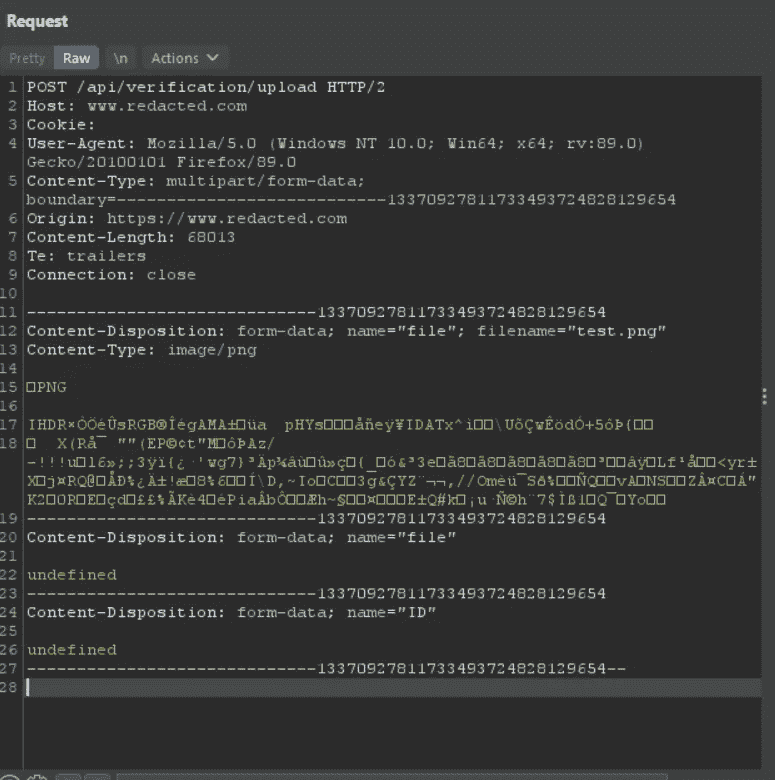

这听起来很耳熟，对吗？

这个请求中没有`csrf token`，这意味着它可能容易受到 csrf 的攻击。我很快使用 fetch 方法为它创建了一个 csrf poc。

当我在浏览器中打开这个 html 文件时，请求的响应是 ***403 禁止*** 。

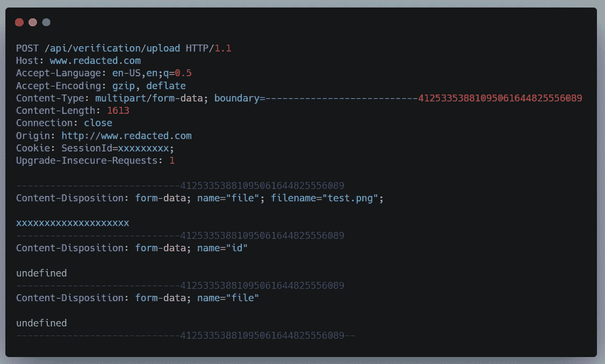

后来我意识到这是因为原产地检查。在请求截图中，您可以看到 Origin 头值设置为`[https://www.redacted.com](https://www.redacted.com,)`，假设我的 csrf poc url 托管在 attacker.com 域上。

例如`[https://www.attacker.com/csrf.html](http://www.attacker.com/csrf.html)`,那么当发出获取请求时，原始报头值应该是`[https://www.attacker.com](http://www.attacker.com/csrf.html)`。

由于`[https://www.attacker.com](http://www.attacker.com/csrf.html)`与`[https://www.redacted.com](https://www.redacted.com,)`不匹配，所以 ***原点检查*** 失败，这也是服务器返回 ***403 禁止错误*** 的原因。

然后在*原点头*里尝试了一些类似`redacted.commxyz`、`redacted.com.xyz`、`xyz.redacted.com`的变体，但是都不行。有时开发人员会在*正则表达式*中犯一些错误，比如他们忘记对点字符进行转义，等等。在这些情况下，可以通过使用这样的变化来绕过它。

然后我从请求中完全删除了 *Origin* 头，并转发请求，注意到它工作了***200 ok response***，文件成功上传。

如果请求中没有 *Origin* header，应用程序不会对其进行验证，这类似于存在***Referer***check 的情况，因此您使用了内容属性设置为`no-referrer`的 meta 标记

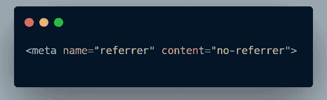

所以我开始寻找是否有什么方法可以让我在请求中不发送 *Origin* 报头的情况下发出请求。我发现了这条微博

当我尝试这样做时，它成功了。发送的请求没有*源*报头。但是只有当我在一个带有*数据*协议的 *iframe* 中使用 ***表单*方法**时，才会起作用，在 *fetch* 和其他类似的相关方法的情况下，总是会发送 *Origin* 头。

我们克服了一个问题，那就是*原点*割台，现在还有一个问题要处理。由于我们受困于 ***表单*** 方法，我们实际上无法实现无交互的 csrf poc。

如果您再次查看易受攻击的请求:

看第 12 行，有一个*文件名*参数，然后我们有*图像*数据。问题是我们实际上不能在 csrf poc 中自己包含*文件名*参数和图像数据。

因为它们仅在使用*文件上传输入*时包含。你可以阅读这篇文章了解更多信息:

 [## 这就是，上传 CSRF 的文件

### 编辑描述

aetherlab.net](http://aetherlab.net/2013/04/here-it-is-the-file-upload-csrf/) 

当前的概念验证与此类似:

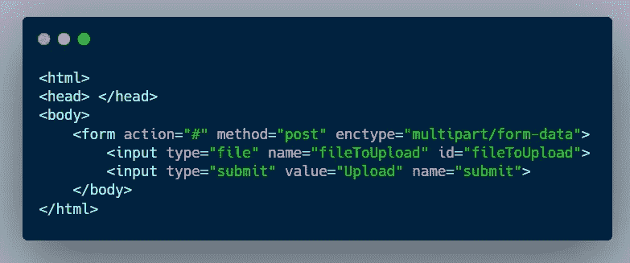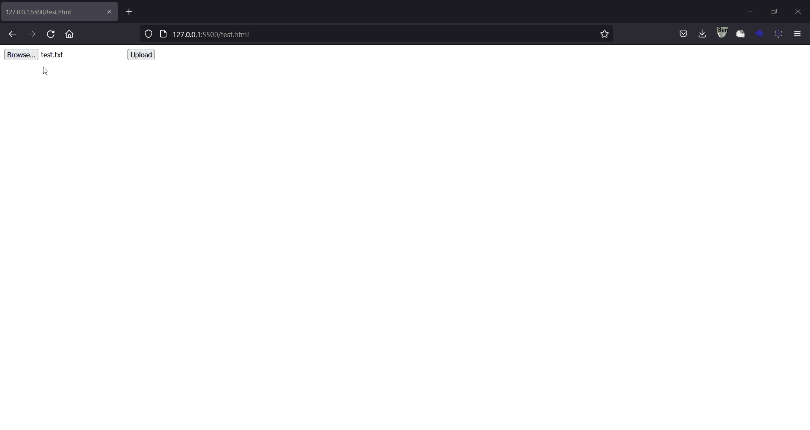

正如你在这张 gif 中看到的，要利用这个 *csrf 漏洞*，我们必须告诉受害者点击上传按钮，然后从他们的系统中选择一个文件。

由于需要用户交互，这使得受害者按照我们的要求上传文件变得非常不现实。

这时，我想起看了一个 **Liveoverflow** 的视频，他在视频中谈到了在 10 万美元黑客奖比赛期间在谷歌云平台(GCP)发现的漏洞。

请确保在继续之前完整地观看这段视频，因为 **Liveoverflow** 已经在这里做了很好的解释:

在此事件中提交的一个错误是:

 [## [GCP]在谷歌云外壳编辑器中上传 CSRF 的文件

### 谷歌云壳是一个谷歌云平台的交互式外壳环境，使学习和实验…

obmiblog.blogspot.com](https://obmiblog.blogspot.com/2019/12/gcp-5k-file-uploading-csrf.html?m=1) 

在这篇博客中，研究人员 [@obmihail](https://bughunter.withgoogle.com/profile/40997bbc-945a-4eca-8408-eed302641c96) 连同 *csrf bug* 细节，也分享了关于在*多部分请求解析*中发现的一个 bug 的细节，该 bug 允许他上传任何带有自己内容的文件，这在 html 表单中是不可能的。

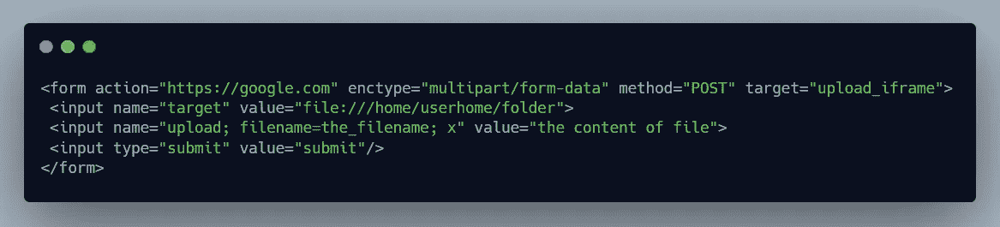

提交上述表格后，将发送以下请求正文:

```
-----------------------------37419614939920406503637463242
Content-Disposition: form-data; name="target"file:///home/userhome/folder
-----------------------------37419614939920406503637463242
Content-Disposition: form-data; name="upload; filename=the_filename; x"the content of file
-----------------------------37419614939920406503637463242--
```

使用这个多部分请求解析 bug，我可以很容易地克服我之前提到的问题，因为我现在可以完全控制文件内容:

`>To exploit this csrf vulnerability we have to tell the victim to click on the upload button, and then choose a file from their system.`

我现在可以在没有任何用户交互的情况下执行 csrf 攻击。

这是最终的 CSRF 概念验证:

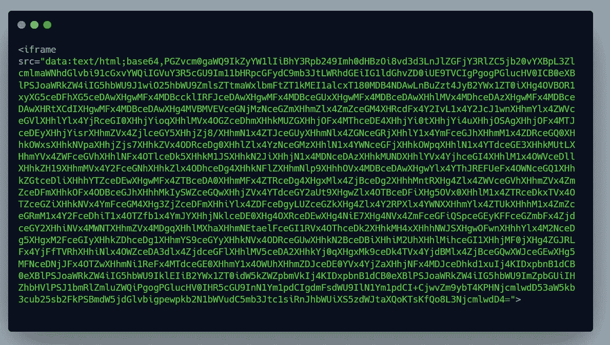

Based64 解码部分

更侧重于名称属性:`name=’\”;name=file;filename=d0B5jW1O_400x400.png;x’`，这个技巧允许我上传任何伪造的文件，而不依赖于受害者上传任何文件，一个图像文件自动得到上传，无需任何用户交互

我在验证了最终的概念验证确实有效并被标记为重复后提交了报告:(

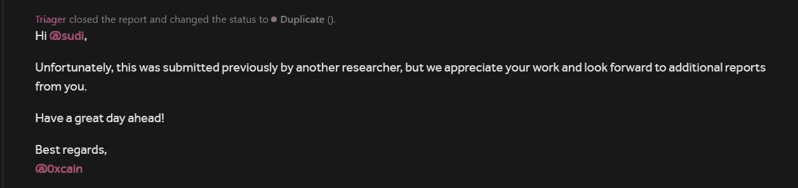

我被邀请参加该报告，所以我研究了一下，发现有人已经报告了这个问题，但他无法在没有用户交互的情况下提供 csrf poc，而且为了克服`Origin`验证，他演示了一个仅在 Mozilla Firefox 的非常低版本中工作的 poc，同时它要求受害者上传一个文档以使 poc 工作。他的报告以信息量大而告终，因为它需要太多的用户交互。

但是我的 poc 不需要任何用户交互，也能在最新版本的 Firefox 中工作。我向*评审员*解释了我的报告与*原始报告*的不同之处

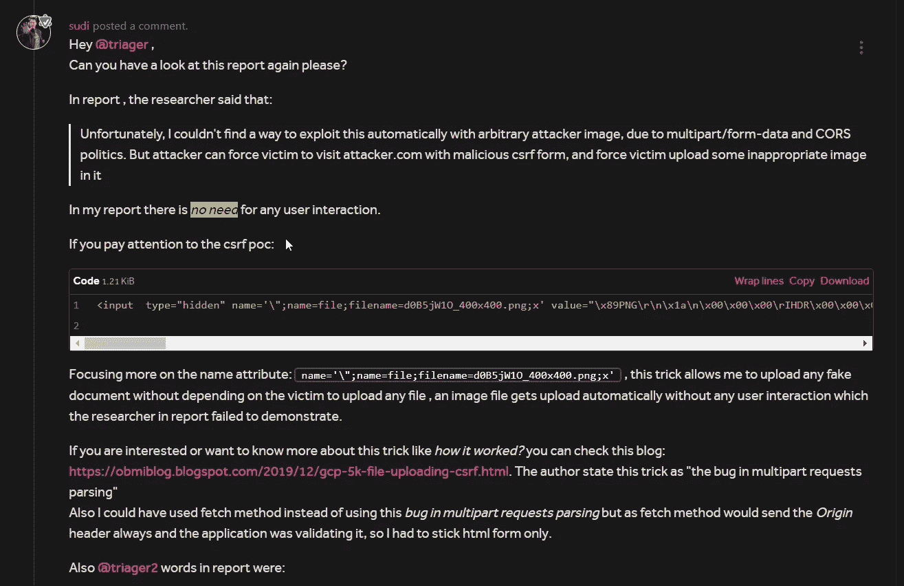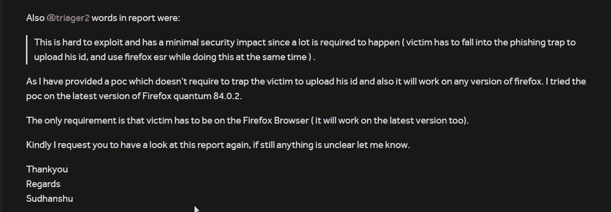

那段时间 ***火狐 84.0.2*** 是最新版本。然后，评审员将报告细节转发给团队

团队承认了这个问题，并发现它确实不同于重复的报告，该报告被分类并奖励为一个`Medium`严重性错误，这将允许我代表用户提交虚假的验证文档。

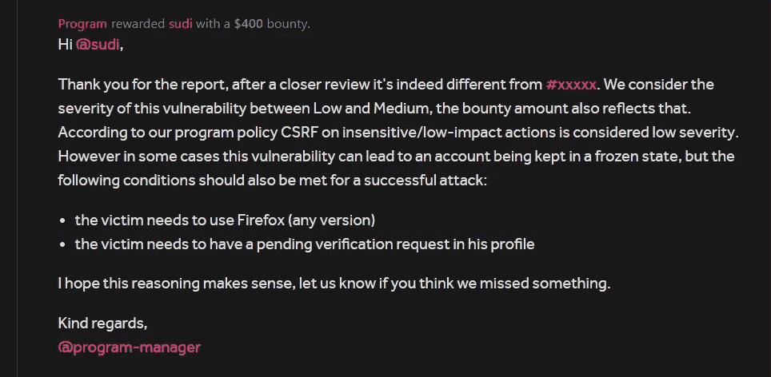

由于验证文件只能提交一次，由于伪造的文件，受害者的帐户将不会得到验证。他必须创造一个新的。攻击面仅限于 Firefox 用户和新创建的 acc，他们没有提交任何验证文件，这就是为什么严重性被降低到`Medium`。

在创建 poc 的过程中，我学到了很多东西，因此这对我来说是一个双赢的局面。

我将在今年年底发表另一篇文章，敬请关注:)

大家好