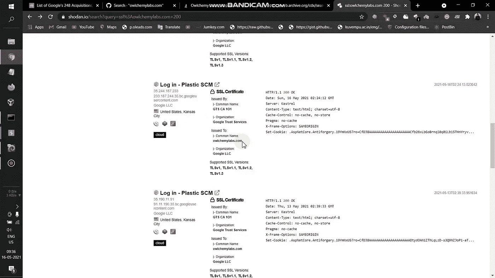
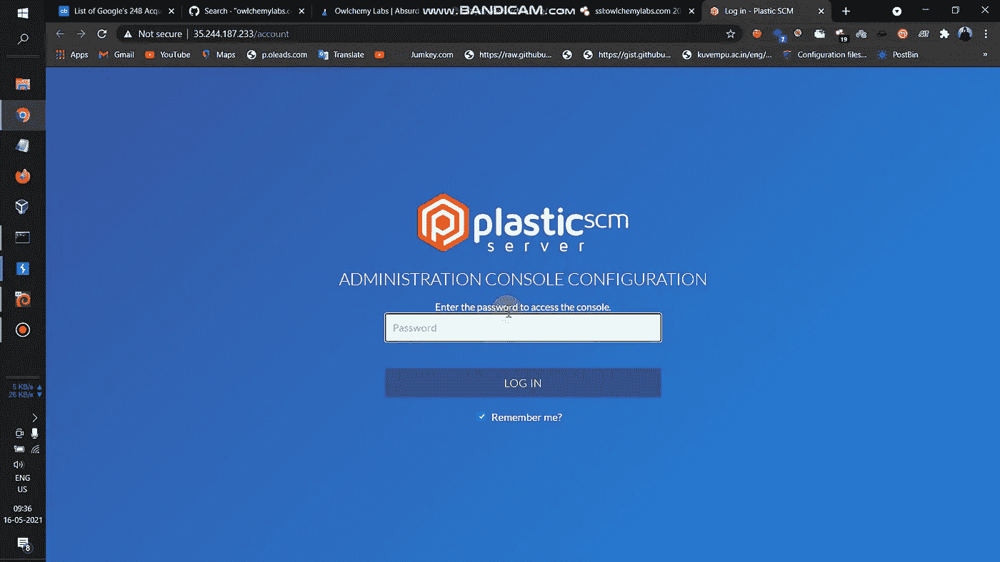
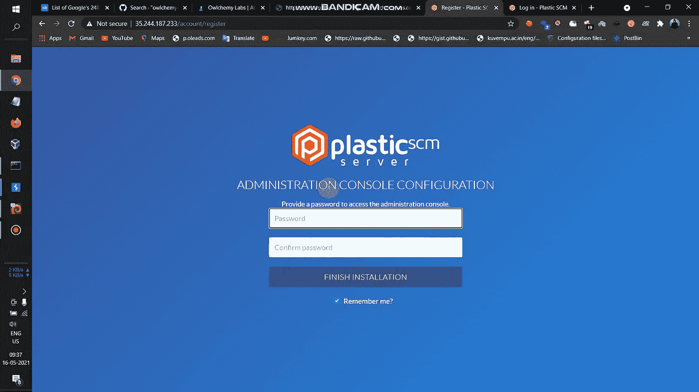
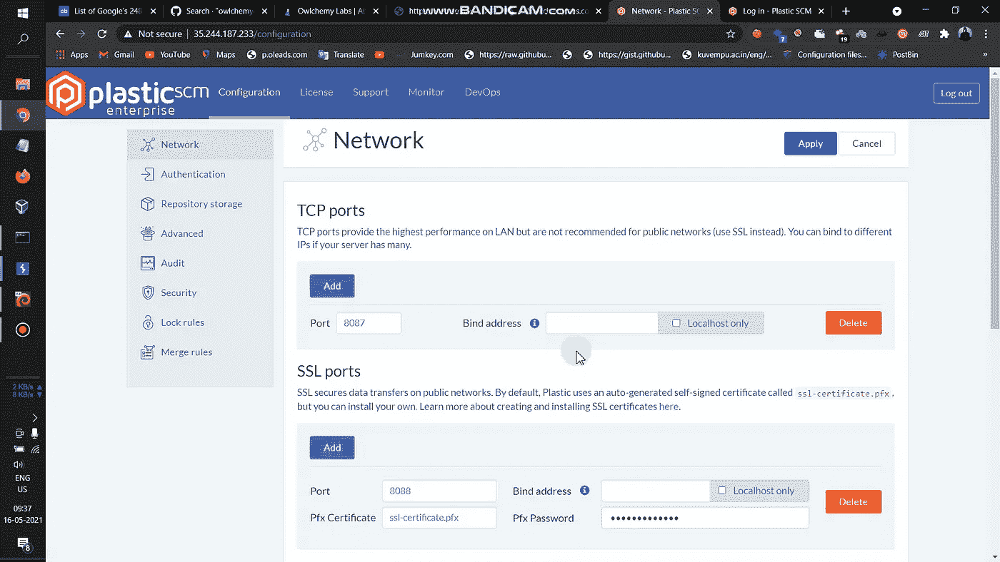
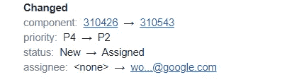
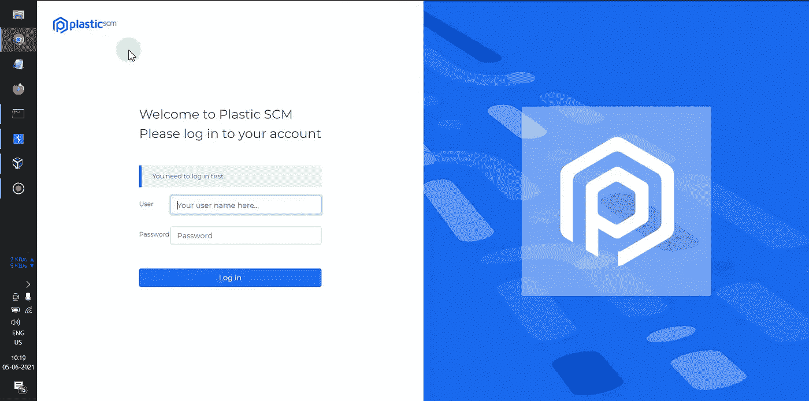
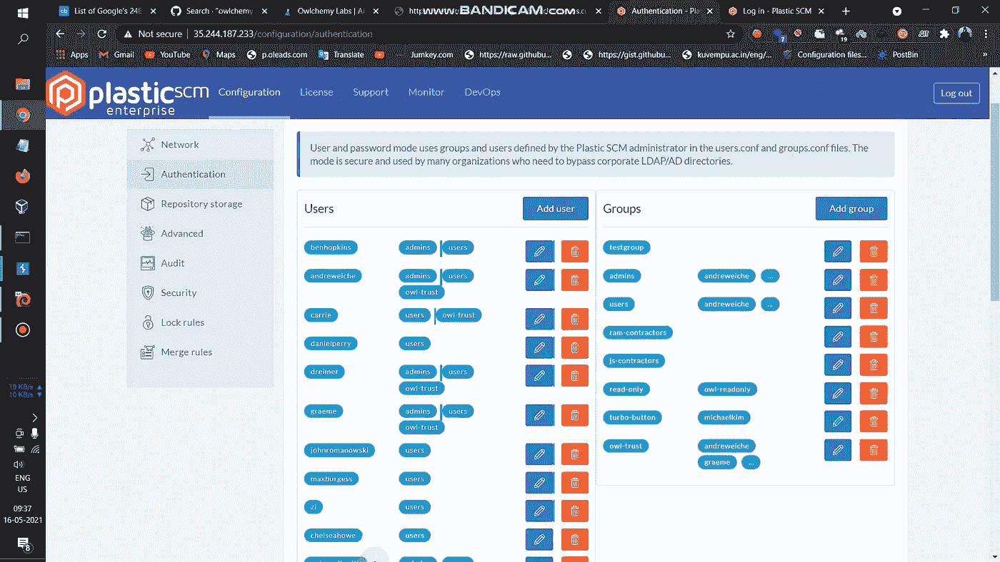
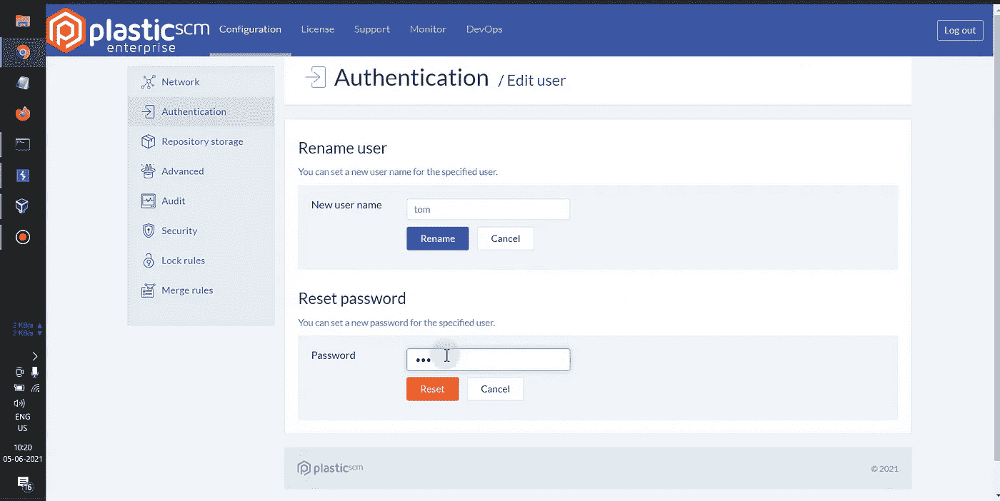
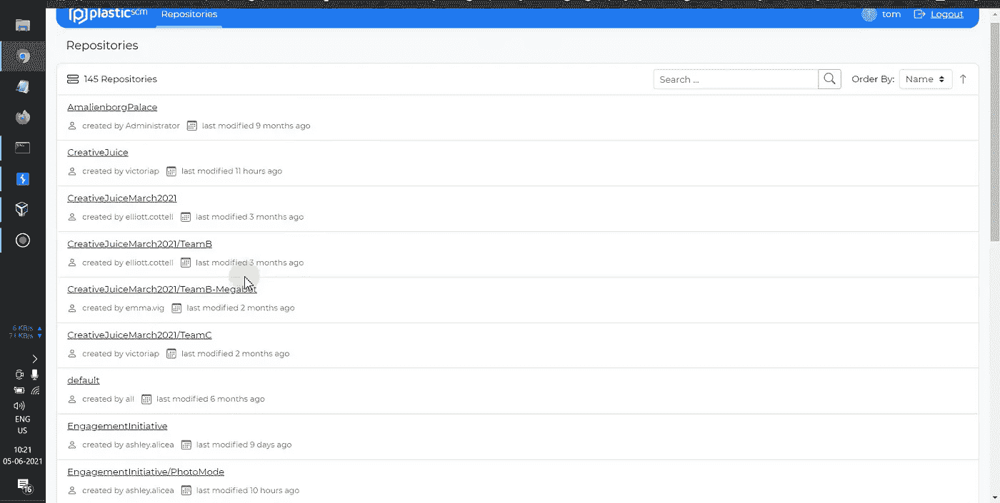
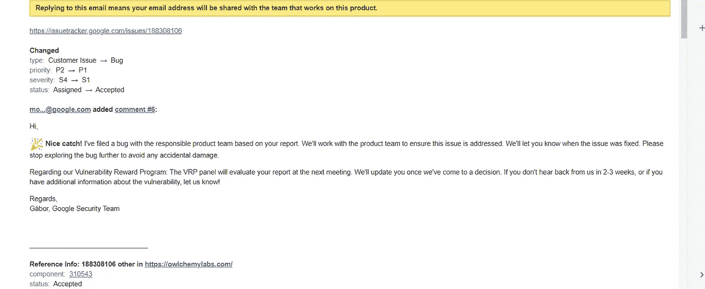

# 谷歌名人堂的故事和价值$$$$的私人计划奖金

> 原文：<https://infosecwriteups.com/story-of-google-hall-of-fame-and-private-program-bounty-worth-53559a95c468?source=collection_archive---------0----------------------->

您好 Infosec 社区我自己 Basavaraj，这是我的第二篇文章，第一篇是关于黑客骗子([点击这里阅读](https://basu-banakar.medium.com/how-i-hacked-scammers-with-whole-windows-server-takeover-by-rdp-42f95b05387f))，我看到许多人从 google vrp 获得名人堂和奖金， 我想我为什么要尝试并成功地得到 4 个副本(任何阅读这篇文章的初学者在你得到 dups 时不要改变你的想法，因为这对每个人来说都是常见的)，并开始寻找一个叫做 owl chemylabs 的[收购](https://en.wikipedia.org/wiki/List_of_mergers_and_acquisitions_by_Alphabet)(注意:如果你开始将收购作为目标，请首先检查它是否被谷歌出售，因为你将首先获得收购的信息，而不是出售，如果被出售，那么它不是谷歌收购)。

我不会在狩猎时进行任何侦察自动化，我会手动检查一切，留下子域枚举和模糊化，首先枚举所有活动子域，并开始逐个查找，一天浪费了，没有得到任何东西，第二天在 shodan 我找到了一个属于 owlchemylabs 示例搜索查询 ssl:target.com 200 的目标

得到了两个 2 目标有一个标题塑料供应链管理登录页面，现在打开了一个链接

塑料单片机:【https://en.wikipedia.org/wiki/Plastic_SCM 

现在我有了这个登录面板，现在我尝试了每个 bug 猎人都尝试过的方法(检查默认凭证、js 文件、sqli 等)，但一无所获，但注意到一件事，即当我添加任何密码并点击登录时，url 更改为[https://35.244.187.233/account/login](https://35.244.187.233/account/login)然后我删除 URL 中的登录并添加注册，即[https://35.244.187.233/account/register](https://35.244.187.233/account/register)Boooom 得到一个密码重置页面(该页面出现在他们成功配置 Plastic SCM 服务器时，最后一步是设置密码)

我将密码设置为 admin，并成功登录到服务器。

我得到了 SSL Pfx 密码和 mysql 密码，并且能够添加和删除用户。我很快做了一个概念验证，并向谷歌报告

我试图增加影响，但那天什么也没有得到，三天后我也没有得到谷歌的任何回复，bug 也没有被接受，我也对这份报告感到担心。现在，我再次开始侦察该目标，在对该目标进行了 3 个小时的研究后，我遇到了一个拥有私有存储库代码的端点[https://35.244.187.233/webui/repos](https://35.244.187.233/webui/repos)，在转到该端点后，我得到了另一个登录页面

现在，我尝试以管理员身份登录，因为我知道管理员密码，但登录失败，尝试默认凭据和 sqli 和强制登录页面，这也失败了，然后我记得我以管理员身份登录时遇到了服务器上的一些用户

现在猜猜看，我已经让一个拥有管理员权限的用户更改了密码，因为我是管理员。

又一次去了 https://35.244.187.233/webui/repos 的，这次我用了最近换过的用户名和密码，试着登录，猜猜怎么着？

成功登录到拥有 145 个库的私有代码库，现在突然添加了这个评论，并在一个小时内得到了 google vrp 的回复

现在我感到非常高兴，这是一项我得到了$美元奖励的收购

现在，我考虑如何使用相同的产品来获得目标。现在，我制作了一个 shodan 搜索查询，即标题:“Plastic SCM”(现在不要搜索，因为没有要报告的目标😂 **)** 得到了两个属于同一个目标的 URL，他们也很脆弱，他们也有 bug bounty 程序，我报告了他们，他们给了他们程序的私人邀请， 他们说要报告，但他们只有有限的范围，这两个网址超出了范围，这是一个关键的漏洞，所以他们标记为 P1 和等待赏金。

这个故事的寓意是:如果你有任何低级别的问题，请尽可能多花些时间在这个 bug 上，以增加影响。

谷歌报道时间表

报道:2021 年 5 月 16 日

接受日期:2021 年 5 月 20 日

奖励时间:2021 年 5 月 25 日

固定日期:2021 年 6 月 7 日

跟我来。

推特:[https://twitter.com/basu_banakar](https://twitter.com/basu_banakar)

insta gram:[https://www.instagram.com/basu_banakar/](https://www.instagram.com/basu_banakar/)

网址:[https://www.basubanakar.com/](https://www.basubanakar.com/)