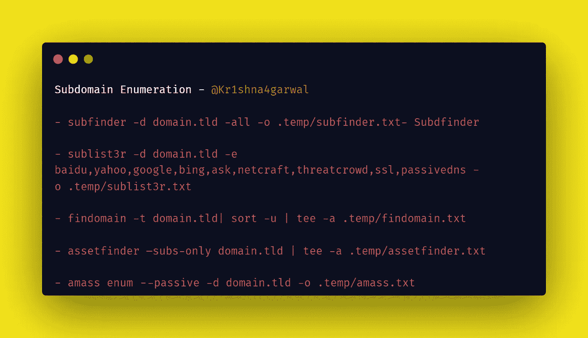
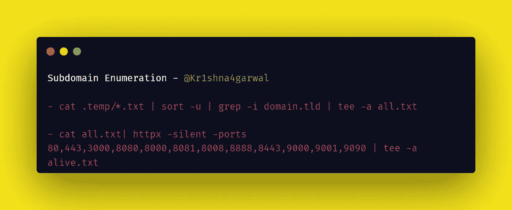
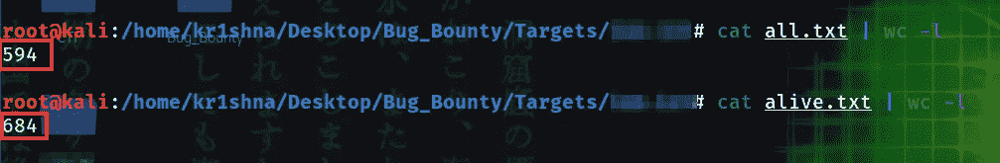
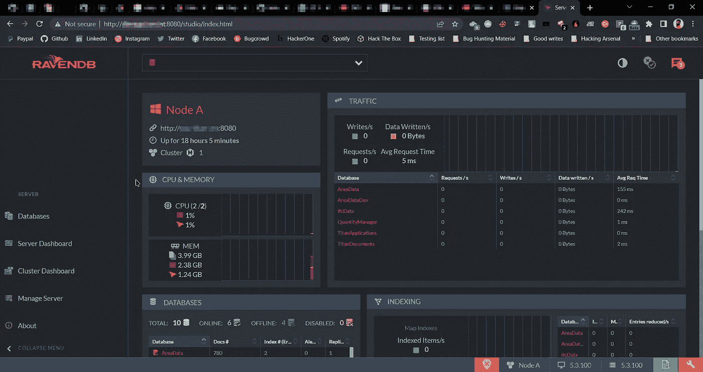
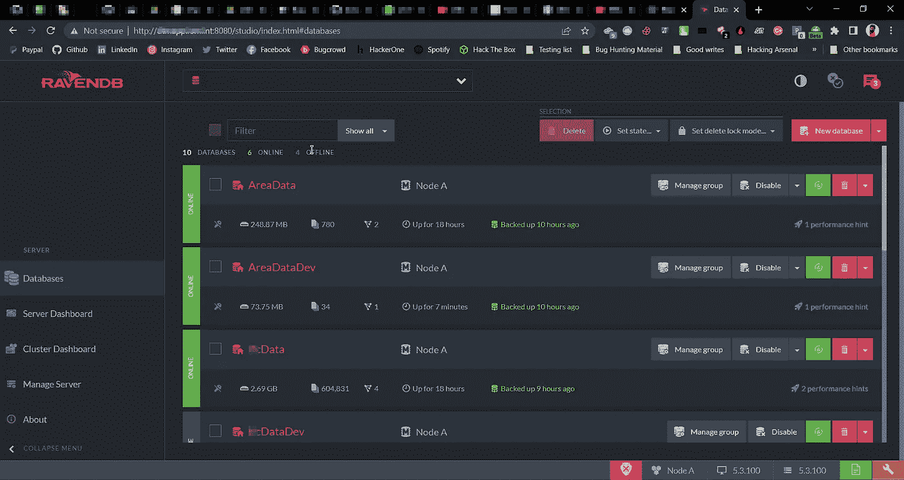
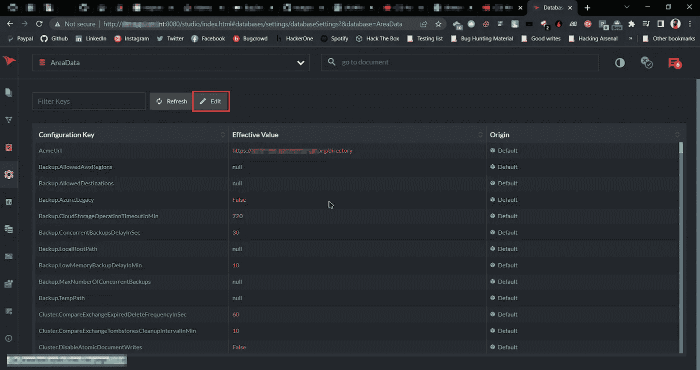

# 好事需要时间|我的第一个“有效的”关键错误的故事！

> 原文：<https://infosecwriteups.com/story-of-my-first-valid-critical-bug-22029115f8d7?source=collection_archive---------0----------------------->

大家好，我是来自印度🇮🇳.的克里希纳·阿加瓦尔一个普通的漏洞猎人和所谓的安全研究员:)

让我告诉你我是如何在一个漏洞披露项目中发现我的第一个“有效的”有趣的关键漏洞的。我希望你能从这篇文章中学到一些新东西:)

var d*omain . TLD = target.com*

有一天，我在搜索一个公开的漏洞披露项目，他们为有效的提交提供了名人堂。这是一个中等范围的目标(*.domain.tld)。所以我为 recon 开始了我的私人 recon 脚本(在这篇文章中我只提到了其中的 5%)。

**命令(摘自我的私人侦察脚本):**

注意:Medium 在一行中打印双连字符(—)，所以不要混淆，它是双连字符。

> sub finder-d domain . TLD-all-o . temp/sub finder . txt
> 
> sublist3r -d domain.tld -e 百度、雅虎、谷歌、必应、ask、netcraft、threatcrowd、ssl、passived ns-o . temp/sublist 3r . txt
> 
> find domain-t domain . TLD | sort-u | tee-a . temp/find domain . txt
> 
> asset finder–subs-only domain . TLD | tee-a . temp/asset finder . txt
> 
> amass enum-passive-d domain . TLD-o . temp/amass . txt

有 594 个子域名。

在这之后，我将所有的结果组合起来，并将其传递给 HTTPX

> 猫。temp/*。txt | sort-u | grep-I domain . TLD | tee-a all . txt
> 
> cat all . txt | httpx-silent-ports 80，443，3000，8080，8000，8081，8008，8888，8443，9000，9001，9090 | tee -a alive.txt

在 HTTPX 之后，我总共探测了 684 个子域名。

现在我在后台用我的自定义模板启动了 nuclei，并将所有的子域转移到我的 Burp 代理配置浏览器中(每个窗口 50 个子域)，在访问每个子域时，我发现了许多 403 个子域，为了绕过这些所有被禁止的子域，我在后台启动了 [4-zero-3](https://github.com/Dheerajmadhukar/4-ZERO-3) ，但是运气不好:(

其他 200 个 OK 子域功能较少(没有注册，登录等)，所以我把这些子域留待将来。

如果你注意到，我用 HTTPX 运行端口扫描，我打开了一些 8080、8443、9090 和 8081 端口，所以在检查带有端口的子域(subdomains.domain.tld: <port>)时，我发现其中一个子域非常有趣，因为它在端口 8080 上运行 RAVENDB，没有身份验证:)</port>

## **什么是渡鸦 DB？**

→ *RavenDB 是用 C#编写的开源全酸性面向文档的数据库，由 Hibernating Rhinos Ltd .开发，跨平台，支持 Windows、Linux、Mac OS。RavenDB 将数据存储为 JSON 文档，可以通过主-主复制部署在分布式集群中。*

简而言之:RavenDB 是一个开源的非 SQL 数据库。

因此，当我在浏览器中打开**subdomain . domain . TLD:8080**时，我看到 RavenDB 上没有认证，**我可以更改设置，转储完整的数据库，查看系统配置，删除数据库**(显然我没有权限这么做)。

RavenDB 仪表板

RavenDB 数据库

RavenDB 设置

我迅速创建了一份专业的详细报告，并将其发送给安全团队:)

后来，我得到了一些匿名的 FTP，XSS 和同一目标的一些常见的错误配置。这对我来说已经足够了，所以我不再去寻找那个目标。

更新(2022 年 7 月 19 日上午 12 时 22 分):

## 寻找 RavenDB 的 shod an Dork:-**http . favicon . hash:442225173**

外卖:想加快你的 Nmap 扫描？使用此命令

> nmap 127 . 0 . 0 . 1-sS-sV-Pn-n-最大速率 1000-open-p 21-oN Active _ 21 . txt
> 
> 提示:不要忘记扫描 21，22，3000，8080，8000，8081，8008，8888，8443，9000，9001，9090 这样的常用开放端口。

为任何语法错误道歉。

DM 总是乐于接受问题、帮助、合作和建议:)

做我的朋友:

*   insta gram—[https://www.instagram.com/krishnaAgarwal_in](https://www.instagram.com/krishnaagarwal_in)
*   LinkedIn—[https://www.linkedin.com/in/kr1shna4garwal](https://www.instagram.com/krishnaagarwal_in/)
*   推特—[https://twitter.com/kr1shna4garwal](https://twitter.com/kr1shna4garwal)

感谢您浪费宝贵的时间阅读我的文章；)

如果你发现这很有价值，并且浪费了你 5 分钟的时间来阅读这篇文章，那么请鼓掌👏，点击“关注”按钮以获取未来的文章，并与您的 infosec 朋友和社区分享。

继续黑，继续学！

*下线！*

*来自 Infosec 的报道:Infosec 上每天都会出现很多难以跟上的内容。加入我们的每周简讯，以 5 篇文章、4 个线程、3 个视频、2 个 Github Repos 和工具以及 1 个工作提醒的形式免费获取所有最新的 Infosec 趋势！*[*https://weekly.infosecwriteups.com/*](https://weekly.infosecwriteups.com/)