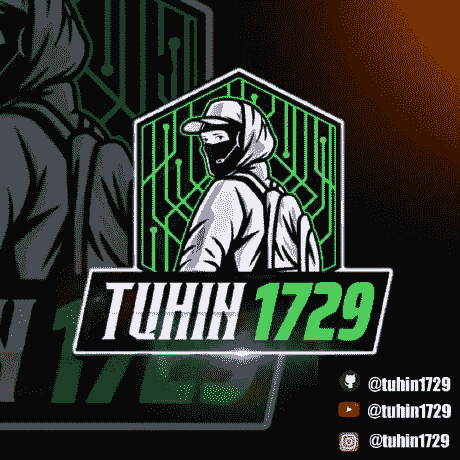
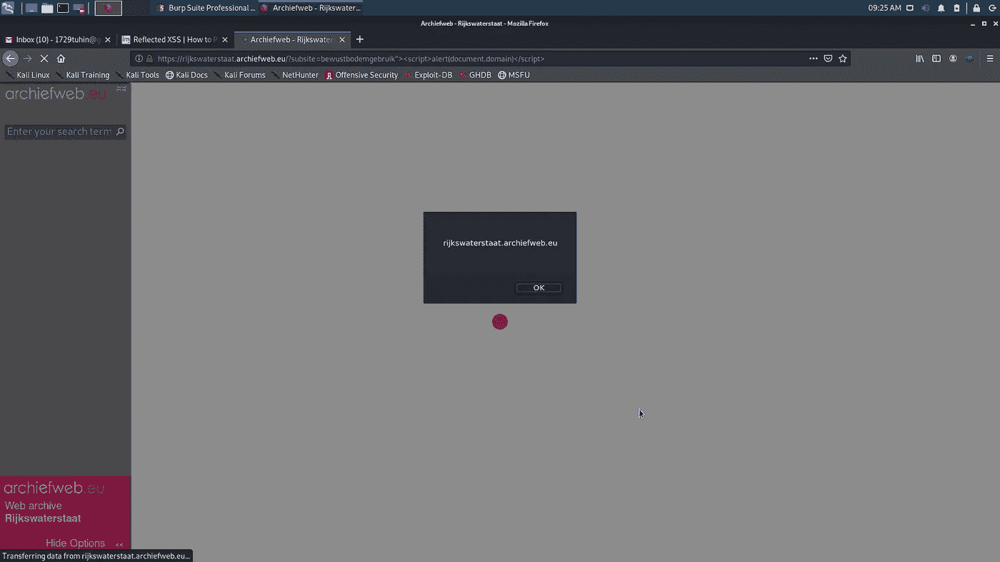
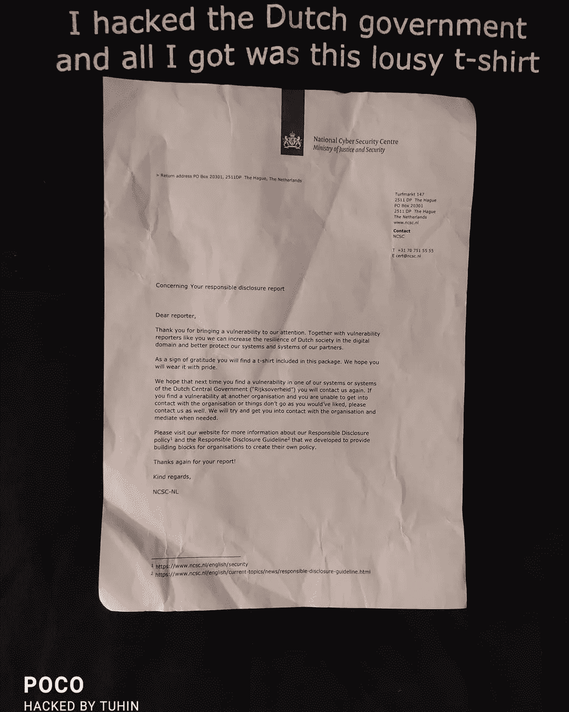

# 我黑荷兰政府的故事

> 原文：<https://infosecwriteups.com/story-of-my-hacking-dutch-government-46b7a3c8b75a?source=collection_archive---------2----------------------->

大家好。我叫图欣·博斯( [@tuhin1729](https://instagram.com/tuhin1729) )。我目前在[虚拟网络实验室](https://virtualcyberlabs.com)担任首席技术官。在这篇文章中，我将分享我黑荷兰政府的经历。

所以不浪费时间，让我们开始吧:

tuhin1729

起初，我很困惑，因为范围内有 1000 多个域。但是后来我从列表中随机选择了一个域名，并开始搜索。经过 2-3 天的搜寻，我开始在 https://rijkswaterstaat.archiefweb.eu/的[进行测试](http://rijkswaterstaat.archiefweb.eu/)

在我最初的侦察过程中，我发现了一个参数*子站点。*我使用一个简单的有效负载快速检查了 XSS:><脚本>alert(document . domain)</脚本>

你猜怎么着！有效负载已成功执行。

最终网址:[https://rijkswaterstaat.archiefweb.eu/?subsite = bewustbodemgebruik % 22% 3E % 3c script % 3e alert(document . domain)% 3C/script % 3E](https://rijkswaterstaat.archiefweb.eu/?subsite=bewustbodemgebruik%22%3E%3Cscript%3Ealert(document.domain)%3C/script%3E)

我很快做了一个概念证明，并向他们报告。一个月后，我得到了他们的回复:

**时间线**:

2010 年 10 月 15 日—报告的漏洞

2010 年 10 月 16 日—确认漏洞并通知
组织。

2010 年 12 月 3 日—已解决

2010 年 4 月 12 日—作为荷兰政府 t 恤获得赞赏

21 年 4 月 1 日——T 恤衫送到了我家

后来，我从他们那里得到了 10 多件 t 恤，这真是一次很好的经历:)

在 Twitter 上关注我:@ [tuhin1729](https://twitter.com/tuhin1729_) _

感谢阅读。我希望你喜欢这个博客。