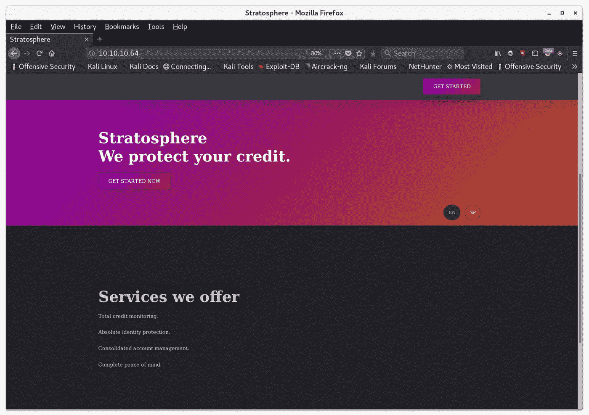
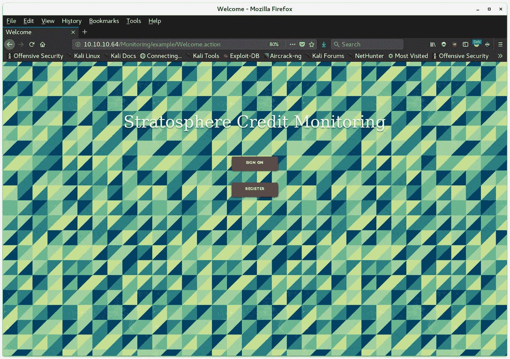

# 平流层—Apache Struts-Shock HackTheBox 演练

> 原文：<https://infosecwriteups.com/stratosphere-an-apache-struts-shock-hackthebox-walkthrough-daa6282c8eed?source=collection_archive---------0----------------------->


# 摘要

同温层是运行 web 服务器的 Linux 主机，易受 CVE 2017–5638:Apache Struts 2 中的一个严重漏洞的攻击，该漏洞被利用来以低权限用户的身份在系统上远程执行代码。本地枚举返回了用于访问 MySQL 本地实例的凭据。这个数据库包含凭证，这些凭证随后被用来作为拥有执行单个 Python 2 脚本的`sudo`特权的用户 SSH 到机器上。Python 2 的输入净化和库导入功能被利用来获得系统的 root 权限。

# 侦察

我开始使用`nmap`对这台主机进行全端口扫描，并使用一些参数来提高扫描速度:

```
nmap -sT --min-rate 5000 --max-retries 1 -p- 10.10.10.64
```

> `-sT` — TCP 连接扫描
> `--min-rate` —使 nmap 尝试将发送速率保持在或高于指定的每秒数据包数(本例中为每秒 5000 个数据包)
> `--max-retries` —限制重新传输次数
> `-p-` —扫描所有端口；1 到 65535

全端口扫描

它能够在不到 30 秒的时间内扫描每个端口！虽然有噪声，但这种方法对于快速返回不常用的端口非常有用。

随后我又进行了一次扫描，以枚举服务版本并在 3 个开放的端口上运行默认脚本，但是`nmap`无法识别端口 80 和 8080。每当这种情况发生时，`nmap`将以原始 html 格式将多个请求的响应返回给终端，以便向用户呈现手动识别服务的结果。它弄乱了扫描结果，所以我在下面的输出中用`…`编辑了它:

```
nmap -sV -sC -p22,80,8080 10.10.10.64
```

> `-sV` —服务版本扫描
> `-sC` —运行默认脚本
> `-p` —指定端口

服务版本和默认脚本

这个扫描能够从端口 22 上的 SSH 服务返回一个 Debian 主机。对 web 服务进行指纹识别要稍微困难一些。在这里，我访问了端口 80 和 8080 上的 web 服务的主页，它们看起来是相同的:



主页

导航到“开始”链接返回了一个简单的页面，上面写着“网站正在建设中”。请稍后再来查看。”…所以我需要在服务器上寻找其他东西。

从这里，我开始在端口 80 和 8080 上使用`gobuster`枚举 web 目录。这些返回了相同的结果。

```
gobuster -u [http://10.10.10.64](http://10.10.10.64) -w /usr/share/wordlists/dirbuster/directory-list-2.3-medium.txt
```

gobuster

这次扫描返回了两个 web 目录:`/manager`和`/Monitoring`。`/manager`目录是一个受密码保护的 Tomcat 管理页面。因为我们在这一点上没有任何凭证，所以它不是非常有用，但是现在知道它正在运行 Apache Tomcat 是有帮助的。

第二个目录更有趣一些，`/Monitoring`实际上被重定向到了`/Monitoring/example/Welcome.action`。该页面还提供了登录或注册账户的链接。然而，与主页上的“入门”链接一样，这些链接只返回了一条消息:“此功能正在建设中。请在下一次迭代中重试。



欢迎，行动

浏览此页面返回了以下文件:

```
http://10.10.10.64/Monitoring/example/Welcome.action
http://10.10.10.64/Monitoring/example/Login_input.action
http://10.10.10.64/Monitoring/example/Register.action
```

每个网页文件都有一个`.action`扩展名。这是我不常见到的事情。我开始研究这个扩展意味着什么，并找到了涉及这个命名约定和概念的 Apache Struts 文档。

结合网站作为信用监控服务的主题和 Apache Struts 的 web 框架，我立即想起了利用 Apache Struts 框架中的缺陷的 Equifax 的数据泄露。

为了验证这一点，我找到了一个检查该漏洞的 nmap 脚本:

```
nmap -p80 --script http-vuln-cve2017–5638 --script-args path=/Monitoring/example/Welcome.action 10.10.10.64
```

nmap Struts 漏洞

该扫描能够成功验证服务器易受[CVE 2017–5638](https://nvd.nist.gov/vuln/detail/CVE-2017-5638):Apache Struts 远程代码执行漏洞的攻击。

# 剥削

现在漏洞已经被成功识别，我使用`searchsploit`来寻找可以利用这个漏洞的漏洞脚本。结果中有许多可用的脚本，我发现[这个脚本](https://www.exploit-db.com/exploits/41570/)完成了我所需要的。作为`searchsploit`的一部分，它已经位于完整路径的 Kali 中:

```
/usr/share/exploitdb/exploits/linux/webapps/41570.py
```

运行该脚本需要两个参数、易受攻击的网页和一个命令。概念证明:

显示本用户信息

现在我们可以在服务器上远程执行代码了！

# 本地枚举

从这里开始，我花了很多时间试图获得一个反向 shell，却发现有非常严格的防火墙规则，非常有效地限制了这个选项。我没有与之抗争，而是选择坚持使用远程代码执行脚本，手动收集我的信息。

我能够在`/var/lib/tomcat8/db_connect`恢复文件中的凭证:

MySQL 凭证

我还能够验证一个 MySQL 实例是否运行在一个仅限本地的连接上:

MySQL 端口

我能够在数据库中搜索并转储用户数据库，该数据库只包含 Richard F. Smith 的一个条目和一个明文密码:

MySQL 用户数据库

查看`/etc/passwd`中可以登录到`/bin/bash`的账户，返回理查德的用户身份！

grep /bin/bash /etc/passwd

然后可以使用这些凭证通过 SSH 进入服务器。

# 权限提升

一旦在机器上，因为我们有了 Richard 的密码，枚举就从`sudo -l`开始，看看这个用户是否能以提升的权限运行任何东西。果然:

须岛一号

Richard 能够在他的主目录中运行 python 脚本。然而，我们只拥有脚本的读取和执行权限。内容如下:

测试. py

我承认我很不幸地浪费了时间来破解这个脚本中的所有散列。这是一次学习的经历——在这次挑战之前，我从未听说过 BLAKE2b 256。然而，这是一个兔子洞。没有`/root/success.py`。

虽然这个脚本以`#!/usr/bin/python3`开始，但是我们可以使用 sudo 权限为这个脚本运行安装在机器上的任何版本的 python。这让我开始研究 python3 中不再存在的 python2 漏洞。这让我[想到了这个脚本中出现的关于 python2 的易受攻击的`input()`函数的文章](https://intx0x80.blogspot.com/2017/05/python-input-vulnerability_25.html)。我能够利用这一点来实现完全交互式的根 shell:

根壳#1

在研究 python 漏洞的过程中，我还发现了第二种同样适用于 python3 的方法。这个方法关注于 [Python 库劫持](https://www.rastating.com/privilege-escalation-via-python-library-hijacking/)，它利用了目录的层次结构，Python 在其中寻找要导入的库。python 检查的第一个地方是本地目录。

由于`hashlib`是在`test.py`的第 2 行导入的，我们可以编写一个名为`hashlib.py`的简单脚本，每当`test.py`运行时，这个脚本就会被导入并执行！概念证明:

hashlib.py

这就是我如何找到两种方法通过 python 脚本获得完全交互的根外壳，这些脚本可以作为`sudo`执行！